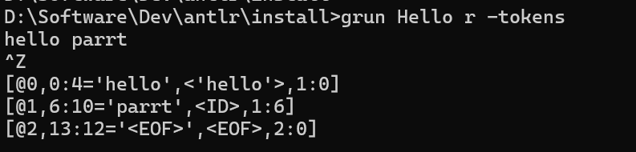

# Antlr4 - Windows 安装 ANTLR 实践

>针对 Java

## 下载 ANTLR  
>env: Windows, antlr version: 4.13.2, jdk version: 11+ (必须确保 JDK 版本)  

`官网原文` 
>All users should download the ANTLR tool itself and then choose a runtime target below, unless you are using Java which is built into the tool jar.
See Release Notes, README.md, Getting started, ANTLR 4 grammar repository, and How to build ANTLR itself.    

根据上面官网介绍，访问 `https://www.antlr.org/download.html`, 下载 antlr-4.13.2-complete.jar 。     

   

## Windows 配置环境变量 
配置 CLASSPATH 环境变量，如下图所示：   

  

## 配置 antlr4,grun 命令脚本   
>安装步骤可完全参考官网 windows 章节 `https://github.com/antlr/antlr4/blob/master/doc/getting-started.md#windows`。          

 

>我在 windows 环境下测试中发现，像官网介绍那样配置，仍然无法满足在任意目录执行 `antlr4` 和 `grun` 命令，所以我采用的是官网介绍的另一种配置方式 `use doskey commands` 命令，我需要再每次打开 CMD时必须要执行 `initAntlr4AndGrun.bat`脚本，因为 doskey 定义的宏只在当前 CMD 会话中有效，关闭窗口后失效。     

创建 initAntlr4AndGrun.bat 文件，内容如下：  
```shell
doskey antlr4=java org.antlr.v4.Tool $*
doskey grun =java org.antlr.v4.gui.TestRig $*
```

配置了 `initAntlr4AndGrun.bat`, 我就不再需要 antlr4.bat 和 grun.bat 脚本文件了  

## Demo 测试 

### 创建 Hello.g4 文件  
在测试目录下创建 install\Hello.g4 文件，内容如下：  
```bash
grammar Hello;

r : 'hello' ID ;
ID : [a-z]+ ;
WS : [ \t\r\n]+ -> skip ;
```

### CMD 执行 antlr4 命令 
```shell
antlr4 Hello.g4  
```

输出结果：  
   

### 编译生成的 java 代码  
```shell
javac Hello*.java
```

### 使用 grun 测试代码  
>注意： grun 命令执行后，终端是出于一个待输入的状态，`并不是等待输出结果`     

grun 可以接收众多的参数，通过这些参数我们可以指定输出的内容。假设我们希望显示识别过程中生成的词法符号。  

#### `-tokens` 

```shell
# 第一步，在 CMD 执行 grun Hello r -tokens  
D:\Software\Dev\antlr\install>grun Hello r -tokens  

# 第二步，输入 hello parrt 字符  
hello parrt

# 第三部，输入终止符，需要回车，在类UNIX系统上的输入方法是Ctrl+D，在Windows上的方法是Ctrl+Z
^Z
```   

示例截图：  


#### `-tree` 
```shell
# 第一步，在 CMD 执行 grun Hello r -tree  
D:\Software\Dev\antlr\install>grun Hello r -tree  

# 第二步，输入 hello parrt 字符  
hello parrt

# 第三步，输入终止符，需要回车，在类UNIX系统上的输入方法是Ctrl+D，在Windows上的方法是Ctrl+Z
^Z
```   

   

#### `-gui`
```shell
# 第一步，在 CMD 执行 grun Hello r -gui  
D:\Software\Dev\antlr\install>grun Hello r -gui  

# 第二步，输入 hello parrt 字符  
hello parrt

# 第三步，输入终止符，需要回车，在类UNIX系统上的输入方法是Ctrl+D，在Windows上的方法是Ctrl+Z
^Z
```   

   

refer   
1.《ANTLR 4 权威指南》     