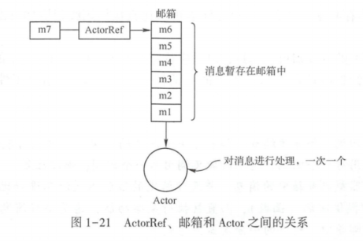
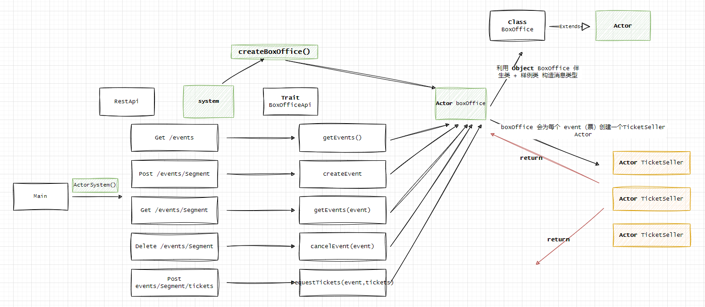

## Akka搭建APP的尝试

>博主是Scala语言的拥护者，而“Akka技术栈”是Scala生态的佼佼者。本篇来自博主对《Akka实战》第二章的理解，若有疑问或者问题欢迎大家给我提ISSUE，这里简单介绍下原项目的历史，因《Akka实战》是《Akka in Action》中文版，它的源码在https://github.com/RayRoestenburg/akka-in-action， 因《Akka in Action》出版2016年，项目中依赖的sbt，scala，akka等版本偏老，博主将本文涉及到代码clone到"https://github.com/xinzhuxiansheng/scalamain-services/tree/main/akka-in-action"的“chapter-up-and-running”模块中，并且对sbt，scala，akka升级到新版。  

>有些技术，了解一些概念，剩下的就是一步一步代码跑起来再了解。 :)

### 引言
Akka由 Lightbend构建的开源项目，它提供了一种简单的、单一编程模型——并发和分布式应用的一种编程方式——Actor编程模型。Actor本身并没有什么新意，它只是一种在JVM上向上和向外扩展应用程序的方式。Akka能够保证在应用程序扩展中高效地利用资源，并保持相对较低的复杂性。   

Akka的主要目标是，使部署在云端的应用，或者运行在多核设备上的应用程序的开发变得简单，而且还要充分利用计算资源。它是构建可扩展应用的工具，提供了Actor编程模型、运行环境和所需的支持工具。 

博主理解Akka类似于Java语言“Spring技术栈”，里面包含工具包，Web包等等，那么用Akka来构建一个Web API服务来说就像Spring Boot一样简单。不过还是提醒一句“响应式”架构，希望大家先别“刨根问底”思考这个概念。因为本篇不涉及到这个概念介绍。

**希望大家了解以下概念：**      
* ActorSystem   
* ActorRe、邮箱和Actor  
* 分发器（Dispatchers） 

    

以上内容请阅读《Akka实战》中的1.7章节；

### 用Akka搭建APP就像Spring Boot一样
图片中展示了项目代码结构图，“chapter-up-and-running”实现了基于内存的简易票务服务。
* `Main`是服务的启动类，负责读取配置、构建Http Server以及Akka的ActorSystem和Dispatchers创建。       

* `RestApi`+`EventMarshalling` 通过Akka HTTP的DSL定义请求地址、参数转换样例类以及创建BoxOffice ActorRef (**system.actorOf(BoxOffice.props,BoxOffice.name)**)，通过分发器将请求参数传给BoxOffice处理。 而这里可以理解Spring Boot的Controler层。      

* `BoxOffice`处理`RestApi`调用BoxOffice ActorRef传递过来的消息（**通过boxOffice.ask(...)**）,这里可以先理解Spring Boot的IOC注解，这里需指出一点，在Spring Boot中Controller层通过注解Service对象，调用不同的方法，而在`RestApi中有且只有通过boxOffice.ask(...)通知BoxOffice，有什么消息过来了`，所以`BoxOffice`继承了Actor后，重写了receive(),根据不同的case 消息处理不同逻辑。

还需注意，在`RestApi`的boxOffice属性添加了**lazy关键字**，这是scala 懒加载并且有且仅执行一次，所以先理解成单例，就跟**@Service**一样，默认情况下Service是单例类。       

在`BoxOffice`在不同case处理时，除`context.child(name).fold(...)(...)` 这种以外的代码都挺好理解。    
```scala
context.child(name).fold(...)(...)
``` 

**context.child(name)** 方法是用于查找当前 Actor 的直接子 Actor。这个方法接受一个字符串参数，返回一个 Option[ActorRef]。如果有一个名为给定名称的子 Actor，那么返回的 Option 会包含这个 Actor 的引用（ActorRef）；否则返回的 Option 会是 None。  

**Option.fold(ifEmpty)(f)** 是 Option 类型的一个方法，用于处理 Option 可能包含的值。这个方法接受两个参数：如果 Option 是空的（None），那么它会返回 ifEmpty 参数的值；如果 Option 包含一个值，那么它会将这个值传递给函数 f，并返回 f 的结果。        

根据上文的理解，我们在创建actor时，可以指定一个"name"，而context.child(name)像是从一个缓存中取actor，所以跟进下BoxOffice.receiver()方法，当消息是CreateEvent事件，会根据“票的名称”来创建一个`TicketSeller` actor。      
```java
case CreateEvent(name, tickets) =>
    def create() = {
    // 局部方法创建TicketSeller向其添加票券，并以EventCreated进行响应
    val eventTickets = createTicketSeller(name)
    val newTickets = (1 to tickets).map { ticketId =>
        TicketSeller.Ticket(ticketId)
    }.toVector
    eventTickets ! TicketSeller.Add(newTickets)
    sender() ! EventCreated(Event(name, tickets))
    }
    // 创建EventCreated并响应或以EventExists作为响应
    context.child(name).fold(create())(_ => sender() ! EventExists)


  // 在BoxOffice的上下中创建TicketSeller
  def createTicketSeller(name: String) =
    context.actorOf(TicketSeller.props(name), name)
```
希望大家注意 创建TicketSeller Actor是调用`context.actorOf`创建，所以当`BoxOffice`发消息给TicketSeller Actor，只需从context取即可。 发送流程如下：   
**1.** 在context获取TicketSeller的ActorRef
**2.** 通过`child.forward`发送消息给 TicketSeller的ActorRef；   

这里需注意，在Akka中，forward方法用于传递消息。当一个actor A接收到一个消息，然后使用forward方法将消息发送给另一个actor B，消息会保留其原始的发送者信息。也就是说，如果actor B回复此消息，那么回复将直接返回给最初的发送者，而不是中间的actor A；    

* `TicketSeller`调用逻辑与BoxOffice一样，同样重写receiver()处理不同类型的消息。这里就类似于Spring Boot
的Dao层。

以下展示一个大概的流程图：  

    

此时，案例项目已基本上讲解完。      

### 总结
每个Actor都有一个邮箱来存放其他Actor发送过来的消息，博主目前理解每次消息传递过程都非常像`Reactor多线程模型`。


refer
1.《Akka实战》
2.https://github.com/RayRoestenburg/akka-in-action
3.https://httpie.io/docs/cli/centos-and-rhel