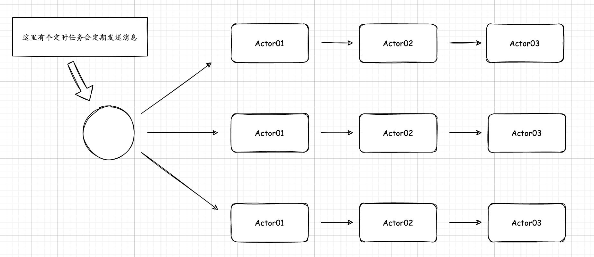
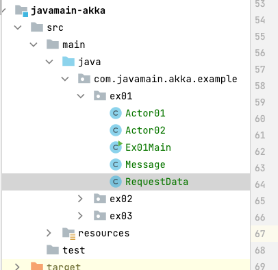

## Akka试水实战(java)

>我想这篇足以烂到家了，仅是为了积累Akka使用经验，为了用而用,但又用不对。

### 思路
有个定时任务定期读取数据，并且将数据发送给actor01，actor01处理完后将结果传给actor02,后面同理，最后actor03会将结果打印出来。

以下为了最终实现的结构图：


### 实现


RequestData的构造方法中创建了定时线程池及带传有config参数的ActorSystem，它是用来增加Akka默认调度器的并行度,所以在requestData()方法中不能像`newCacheTreadPool`无休止创建。 

Actor创建：
1. ActorRef jobRootRef = actorSystem.actorOf(Props.create(Actor01.class, Actor01::new));

2. ActorRef actorRef = this.getContext().actorOf(Props.create(Actor02.class, Actor02::new));


`Ex01Main`
```java
public class Ex01Main {
    private static final Logger logger = LoggerFactory.getLogger(Ex01Main.class);

    public static void main(String[] args) throws InterruptedException {
        RequestData requestData = new RequestData();
        Thread.sleep(100000);
        logger.info("main end");
    }
}
```

`RequestData`
```java
public class RequestData {
    private static final Logger logger = LoggerFactory.getLogger(RequestData.class);

    private static ScheduledExecutorService jobDataExecutor;
    static ActorSystem actorSystem = null;

    public RequestData() {
        jobDataExecutor = Executors.newSingleThreadScheduledExecutor();
        jobDataExecutor.scheduleAtFixedRate(this::requestData, 5, 60, TimeUnit.SECONDS);

        actorSystem = ActorSystem.create("yzhouSystem", createConfig());
//        actorSystem = ActorSystem.create("yzhouSystem");
    }

    // 非常重要的参数
    private Config createConfig() {
        Map<String, Object> map = new HashMap<String, Object>();
        // forkjoinpool默认线程数 max(min(cpu线程数 * parallelism-factor, parallelism-max), 8)
        map.put("akka.actor.default-dispatcher.fork-join-executor.parallelism-factor", "1");
        map.put("akka.actor.default-dispatcher.fork-join-executor.parallelism-max", "1");

//        map.put("akka.loglevel", "ERROR");
//        map.put("akka.stdout-loglevel", "ERROR");
//
//        //开启akka远程调用
//        map.put("akka.actor.provider", "akka.remote.RemoteActorRefProvider");
//
//        List<String> remoteTransports = new ArrayList<String>();
//        remoteTransports.add("akka.remote.netty.tcp");
//        map.put("akka.remote.enabled-transports", remoteTransports);
//
//        map.put("akka.remote.netty.tcp.hostname", host);
//        map.put("akka.remote.netty.tcp.port", port);
//
//        map.put("akka.remote.netty.tcp.maximum-frame-size", 100 * 1024 * 1024);
//
//        logger.info("akka.remote.netty.tcp.hostname="+map.get("akka.remote.netty.tcp.hostname"));
//        logger.info("akka.remote.netty.tcp.port="+map.get("akka.remote.netty.tcp.port"));

        return ConfigFactory.parseMap(map);
    }

    private void requestData() {
        logger.info("开始定时任务...");
        for (int i = 0; i < 30; i++) {
            Message message = new Message("name" + i, "age" + i);
            ActorRef jobRootRef = actorSystem.actorOf(Props.create(Actor01.class, Actor01::new));
            jobRootRef.tell(message, jobRootRef.noSender());
        }
    }
}
```

`Actor01`
```java
public class Actor01 extends UntypedAbstractActor {
    private static final Logger logger = LoggerFactory.getLogger(Actor01.class);

    @Override
    public void onReceive(Object message) throws Throwable {
        logger.info("Actor01...");
        Message data = (Message) message;
        data.setStep("01");
        ActorRef actorRef = this.getContext().actorOf(Props.create(Actor02.class, Actor02::new));
        actorRef.tell(data, actorRef.noSender());
        Thread.sleep(5000);
    }
}
```

`Actor02`
```java
public class Actor02 extends UntypedAbstractActor {
    private static final Logger logger = LoggerFactory.getLogger(Actor02.class);

    @Override
    public void onReceive(Object message) throws Throwable {
        logger.info("Actor02...");
        Message data = (Message) message;
        data.setStep("02");

        Thread.sleep(5000);
    }
}
```

`Message`
```java
@Data
public class Message {
    private String name;
    private String age;
    private String step;

    public Message(){

    }

    public Message(String name,String age){
        this.name = name;
        this.age = age;
    }
}
```
