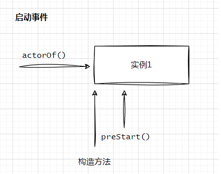
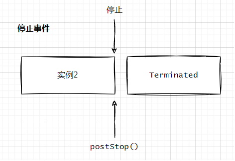
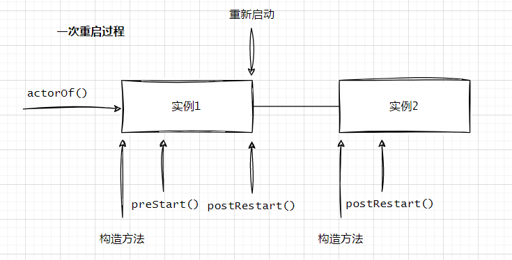

## Akka Actor生命周期

监视器对Actor 的处理有以下4种选择:

* 重启(restart)——Actor 必须从它的Props重新创建。重新开始（或者重启
后，Actor继续处理消息。因为应用的其他部分使用ActorRef与之通信，新的Actor实例会自动接收下一条消息。
* 恢复(resume)——相同的 Actor 实例继续进行消息处理，故障被忽略。
* 停止( stop)——Actor 必须终止。不再参加消息处理。
* 处理升级（ escalate)——监视器不知道如何处理，把问题汇报给它的父对象。父对象也是一个监视器。

下面重温一下“let-it-crash”方法的优点:  
* 错误隔离( fault isolation)——监视器可以决定终止一个Actor。这个Actor 被从系统中移除。
* 容错结构( structure)——Actor系统的引用层次结构，可以在不影响其他Actor的情况下替换Actor实例。
* 冗余(redundancy)——一个Actor可以替换为其他的 Actor。在数据库连接损坏的例
子中，新的Actor实例可以连按到个回的双展说O坭"毒平衡的原则,把消息路由Actor，并创建另一类型进行替代。另一种选择是根据负责平衡的原则，把消息路由
到其他许多的Actor，这将在第9章进行讨论。
* 替代（ replacement)——Actor可以通过它的Props进行重建。监视器可以决定以
一个新的Actor替换出错的 Actor实例，而无须知道重建Actor的任何细节。
* 重启( reboot)——这可以通过重新启动来实现。
* 组件生命周期——Actor是一个活跃的组件。它可以被启动、停止和重新启动。下一节将详细介绍Actor的生命周期。
* 挂起( suspend)——当一个Actor崩溃时，它的邮箱被挂起，直到监视器做出处理决定。
* 关注点分离( separation of concerns)——正常的Actor消息处理和出错恢复监控流程是正交的，它们之间泾渭分明。

在Actor的生命周期中，有以下3种类型的事件:
* Actor被创建并启动——为了简单起见，称之为开始（( start)事件。
* 由于重新启动( restart)事件重启 Actor。
* 由于停止( stop）事件Actor被停止。 

### 生命周期

#### 启动事件    
启动事件(start event)。Actor由actorOf()创建并自动启动。顶层的Actor由`ActorSystem`的actorOf()创建。父Actor使用其`ActorContext`的actorOf()创建子Actor。   

实例创建后，Actor由Akka启动。在Actor启动之前，preStart()钩子被调用, preStart()钩子用于设置Actor的初始状态，还可以通过Actor 的构造函数进行初始化。   

#### 停止事件   
停止事件(stop event)。因为重新启动的钩子与启动和停止的钩子相关。当Actor停止时，停止事件表明Actor的生命周期终止，并且只发生一次。Actor可以通过`ActorSystem`和 `ActorContext`对象的stop方法停止，或者向Actor发送 PoisonPill消息，也可以停止Actor。    

在Actor被终止前,postStop钩子被调用，当Actor处于Terminated 状态时,Actor不会再收到任何新的消息。postStop方法与preStart 钩子相对应。       

通常情况下这个钩子实现的功能与preStart()相反，释放在preStart方法中申请的资源,并把Actor的最后状态保存在Actor外的某处，以备下一个Actor实例使用。已停止的Actor与它的ActorRef 脱离。Actor停止后，ActorRef重定向到系统中的`deadLettersActorRef`，它是一个特殊的ActorRef，接收发送给已死亡的Actor的消息。 

#### 重启事件   
重启事件(restart event)。在Actor的生命周期中，监视器有可能决定重新启动它。根据发生错误的数目，这种情况可能出现多次。因为Actor的实例被替换，所以这个事件比启动或停止事件要复杂得多。 
    

当重启发生时，崩溃Actor实例的preRestart()被调用，在这个钩子中，在崩溃 Actor的实例被替换前,它的当前状态被保存。  
在覆盖这个钩子时，一定要小心。preRestart方法的默认实现是，停止该Actor的所有子Actor，并调用postStop钩子。如果忘记调用`super.preRestart`，则默认行为不会发生。    

记住Actor从 Props对象（重新）创建时，Props对象最终调用Actor的构造方法,在构造方法中创建它所有的子Actor。如果崩溃Actor的子Actor没有停止，当父Actor重启时，会增加子Actor的数量。   

重新启动Actor时，需要注意停止策略与停止方法的不同。后面将看到，它可以监视Actor的死亡。已崩溃的Actor实例重启时，并不会发送Terminated消息给崩溃的Actor。在重启中，新的Actor实例被连接到错误发生前，与崩溃Actor相同的ActorRef。而已经停止的Actor 从它的ActorRef 断开，并重定向到deadLettersActorRef。**已停止的Actor和崩溃的Actor的共同点是，当它们被从系统中清除时，默认情况下调用postStop方法**。    

preRestart方法接收两个参数:重启的原因和当Actor崩溃时正在处理的消息（可选的)。监视器可以决定保存什么，以便在重启时恢复其状态。这不能用局部变量实现，因为重启后，新的Actor实例将接管处理过程。一种在崩溃死亡的Actor之外保存状态的方案是,监视器发送一条消息到Actor的邮箱。这是通过Actor向其自身的 ActorRef 发送消息完成的,Actor实例通过self 的值引用ActorRef。其他的选择包括把状态写到Actor之外，如数据库或文件系统。这取决于你的系统和Actor的行为。   

这让我们联想到日志处理的例子，我们不想在dbWriter崩溃时丢失行( Row )消息。这种情况下解决方案是发送失败的Row消息到self ActorRef，以便Actor实例处理它。**这个方法需要注意的一点是，由于向邮箱发送了一条消息，因此邮箱中的消息顺序被改变了。失败的消息被弹出邮箱，并比等待在邮箱中的其他消息更晚一些处理。**    

preStart钩子方法调用后，Actor类的新实例被创建，并且通过Props对象执行它的构造方法，然后，新实例的postRestart 钩子方法被调用。    

>postRestart方法的默认实现会触发preStart函数的调用。如果确信重启时不需要调用preStart方法，则可以忽略`super. postRestart`，但大多数情况下不是这么回事。在重新启动过程中，默认调用preStart和postStop，并且在生命周期中的启动和停止事件中也会被调用，因此在这里分别添加初始化和清理代码是非常有意义的。    

### 生命周期汇总    
当把所有不同的事件组合在一起，就得到了Actor 的完整的生命周期。  
    

### 生命周期监控    
Actor的生命周期可以被监控。Actor终止生命周期也就结束。如果监视器决定停止Actor，它就会被终止;如果 stop方法用于停止Actor，或者收到PoisonPill消息，就会间接调用stop方法。因为preRestart方法默认情况下，使用stop方法停止 Actor的所有子Actor，因此重启时这些子Actor也会被停止。崩溃的Actor实例重启时，不会以这种方式终止。它会被从Actor系统中移除，并不会直接或间接地调用stop方法。因为ActorRef重启后仍保持活跃，Actor实例没有终止，只是换成了一个新的实例。ActorContext 提供了watch 方法监控Actor 的死亡，并提供了unwatch方法解除监控。一旦Actor调用了Actor引用的watch方法，它就变成了这个Actor引用的监控器。当被监控的Actor终止时，一条Terminated消息被送往Actor的监控器。  

Terminated消息只包含死亡Actor 的 ActorRef。崩溃的Actor实例在重启时与Actor停止时的终止方式不同，就变得很有意义，否则每当Actor重启时会收到许多终止消息，这将造成无法区分Actor是最终死亡还是临时重启。     

与监视相比，它只能用于父Actor对子Actor，监控可以由任何Actor进行。只要 Actor能够访问被监控的Actor 的ActorRef，它就可以简单地调用context. watch( actorRef)。当被监控的Actor终止时，它就会收到一条Terminated消息。监控和监视可以组合使用，而且很强大。     

