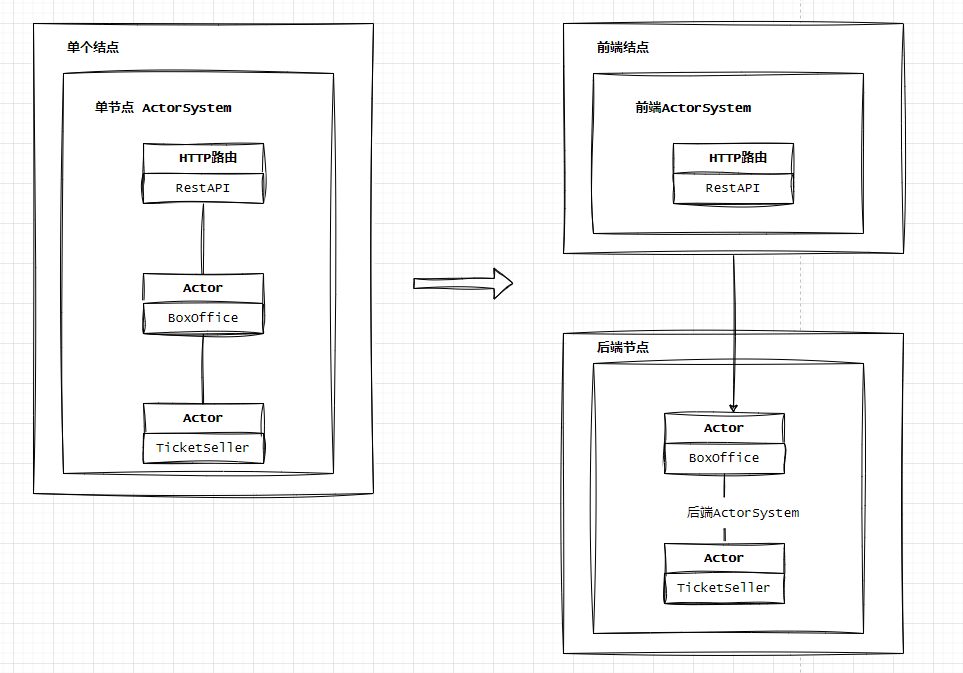
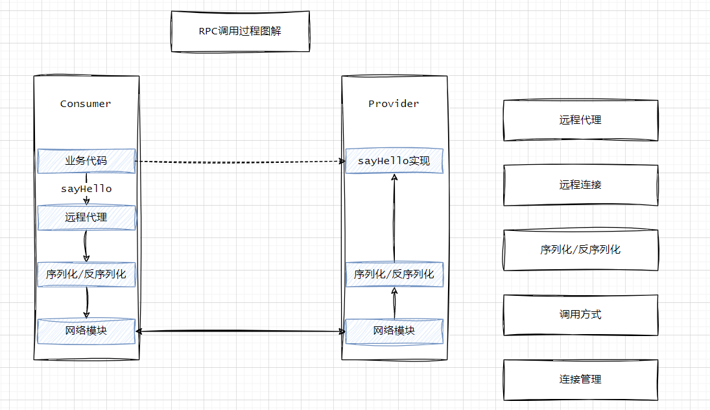
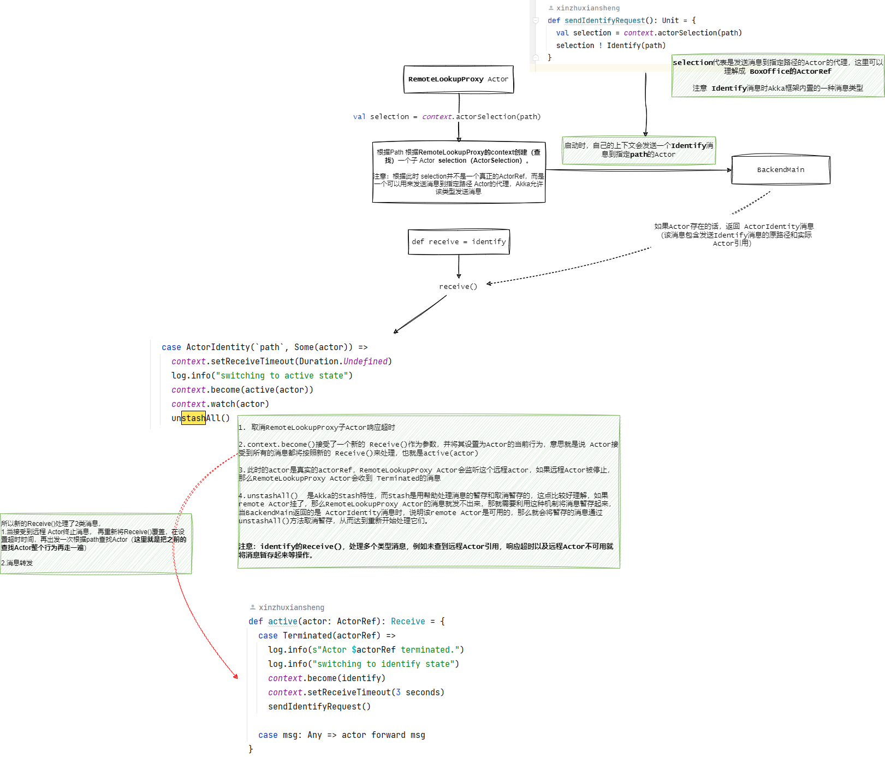

## Akka搭建分布式APP的尝试

>Akka version: 2.6.19

### 引言  
在之前《Akka搭建APP的尝试》Blog中介绍了Akka的一些基本使用，例如Akka的actor的创建以及actor之间消息通信，并且也类比了Spring Boot应用开发搭建过程。而本篇主要介绍Akka actor跨服务之间的调用，这里类似于Spring Boot接入Dubbo进行跨服务之间的RPC通信，而Akka也提供了自己的跨服务调用模块`akka-remote`。  

>请注意，Blog中的类比是博主为了更好了解akka-remote的功能，并不刻意针对细节比较。 

### 服务结构演变  
基于"https://github.com/xinzhuxiansheng/scalamain-services/tree/main/akka-in-action"的“chapter-up-and-running”模块，当请求经过DSL路由，拼装消息经过BoxOffice Actor到TicketSeller Actor处理。我把描述成Service层（BoxOffice）到Dao层（TicketSeller）的调用关系。 

那么现在要改造成，当请求经过DSL路由时，需将消息转发给另一个进程服务的BoxOffice Actor处理。  下面是服务结构图：  

  

上面结构图与RPC的服务调用过程有些类似   
  


### 改造过程    
>还请大家注意，在“chapter-remoting”模块，我也将将akka升级到2.6.19，scala升级到2.13.10，同样需要在原来仓库代码中修改相关Api以及配置文件，建议读Blog时，请参考`https://github.com/xinzhuxiansheng/scalamain-services/tree/main/akka-in-action`下的“chapter-remoting”。    

经过改造后，启动`BackendMain`:  
output: 
```
INFO  [Slf4jLogger]: Slf4jLogger started
WARN  [RemoteActorRefProvider]: Using the 'remote' ActorRefProvider directly, which is a low-level layer. For most use cases, the 'cluster' abstraction on top of remoting is more suitable instead.
WARN  [RemoteActorRefProvider]: Akka Cluster not in use - Using Akka Cluster is recommended if you need remote watch and deploy.
INFO  [ArteryTransport]: Remoting started with transport [Artery tcp]; listening on address [akka://backend@0.0.0.0:2551] with UID [-661911253103235109]
```

启动`FrontendMain`: 
output: 
```
[DEBUG] [06/15/2023 01:32:06.919] [main] [EventStream] StandardOutLogger started
INFO  [Slf4jLogger]: Slf4jLogger started
[DEBUG] [06/15/2023 01:32:07.616] [main] [EventStream(akka://frontend)] logger log1-Slf4jLogger started
[DEBUG] [06/15/2023 01:32:07.619] [main] [EventStream(akka://frontend)] Default Loggers started
WARN  [RemoteActorRefProvider]: Using the 'remote' ActorRefProvider directly, which is a low-level layer. For most use cases, the 'cluster' abstraction on top of remoting is more suitable instead.
WARN  [RemoteActorRefProvider]: Akka Cluster not in use - Using Akka Cluster is recommended if you need remote watch and deploy.
INFO  [ArteryTransport]: Remoting started with transport [Artery tcp]; listening on address [akka://frontend@0.0.0.0:2552] with UID [71907158147315863]
INFO  [go-ticks]: RestApi bound to /0:0:0:0:0:0:0:0:5000 
```

### remote交互  
通过“chapter-remoting”与“chapter-up-and-running”两个模块代码比较，代码量调整还是比较小的，在`chapter-up-and-running`模块中RestAPI接受请求后，在DSL路由匹配过程中创建`BoxOffice Actor`再进行消息传递，而此时`chapter-remoting`模块，通过创建`RemoteLookupProxy Actor`来调用（查找）BoxOffice Actor。这里也特别像我们写一个HTTPUtils 工具类一样，只不过BoxOffice的调用是按Actor的路径进行查找的(`s"$protocol://$systemName@$host:$port/$actorName"`)，而不是Http URL地址。下面我们了解下具体细节  

RestApi由创建BoxOffice Actor 变成 RemoteLookupProxy Actor:  
```java
val api = new RestApi() {
  val log = Logging(system.eventStream, "frontend")
  implicit val requestTimeout = configuredRequestTimeout(config)
  implicit def executionContext = system.dispatcher
  
  def createPath(): String = {
    val config = ConfigFactory.load("frontend").getConfig("backend")
    val host = config.getString("host")
    val port = config.getInt("port")
    val protocol = config.getString("protocol")
    val systemName = config.getString("system")
    val actorName = config.getString("actor")
    s"$protocol://$systemName@$host:$port/$actorName"
  }

  def createBoxOffice(): ActorRef = {
    val path = createPath()
    system.actorOf(Props(new RemoteLookupProxy(path)), "lookupBoxOffice")
  }
}
``` 

在RestApi#createBoxOffice()可知，用RemoteLookupProxy Actor代替了BoxOffice Actor，那我们先回顾下Akka actor消息传递的知识，当我们要往哪个Actor发送消息时，是需要知道发送到的Actor的引用的，例如在`chapter-up-and-running`模块中BoxOffice Actor是拿到TicketSeller ActorRef再发送消息，那RemoteLookupProxy Actor是如何拿到BoxOffice ActorRef的呢？  


### RemoteLookupProxy Actor
我们先看下`RemoteLookupProxy Actor`的流程图  

  

RemoteLookupProxy Actor,它的作用是与一个远程Actor通信，当`RemoteLookupProxy Actor`启动时，它会通过Path查找一个Actor（此时得到一个`ActorSelection`实例），它还并不是真正的ActorRef，RemoteLookupProxy Actor会向ActorSelection实例，发送Idenfify消息，用来验证该Path的Actor是否存在，当Remote Actor收到消息会回复一个`ActorIdentity`消息，若该Actor存在，则返回的消息中会包含原路径和实际Actor引用。  

此时得到实际ActorRef，那么RemoteLookupProxy Actor会用新的Receive()覆盖老的逻辑，在新的Receive()会将消息转发给得到ActorRef，从而达到消息转发的效果。 不过需注意，此时得到remote ActorRef后，会让RemoteLookupProxy Actor来监听这个实际存在的Actor，那么当远程Actor异常后，RemoteLoopupProxy Actor要知道，所以在新的Receive()中，增加了`Terminated`消息，当remote Actor异常后，RemoteLookupProxy Actor的Receive()切换成**校验状态**时的逻辑。 并且也会将消息暂存到akka Stash中。 

>RemoteLoopupProxy Actor负责了remote Actor身份确认、消息转发、异常中断等情况，这块做的比“chapter-up-and-running”模块BoxOffice Actor多的多。  

### 远程部署  
这四个字，我当时看了一脸懵逼，这是什么？通过对代码了解以及调试，博主悟到，由代码构建remote Actor改成通过配置文件来通过Actor Path匹配来识别是否是remote，并且也标柱处remote地址。  

下面我们来看下`frontend-remote-deplo.conf`比`frontend.conf`多了`deployment`配置项 
```
deployment {

  /boxOffice {
    remote = "akka://backend@0.0.0.0:2551"
  }

  /forwarder/boxOffice {
    remote = "akka://backend@0.0.0.0:2551"
  }

}
``` 

我们看`FrontendRemoteDeplyMain`代码，发现RestApi调用的是BoxOffice Actor 而不是 RemoteLoopupProxy Actor。  
```java
object FrontendRemoteDeployMain extends App
    with Startup {
  val config = ConfigFactory.load("frontend-remote-deploy") 
  implicit val system = ActorSystem("frontend", config) 

  val api = new RestApi() {
    val log = Logging(system.eventStream, "frontend-remote")
    implicit val requestTimeout = configuredRequestTimeout(config)
    implicit def executionContext = system.dispatcher
    def createBoxOffice(): ActorRef = system.actorOf(BoxOffice.props, BoxOffice.name)
  }

  startup(api.routes)
}
```
到这里，我觉得要是用过RPC做服务之间调用的哥们，差不多觉得很类似，在消息传递过程中，并不关心调用是local还是remote，只关心业务逻辑处理。到这里我想大伙也差不多明白了，这次的尝试，感觉在Java微服务中似曾相识。不过有以下几点需注意：  

* RemoteLoopupProxy Actor并不是简简单单调用，并包含actorRef状态监听等，所以就有了`RemoteBoxOfficeForwarder` Actor 
* BackendRemoteDeployMain并没有像BackendMain创建 BoxOffice Actor，那为什么还能接受 BoxOffice Actor请求？ 大大的疑问。     
```java
object BackendRemoteDeployMain extends App {
  val config = ConfigFactory.load("backend")
  val system = ActorSystem("backend", config)
}
```


refer 
1.《Akka实战》  
