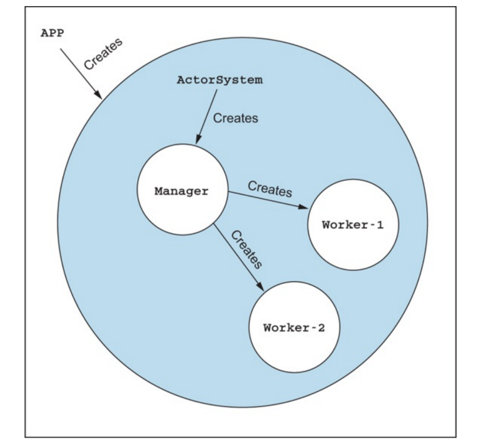
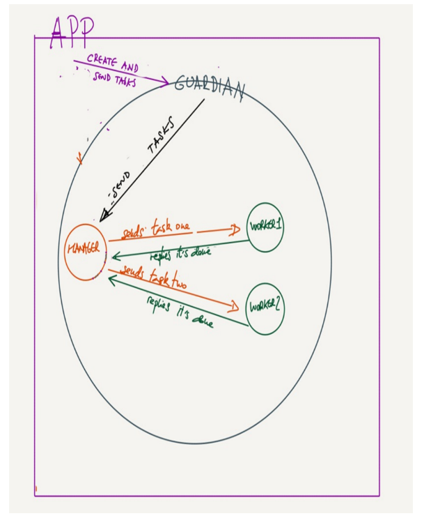
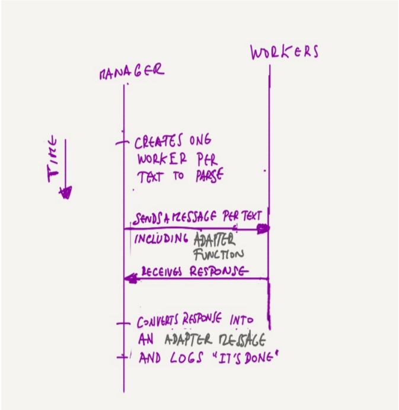
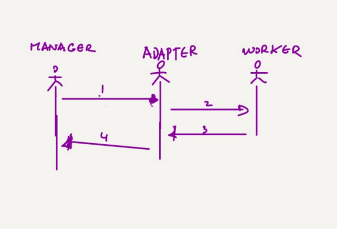
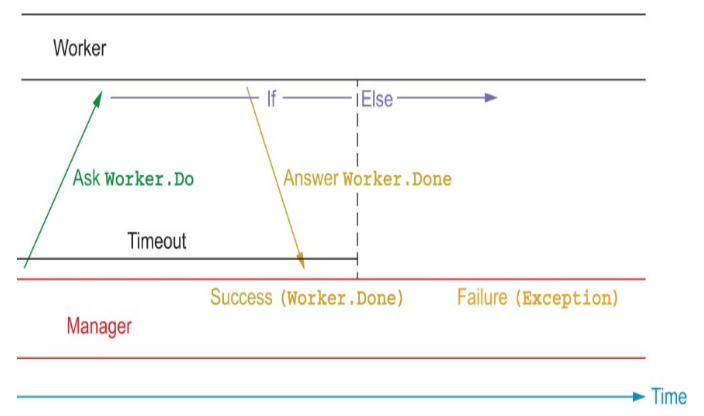
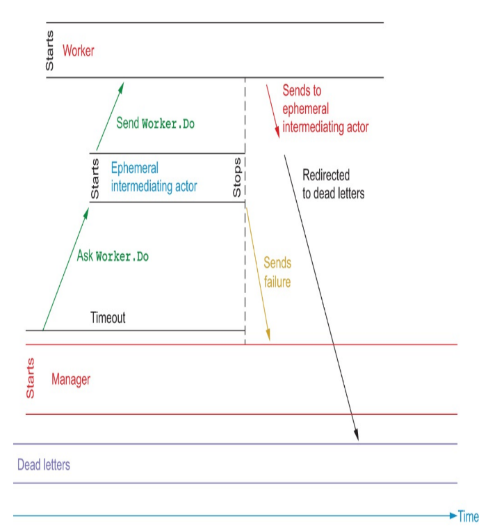

## 构建多Actor 协同工作(One actor is no actor)  

**本章内容包括：**
* Actor作为层级结构
* 创建更多actor
* 来回发送消息
* 适应响应
* 发送消息并等待回复

“一个蚁群不仅仅是一群生活在一起的昆虫的总和。一个蚂蚁并不算是蚂蚁。有两个蚂蚁，你就开始看到全新的东西。将一百万只蚂蚁聚在一起，工蚁被分成不同的等级，每个等级都有不同的功能——剪叶子，照顾女王，照料幼崽，挖出巢穴等等——你就得到了一个重约11公斤（24磅），大约有一只狗那么大，主宰着一个房子大小的区域的有机体。” David Suzuki，《神圣的平衡：重新发现我们在自然中的位置》。ISBN-13：978-1553651666。第209页。

Actor非常相似——他们以组织化的团体出现。单个的演员并非演员，他们以系统的形式出现。我们来看看如何实现。   

actor模型最吸引人的特性之一是每个actor都做出本地决策。同时，它们属于一个层级。也就是说，父母和孩子之间有一种自上而下的关系。每当一个actor创建了另一个actor，它就成为其父母。这两个属性 - 局部性和层次性 - 允许actor模型轻松地进行委派。传统的 Akka 应用就是基于这种委派的。     

到目前为止，你已经学会了如何创建类型为 ActorSystem 的actor，但这种类型的actor相当独特。它是一个单例。每个actor系统只有这种类型的一个实例，而且这个actor有双重任务。它是所有actor层次结构的根，以及控制整个系统的机制。本章将讨论这种层次结构，为什么它重要以及如何实现它。  

为了学习这一点，你将看到一个解析文本的应用程序。这通过一个管理者来模型化，它将每个文本的解析任务委托给一个actor，一个解析器。管理者专门创建解析器并向它们委托任务，而解析器只做一件事，而且做得很好：处理文本。让我们通过创建一个演员的层次结构来实践这一点，这些actor共同为这个目的服务。  

**重要提示：**  
你可以使用以下代码伙伴来查看本章的源代码 https://github.com/franciscolopezsancho/akka-topics/tree/main/chapter03 。你可以在与类、对象或特质名称相同的 .scala 文件中找到任何代码片段或清单的内容。例如，你可以在 ErrorKernelApp.scala 文件中找到带有对象 ErrorKernelApp 的代码片段。 

### 3.1 简单的解析示例
在这个应用程序中，actor是一个创建了一个管理者的守护者，管理者又创建了几个工作者。守护者将要解析的文本列表传递给管理者，管理者又将其传递给工作者进行解析。这种层级结构如图3.1所示。
图3.1 自顶向下的actor创建关系，从顶部的 ActorSystem 到底部的工作者。 
  

应用程序在开始时将工作传递给守护者 - 这些文本的字符串列表 - 然后将其发送到链下。当工作者完成时，他们会通知管理者。然而，为了理解这个通知，管理者需要一个适配器。关于适配器的更多信息，将在3.1.3节中讨论。如何委派和完成工作如图3.2所示。

图3.2 管理者和工作者之间的消息方向  
      

通常，你不会在应用程序级别产生消息，就像这个例子一样，而是通过HTTP、gRPC或类似的端点。如何创建这些入口点将在第11章中介绍。现在，我们不要深入研究如何从外部连接到一个Akka应用程序。相反，我们将专注于应用程序本身。  

重要提示：本节的示例可以在 `errorkernel` 包中找到。     

#### 3.1.1 编码应用程序
要了解如何实现图3.2，让我们从层级结构的顶部开始 - 从应用程序发送给守护者的输入开始。守护者的协议如下：  
```java
object Guardian {

  sealed trait Command
  final case class Start(texts: List[String]) extends Command

  ...   
}
```
在这里，Start包含了要解析的文本，使用方式如下。  
```java
object ErrorKernelApp extends App {

  val guardian: ActorSystem[Guardian.Command] =
    ActorSystem(Guardian(), "error-kernel")
  guardian ! Guardian.Start(List("-one-", "--two--"))
  ...
}
``` 
当守护者收到 `Start`` 指令时，它会接收文本列表并将它们传递给 Manager，然后 Manager 将列表分割并为每个 worker 分配一部分。整个应用程序会产生以下输出。   
```java
2023-08-06 15:11:36,161 INFO  [Guardian$] - Setting up. Creating manager
2023-08-06 15:11:36,166 INFO  [Manager$] - sending text '-one-' to worker
2023-08-06 15:11:36,166 INFO  [Manager$] - sending text '--two--' to worker
2023-08-06 15:11:36,166 INFO  [Worker$] - 'Actor[akka://error-kernel/user/manager-alpha/worker-one-#-1207091859]' DONE!. Parsed result: one
2023-08-06 15:11:36,166 INFO  [Worker$] - 'Actor[akka://error-kernel/user/manager-alpha/worker--two--#2116167497]' DONE!. Parsed result: two
2023-08-06 15:11:36,168 INFO  [Manager$] - text '-one-' has been finished
2023-08-06 15:11:36,168 INFO  [Manager$] - text '--two--' has been finished
``` 
现在让我们关注输出的前三行 -- 守护者如何创建 manager，以及 manager 在设置过程中如何委托任务。为此，你需要从 Akka 工具包中获取两个新工具，如下所示： 

* Spawn - 为了从另一个actor中创建actor，你可以使用 context.spawn([someActorsApplyMethod], [someName]) 来使用上下文。其签名与 ActorSystem 的一样，也可以创建一个你可以发送消息的 ActorRef。在下面的示例中，spawn 操作是在 Behaviors.setup 内部完成的。

* Behaviors.setup - 这个工厂创建的行为只执行一次 - 当actor实例化时。它从只有一个输入参数的函数创建行为，即用于生成管理者的上下文：ActorContext。        
一旦 Guardian 设置好，它就使用管理者来委托在 Start 消息中解析文本。 

#### 3.1.2 编写守护程序和生成代码
列表3.1显示了守护者如何创建管理者并将任务委托给它。 
列表3.1 守护者  
```java
object Guardian {

  sealed trait Command
  final case class Start(texts: List[String]) extends Command

  def apply(): Behavior[Command] =
    Behaviors.setup { context =>
      context.log.info("Setting up. Creating manager")
      val manager: ActorRef[Manager.Command] =
        context.spawn(Manager(), "manager-alpha")
      Behaviors.receiveMessage {
        case Start(texts) =>
          manager ! Manager.Delegate(texts)
          Behaviors.same
      }
    }
}
```
一旦创建了守护者和管理者，它就可以开始处理消息了。这些消息由方法 Behaviors.receiveMessage 处理，守护者将 Start 中包含的任务委托给管理者。它将任务包装在管理者可以理解的 Delegate 消息中，并用 tell 发送，即！现在让我们看一下管理者。       

#### 3.1.3 来回发送消息：适应响应
管理者负责为每个文本创建一个工作者，并向工作者发送要解析的文本。从管理者向工作者发送消息的方式与以前相同，但现在你面临的是一个新的情况。工作者必须回复给管理者 - 这就是一个新概念开始发挥作用的地方，即适配器。 

需要工作者响应的适配器，因为其响应类型属于工作者而不是管理者。工作者使用自己的协议进行响应，这是一个问题。请记住，每个actor都有自己的协议，那是它唯一理解的协议。因此，原则上，管理者不能理解工作者的答复。  

为了让管理者理解这一点，你需要两样东西。一个适配器函数和一个适配器消息。适配器函数用于向工作者发送消息，适配器消息用于从工作者接收消息。其余的，创建一个工作者，与守护者一样。生成就是你所需要的。  

总的来说，管理者由四部分组成。    
* 协议中的消息适配器。
* 一个适配器函数。
* 委托，即为每个文本创建一个工作者并发送文本进行解析。
* 接收工作者的响应并记录其完成情况。
这在下图中有所体现。

图3.3 管理者功能的时间顺序。    
  
管理者的协议有 `Delegate` 用于获取要解析的文本，以及 WorkerDoneAdapter 作为适配器的消息，用于获取工作者的响应。       
```java
object Manager {

  sealed trait Command
  final case class Delegate(texts: List[String]) extends Command
  ...
}

```
值得注意的是修饰符是私有的。这是为了确保没有其他的actor使用这个消息。否则，管理者可能从任何一个actor那里收到这个消息，确认一个文本已经被解析。只有管理者可以将 Worker.Response 消息转换为 WorkerDoneAdapter 消息。

#### 3.1.5 适配器的函数
适配器的函数是一个actor - 一个 ActorRef - 它生活在两个世界之间。它是一个 ActorRef[Worker.Response]，所以它是一个 Worker.Response，共享工作者的协议 - 显示在这部分之后。它理解工作者的响应。另一方面，适配器具有对管理者的引用，感谢这两个，他可以作为一个中间人。       
```java
object Manager {

  ...
      val adapter: ActorRef[Worker.Response] =
        context.messageAdapter(response =>
          WorkerDoneAdapter(response))

  ...
}
``` 
管理者向适配器发送请求，适配器向工作者发送请求，工作者回应适配器，适配器最后将工作者的消息包装成一个 WorkerDoneAdapter 并发送给管理者，如图3.4所示。

图3.4 从 Manager 发送到 Worker 的消息流程。     
      

你应该在 Behaviors.setup 中创建适配器函数，这样它只会被创建一次 - 如下文的清单3.2所示。 

#### 3.1.6 委托 
委派包括使用适配器函数和工作者协议，将任务从管理者发送到工作者。        

工作者协议有两条消息。  
* Parse - 包含待解析的字符串以及被回复的参与者的引用的命令。    
* Done(text: String) - 包含已解析的字符串的回复，以便管理者可以追踪已完成的工作。   

下面的片段显示了工作者协议。    
```java
object Worker {

  sealed trait Command
  final case class Parse(
      replyTo: ActorRef[Worker.Response],
      text: String)
      extends Command

  sealed trait Response
  final case class Done(text: String) extends Response
  ...
}
``` 
最后，工作人员的回应由中间适配器函数翻译成适配器消息。管理者接收到包装在适配器消息中的 Worker.Done，并查看其中的内容，将解析出的文本打印到控制台。  
让我们看看管理者的代码（清单3.2），看看它的四个部分是如何组合在一起的。 
* 协议中的消息适配器。  
* 适配器函数。  
* 委派，即为每个文本创建一个工作人员并发送文本进行解析。    
* 接收工作人员的回应并记录其完成情况。  

**清单 3.2 管理者行为**    
```java
object Manager {

  sealed trait Command
  final case class Delegate(texts: List[String]) extends Command
  private final case class WorkerDoneAdapter(
      response: Worker.Response)
      extends Command

  def apply(): Behavior[Command] =
    Behaviors.setup { context =>
      val adapter: ActorRef[Worker.Response] =
        context.messageAdapter(response =>
          WorkerDoneAdapter(response))

      Behaviors.receiveMessage { message =>
        message match {
          case Delegate(texts) =>
            texts.map { text =>
              val worker: ActorRef[Worker.Command] =
                context.spawn(Worker(), s"worker$text")
              context.log.info(s"sending text '${text}' to worker")
              worker ! Worker.Parse(adapter, text)
            }
            Behaviors.same
          case WorkerDoneAdapter(Worker.Done(text)) =>
            context.log.info(s"text '$text' has been finished")
            Behaviors.same
        }
      }
    }
}
```
这里你可以看到所有的部分：管理者的协议，适配器消息，以及委派。然后是作为管理者和工作人员之间中介的适配器函数，最后是在工作人员的响应中使用的适配器消息。现在让我们讨论工作人员。    

#### 3.1.7 使用命令和响应作为特性的协议
工作人员的协议如下所示。你可能会惊讶于看到两个特性。到目前为止，你只看到了 Command，但现在你看到了 Response。actor的类型由其 Command 定义，这决定了actor公开的消息。    
```java
object Worker {

  sealed trait Command
  final case class Parse(
      replyTo: ActorRef[Worker.Response],
      text: String)
      extends Command

  sealed trait Response
  final case class Done(text: String) extends Response
  ...  
}
```
类型为 Response 的消息不能发送给actor。它们不属于它的类型。它们必须由定义它们的演员发送给另一个actor，这意味着这个另一个actor负责翻译和适配消息。最后，让我们看一下工作人员。

#### 3.1.8 编码工人

工作人员的逻辑现在如下：    
* 接收 Parse 消息。 
* 解析文本，仅通过在文本中删除连字符。这里有一个简单的功能，不会让你在业务逻辑中分心。  
* 回复管理者已完成（Done）。   
* actor停止，不再处理其他消息，并从内存中删除。 
工作人员没有你还没有看到的东西，所以让我们在列表 3.3 中看一下代码，不需要进一步的解释。 
```java
object Worker {

  sealed trait Command
  final case class Parse(
      replyTo: ActorRef[Worker.Response],
      text: String)
      extends Command

  sealed trait Response
  final case class Done(text: String) extends Response

  def apply(): Behavior[Command] =
    Behaviors.receive { (context, message) =>
      message match {
        case Parse(replyTo, text) =>
          val parsed = naiveParsing(text)
          context.log.info(
            s"'${context.self}' DONE!. Parsed result: $parsed")
          replyTo ! Worker.Done(text)
          Behaviors.stopped
      }
    }

  def naiveParsing(text: String): String =
    text.replaceAll("-", "")

}
```
就这样，应用程序完成了。你已经学习了如何从应用程序到 Worker，通过 Guardian 和 Manager，以层次化的方式构建应用程序。你还学习了如何生成actor和创建适配器。下一节将处理不同类型的请求和响应。它被称为询问(ask)，是一种期望得到响应的请求。     

### 3.2 Asking and expecting a reply
在 Akka 中，询问（ask）意味着在一定时间内发送一条包含回调的消息。在一个actor提出问题后，可能会发生两种情况。在一定时间后，它要么接收到一个表明消息已经被处理的响应，要么接收不到响应。这就是时间限制的问题：如果在等待一定时间后还没有得到响应，actor需要决定如何处理这个问题。这和许多其他类型的通信一样，比如发送电子邮件。如果你需要一个答案却得不到，你愿意等多久才采取行动？       

在 Akka 中，这个问题的答案是以时间和两种可能的结果来表述的。当你请求某件事情时，你需要指定你愿意等待多久，以及在你得到答案或者没有得到答案的情况下你会做什么。为了指定时间，你使用 Timeout 类。对于可能收到或可能不收到响应的情况，你需要检查两个选项，即成功（Success）和失败（Failure）。 

这两个选项形成了 Try[T] 类，其中 T 是被询问的actor的类型。只有在有成功的答案时，T 才相关。否则，T 不适用，因为如果actor没有回答，那么也没有类型。按照前面例子中的相同结构，你有一个应用程序，一个守护者，一个管理者，和工人，但有一些差异。管理者不再告诉工人该做什么，而是询问他们，这会设定一个时间限制。其次，工人现在花费大约 3 秒钟来解析文本。这模拟了复杂的解析过程。下图显示了管理者如何询问一个工人进行解析并等待响应。如果响应来得够快，管理者会在 Success 中接收到响应，否则它会在 Failure 中接收到一个异常。
**图 3.5 管理者询问工人时的可能结果**       
      

这个应用程序和守护者的入口点与前一个例子相同，因此在这个部分中将不会讨论。像往常一样，在处理代码之前，让我们先看看正在运行的应用程序。

**重要提示：**
如果没有明确指出，你可以在 simplequestion 包中找到这一部分的示例。  

#### 3.2.1 一个简单的问题
如果你从解决方案存储库运行 SimpleQuestion 应用程序，你可以看到两种类型的结果。解析的顺序-因此输出并不总是相同，结果也不总是相同，但只有两种结果，这些结果如下。第一个是顺利进行的路径：每个工作者都及时完成了他们的任务，经理也记录了这一点。对于每个解析请求，这都是一个成功。     
```java
2023-08-06 17:15:48,146 INFO  [Worker$] - worker-text-a: done
2023-08-06 17:15:48,148 INFO  [Manager$] - text-a read by worker-text-a
2023-08-06 17:15:48,891 INFO  [Worker$] - worker-text-b: done
2023-08-06 17:15:48,891 INFO  [Manager$] - text-b read by worker-text-b 
``` 
第二个是不愉快的路径，当解析其中一段文本的时间超过可接受的范围。在下面的列表中，文本c花费的时间超过3秒。相反，其他两段文本在合理的时间内被处理，
如列表3.4所示。列表3.4 输出当响应没有及时回来的时候 
```
2023-08-06 17:15:48,146 INFO  [Worker$] - worker-text-a: done
2023-08-06 17:15:48,148 INFO  [Manager$] - text-a read by worker-text-a
2023-08-06 17:15:48,891 INFO  [Worker$] - worker-text-b: done
2023-08-06 17:15:48,891 INFO  [Manager$] - text-b read by worker-text-b
2023-08-06 17:15:49,101 INFO  [Manager$] - parsing 'text-c' has failed with [Ask timed out on [Actor[akka://example-ask-without-content/user/manager-1/worker-text-c#1281833482]] after [3000 ms]. Message of type [simplequestion.Worker$Parse]. A typical reason for `AskTimeoutException` is that the recipient actor didn't send a reply.
2023-08-06 17:15:49,559 INFO  [Worker$] - worker-text-c: done
2023-08-06 17:15:49,564 INFO  [DeadLetterActorRef] - Message [simplequestion.Worker$Done$] to Actor[akka://example-ask-without-content/deadLetters] was not delivered. [1] dead letters encountered. If this is not an expected behavior then Actor[akka://example-ask-without-content/deadLetters] may have terminated unexpectedly. This logging can be turned off or adjusted with configuration settings 'akka.log-dead-letters' and 'akka.log-dead-letters-during-shutdown'.
```
如果你看一下解析文本c时出现的错误，你会看到发生了三件相关的事情。   
* 管理员不再等待响应，而是注册了失败，并报告任务未完成。 [Manager$] - 解析 'text-c' 失败，原因是 [请求超时 ...] 
* 在工作人员方面，解析花费的时间超过了管理员愿意等待的时间，但工作人员完成了任务并记录了他完成解析的事实。这就是为什么你会看到以下信息。    
```java
[Worker$] - worker-text-c: done 
```
第三点涉及到前一章提到的`deadLetters actor`。当worker完成其任务时，它试图发送回一个响应，但这个消息永远不会到达manager。这是因为询问是通过一个中间的actor进行的，就像前一个示例中的适配器一样。创建了一个临时的actor，它在manager和worker之间充当代理，实际上负责超时。当时间到了，它向manager发送一个错误消息并停止。因为它已经停止，worker发送给代理的消息无法再到达它。然后，Actor系统接管，并且发送给这个已停止的actor的消息被转发到`deadLetters actor`。在图3.6中，你可以看到成功和失败的两种情况。    
**图3.6 超时后临时中间actor的生命周期和职责**   
  
如果消息可以到达其目的地，你现在对此有了一些了解。但是这需要有所保留；发送消息给`deadLetters actor`只保证尽力而为；也就是说，投递保证最多一次。这意味着每个消息只发送一次。无论它是否到达目的地，对于发送者来说都无所谓，它不会等待确认。

如果由于某种原因worker出现问题并抛出异常，manager只会收到超时。在这种情况下，由于异常，worker不会发送任何响应，因此没有任何东西最终进入deadLetters。

#### 3.2.2 编写管理器
管理器执行以下操作：    
* 使用接收到的文本列表，为每个文本创建一个工作器并要求它进行解析（Parse）。 
* 在ask中，它指定如何处理响应。在成功时，它向自身发送一个包含工作器名称的Report消息。在失败时，它将异常的消息包装在一个Report中，然后再次发送给自身。   
* 当接收到报告时，无论是成功还是失败，都会打印内容。    

#### 3.2.3 协议
管理器具有与前一个示例相同的协议，但是现在，它有了Report，而不是适配器，Report与ask结合使用。Report对处理工作器的响应是必需的。在ask的回调中，管理器必须向自身发送消息，这与ask的签名有关。在处理ask的签名之前，让我们解释两种协议，即管理器的协议和工作器的协议，这样你可以看到通信的两个方面。        

这是管理器的协议。      
```java
object Manager {

  sealed trait Command
  final case class Delegate(texts: List[String]) extends Command
  private final case class Report(description: String) extends Command
  ...
}
```
工作器的协议也与前一个示例略有不同。Parse消息不需要包含要打印的文本，现在它在创建工作器时作为输入参数传递给工作器。Done也不包含对要解析的文本的引用；在这里，用于ask的Report是那个做到这一点的。在以下片段中，你可以看到工作器的协议。  
```java
object Worker {

  sealed trait Command
  final case class Parse(replyTo: ActorRef[Worker.Response])
      extends Command

  sealed trait Response
  final case object Done extends Response   
  ...
}
``` 
在定义了通信的两端之后，让我们看看ask是如何工作的。 

#### 3.2.4 Asking
在下面的代码片段中，ask之前立即创建了工作器。然后ask使用工作器引用和Worker.Parse来发送请求。最后，你有了回调来处理成功和失败的响应。根据它收到的响应，它会创建一个或另一个报告，这取决于它是成功还是失败。  
```java
object Manager {

  ...
              val worker: ActorRef[Worker.Command] =
                context.spawn(Worker(text), s"worker-$text")
              context.ask(worker, Worker.Parse) {
                case Success(Worker.Done) =>
                  Report(s"$text read by ${worker.path.name}")
                case Failure(ex) =>
                  Report(
                    s"parsing '$text' has failed with [${ex.getMessage()}")
 ...                  
      }
    }
}

```
这段代码片段需要一个超时时间，指定管理器将等待响应多长时间。这是通过设置超时时间来实现的，如下所示：    
```java
implicit val timeout: Timeout = Timeout(3, SECONDS)     
```
这个隐式值被Scala传递给了ask，因为ask有一个这种类型的隐式参数。你可以在下面的代码片段中看到它的简化版本的签名。     

**Scala implicits** 
Scala 的implicits是一个复杂的主题，但是现在这是一个足以理解这个例子的 TL;DR; 版本。 

为了填充隐式参数——比如 `responseTimeout` ——Scala 寻找标记为 `implicit val` 的兼容类型。编译器在同一类中（以及其他地方）查找这些值，如果找到了，就将它们作为隐式参数的输入。就这样，隐式参数可以被自动填充在同一类中出现的隐式值。因此，只需在此类中将超时添加为隐式值，即可为 ask 填充。编译器发现超时是 ask 方法的正确参数，并使用它。 

因此，只需在此类中将超时添加为隐式值，即可为 ask 填充。编译器发现超时是 ask 方法的正确参数，并使用它。  

重复一下，Worker.Parse 可以在管理器中用作 context.ask(worker, Worker.Parse)。即使签名是 Worker.Parse(replyTo: ActorRef[Worker.Response])，当实例化 Worker.Parse 时，你也不需要添加参数 replyTo。这是由 Actor 系统为你创建并添加的，就像前一节中的适配器一样。       

当你把所有这些部分放在一起，你会得到以下的管理器。如清单 3.5 所示。清单 3.5 询问的管理器。
```java
object Manager {

  sealed trait Command
  final case class Delegate(texts: List[String]) extends Command
  private final case class Report(description: String) extends Command

  def apply(): Behavior[Command] =
    Behaviors.setup { context =>
      implicit val timeout: Timeout = Timeout(3, SECONDS)

      Behaviors.receiveMessage { message =>
        message match {
          case Delegate(texts) =>
            texts.map { text =>
              val worker: ActorRef[Worker.Command] =
                context.spawn(Worker(text), s"worker-$text")
              context.ask(worker, Worker.Parse) {
                case Success(Worker.Done) =>
                  Report(s"$text read by ${worker.path.name}")
                case Failure(ex) =>
                  Report(
                    s"parsing '$text' has failed with [${ex.getMessage()}")
              }
            }
            Behaviors.same
          case Report(description) =>
            context.log.info(description)
            Behaviors.same
        }
      }
    }
}
```
现在你已经了解了 ask 是如何工作的，你知道了所有的管理者工作流程。管理者接收到要解析的文本，为每个文本创建一个工作者，然后要求每个工作者解析文本。最后，根据答案是否及时到达，他会创建一个成功或失败的报告。     

#### 3.2.5 编写 worker
工作者的行为如下。当它被创建时，它接收到它必须处理的文件。在接收到 Parse - 以及它应该回应的引用 - 之后，它开始解析文件。这只是一个伪解析，其唯一的目的是引入持续时间。一旦完成，它会回应 Done。这是一个伪装的解析，需要在两到四秒之间才能完成。这与管理者的超时时间3秒有关，所以平均有一半的请求会超时。工作者的代码显示在列表3.6中。   
**清单3.6 工作者**  
```java
object Worker {

  sealed trait Command
  final case class Parse(replyTo: ActorRef[Worker.Response])
      extends Command

  sealed trait Response
  final case object Done extends Response

  def apply(text: String): Behavior[Command] =
    Behaviors.receive { (context, message) =>
      message match {
        case Parse(replyTo) =>
          fakeLengthyParsing(text)
          context.log.info(s"${context.self.path.name}: done")
          replyTo ! Worker.Done
          Behaviors.same
      }
    }

  private def fakeLengthyParsing(text: String): Unit = {
    val endTime =
      System.currentTimeMillis + Random.between(2000, 4000)
    while (endTime > System.currentTimeMillis) {}
  }
}
``` 
现在，你已经对使用ask实现的文本解析应用程序有了全面的了解和详细的了解。 

#### 3.2.6 context 使用 
到目前为止，你已经看到了一个actor如何使用context进行日志记录，询问，生成和引用自己。使用self很方便，当你想要使用actor的路径时。你可能记得从上一章中，路径是由一个actor的父母和子女的层次结构形成的。在下一个片段中，你有一个工作者的路径。akka://example-ask-without-content/user/manager-1/worker-file-c#-     

在你继续下一个例子之前，你需要理解ask在后台是如何工作的，如果你想在发送带有有效载荷的消息时使用ask——例如，如果你向工作者发送解析的消息以及replyTo。 

#### 3.2.7 Ask签名 
之前，你学习了当你使用ask和Parse(replyTo: ActorRef[Worker.Response])时，replyTo是为你添加的。要理解为什么会发生这种情况，你可以看一下ask的签名。下面的片段为你展示了这个签名。  

这可能看起来令人生畏，所以让我们慢慢来。一步一步。在上一节的例子中`context.ask(worker, Worker.Parse)`，worker对应于target参数，而`Worker.Parse对应于createRequest`。    

方法开头的注释[Req, Res]是该方法中类型的占位符。这样，例如对于Req，编译器可以检查你在target RecipientRef[Req]中使用的类型是否与createRequest: ActorRef[Res] => Req中的类型相同。在此示例和先前的Req是Worker.Command。   

Worker.Parse可能看起来像一个对象，但是你刚刚看到，createRequest是一个具有签名ActorRef[Res] => Req的函数，而不是一个对象。所以问题是如何将Worker.Parse类用作函数？在上一节中你有这个提示，但是让我们更明确一点。     

如果你不熟悉Scala，这可能会让人感到困惑。如果它们有一个apply方法，那么类和对象可以被视为函数，像Worker.Parse这样的case类在后台就有那个apply方法。   
```java
object Worker {

  ...
  final case class Parse(replyTo: ActorRef[Worker.Response])
      extends Command
    ...
}
```
多亏了编译器，case类Worker.Parse(replyTo: ActorRef[Worker.Response]) 创建了如下方法。`def apply(replyTo: ActorRef[Worker.Response]): Worker.Parse = new Worker.Parse(replyTo)`。因为这个方法是可用的，所以现在编译器明白了，当你在ask方法中放入Worker.Parse时，你的意思是什么。编译器得出的结论是，你在引用这个case类的apply函数，因为在createRequest的签名上下文中，这是唯一有意义的事情。     

那就是全部： 多亏了语法糖和编译器的聪明才智，你通过使用Worker.Parse，将Worker.Parse.apply()传递给这个方法，这等价于ActorRef[Worker.Response]) => Worker.Parse。这使我们回到了ask中createRequest的签名。 

为了完整性，这里列出了其余的参数。如果你已经对技术细节了解够了，想要回到例子中，可以随意跳过到下一节。mapResponse是回调函数的定义，作为Success或Failure，取决于响应是否按时到达。你已经知道这个，但是让我们仔细看看。mapResponse: Try[Res] => T 可以这样阅读：   
* mapResponse是一个需要定义两个函数的函数 - 一个输入为Success[Res]，输出为T的函数，另一个输入为Failure，输出为T的函数。 
* 在这个例子中，Res是Worker.Done，T是Manager.Command。Try[Res] => T表示，在收到Worker.Done（包装在Success或Failure中）之后，回调函数生成一个Manager.Command。这个命令是回调函数发送回管理器的消息，这里是一个Report。   
* 最后，隐式的responseTimeout: Timeout是请求等待响应的时间。    

正如你现在所知，它是一个隐式参数，这意味着如果在作用域中有一个隐式值，它将被使用，而无需明确地传递它。在Scala中有许多作用域，但我们在这里不会深入讨论。 （你可以在 https://www.manning.com/books/get-programming-with-scala 的第42章中查找更多信息。）

>注意，
你不应该过多地注意隐式的classTag。它是由于历史原因以及为了二进制兼容性存在的。  
现在让我们继续讨论ask的最常见用法，它与你迄今为止看到的有些不同。有两种使用ask的方法：你刚刚看到的空的方式，其中作为问题发送的消息只包含一个replyTo，与之相对的是装载的方式，其中发送的消息包含一些额外的信息。     

在下一节中，你会改变你的解析工作器，而不是在创建工作器时传递要解析的文本，而是在每次要求它解析时在发送给工作器的消息中传递它。这样，工作器每次都可以处理不同的文本。        

### 3.3 附带负载的问询示例 
要在消息中包含要解析的文本，工作人员的协议必须如下。 重要 提示：如果没有明确的包，该部分的示例可以在questionwithpayload包中找到。   
```java
object Worker {

  sealed trait Command
  final case class Parse(
      text: String,
      replyTo: ActorRef[Worker.Response])
      extends Command

  sealed trait Response
  final case object Done extends Response
    ...
}
``` 
当您为请求指定createRequest参数时，您不能像以前那样只依赖于`Worker.Parse.apply()`。请记住，createRequest期望只有一个参数的函数，这样系统可以为您传递replyTo。       

但是，如果你的Worker.Parse.apply有两个参数，text和replyTo，你就不能直接将它传给createRequest。你需要创建一个函数，用来填充text参数，而留下replyTo参数未填。然后你可以把这个函数传给createRequest。你可以用一个叫做柯里化的技术来做这个。        

**柯里化**   
柯里化允许你将一些参数传递给函数，并将其他参数留空。柯里化的结果是一个参数比原始函数少的函数。例如，如果你有一个像乘法(x: Int)(y: Int) = x * y的函数，你可以像乘法(4)那样柯里化它，也就是说，你只传递x，不传递y。这样，你就得到了一个新的函数乘法柯里化(z: Int) = 4 * z，你现在可以在你的程序中使用这个函数，例如，乘法柯里化(3)，这将给你12作为结果。  

>注意
这里的名称`multiplicationCurried`是虚构的。你叫它什么名字取决于你自己。在Scala中，你必须明确指定何时函数可以被柯里化。你通过逐个用括号隔开你想传递的输入变量来做到这一点。对于乘法例子，你会像这样做： def multiplication(x: Int)(y: Int) 所以你可以部分地使用它作为 multiplication(4)_. 注意，下划线是必需的，用来表示 y 没有被传递。这给你返回了 multiplicationCurried，然后你可以在程序的其他地方使用它。在下面的代码片段中，你有一个柯里化的函数，它为你提供了你需要的解析工作器的签名。    
```java
object Manager { 
    …
    def auxCreateRequest(text: String)(replyTo: ActorRef[Worker.Response]): Worker.Parse = Worker.Parse(text, replyTo)
    … 
}
```
例如，如果你将一个文本像 "text-a" 传递给这个函数，你将得到你需要的函数。这匹配了 createRequest 的签名：ActorRef[Res] => Req。 ActorRef[Worker.Response] => Worker.Parse("text-a", replyTo) 一旦你将这个函数添加到你的管理器中，你就可以改变之前的工作器创建，如下面的代码片段所示。 
```java
 object Manager { 
    …
    val worker: ActorRef[Worker.Command] = context.spawn(Worker(text), s"worker-$text")
    context.ask(worker, Worker.Parse){ … }
} 
```

将它改为以下实现。 
```java
object Manager { 
    …
    val worker: ActorRef[Worker.Command] = context.spawn(Worker(), s"worker-$text") 
    context.ask(worker, auxCreateRequest(text)){ 
}   
``` 
这种从直接传递 `Worker.Parse` 到创建 auxCreateRequest 并将那个柯里化的函数传递给 ask 的改变，是你需要的以启用传递有效载荷。有了这个，你在本节中学到了如何在问一个演员时包含有效载荷。   

### 3.4 总结    
在这一章中，你学习了以下重要概念：  
* 传统的Akka应用程序是作为一个actor层次结构构建的。首先是ActorSystem，然后是它的子代。由ActorSystem创建的子代可以反过来创建其他子代，依此类推，从而创建actor层次结构。        
* 当你在两个actor之间来回发送消息时，你需要适配器来将响应转换为接收演员的协议。你可以使用Context.messageAdapter创建适配器。      
* 除了使用tell（发送并忘记）外，一个演员还可以进行询问（ask）。这意味着，询问的演员期望在一定的时间内得到答复。因此，它必须指定一个超时时间和一个处理可能的成功和失败的回调。   
* 你可以在函数如sum(Int: a, Int: b)中使用柯里化，通过sum(Int: a)(Int: b)实现。这种柯里化允许你创建更复杂的适配器，这些适配器可以在询问时使用。      
这一章给你提供了一个关于如何使用Akka进行异步通信的全面概述，帮助你理解了演员模型如何处理并发性和并行性的问题。通过使用ask和tell，你可以创建复杂的、高效的、响应式的应用程序。   

