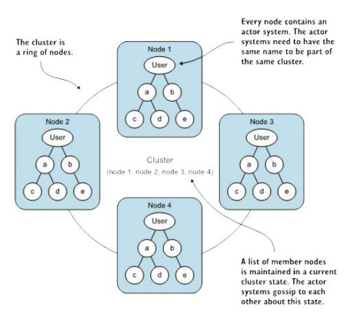
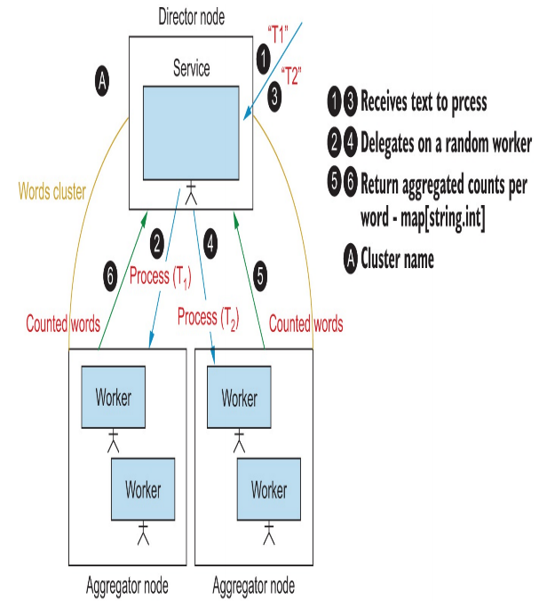
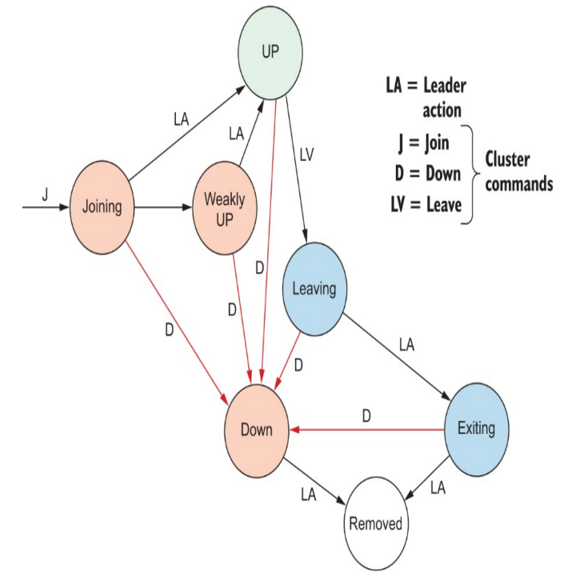
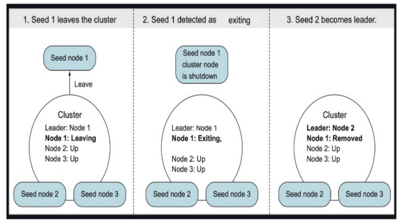
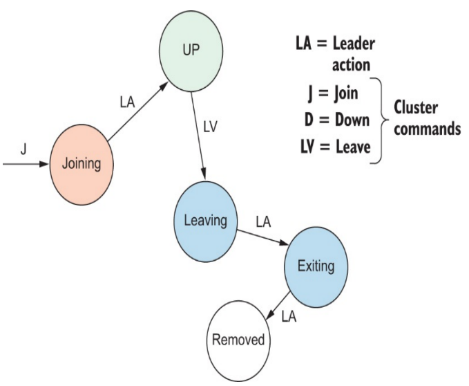
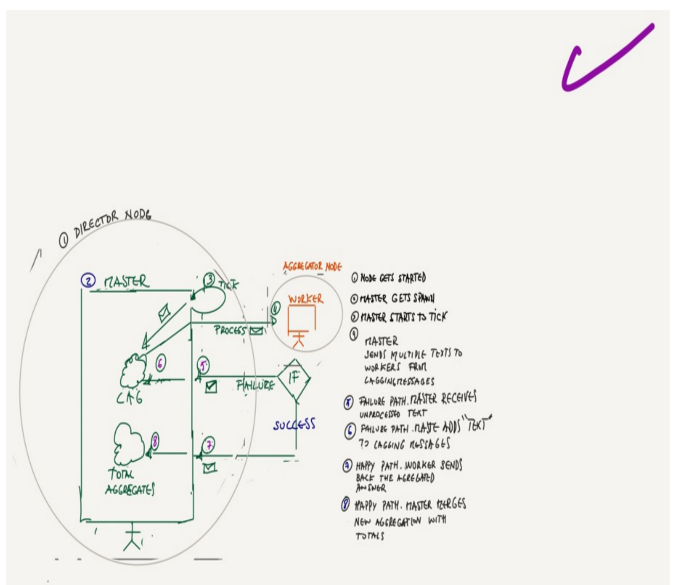
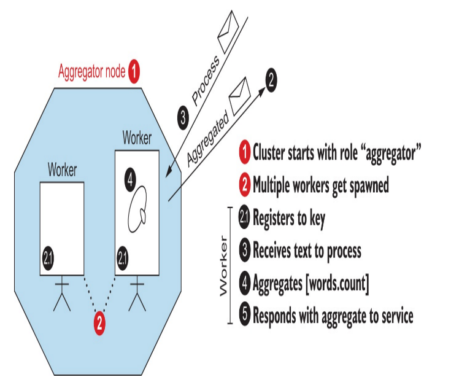
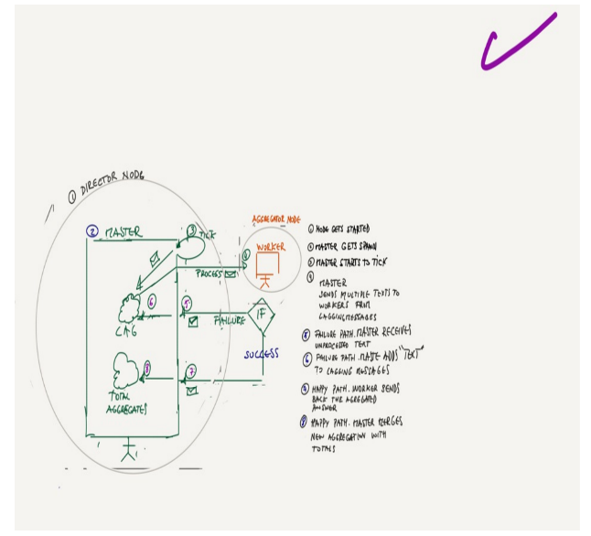

## 集群 

**本章将涵盖以下内容：**
* 形成一个集群  
* 集群监控  
* 构建一个集群化的Akka应用程序  

Akka集群是一组进行对等通信以形成一个整体的节点。这些节点是生活在独立JVM中的ActorSystems。由于其分布式结构，一个集群没有单一的故障点，它是容错的，并且可以动态地增加和减少节点数量。 

分布式应用程序运行在不完全在你控制之下的环境中，比如云计算平台或远程数据中心。集群越大，分配负载的能力越强，但故障的风险也越大。在这种不可避免的故障发生时，Akka提供了集群功能和许多扩展，这些扩展提供了多年来提出的常见需求的解决方案。  
其中一个需求是监视和改变集群节点状态的手段。Akka集群带来了多种工具。你将在本章中了解到前两种工具；对于其他的工具，了解它们在你需要的时候可用可能会很有用。  

* 集群单例 - 在整个集群中只有一个实例的Actor，如果发生故障，它将被迁移到另一个节点。关于这一点，我们会在本章后面详细介绍。  
* 集群分片 - Actor被自动分布到不同的节点上，分布的关键是一个分区键，这个键也被用来与Actor进行通信。当节点离开集群时，这提供了负载均衡和弹性。关于这个，我们会在下一章详细介绍。 
* 分布式数据 - 分布式键值对象，最终一致性，并且可以被集群中任何节点的任何Actor使用。这些值是无冲突复制数据类型。  
* 分布式发布订阅 - Actor可以创建、发布和订阅主题。  
* 可靠的交付 - 除了默认的最多一次交付，这个模块还提供了至少一次的保证。 
* 多数据中心集群 - 提供在不同数据中心部署集群的机制，以增加弹性。 

除了这些模块之外，Akka管理下还有一些工具，旨在与集群节点进行交互。我们来简单看一下这些工具。  

* 核心（也称为管理）- 提供通过HTTP与集群交互的基本功能，这构成了Akka管理中不同模块的基础。  
* 集群管理HTTP - 利用核心模块提供一个端点，用于读取和修改集群中节点的状态。 
* 集群引导 - 自动发现网络中的节点，而不是使用静态配置。 
* 发现 - 集群引导和许多其他Akka的基础。它为静态配置提供了一个查找服务，以及如DNS、Kubernetes、AWS、Consul或Marathon的动态实现。 

了解这两大类别：akka-cluster及其模块和akka-management核心及其扩展，对构建思维模型是非常有用的。在本章中，你将学习关于akka-cluster如何形成一个集群，以及如何使用akka-management和akka-management-cluster-http通过HTTP处理集群中的节点。在本章的第一节中，你将了解一个节点如何成为集群的成员，如何监听成员事件，以及如何检测集群中的节点是否已经崩溃。  

**重要提示：**  
你可以使用以下代码配套资料 https://github.com/franciscolopezsancho/akka-topics/tree/main/chapter08a 来查看以下示例的源代码。你可以在与类、对象或特质同名的.scala文件中找到任何代码片段或列表的内容。本章中的代码在Git仓库的多个项目中进行了分组。因此上面有chapter8a，后面你会看到Chapter8b。之所以这样做，一方面是因为你有不同的可执行文件和每个文件的不同配置。这种分离帮助你分别运行它们，而无需进行太多额外的配置。另一个原因是你可以将本章的某些想法映射到这些项目中。最简单的集群应用程序在chapter8a中编写，而一个更复杂的带有词计数逻辑的集群示例在chapter8b中编写。在整本书中，这种根据可执行文件和想法对项目进行分组的方式会持续进行。   

### 8.1 为什么使用集群？ 
集群是一组动态的节点。在每个节点上，都有一个在网络上监听的actor系统。集群是建立在Akka远程模块之上的，使得Akka能够实现位置透明。无论一个actor是否在同一个节点上，其位置都是抽象的，因此无论actor所在何处，我们都可以透明地处理它。你的代码，即业务逻辑，不必为此操心。图8.1显示了一个由四个节点组成的集群。  
图8.1 一个由四个节点组成的集群Actor系统 
  

集群模块的最终目标是为actor的分发和故障切换提供完全自动化的功能。现在，我们要关注以下几个特性： 
* 集群成员资格：为actor系统提供容错的成员资格。 
* 分区点：actor系统可以被分割为位于不同节点上的actor子树。你会在本章后面的角色部分了解更多关于这点的内容。  

一个专用的数据处理应用程序是使用集群的理想候选应用程序，例如，图像识别或社交媒体的实时分析等数据处理任务。当需要更多或更少的处理能力时，可以添加或移除节点。处理任务是被监控的：如果一个actor失败，该任务可以在集群上重新启动并重试，直到它成功或被放弃。 

你可以在图8.2中找到一个例子，但不用担心细节。一旦你学会了集群的基本概念，你将详细学习一个例子。现在我们只需说，目标是开发一个计算单词的应用程序。在一系列文本中，一个单词出现了多少次。 
  

在深入研究应用程序的具体内容之前，你需要了解一些事情。如何创建一个集群，为此你需要所谓的种子节点。节点如何成为种子节点以及如何加入和离开集群。你将看到一个集群是如何形成的，并通过REPL控制台实验加入和离开一个简单的集群。最后，你将学习一个成员节点可以经历的不同状态，以及如何接收关于这些状态变化的通知。  

#### 8.1.1 集群成员资格：加入集群

就像任何类型的团体一样，你需要一些"创始人"来启动这个过程。为此，Akka 提供了种子节点功能。种子节点是集群的起点，是其他节点的第一个接触点。节点通过发送一个包含加入节点唯一地址的 JOIN 消息来加入集群。集群模块确保此消息发送到已注册的种子节点之一。节点不需要包含与 ActorSystem 不同的 actor，因此可以使用纯种子节点。图 8.3 展示了如何使用种子节点初始化一个集群，以及其他节点如何加入集群。

图 8.3 使用种子节点初始化集群 


#### 8.1.2 集群最小示例

让我们从通过 REPL 控制台创建种子节点开始，这将使你更好地了解集群是如何形成的。明确一点：如果你正在设置一个集群应用，你不会手动进行这些步骤。现在你将看到如何在较低级别与集群进行交互，以便更好地理解基本原理。你所需要的只是一个 ActorSystem 和一些配置。让我们从配置开始，因为在这种情况下，Actor 系统将在 REPL 中创建。Actor 系统需要配置为使用集群模块。清单 8.1 显示了设置种子节点的最小配置。配置需要你选择以下内容：

* Actor 提供者 - 它可以是本地的或集群的。本地用于不需要分布的应用，如流处理器或 HTTP 服务器。否则，你可以选择集群提供者，以允许在任何节点上创建 actor。为此，在配置中设置 akka.actor.provider = cluster。 
* 远程 - 这是不同节点上的 actor 通过其相互通信的内部机制。  
* 种子节点 - 启动节点的主机、端口和 actor 系统名称的列表。记住，种子节点并不是唯一的选项，但现在让我们专注于它们。  

清单 8.1 在 application.conf 中配置种子节点 
```
akka {
  actor {
    provider = "cluster"               
  } 
  remote {            
    artery {
      transport = tcp
      canonical.hostname = 127.0.0.1
      canonical.port = ${PORT}
    }
  }
  cluster {                 
    seed-nodes = [
     "akka://words@127.0.0.1:2551",
     "akka://words@127.0.0.1:2552",
     "akka://words@127.0.0.1:2553"
    ]                       
 
  }
}
``` 
你看到的是 127.0.0.1 而不是 localhost，因为后者可能会根据你的设置解析为不同的 IP 地址，而 Akka 则会按字面解析地址。你不能依赖于用于系统地址的 akka.remote.artery.canonical.hostname 值的 DNS 解析；对此并未进行任何 DNS 解析。在 Akka 远程节点之间序列化 actor 引用时，将使用地址的精确值。因此，一旦你向由这样的 actor 引用所引用的远程 actor 发送消息，它将使用该精确地址连接到远程服务器。不使用 DNS 解析的主要原因是性能。如果配置不正确，DNS 解析可能需要几秒钟；在病态情况下，可能需要几分钟。发现延迟的原因是错误的 DNS 配置并不容易，通常并不立即明显。不使用 DNS 解析简单地避免了这个问题，但这确实意味着你在配置地址时必须小心。  

remote.artery 指的是 remoting 实现。Artery 是 Akka 的经典模块的重新实现，用于节点间通信，它提供了更好的性能和可靠性等特性。artery.transport 提供了三种不同的协议。  

* tcp - 这是默认设置。它基于 Akka Streams TCP，提供高吞吐量和低延迟。 
* tls-tcp - 这与 tcp 相同，但使用 Akka Streams TLS 进行加密。 
* aeron-udp - 基于 Aeron (UDP) 的这种协议，其吞吐量和延迟的性能优于 tcp，但以 CPU 消耗为代价 - 即使应用程序不使用可用的消息速率。 

artery.canonical.hostname 是由地址和端口定义的唯一位置。如果多个名称引用同一 IP 地址，只能使用一个。因此，可以在本地开发中使用 127.0.0.1:port，但不能在网络中使用，因为它不是唯一的。 
artery.canonical.port - Actor 系统应该监听的端口。如果将其设置为 0，将自动且随机地在某些限制范围内选择它。  
要使用这个配置，项目必须在其 build.sbt 中包含以下依赖项。 
```scala
val AkkaVersion = "2.6.20" 
"com.typesafe.akka" %% "akka-cluster-typed" % AkkaVersion
```
有了这个配置，你就有了创建集群所需的一切。  

#### 8.1.3 启动集群 
启动集群需要初始化一个ActorSystem实例。你可以在Sbt控制台上直接执行相关命令。首先，你需要在命令行中执行以下命令以启动Sbt控制台并设置PORT变量的值为2551（这是配置文件中使用的值）： 
```
sbt -DPORT=2551 chapter08a/console
```
执行后的输出如下：  
```
[info] Loading settings for project global-plugins from build.sbt ...
...
Type in expressions for evaluation. Or try :help.

scala> #A
``` 
然后，你需要创建ActorSystem。最简单的方式是在控制台中粘贴以下内容。首先你需要输入`:paste`命令，然后你就可以粘贴测试代码。 

你的代码在控制台上创建了一个ActorSystem，这在Akka Cluster中就是一个节点。你的Scala代码如下：  

```scala
scala> :paste // Entering paste mode (ctrl-D to finish) 

import akka.actor.typed.ActorSystem
import akka.actor.typed.scaladsl.Behaviors
val guardian = ActorSystem(Behaviors.empty, "words") 
// A Behavior.empty is enough to create the actor.
```
在你按下crtl+D之后，插入模式将被退出并且代码会被解析。执行的输出可以在清单8.2中看到，它只包含最重要的消息。 
清单 8.2 输出：

```
// Exiting paste mode, now interpreting.
INFO akka.remote.artery.tcp.ArteryTcpTransport - Remoting started with transport [Artery tcp] ; listening on address [akka://words@127.0.0.1:2551] #A
…
INFO akka.cluster.Cluster - Cluster Node [akka://words@127.0.0.1:2551] - Started up successful #B
INFO akka.cluster.Cluster - Cluster Node [akka://words@127.0.0.1:2551] - No downing-provider-class configured, manual cluster downing required #C

guardian: akka.actor.typed.ActorSystem[Any] = akka://words #D

…INFO akka.cluster.Cluster - Cluster Node [akka://words@127.0.0.1:2551] - Node [akka://words@127.0.0.1:2551] is JOINING itself (with roles [seed, dc-default], version [0.0.0]) and forming new cluster #E
INFO akka.cluster.Cluster - Cluster Node [akka://words@127.0.0.1:2551] - is the new leader among reachable nodes (more leaders may exist) #F
INFO akka.cluster.Cluster - Cluster Node [akka://words@127.0.0.1:2551] - Leader is moving node [akka://words@127.0.0.1:2551] to [Up] 
…WARN akka.remote.artery.Association - Outbound control stream to [akka://words@127.0.0.1:2552] failed. Restarting it. akka.remote.artery.OutboundHandshake$HandshakeTimeoutException: Handshake with [akka://words@127.0.0.1:2552] did not complete within 20000 ms #G
```

你可以将这个输出理解为图8.5所显示的内容。在图8.5中，初始的种子节点加入了自己并且形成了集群。

图图图图


从输出确认领导节点已经切换到Up状态并准备接受其他节点后，就可以进行下一步了。领导节点的角色是管理集群的收敛和成员过渡。任何时候只能有一个节点作为领导，集群中的任何节点都可能成为领导。  
现在你可以用完全相同的方式在其他两个终端启动两个更多的节点——只需要将端口改为2552和2553。在2552端口上添加一个节点的操作会如下所示：  
```
sbt -DPORT=2552 chapter08a/console
```

然后执行以下代码：  
```scala
scala> :paste // Entering paste mode (ctrl-D to finish)
import akka.actor.typed.ActorSystem
import akka.actor.typed.scaladsl.Behaviors

val guardian = ActorSystem(Behaviors.empty, "words")
```
这样，它们将会加入到集群中，如图8.6所示。图8.6 启动第二个种子节点。 
以同样的方式，你可以再次重复这个过程并使用不同的端口（比如2553）来启动一个新的节点。这样，通过接纳新的节点，每个节点运行一个ActorSystem实例，集群就会不断增长。   

图图图图  

在启动节点2552和2553后，你可以在它们的输出中看到节点已经加入集群的确认信息，如下面的代码片段所示：  
```
INFO akka.cluster.Cluster - Cluster Node [akka://words@127.0.0.1:2552] - Welcome from [akka://words@127.0.0.1:2551] 
``` 

下一个代码片段显示了第一个种子节点的输出，确认节点2请求加入，被接受，并被领导者设置为UP。

```
Cluster Node [akka://words@127.0.0.1:2551] - Sending InitJoinAck message from node [akka://words@127.0.0.1:2551] to [Actor[akka://words@127.0.0.1:2552/... #A
Cluster Node [akka://words@127.0.0.1:2551] - Node [akka://words@127.0.0.1:2552] is JOINING, roles [seed, dc-default], version [0.0.0] #B
Cluster Node [akka://words@127.0.0.1:2551] - Leader is moving node [akka://words@127.0.0.1:2552] to [Up] #C
…
```
种子节点2和3都请求加入集群。领导者将它们置于Joining状态，然后将其置于Up状态，使它们成为集群的一部分。所有三个种子节点现在已经成功地加入了集群。 
集群中一个节点的不同状态，也被称为节点的生命周期，在图8.7中显示。图8.7 显示了集群状态的有限状态机。   
    

这些状态可以通过领导者行为或集群命令进行更改，如图8.7所示。领导者行为由系统自动触发，但你也可以向集群发送ClusterCommand消息，这将在下一节中看到。   

当这种情况发生时，下一个节点——IP最低的节点——将接管领导者的角色。下一段代码演示了如何让领导节点1离开集群。这是在节点1的终端中完成的。创建一个地址来引用节点1，并向集群管理器发送一个Leave指令。要做到这一点，你需要按Enter键返回到sbt控制台，然后输入以下内容。   
```scala
scala> import akka.cluster.typed.{ Cluster, Leave }
scala> val address = Cluster(guardian).selfMember.uniqueAddress.address #A
address: akka.actor.Address = akka://words@127.0.0.1:2551
scala> Cluster(guardian).manager ! akka.cluster.typed.Leave(address) #B
```
输出内容中，你可以看到节点1将自己标记为Leaving然后再标记为Exiting，而这个时候它仍然是领导者。这些状态变化会传播到集群中的所有节点。然后，集群节点会关闭，而Actor系统会继续运行。这是图8.8所示。   

此时，可以看到节点1将自身标记为Leaving，然后在仍然是领导者的状态下，标记为Exiting。这些状态的改变被传播到集群中的所有节点。然后，集群节点关闭，而Actor系统继续运行。这如图8.8所示。 
图8.8 第一个种子节点离开集群      
  

在节点2的终端中，你可以看到对退出和领导者移除的确认，以及新领导者的选举。 
```
Cluster Node [akka://words@127.0.0.1:2552] - Exiting confirmed [akka://words@127.0.0.1:2551] #A
Cluster Node [akka://words@127.0.0.1:2552] - is the new leader among reachable nodes (more leaders may exist) #B
Cluster Node [akka://words@127.0.0.1:2552] - Leader is removing confirmed Exiting node [akka://words@127.0.0.1:2551] #C
``` 

**Gossip协议**
你可能会想，示例中的种子节点是如何知道第一个种子节点正在离开、退出，最后被移除的。Akka使用一个gossip协议将集群的状态通知给集群中的所有成员节点。每个节点都会向其他节点传播自己的状态以及它所看到的状态（这就是所谓的gossip）。这个协议使得集群中的所有节点最终都能达成对每个节点状态的共识。这种共识称为收敛，它可以在节点彼此之间传播的过程中随着时间的推移而发生。为了协助这种收敛，在节点无法达到的情况下，创建了“Split Brain Resolver”模块。在收敛之后，可以确定集群的领导者。状态为Up或Leaving的第一个节点（按照排序顺序）自动成为领导者。（用于对节点排序的是节点的完整远程地址，例如akka.tcp://words@127.0.0.1:2551。）  

种子节点2和3了解到种子节点1已经请求离开集群。一旦节点1转变到Exiting状态，种子节点2就会自动接管，并将离开节点的状态从Exiting更改为Removed。现在，集群还有两个种子节点，并且仍然能够正常工作。本例中节点1的转变如图8.9所示。  

图8.9 从Joining到Removed的种子节点1。 
    

#### 8.1.5 不可达
如果一个节点无法被达到，这可能有各种原因。可能是网络分区，可能是非常长的垃圾收集暂停，或者可能是不正常的关闭。在这些情况下，领导节点无法履行其职责，也就是说，节点无法被设为Leaving或Up状态。在这些情况下，唯一可能设置的状态是WeaklyUp。让我们看看如果一个种子节点崩溃而没有可能适当关闭它会发生什么。这可以通过杀掉进程来模拟。 

注意 在Linux或OS/X下，你可以使用kill -9 [PID]来杀掉一个进程。在Windows 10下，你可以使用taskkill /F /PID [pid_number]。你可以通过搜索一个带有参数 -jar [.../.../]sbt-launch.jar 和 -DPORT=2551 的Java进程来找到这个PID——如果你尝试杀掉前面例子中的节点1。下面的列表显示了当种子节点1突然终止时，运行种子节点2的终端的输出。  
```
Cluster Node [akka://words@127.0.0.1:2552] - Marking node as UNREACHABLE [Member(akka://words@127.0.0.1:2551, Up)]. #A
Cluster Node [akka://words@127.0.0.1:2552] - is the new leader among reachable nodes (more leaders may exist) #B
```

种子节点1被集群标记为不可达，这得益于一个故障检测机制，该机制决定何时应将一个节点视为不可达。当种子节点崩溃时，它处于Up状态，但这可能发生在任何其他状态。在这种情况下，被标记为不可达的节点必须被关闭，因为没有回头路。它不能恢复并重新加入集群。出于安全原因，这是不允许的。如果你想再次启动节点，你可以运行chapter08a中的Main类，它包含了你用来启动节点的相同代码。 
```java
import akka.actor.typed.ActorSystem
import akka.actor.typed.scaladsl.Behaviors

object Main extends App {
  ActorSystem(Behaviors.empty, "words")
}
```
要用这个Main启动一个节点，你需要在命令行中输入以下内容。  
```
sbt -DPORT=2552 chapter08a/run
```
注意这里的端口是2552。你可以根据你的可用端口情况自由改变它。    

8.1.6 关闭一个可达节点
集群中的任何节点都可以通过发送一个akka.cluster.type.Down消息来关闭一个节点。列表8.3展示了如何从REPL手动关闭节点1，方法是创建指向节点1的地址并向集群管理器发送down消息。

列表8.3 手动关闭种子节点1
```scala
scala> import akka.actor.Address
scala> import akka.cluster.typed.{ Cluster, Down}
scala> val address = Address("akka", "words", "127.0.0.1",2551)
address: akka.actor.Address = akka://words@127.0.0.1:2551
scala> Cluster(guardian).manager ! Down(address)
```
Cluster Node [akka://words@127.0.0.1:2552] - Marking unreachable node [akka://words@127.0.0.1:2551] as [Down] #A
Cluster Node [akka://words@127.0.0.1:2552] - Leader can perform its duties again #B
Cluster Node [akka://words@127.0.0.1:2552] - Leader is removing unreachable node [akka://words@127.0.0.1:2551] #C
Association to [akka://words@127.0.0.1:2551] with UID [3375074971115939575] is irrecoverably failed. UID is now quarantined and all messages to this UID will be delivered to dead letters. Remote ActorSystem must be restarted to recover from this situation. Reason: Cluster member removed, previous status [Down] #D

输出还显示，如果种子节点1想要重新连接，就必须重启它的Actor系统。虽然一个不可达节点可以通过设置在一定时间后自动关闭，但这并不推荐。最好使用Akka Split Brain Resolver (SBR)，它会根据你的配置自动为你做出这个决定。你现在可以通过在你的.conf文件中添加以下内容来设置它。

akka.cluster.downing-provider-class = "akka.cluster.sbr.SplitBrainResolverProvider"

这个话题在第13章中有更详细的讨论。

**故障检测器**  
集群模块使用一个j滞后故障检测器的实现来检测不可达节点。这项工作是基于Naohiro Hayashibara, Xavier Défago, Rami Yared, 和 Takuya Katayama的一篇论文(https://ieeexplore.ieee.org/document/1353004)。 

检测故障在分布式系统的容错中是一个基本问题。j滞后故障检测器计算一个连续的标度值（称为j(φ)值），而不是确定一个指示故障的布尔值（节点是否可达）。从引用的论文中：“大致来说，这个值表示一个对应的被监控过程已经崩溃的信心度。如果过程确实崩溃，这个值保证会随着时间的推移积累，并趋向于无穷大，因此得名。”这个值被用作一个怀疑出问题的指标（怀疑等级）而不是确定一个硬性的是或否的结果。怀疑等级的概念使故障检测器可调，并允许应用程序需求和环境监控之间的解耦。集群模块提供了一些你可以为你特定的网络环境调整的故障检测器设置，在akka.cluster.failure-detector部分，其中包括一个节点被视为不可达的j值的阈值。   

节点往往在处于GC暂停状态时被视为不可达，这意味着垃圾收集花费的时间太长，JVM在垃圾收集完成之前不能做任何其他事情。 

在这个例子中，你查看了集群的日志来确定其状态，并了解如何与之交互。为此，你看到了如何输入一些命令到控制台来让节点离开集群或切换到down状态。如前面提到的，这不是你在真实应用程序中使用的方法。所有这些任务都被委托给SBR模块。 

现在有一个特殊的模块可以与集群交互，检查其状态并改变它，那就是Akka Management，特别是Cluster HTTP子模块。让我们来看一下它。     

### 8.2 Akka管理和集群HTTP扩展 
Akka管理是一组工具，允许你对集群进行许多不同的操作。有许多模块在其基础上构建，但现在你将重点关注akka-management-cluster-http。其API允许你通过HTTP调用检查集群的状态，如果配置允许，还可以更改它。 

要添加这个功能，你需要包含一些库依赖。这些是akka-management和akka-management-cluster，为了解决传递依赖性，还有akka-cluster-sharding和akka-discovery。以下是相关代码： 
```scala
val AkkaManagementVersion = "1.1.4"
val AkkaVersion = "2.6.20"

libraryDependencies ++= Seq(
  "com.lightbend.akka.management" %% "akka-management" % AkkaManagementVersion,
  "com.lightbend.akka.management" %% "akka-management-cluster-http" % AkkaManagementVersion,
  "com.typesafe.akka" %% "akka-cluster-sharding" % AkkaVersion,
  "com.typesafe.akka" %% "akka-discovery" % AkkaVersion
)
```

这为你提供了以下的akka-management默认配置： 

```scala
akka.management.http.hostname = "<hostname>" #A
akka.management.http.port = 8558 #B
```

这提供了一个HTTP端点在[InetAddress.getLocalHost.getHostAddress]:8558 #A

现在你需要在每个节点中启动Akka管理服务器。为此你需要以下代码：

```scala
import akka.management.scaladsl.AkkaManagement

AkkaManagement(system).start()
```

在chapter08a的Main中添加以上代码将在你运行它时在每个节点中启动Akka管理服务器。这样一个Main看起来像这样：

```scala
import akka.actor.typed.ActorSystem
import akka.actor.typed.scaladsl.Behaviors
import akka.management.scaladsl.AkkaManagement

object Main extends App {
  ActorSystem(Behaviors.empty, "words") #A
  AkkaManagement(system).start() #B
}
```

请记住，由于这个例子在同一台机器上运行，你需要注意端口。不仅是remote.canonical.port，还有akka.management.http.port，这也必须与默认值不同。至少对于所有运行的节点，除了第一个。否则你会得到java.net.BindException: [xyz-address]地址已在使用。你可以做以下操作来启动第一个节点： 
```bash
$ sbt -DPORT=2551 \
  -Dakka.management.http.port=8558 \
  -Dakka.management.http.hostname=127.0.0.1 chapter08a/run
```

然后你可以在另一个终端做同样的操作，设置端口2552和8559来启动另一个节点并将其添加到集群。一旦设置了节点1，你就可以用现在添加的akka-management来管理集群。可用的操作显示在表8.1中。

如果设置了akka.management.http.route-providers-read-only = false，那么你现在可以通过简单地请求curl -XDELETE localhost:8558/cluster/members/akka://words@127.0.0.1:2552来强制2552端口上的节点离开。这将返回：{"message":"Leaving akka://words@127.0.0.1:2552"}。

**重要提示：**
你可以使用以下代码伴侣 https://github.com/franciscolopezsancho/akka-topics/tree/main/chapter08b 来查看以下例子的源代码。你可以在与类、对象或特性名称相同的.scala文件中找到任何片段或列表的内容。    

#### 8.2.1 集群订阅 
检查集群状态的另一种方式是订阅。你可以通过ClusterDomainEvent消息得到通知，而不是向akka-management-cluster HTTP模块发出同步HTTP调用。你可以通过在akka.cluster.typed.Cluster上使用subscriptions方法，将一个actor订阅到这些集群事件。  

在计算单词应用中，你可以看到守护进程如何订阅集群领域事件。具体来说，为了验证应用是否已启动，确保集群中有最少数量的节点可以接手工作。如果没有工作人员进行计数，你不想开始处理文本。但在你得到这个之前，让我们看看一个actor如何订阅生命周期事件并在列表8.5中得到通知。在这里，你可以看到一个actor如何在.setup中订阅，定义其行为来处理这些ClusterDomainEvents，并在接收到PostStop信号时取消订阅。这在列表8.5中显示。 

列表8.5 订阅到Cluster域事件 
```scala
import akka.actor.typed.PostStop
import akka.actor.typed.scaladsl.Behaviors
import akka.cluster.typed.{ Cluster, Subscribe, Unsubscribe }
import akka.cluster.ClusterEvent._
import akka.cluster.MemberStatus

object ClusterDomainEventListener {
  def apply() = Behaviors.setup[ClusterDomainEvent] { context =>
    Cluster(context.system).subscriptions ! Subscribe(
      context.self, 
      classOf[ClusterDomainEvent]) #A

    Behaviors
      .receiveMessage[ClusterDomainEvent] { #B
        case MemberUp(member) =>
          context.log.info(s"$member UP.")
          Behaviors.same

        case MemberExited(member) =>
          context.log.info(s"$member EXITED.")
          Behaviors.same

        case MemberRemoved(m, previousState) =>
          if (previousState == MemberStatus.Exiting) {
            context.log.info(s"Member $m gracefully exited, REMOVED.")
          } else {
            context.log.info(s"$m downed after unreachable, REMOVED.")
          }
          Behaviors.same

        case UnreachableMember(m) =>
          context.log.info(s"$m UNREACHABLE")
          Behaviors.same

        case ReachableMember(m) =>
          context.log.info(s"$m REACHABLE")
          Behaviors.same

        case event =>
          context.log.info(s"not handling ${event.toString}")
          Behaviors.same
      }
      .receiveSignal {
        case (context, PostStop) =>
          Cluster(context.system).subscriptions ! Unsubscribe(
            context.self) #C
          Behaviors.stopped
      }
  }
}
```

Cluster.manager与Cluster.subscriptions一起完成了akka.cluster.typed.Cluster的可用API。前者几乎只在Akka内部使用，而后者是你在应用中会使用的。通过理解Akka集群的基础知识，你现在可以深入了解一个简单应用的细节，并轻松区分哪些属于集群功能，哪些属于应用领域。   

### 8.3 集群化的工作处理 
在接下来的应用中，有两种主要类型的actor，Master和Worker，它们各自生活在不同的节点中，这取决于节点是否担任导演或聚合器的角色。Master产生一些需要按单词分组和计数的文本。为了完成这个任务，master将每个文本的分组和计数任务委托给工作人员，而它只聚合每个工作人员的工作结果。   

每个文本都从master发送到一个随机的工作人员，该工作人员通过计算文本中每个单词的出现次数来处理它。工作节点异步处理每个文本，结果是处理速度更快，并最终将计数结果发送回master，由master进行总结。这个想法是在一个弹性应用的背景下进行划分和征服。这再次在图8.10中显示。图8.10 ClusterWords actor和主要流程 
      

在图中，你可以看到，根据节点的角色，导演节点上创建一个主角色，而聚合器节点上创建工作人员。当导演节点启动时，它创建一个主演和一个可以与每个已注册的工作人员通信的路由器。这个路由器被主角色用来将每个文本委托给每个工作人员。为了简化例子，主节点每秒生成一个文本，而不是像在真实的应用中那样从如主题或队列这样的源中提取数据。    

主节点以指定的速率向一个随机工作人员发送消息，并期望在3秒或更短的时间内得到响应。这个响应可以是一个成功的字词聚合，也可以是一个包含原始消息的失败，然后被转发到一个叫做延迟的队列进行重新处理。如果成功，主角色会将聚合与其当前状态合并，并保持到那时为止接收的所有聚合的总和。这再次如图8.11所示。   

图8.11 主节点流程 
  

当聚合节点启动时，它将创建配置中指定的工人员数。他们在安装期间与工人进行注册。注册密钥，以便主节点的路由器，它订阅 到那个钥匙，可以找到他们并送他们工作。从那时起，消息到达工人，并被处理，结果以映射[字符串，Int]的形式返回，指示频率 每个字。您可以查看图8.12中的工人的业务逻辑。

图8.12：工人  
    

在下一节中，您将详细介绍所有步骤，从启动集群到分发工作，再到在聚合器节点崩溃时测试应用程序的弹性.   

在本例中，假定错误不是由于消息的内容，而是由于缺乏通信。如果工人无法处理该消息，因为内容，这将由监督来处理，但这并不能说明本章的主要主题。我们在这里关心的故障排除是通过集群实现的弹性。  

#### 8.3.1 实践
为了查看运行时主节点和工作节点之间的逻辑，让我们看一下运行主节点的导演节点的日志。当工作节点达到 Up 状态时，将创建一个主节点并开始向它们发送要处理的文本。最后，它们会回应并将计数添加到主节点状态。在列表 8.6 中，你可以看到主节点运行 CounterApp 时输出两种类型的变量的日志。滞后和当前单词计数。
列表 8.6 当存在聚合节点时，主节点从主演者输出的聚合
[17:50:14,499] [DEBUG] - 接收，当前滞后 0 #A
[17:50:14,505] [DEBUG] - 当前计数 HashMap(this -> 16, a -> 32, very -> 16, simulates -> 16, simple -> 16, stream -> 32) #B
[17:50:14,505] [DEBUG] - 当前计数 HashMap(this -> 17, a -> 34, very -> 17, simulates -> 17, simple -> 17, stream -> 34)
[17:50:14,505] [DEBUG] - 当前计数 HashMap(this -> 18, a -> 36, very -> 18, simulates -> 18, simple -> 18, stream -> 36)
[17:50:14,505] [DEBUG] - 当前计数 HashMap(this -> 19, a -> 38, very -> 19, simulates -> 19, simple -> 19, stream -> 38)
[17:50:14,505] [DEBUG] - 当前计数 HashMap(this -> 20, a -> 40, very -> 20, simulates -> 20, simple -> 20, stream -> 40)
因为工作节点可用，而且这个时间点发送的所有文本都已经无问题地处理了，所以滞后为零。现在让我们深入代码。

#### 8.3.2 代码
启动应用程序的入口点在列表 8.7 中部分显示。其中一部分与启动时指定的角色和端口参数有关。如果没有传递参数，则创建一个聚合器，为 akka.remote 配置生成一个随机端口。否则，参数可以指定节点的端口和角色。
列表 8.7 应用程序的入口点
```scala
import akka.cluster.Cluster
import akka.actor.typed.scaladsl.{ Behaviors, Routers }
import akka.actor.typed.{ ActorSystem, Behavior }
import com.typesafe.config.ConfigFactory

object CounterWordsApp {

  def main(args: Array[String]): Unit = {
    if (args.isEmpty) {
      startup("aggregator", 0) #A
    } else {
      require(
        args.size == 2, "Usage: two params required 'role' and 'port'") #B
      startup(args(0), args(1).toInt)
    }
  }

  def startup(role: String, port: Int): Unit = {
    val config = ConfigFactory
      .parseString(s"""
         akka.remote.artery.canonical.port=$port
         akka.cluster.roles = [$role]
      """)
      .withFallback(ConfigFactory.load("words")) #C
    ActorSystem[ClusterDomainEvent](ClusteredGuardian(), "WordsCluster", config) #D
  }

  … #E
}
```
这些参数可以是以下的。在 sbt 中运行以下命令：
```scala
sbt:chapter08b>runMain example.countwords.CounterApp seed 2551
sbt:chapter08b>runMain example.countwords.CounterApp director 2555
sbt:chapter08b>runMain example.countwords.CounterApp aggregator 2556
sbt:chapter08b>runMain example.countwords.CounterApp aggregator 2557
```
在不同的终端执行，将启动四个应用程序节点，一个种子节点，一个导演和 2 个聚合器。由于主节点在没有工作节点的情况下无法做任何事情，所以只有当集群有一定数量的工作节点时，主节点才能被提升到 Up。你可以使用配置来设置具有特定角色的最小成员数量作为成为 Up 的前提条件。此配置文件定义了在 127.0.0.1 和端口 2551、2552 和 2553 上运行的本地种子节点列表；由于 2551 是第一个种子节点，这将足以启动集群。这在列表 8.8 中显示。
列表 8.8 为 MemberUp 事件配置工作节点的最小数量
```scala
…cluster {
  seed-nodes = [
    "akka://WordsCluster@127.0.0.1:2551",
    "akka://WordsCluster@127.0.0.1:2552",
    "akka://WordsCluster@127.0.0.1:2553",
  ]
  role {
    seed.min-nr-of-members = 1 #A
    aggregator.min-nr-of-members = 2 #A
  }
}

example.countwords {
  workers-per-node = 5 #B
  delegation-parallelism = 20 #C
}…
```
此配置指定在他们可以被移动到 Up 之前，必须至少有两

个聚合器和一个种子正在加入。这与订阅 SelfUp 集群域事件结合使用，以推迟 Guardian 产生 Master。如果在导演节点中创建了 guardian，那么当接收到 SelfUp 时，将创建两个演员：一个 GroupRouter 和一个使用此路由器随机委托工作给工作人员的 Master – 这是路由器的默认策略。如果在聚合器节点中创建了 guardian - 例如，使用 runMain example.countwords.App worker 2556 - 它将生成与配置值 example.countwords.workers-per-node 定义的工作节点数量一样多的工作节点。这在列表 8.9 中显示。
列表 8.9 为 MemberUp 事件配置工作节点的最小数量
```scala
import akka.cluster.Cluster
import akka.actor.typed.scaladsl.{ Behaviors, Routers }
import akka.actor.typed.{ ActorSystem, Behavior }
import com.typesafe.config.ConfigFactory

object CountWordsApp {

  def main …

  def startup(role: String, port: Int): Unit = …

  private object ClusteredGuardian {
    def apply(): Behavior[SelfUp] = Behaviors.setup[SelfUp] { context =>
      val cluster = Cluster(context.system)

      if (cluster.selfMember.hasRole("director")) { #A
        Cluster(context.system).subscriptions ! Subscribe( #B
          context.self, classOf[SelfUp])
      }

      if (cluster.selfMember.hasRole("aggregator")) { #C
        val numberOfWorkers = context.system.settings.config.getInt("example.countwords.workers-per-node") #D
        for (i <- 0 to numberOfWorkers) {
          context.spawn(Worker(), s"worker-$i")
        }
      }

      Behaviors.receiveMessage {
        case SelfUp(_) =>
          val router = context.spawnAnonymous { #E
            Routers
              .group(Worker.RegistrationKey)
          }

          context.spawn(Master(router), "master") #F

          Behaviors.same
      }
    }
  }
}
```
现在，让我们深入主节点。    

#### 8.3.3 主节点中的工作分发 

本章讲述的是不同 JVM 间的通信，因此，发送到另一个节点（在这里是从聚合器到导演）的消息必须被序列化。因此，主节点的部分协议是用 CborSerializable 定义的。当你对主节点和工作节点的实现有了完整的理解后，你将在本章中了解更多关于序列化的内容，但现在让我们专注于主节点的协议。

```scala
object Master {
  sealed trait Event
  final case object Tick extends Event #A
  final case class CountedWords(aggregation: Map[String, Int]) #B extends Event with CborSerializable
  final case class FailedJob(text: String) extends Event #C
  …
}
```

主节点在初始化时每秒向自身调度一个 Tick 消息，这个消息生成一个用于处理的假文本。初始化之后，它将其状态改变为工作状态。下面的代码片段显示了这个过程。

```scala
import akka.actor.typed.{ ActorRef, Behavior }
import akka.actor.typed.scaladsl.Behaviors

object Master {
  … #A

  def apply(workerRouter: ActorRef[Worker.Command]): Behavior[Event] = Behaviors.withTimers { timers =>
    timers.startTimerWithFixedDelay(Tick, Tick, 1.second) #B
    working(workerRouter) #C
  }

  final def working … #C
}
```

每个生成的文本都添加到滞后队列中，然后从那里将一个大小为 example.countwords.delegation-parallelism 的批次发送到路由器，路由器将消息转发给工作节点。每个发送给工作节点的请求都通过一个有 3 秒超时的 ask 来执行。使用四个聚合器节点，每个节点有 5 个工作节点，一个并行委托度为 20 将被完全利用。当工作节点的响应回来时，如果响应是 Success，则主节点向自己发送 CountedWords，如果是 Failure，则发送 FailedJob。这在列表 8.10 中显示。

清单 8.10 主节点实现的第二部分
```scala
object Master {
…
def working(
  workersRouter: ActorRef[Worker.Command],
  countedWords: Map[String, Int] = Map(), #A
  lag: Vector[String] = Vector()): Behavior[Event] = #B
  
  Behaviors.setup[Event] { context =>
    implicit val timeout: Timeout = 3.seconds #C
    val parallelism = … #C
    
    Behaviors.receiveMessage[Event] {
      case Tick =>
        context.log.debug(s"receiving, current lag ${lag.size} ")
        val text = "this simulates a stream, a very simple stream"
        val allTexts = lag :+ text
        val (firstPart, secondPart) = allTexts.splitAt(parallelism) #D
        
        firstPart.map { text =>
          context.ask(workersRouter, Worker.Process(text, _)) { #E
            case Success(CountedWords(map)) => CountedWords(map)
            case Failure(ex) => FailedJob(text)
          }
        }
        working(workersRouter, countedWords, secondPart)
      case … 
    }…
}
```

如果发送给自己的消息是 CountWords，它会使用 merge 函数将计数添加到 countedWords 的总数。如果发送给自己的消息是 FailedJob，它会将失败的文本发送给自己并将其放回到滞后队列中。这在列表 8.11 中显示。

清单 8.11 主节点实现的后半部分
```scala
object Master {
…
def working(
  workersRouter: ActorRef[Worker.Command],
  countedWords: Map[String, Int] = Map(), #A
  lag: Vector[String] = Vector()): Behavior[Event] = #B
  
  Behaviors.setup[Event] { context =>
    …
    Behaviors.receiveMessage[Event] {
      case Tick => …
      case CountedWords(map) => #C
        val merged = merge(countedWords, map)
        context.log.debug(s"current count ${merged.toString} ")
        working(workersRouter, merged, lag)
      case FailedJob(text) => #D
        context.log.debug(
          s"failed, adding text to lag ${lag.size} ")
        working(workersRouter, countedWords, lag :+ text)
    } 
  }
  private def merge( #E
    currentCount: Map[String, Int], 
    newCount2Add: Map[String, Int]): Map[String, Int] = … 
}
```
可能值得再看一下现在作为图 8.13 显示的主节点业务逻辑。

图 8.13 主节点业务流程  
    

在协议中，Worker只有一种消息类型，其中包含要处理的文本和要回复给master的引用。
```
final case class Process(text: String, replyTo: ActorRef[Master.Event]) extends Command with CborSerializable
```
在设置过程中，worker将自己注册到注册键中，以便后续master的路由器可以找到它。在设置后，每次收到Process消息时，它都会将文本分割成单词，对它们进行计数，并将结果发送回master。你可以在列表8.11中看到实现。

列表8.11 Worker实现
```scala
import akka.actor.typed.{ ActorRef, Behavior }
import akka.actor.typed.scaladsl.Behaviors
import akka.actor.typed.receptionist.{ Receptionist, ServiceKey }

object Worker {
  val RegistrationKey = ServiceKey[Worker.Command]("Worker")

  sealed trait Command #A
  final case class Process(text: String, replyTo: ActorRef[Master.Event]) extends Command #A with CborSerializable #B

  def apply() = Behaviors.setup[Command] { context =>
    context.log.debug(s"${context.self} subscribing to $RegistrationKey")
    context.system.receptionist ! Receptionist #C
      .Register(RegistrationKey, context.self)
    Behaviors.receiveMessage {
      case Process(text, replyTo) =>
        context.log.debug(s"processing $text")
        replyTo ! Master.CountedWords(processTask(text)) #D
        Behaviors.same
    }
  }

  private def processTask(text: String): Map[String, Int] = … #D
}
```
有了这个，你就对应用程序有了完整的视图。如何启动它你可以在下面的部分再次看到。

#### 8.3.4 启动集群

如果你想运行应用程序，你可以转到git仓库。在不同的终端中输入sbt chapter08b打开四个Sbt shell，并按下面所示启动四个节点。
```shell
sbt:chapter08b>runMain example.countwords.App seed 2551
sbt:chapter08b>runMain example.countwords.App director 2555
sbt:chapter08b>runMain example.countwords.App aggregator 2556
sbt:chapter08b>runMain example.countwords.App aggregator 2557
```
#### 8.4 弹性工作

下面将展示当节点失败时集群的容错能力。在你启动集群和master处理文本之后，你可以杀掉所有的聚合器节点并等待。在你启动新的聚合器和没有工作者可用之前，master会将每一个失败收集为lag，所以没有任何数据会丢失。并且一旦新的聚合器加入到集群中，master就可以成功地再次委派工作，直到lag最终达到零。你可以在下面的片段中看到在关闭所有聚合器节点后的输出。

```shell
[18:45:15,531] [DEBUG] - failed, adding text to lag 59 #A
[18:45:15,540] [DEBUG] - tick, current lag 60 #B
[18:45:15,540] [DEBUG] - failed, adding text to lag 56
[18:45:15,540] [DEBUG] - failed, adding text to lag 57
[18:45:15,540] [DEBUG] - failed, adding text to lag 58
```
lag不是以有序的方式显示，这就揭示了消息不确定性的本质。现在，当新的聚合器节点被添加到集群中并且工作者被生成和注册后，他们开始工作，master的lag开始减少，如下一段代码所示。

```shell
[18:50:14,499] [DEBUG] - tick, current lag 351 #A
[18:50:14,505] [DEBUG] - current count HashMap(this -> 16, a -> 32, very -> 16, simulates -> 16, simple -> 16, stream -> 32) #B
[18:50:14,505] [DEBUG] - current count HashMap(this -> 17, a -> 34, very -> 17, simulates -> 17, simple -> 17, stream -> 34)
[18:50:14,505] [DEBUG] - current count HashMap(this -> 18, a -> 36, very -> 18, simulates -> 18, simple -> 18, stream -> 36)
[18:50:14,505] [DEBUG] - current count HashMap(this -> 19, a -> 38, very -> 19, simulates -> 19, simple -> 19, stream -> 38)
[18:50:14,505] [DEBUG] - current count HashMap(this -> 20, a -> 40, very -> 20, simulates -> 20, simple -> 20, stream -> 40)
[18:50:15,510] [DEBUG] - receiving, current lag 347
```
你现在可以看到master中积累的lag是如何比新的"text"生成的速度更快地减少的。如果你掉落了两个聚合器中的一个，你会看到一个类似的结果。应用程序仍然可以工作。这就是你期望从一个集群中得到的容错性。这个简单的案例展示了Akka如何提供一个强大的抽象。你可以在不担心退化或失败的情况下构建你的业务逻辑，并在设计应用程序入口点和角色时处理它。这是Akka的一个重要部分，它与监督一起，提供了构建可靠的分布式系统所需的容错性。

#### 8.4.1 序列化
到目前为止，发送消息在同一个 JVM 中运行的 actor 之间并不是问题。然而，当这些 actor 在不同的 JVM 上运行，无论是在同一台主机上还是在完全不同的机器上，消息需要从对象转换为字节，反之亦然。让我们看看如何可以序列化它们。您可以添加各种库来帮助您处理这个问题，甚至可以创建自己的序列化器。最常见的选择，因其良好的性能和简单的设置而被推荐，是一个使用 Jackson 序列化的 Akka 模块。它提供了两种序列化器供您选择。要使用它，您需要添加它的依赖项，如下所示：

```scala
val AkkaVersion = "2.6.20"
libraryDependencies += "com.typesafe.akka" %% "akka-serialization-jackson" % AkkaVersion
```

一旦这个被包含在 build.sbt 中，您将需要将以下两种序列化器之一添加到您的应用程序配置中。

```scala
akka {
  actor {
    serializers {
      jackson-json = "akka.serialization.jackson.JacksonJsonSerializer"  //A
      jackson-cbor = "akka.serialization.jackson.JacksonCborSerializer"  //B
    }
  }
}
```

这两个序列化器包含在 reference.conf 中，它被包含在 akka-serialization-jackson 库中，为该库提供默认配置。JacksonCborSerializer 提供了一种更紧凑、吞吐量略好的二进制格式，而 JacksonJsonSerializer 是基于文本的。要选择任一格式，您需要设置绑定，如下所示：

```scala
serialization-bindings {
  "example.countwords.CborSerializable" = jackson-cbor  //A
}
```

有了这个配置，您需要确保您的应用程序中有这样一个 trait，并且您将其与需要序列化的消息混合。在本章的例子中，那将是从 master 到 worker 或反之亦然的所有消息。example.countwords.CborSerializable trait 仅仅是指向您选择的序列化的占位符。实现如下所示：

```scala
package example.countwords

trait CborSerializable
```

例如，正如你在 master 中看到的，你需要将它与需要序列化的消息一起使用，如下所示：

```scala
object Master {
  …
  final case class CountedWords(aggregation: Map[String, Int]) extends Event with CborSerializable
  …
}
```

另一种序列化库可能是 Google Protocol Buffer。这个选项的吞吐量比 Jackson 更好，并且架构开发非常灵活。缺点是需要更多的工作来设置和维护。无论您选择哪种序列化方式，都需要考虑到模式的演化。但这是一个独立的主题，不特定于 Akka，您可能已经知道。在大多数情况下，本例中选择的序列化足以在生产中使用。 


