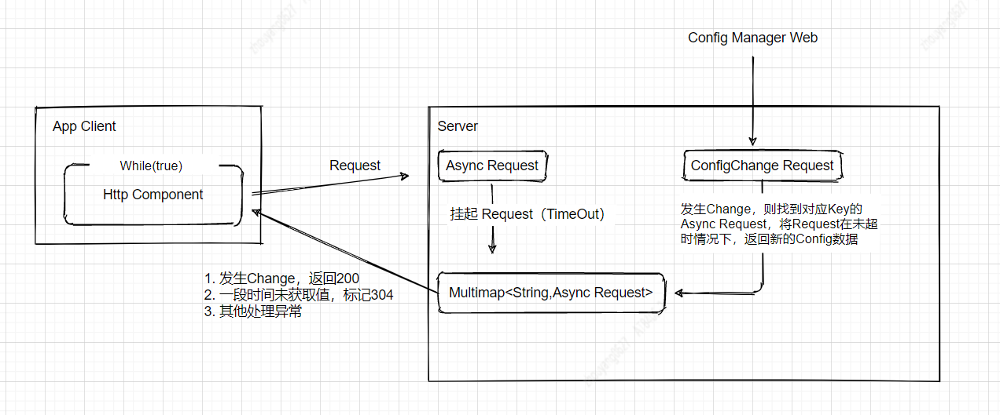
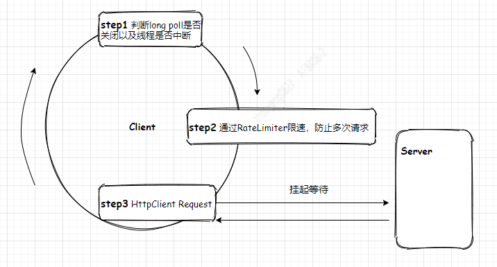

# Long Poll

## 1. Long Poll介绍
长轮询是服务器应用程序用来保持客户端连接直到信息可用的一种方法。当服务器必须调用下游服务以获取信息并等待结果时，通常会使用这种方法。
这篇文章中会介绍Servlet3.0和DeferredResult在Spring boot中长轮询的实现细节。

## 2. 结构图
`结构图`    


## 3. Apollo实现讲解
根据Apollo的官网文档实现细节（https://www.apolloconfig.com/#/zh/design/apollo-design），下面会从代码中分析
```xml
2.1.2 Config Service通知客户端的实现方式

上一节中简要描述了NotificationControllerV2是如何得知有配置发布的，那NotificationControllerV2在得知有配置发布后是如何通知到客户端的呢？

实现方式如下：

1.客户端会发起一个Http请求到Config Service的notifications/v2接口，也就是NotificationControllerV2，参见RemoteConfigLongPollService
2.NotificationControllerV2不会立即返回结果，而是通过Spring DeferredResult把请求挂起
3.如果在60秒内没有该客户端关心的配置发布，那么会返回Http状态码304给客户端
4.如果有该客户端关心的配置发布，NotificationControllerV2会调用DeferredResult的setResult方法，传入有配置变化的namespace信息，同时该请求会立即返回。客户端从返回的结果中获取到配置变化的namespace后，会立即请求Config Service获取该namespace的最新配置。
```

### 3.1 Client
在doLongPollingRefresh()方法中利用while(true)循环发起Http请求，然后处理接口逻辑即可。

`流程图` 


>请阅读 RemoteConfigLongPollService.java

### 3.2 Server
服务端使用Spring DeferredResult实现了请求`异步化`， 利用临时容器保存异步请求上下文，可以参考`deferredResults`变量, 利用DeferredResult注册onTimeout()和onCompletion() 处理挂起的异步请求的上下文。

```java
private final Multimap<String, DeferredResultWrapper> deferredResults =
      Multimaps.synchronizedSetMultimap(TreeMultimap.create(String.CASE_INSENSITIVE_ORDER, Ordering.natural()));
```
>请阅读 NotificationControllerV2.java

## 4. Long Polling实现

## 4.1 Client
Client是由HttpClient构建的Http请求方法，这里注意一下点：  
* Http请求超时时间不要低于Server的Timeout时间
```java
//Client
this.requestConfig = RequestConfig.custom().setSocketTimeout(60000).build();

//Server
//V1
asyncContext.setTimeout(20000);

//V2
DeferredResult dr = new DeferredResult<>(20 * 1000L, NOT_MODIFIED_RESPONSE);

```
* Http Status处理，将Server端将超时重新定义`304`http status, 含义是：Config没有任何改变。 所以Client要对304返回值处理。
```java
switch (response.getStatusLine().getStatusCode()) {
    case 200: {
        BufferedReader rd = new BufferedReader(new InputStreamReader(response.getEntity()
                .getContent()));
        StringBuilder result = new StringBuilder();
        String line;
        while ((line = rd.readLine()) != null) {
            result.append(line);
        }
        response.close();
        String value = result.toString();
        logger.info("key: {} changed, receive value: {}", key, value);
        break;
    }
    case 304: {
        logger.info("longPolling key: {} once finished, value is unchanged, longPolling again", key);
        break;
    }
    default: {
        System.out.println("default ： " + response.getStatusLine().getStatusCode());
    }
}
```

## 4.2 Server
Server的 V1 利用`Servlet3.0`实现的异步请求，V2 利用`Spring DeferredResult<ResponseEntity<String>>`实现的异步请求 2中不同的异步化方式， /publicConfig是提供修改K-V接口，当临时容器存在key的请求上下文Context，则需要将Context设值并标记完成。
```java
//V1
Collection<AsyncContext> asyncContexts = asyncContextResult.removeAll(key);
for (AsyncContext asyncContext : asyncContexts) {
    HttpServletResponse response = (HttpServletResponse) asyncContext.getResponse();
    response.getWriter().println(value);
    asyncContext.complete();
}

//V2
Collection<DeferredResult> deferreds = deferredResults.removeAll(key);
for (DeferredResult deferredResult : deferreds) {
    deferredResult.setResult(new ResponseEntity<>(value, HttpStatus.OK));
}
```

实现代码： https://github.com/xinzhuxiansheng/javamain-services/tree/main/javamain-springboot/src/main/java/com/javamain/longpolling
