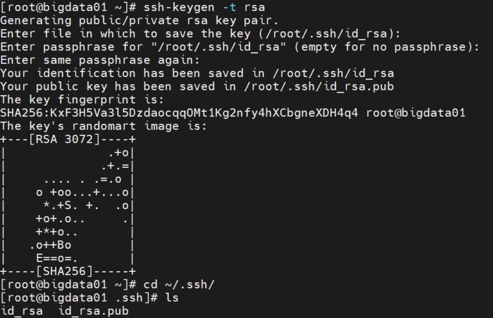
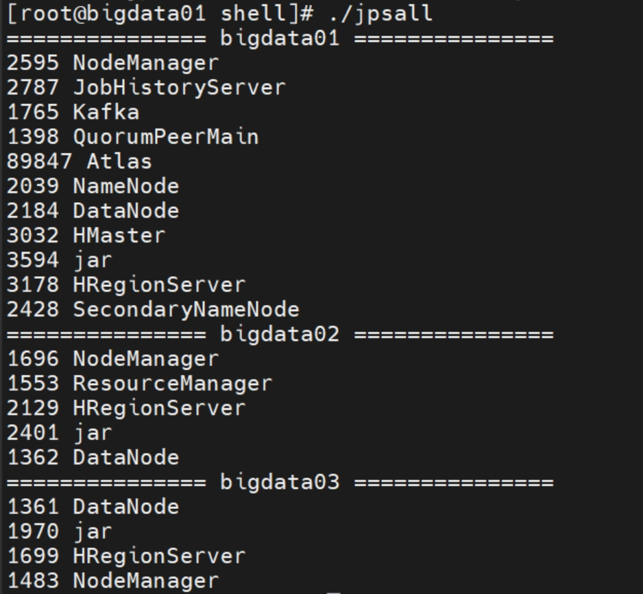

# Atlas - Atlas 2.3.0 部署  

>Atlas version: 2.3.0, Jdk version: 1.8, Hadoop version: 3.2.0, Hive version: , Hbase version: , Solr version: 

## 引言    


## 环境说明 


## bigdata01 与其他节点配置免密登录   

### 1）.生成 ssh key (所有节点都执行)    
在每个节点都执行以下命令，并且持续 `敲` 回车键即可，如下图所示：  
```bash
ssh-keygen -t rsa
```  
       

### 2）.复制公钥到远程服务器 (只在 bigdata01 节点操作)   
```bash
ssh-copy-id -i ~/.ssh/id_rsa.pub bigdata01
ssh-copy-id -i ~/.ssh/id_rsa.pub bigdata02
ssh-copy-id -i ~/.ssh/id_rsa.pub bigdata03
``` 

## 配置 xsync 脚本  

### 1）在全部节点安装 rsync 命令 
```bash
yum install -y rsync
```

### 2）在 bigdata01 节点编写 xsync 脚本 
vim xsync，使用示例：xsync /path/xxx, 它会将当前文件或者文件夹，传输到其他机器，并且是相同目录。 

脚本内容如下：（`注意根据虚机 hostname 替换脚本中的 host`）
```bash
#!/bin/bash
#1. 判断参数个数
if [ $# -lt 1 ]
then
  echo Not Enough Arguement!
  exit;
fi
#2. 遍历集群所有机器
for host in bigdata01 bigdata02 bigdata03
do
  echo ====================  $host  ====================
  #3. 遍历所有目录，挨个发送
  for file in $@
  do
    #4. 判断文件是否存在
    if [ -e $file ]
    then
      #5. 获取父目录
      pdir=$(cd -P $(dirname $file); pwd)
      #6. 获取当前文件的名称
      fname=$(basename $file)
      ssh $host "mkdir -p $pdir"
      rsync -av $pdir/$fname $host:$pdir
    else
      echo $file does not exists!
    fi
  done
done
``` 

使用 `chmod +x xsync`命令，将其设置为可执行脚本。     

## JDK 安装 & 环境变量配置 & 批量执行 jps 

### 1）JDK 1.8 安装 & 配置环境变量  
下载 jdk1.8 安装包，使用以下命令解压并且指定解压目录,`注意: 不推荐将 JDK 安装在 /root 目录下，假设某个程序使用一般用户运行，默认情况下它是无权限访问 /root 目录下的 JDK，为了避免出现无权限问题，将 JDK 安装到 公共目录。`  
```bash
tar -zxf jdk-8u451-linux-x64.tar.gz -C /opt/module   
```  

在 `/etc/profile.d` 目录下创建 `my_env.sh` 用于设置环境变量，例如 JDK的环境变量设置如下：  
```bash
# java env
JAVA_HOME=/opt/module/jdk1.8.0_202
PATH=$PATH:$JAVA_HOME/bin:$JRE_HOME/bin
CLASSPATH=.:$JAVA_HOME/lib/dt.jar:$JAVA_HOME/lib/tools.jar:$JRE_HOME/lib
export JAVA_HOME JRE_HOME PATH CLASSPATH
```

再执行 `source /etc/profile` 生效环境变量配置。   

只所以这么做的原因是因为，在后续使用 ssh 跨机器执行 jps 命令时，若环境变量在 /etc/profile 中设置，则 jps 命令无法执行，ssh 跨机器执行 jps，会出现无法加载 /etc/profile 的环境变量。    

### 2）批量执行 jps  
像 hadoop，hbase等这种 Cluster 方式部署，需要多个机器节点，为了 `一个命令` 可同时查看多个机器节点的Java 进程的运行状态。所以有了这样的 `jpsall` 脚本。   

```bash
#!/bin/bash
for host in bigdata01 bigdata02 bigdata03
do
        echo =============== $host ===============
        ssh $host jps $@ | grep -v Jps
done
```

  


## Hadoop 3.2.0 安装  
| 服务名称      | 子服务 | 服务器 bigdata01  | 服务器 bigdata02  | 服务器bigdata03  |
| :-------- | :-------- | :--: | :--: | :--: |
| HDFS  | NameNode |  ✓  |    |    |
|       | DataNode |  ✓  |  ✓  |  ✓  |
|       | SecondaryNameNode |    |    |  ✓  |


