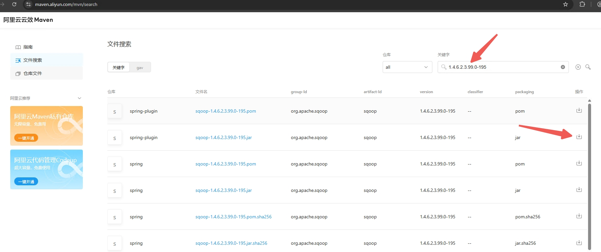

# Atlas - 源码编译打包   

>Atlas version: 2.3.0, Node version: >=18, JDK version: 1.8  

## 源码编译打包 
从 github clone 源码后，执行以下命令进行打包：  
```bash
mvn clean -DskipTests package -Pdist 
```  

打包后的安装包路径在 `distro\target` 目录下；

## 缺失 org.apache.sqoop:sqoop:pom:1.4.6.2.3.99.0-195  
在编译过程中会出现 sqoop jar 无法下载，该 jar 从 [Maven](https://mvnrepository.com/) 无法下载到。  
`异常信息：` 
```bash
[ERROR] Failed to execute goal on project sqoop-bridge-shim: Could not resolve dependencies for project org.apache.atlas:sqoop-bridge-shim:jar:2.3.0: Failed to collect dependencies at org.apache.sqoop:sqoop:jar:1.4.6.2.3.99.0-195: Failed to read artifact descriptor for org.apache.sqoop:sqoop:jar:1.4.6.2.3.99.0-195: The following artifacts could not be resolved: org.apache.sqoop:sqoop:pom:1.4.6.2.3.99.0-195 (absent): Could not transfer artifact org.apache.sqoop:sqoop:pom:1.4.6.2.3.99.0-195 from/to hortonworks.repo (https://repo.hortonworks.com/content/repositories/releases): sun.security.validator.ValidatorException: PKIX path validation failed: java.security.cert.CertPathValidatorException: validity check failed: NotAfter: Thu Sep 11 07:59:59 CST 2025 -> [Help 1]
[ERROR]
[ERROR] To see the full stack trace of the errors, re-run Maven with the -e switch.
[ERROR] Re-run Maven using the -X switch to enable full debug logging.
[ERROR]
[ERROR] For more information about the errors and possible solutions, please read the following articles:
[ERROR] [Help 1] http://cwiki.apache.org/confluence/display/MAVEN/DependencyResolutionException
[ERROR]
[ERROR] After correcting the problems, you can resume the build with the command
[ERROR]   mvn <args> -rf :sqoop-bridge-shim
```

可以通过 `https://developer.aliyun.com/mvn/search` 下载，在检索条件输入 `1.4.6.2.3.99.0-195`。如下图所示：   
  

有了 jar，再将 jar 安装到本地 Maven 仓库。   
```
mvn install:install-file -Dfile=sqoop-1.4.6.2.3.99.0-195.jar -DgroupId=org.apache.sqoop -DartifactId=sqoop -Dversion=1.4.6.2.3.99.0-195 -Dpackaging=jar
``` 

## java: error reading D:\Software\Dev\Maven\repository\org\restlet\jee\org.restlet\2.4.3\org.restlet-2.4.3.jar; error in opening zip file 
该问题是因为当前依赖的jar 下载的文件不完整。 需要重新删除本地 Maven 仓库中的 jar 文件，再重新编译打包程序，或者 Maven 本地安装 jar。  
```bash
wget https://download.restlet.talend.com/2.4/restlet-jee-2.4.3.zip
unzip restlet-jee-2.4.3.zip
cd restlet-jee-2.4.3/lib
 
mvn install:install-file -DgroupId=org.restlet.jee -DartifactId=org.restlet -Dversion=2.4.3 -Dpackaging=jar -Dfile=org.restlet.jar
mvn install:install-file -DgroupId=org.restlet.jee -DartifactId=org.restlet.ext.servlet -Dversion=2.4.3 -Dpackaging=jar -Dfile=org.restlet.ext.servlet.jar
```