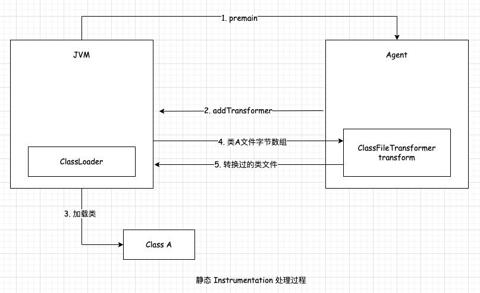

## Java Instrumentation 原理        

### Java Instrumentation 简介   
JDK从1.5版本开始引人了java.lang.instrument包,开发者可以更方便的实现字节码增强。其核心功能由java.lang.instrument.Instrumentation提供,这个接口的方法提供了注册类文件转换器、获取所有已加载的类等功能,允许我们在对已加载和未加载的类进行修改,实现AOP、性能监控等功能。  

Instrumentation接口的常用方法如下所示:  
```
void addTransformer(ClassFileTransformer transformer, boolean canRetransform);  
void retransformClasses(Class<?>... classes) throws UnmodifiableClassException; 
Class[] getAllLoadedClasses();  
boolean isRetransformClassesSupported(); 
```

它的 addTransformer() 方法给 Instrumentation 注册一个类型为 ClassFileTransformer 的类文件转换器。 ClassFileTransformer 接口有 transform() 方法,接口定义如下所示:  
```java
default byte[] transform(  ClassLoader         loader,
            String              className,
            Class<?>            classBeingRedefined,
            ProtectionDomain    protectionDomain,
            byte[]              classfileBuffer)
    throws IllegalClassFormatException {
    return null;
}
```
其中 className 参数表示当前加载类的类名, classfileBuffer 参数是待加载类文件的字节数组。调用 addTransformer 注册 transformer 以后，后续所有JVM加载类都会被它的 transform 方法拦截，这个方法接收原类文件的字节数组，在这个方法中可以做任意的类文件改写，最后返回转换过的字节数组，由JVM加载这个修改过的类文件。 如果 transform 方法返回null，表示不对此类做处理，如果返回值不为null，JVM会用返回的字节数组替换原来类的字节数组。  

Instrumentation 接口的 retransformClasses 方法对JVM已经加载的类重新触发类
加载。 getAllLoadedClasses 方法用于获取当前JVM加载的所有类对象。 isRetransformClassesSupported 方法返回一个boolean值表示当前JVM配置是否支持类重新转换的特性。  

Instrumentatjon 有两种使用方式:第—种方式是在JVM启动的时候添加—个Agent的jar包; 第二种方式是JVM运行以后在任意时刻通过 Attach API 远程加载Agent的jar包。接下来分开进行介绍：  

### Instrumentation 与 -javaagent 启动参数  
Instrumentation 的第一种使用方式是通过JVM的启动参数 -javaagent 来启动，一个典型的使用方式如下所示： 
```shell
java -javaagent:myagent.jar MyMain  
```
为了能让JVM识别到 Agent 的入口类，需要在jar包的 MANIFEST.MF 文件中指定 `Premain-Class`等信息，—个典型的生成好的 MANIFEST.MF 内容如下所示:   
```
Premain-Class: me.geek01.javaagent.AgentMain
Agent-Class: me.geek01.javaagent.AgentMain  
Can-Redefine-Classes: true
Can-Retransform-Classes: true   
```
其中 AgentMain 类有—个静态的 premain 方法, JVM在类加载时会先执行 AgentMain 类的 premain 方法,再执行Java程序本身的main方法, 这就是 premain 名字的来源。在 premain 方法中可以对class文件进行修改。这种机制可以认为是虚拟机级别的AOP，无须对原有应用做任何修改就可以实现类的动态修改和增强。   

premain 方法签名如下所示:  
```java
public static void premain(final String options, final Instrumentation inst)  
```
第—个参数 options 是agent的启动参数, 可以在JVM启动时指定。以下面的启动方式为例，它的 options 的值为＂appId:agent-demo,agentIype:singleJar＂。  
静态 Instrumentation 的处理过程如下, JVM启动后会执行 Agent.jar 中的 premain 方法, 在 premain 中可以调用 Instrumentation 对象的 addTransformer 方法注册 ClassFileTransformer。当JVM加载类时会将类文件的字节数组传递给 transformer 的 transform 方法, 在 transform 方法中可以对类文件进行解析和修改, 随后JVM就可以加载转换后的类文件。 
整个过程如图所示：  
              


refer   
1.《深入理解JVM字节码》     