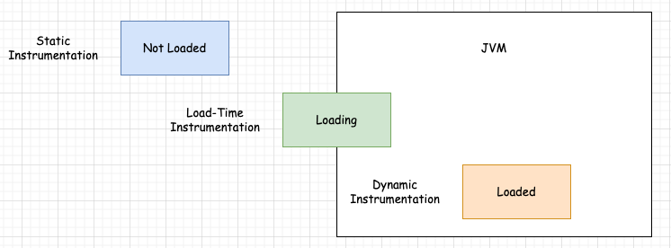
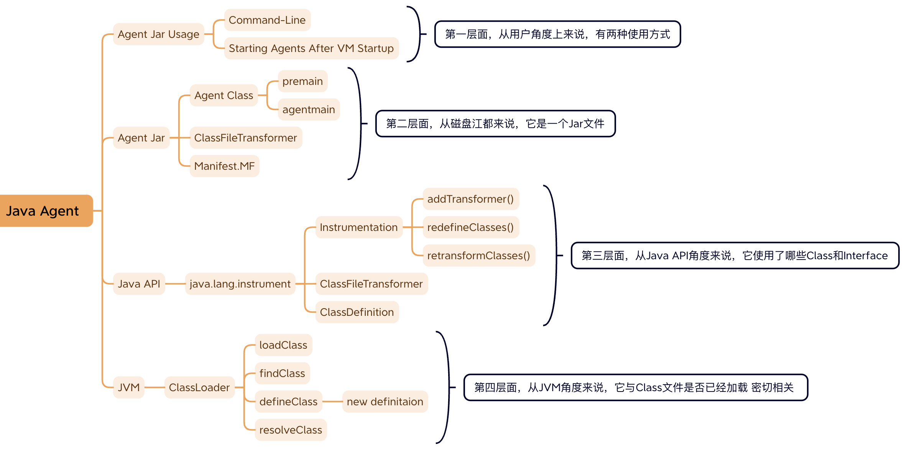

## JavaAgent 概述   

>本篇Blog 参考Blog中的 refer部分         


### JavaAgent 简介      
`javaagent` 是 Java 的一个功能，允许你在启动 Java 应用程序时，通过 Java 的 Instrumentation API 对类字节码进行修改。这个功能常常用于性能监控、代码覆盖率统计、日志、甚至是一些高级的框架功能，如 AOP（面向切面编程）。    

在Java Agent当中，核心的作用是进行 bytecode instrumentation。           

### Instrumentation 分类     

Instrumentation can be inserted in one of three ways: (https://docs.oracle.com/en/java/javase/11/docs/specs/jvmti.html#bci)     

    Static Instrumentation: The class file is instrumented before it is loaded into the VM - for example, by creating a duplicate directory of *.class files which have been modified to add the instrumentation. This method is extremely awkward and, in general, an agent cannot know the origin of the class files which will be loaded.
    Load-Time Instrumentation: When a class file is loaded by the VM, the raw bytes of the class file are sent for instrumentation to the agent. The ClassFileLoadHook event, triggered by the class load, provides this functionality. This mechanism provides efficient and complete access to one-time instrumentation.
    Dynamic Instrumentation: A class which is already loaded (and possibly even running) is modified. This optional feature is provided by the ClassFileLoadHook event, triggered by calling the RetransformClasses function. Classes can be modified multiple times and can be returned to their original state. The mechanism allows instrumentation which changes during the course of execution.

其实，这里就是讲了对 .class 文件进行修改（Instrumentation）的三个不同的时机（时间和机会）：没有被加载、正在被加载、已经被加载   
  

对于 Java Agent 这部分内容来说，我们只关注 Load-Time Instrumentation 和 Dynamic Instrumentation 两种情况。  

### 如何编写代码  
上面的 Instrumentation 分类，只是一个抽象的划分，终究是要落实到具体的代码上：  
写代码 --> 编译成.class 文件 --> 生成 jar 包   

那么，编写 Java Agent 的代码，需要哪些知识呢？需要两方面的知识：  
* 需要熟悉 java.lang.instrument 相关的 API。这些 API 是我们编写 Java Agent 的主要依据，是我们关注的重点。  
* 需要掌握操作字节码的类库，并不是我们关注的重点。比较常用的字节码的类库有：ASM、ByteBuddy 和 Javassist。  

知识体系：  
```
1. Java Agent 可以修改字节码的机会   
2. Java ASM   操作字节码的类库  
3. ClassFile  理论基础  
```

### 如何启动 Java Agent  
启动 Java Agent 有两种方式：命令行和 Attach 机制。  
第一种方式，是从命令行（Command Line）启动 Java Agent，它对应着 Load-Time Instrumentation。     
在使用 java 命令时，使用 -javagent 选项：  
```shell
-javaagent:jarpath[=options]
```
具体示例：  
```shell
java -javaagent:jacocoagent.jar="includes=*,output=tcpserver,port=6300,address=localhost,append=true" -jar jacoco-demo-1.0-SNAPSHOT.jar     
```

第二种方式，是通过虚拟机提供的 Attach 机制来启动 Java Agent，它对应着 Dynamic Instrumentation。         
```java
import com.sun.tools.attach.VirtualMachine;

public class VMAttach {
    public static void main(String[] args) throws Exception {
        // 注意：需要修改 pid 的值
        String pid = "1234";
        String agentPath = "D:\\git-repo\\learn-java-agent\\target\\TheAgent.jar";      
        VirtualMachine vm = VirtualMachine.attach(pid);
        vm.loadAgent(agentPath);
        vm.detach();
    }
}
```       

### 如何学习 Java Agent  
我们学习 Java Agent 的过程中，可以从四个层面来着手：  
* 第一个层面，用户层面。也就是说，Java Agent 是一件事物（野马、怪物），那从用户（人）的角度出发，如何使用（驾驭、打败）它呢？有两种方式，  
    第一种方式，在启动 JVM 之前，执行 java 命令时，使用 -javaagent 选项加载 Agent Jar，这就是 Load-Time Instrumentation  
    第二种方式，在启动 JVM 之后，使用 Attach 机制加载 Agent Jar，这就是 Dynamic Instrumentation   
* 第二个层面，磁盘层面。也就是说，从磁盘（操作系统）的角度来说，Java Agent 就是一个 .jar 文件，它包含哪些主要组成部分。  
* 第三个层面，Java 层面。也就是说，我们在使用 Java 语言开发 Java Agent，主要是利用 java.lang.instrument 包的 API 来实现一些功能。    
* 第四个层面，JVM 层面。也就是说，Java Agent 也是要运行在 JVM 之上的，它要与 JVM 进行“沟通”，理解其中一些细节之处，能够帮助我们更好的掌握 Java Agent。  

   


refer   
1.https://docs.oracle.com/en/java/javase/11/docs/specs/jvmti.html#bci  
2.https://lsieun.github.io/java-agent/s01ch01/java-agent-overview.html  
