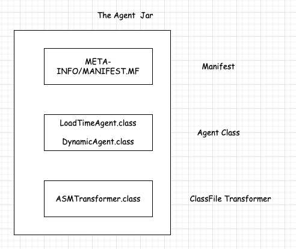
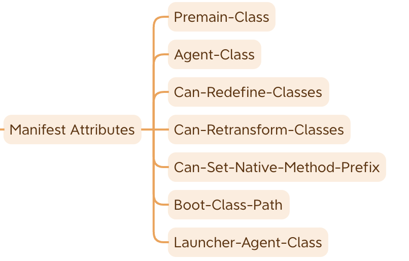

## Agent Jar 三个重要组成部分        

>本篇Blog 参考Blog中的 refer部分       
https://docs.oracle.com/javase/8/docs/api/java/lang/instrument/package-summary.html 是介绍 Java Agent 官方文档入口         
特别注意： 不同JDK版本，所对应的介绍或者API有不同。    

### 三个主要组成部分

在 Java Agent 对应的 .jar 文件里，有三个主要组成部分：   
* Manifest  
* Agent Class  
* ClassFileTransformer  

  

### Manifest Attributes  
首先，在 Manifest 文件当中，可以定义的属性非常多，但是与 Java Agent 相关的属性有 6、7 个。   
* 在 Java 8 版本当中，定义的属性有 6 个；  
* 在 Java 9 至 Java 17 版本当中，定义的属性有 7 个。 其中，Launcher-Agent-Class 属性，是 Java 9 引入的   

  

#### Premain-Class & Agent-Class 介绍   
JAR 文件清单中的属性指定将加载以启动代理的代理类。    
`Premain-Class`：当在 JVM 启动时指定代理时，此属性指定代理类。即包含 premain 方法的类。当在 JVM 启动时指定代理时，需要此属性。如果该属性不存在，JVM 将中止。注意：这是一个类名，而不是文件名或路径。     
`Agent-Class`：如果实现支持在 VM 启动后某个时间启动代理的机制，则此属性指定代理类。即包含agentmain方法的类。此属性是必需的，如果不存在，代理将不会启动。注意：这是一个类名，而不是文件名或路径。    


#### Java Agent的作用   
它其中的三个属性对应着它的作用： 
```
Can-Redefine-Classes
    Boolean (true or false, case irrelevant). Is the ability to redefine classes needed by this agent. Values other than true are considered false. This attribute is optional, the default is false. 
Can-Retransform-Classes
    Boolean (true or false, case irrelevant). Is the ability to retransform classes needed by this agent. Values other than true are considered false. This attribute is optional, the default is false. 
Can-Set-Native-Method-Prefix
    Boolean (true or false, case irrelevant). Is the ability to set native method prefix needed by this agent. Values other than true are considered false. This attribute is optional, the default is false. 
```

#### 其他属性       
```
Boot-Class-Path: A list of paths to be searched by the bootstrap class loader. Paths represent directories or libraries (commonly referred to as JAR or zip libraries on many platforms). These paths are searched by the bootstrap class loader after the platform specific mechanisms of locating a class have failed. Paths are searched in the order listed. Paths in the list are separated by one or more spaces. A path takes the syntax of the path component of a hierarchical URI. The path is absolute if it begins with a slash character (/), otherwise it is relative. A relative path is resolved against the absolute path of the agent JAR file. Malformed and non-existent paths are ignored. When an agent is started sometime after the VM has started then paths that do not represent a JAR file are ignored. This attribute is optional. 

Launcher-Agent-Class: If an implementation supports a mechanism to start an application as an executable JAR then the main manifest may include this attribute to specify the class name of an agent to start before the application main method is invoked.
```

Boot-Class-Path：引导类加载器要搜索的路径列表。路径表示目录或库（在许多平台上通常称为 JAR 或 zip 库）。在定位类的平台特定机制失败后，引导类加载器将搜索这些路径。按列出的顺序搜索路径。列表中的路径由一个或多个空格分隔。路径采用分层 URI 的路径组件的语法。如果路径以斜线字符 (/) 开头，则该路径是绝对路径，否则是相对路径。相对路径根据代理 JAR 文件的绝对路径进行解析。格式错误和不存在的路径将被忽略。当虚拟机启动后某个时间启动代理时，不代表 JAR 文件的路径将被忽略。该属性是可选的。     
Launcher-Agent-Class：如果实现支持将应用程序作为可执行 JAR 启动的机制，则主清单可能包含此属性，以指定在调用应用程序主方法之前启动的代理的类名。      

### Agent Class 

#### LoadTimeAgent 
如果我们想使用 Load-Time Instrumentation，那么就必须有一个 premain 方法，它有两种写法。   
The JVM first attempts to invoke the following method on the agent class:（推荐使用）   
```java
public static void premain(String agentArgs, Instrumentation inst);    
```

If the agent class does not implement this method then the JVM will attempt to invoke:   
```java
public static void premain(String agentArgs);       
```

#### DynamicAgent 
如果我们想使用 Dynamic Instrumentation，那么就必须有一个 agentmain 方法，它有两种写法。    
The JVM first attempts to invoke the following method on the agent class:（推荐使用）   
```java
public static void agentmain(String agentArgs, Instrumentation inst);   
```

If the agent class does not implement this method then the JVM will attempt to invoke:   
```java
public static void agentmain(String agentArgs);  
```  

#### ClassFileTransFormer  
在 java.lang.instrument 下包含了 Instrumentation 和 ClassFileTransformer 接口：
* java.lang.instrument.Instrumentation  
* java.lang.instrument.ClassFileTransformer  

在 Instrumentation 接口中，定义了添加和移除 ClassFileTransformer 的方法：   
```java
public interface Instrumentation {
    void addTransformer(ClassFileTransformer transformer, boolean canRetransform);

    boolean removeTransformer(ClassFileTransformer transformer);
}
```
在 ClassFileTransformer 接口中，定义了 transform 抽象方法：    
```java
public interface ClassFileTransformer {
    byte[] transform(ClassLoader         loader,
                     String              className,
                     Class<?>            classBeingRedefined,
                     ProtectionDomain    protectionDomain,
                     byte[]              classfileBuffer) throws IllegalClassFormatException;
            
}
```

当我们想对 Class 进行 bytecode instrumentation 时，就要实现 ClassFileTransformer 接口，并重写它的 transform 方法     


refer   
1.https://lsieun.github.io/java-agent/s01ch01/agent-jar-three-core-components.html  
2.https://docs.oracle.com/javase/8/docs/api/java/lang/instrument/package-summary.html  
