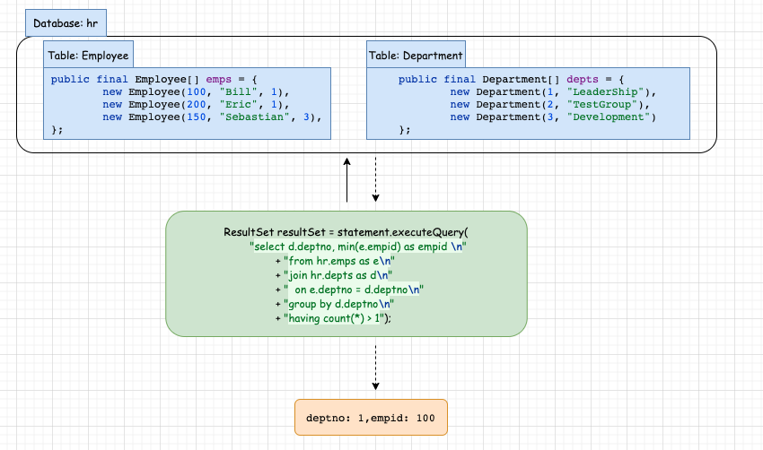
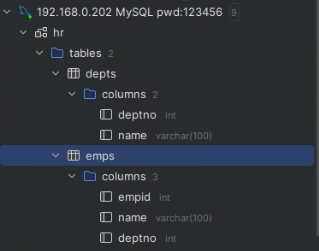

# Calcite - Official - Background 扩展       


## 知识串联   


## 引言   
Apache Calcite是一个动态数据管理框架。它包含了构成典型数据库管理系统的许多部分，但省略了一些关键功能：数据存储、数据处理算法和用于存储元数据的仓库。    

Calcite有意避开存储和处理数据的业务。正如我们将看到的，这使它成为在应用程序与一个或多个数据存储位置和数据处理引擎之间进行调解的绝佳选择。它也是构建数据库的完美基础：只需添加数据。 

为了说明这一点，让我们创建一个Calcite实例，然后将其指向一些数据。       

## 演示静态数据查询  

>注意：官网给的示例是伪代码片段，完整案例可参考 Blog 内容，可参考该篇Blog 示例：          
### 1.添加calcite-core依赖   
```xml
<!-- https://mvnrepository.com/artifact/org.apache.calcite/calcite-core -->
<dependency>
    <groupId>org.apache.calcite</groupId>
    <artifactId>calcite-core</artifactId>
    <version>1.35.0</version>
</dependency>
```

### 2.HelloCalciteReadStaticData.java         
```java
public class HelloCalciteReadStaticData {
    public static void main(String[] args) throws Exception {

        Class.forName("org.apache.calcite.jdbc.Driver");
        Properties info = new Properties();
        info.setProperty("lex", "JAVA");
        Connection connection =
                DriverManager.getConnection("jdbc:calcite:", info);
        CalciteConnection calciteConnection =
                connection.unwrap(CalciteConnection.class);
        SchemaPlus rootSchema = calciteConnection.getRootSchema();
        Schema schema = new ReflectiveSchema(new HrSchema());
        rootSchema.add("hr", schema);
        Statement statement = calciteConnection.createStatement();
        ResultSet resultSet = statement.executeQuery(
                "select d.deptno, min(e.empid) as empid \n"
                        + "from hr.emps as e\n"
                        + "join hr.depts as d\n"
                        + "  on e.deptno = d.deptno\n"
                        + "group by d.deptno\n"
                        + "having count(*) > 1");

        while(resultSet.next()){
            int deptno = resultSet.getInt("deptno");
            int minEmp = resultSet.getInt("empid");
            System.out.println(deptno + "->" + minEmp);
        }

        resultSet.close();
        statement.close();
        connection.close();
    }

    public static class HrSchema {
        public final Employee[] emps = {
                new Employee(100, "Bill",1),
                new Employee(200, "Eric",1),
                new Employee(150, "Sebastian",3),
        };

        public final Department[] depts = {
                new Department(1, "LeaderShip"),
                new Department(2, "TestGroup"),
                new Department(3, "Development")
        };
    }

    public static class Employee {
        public final int empid;
        public final String name;
        public final int deptno;

        public Employee(int empid, String name, int deptno) {
            this.empid = empid;
            this.name = name;
            this.deptno = deptno;
        }
    }

    public static class Department{
        public final int deptno;
        public final String name;

        public Department(int deptno, String name){
            this.deptno = deptno;
            this.name = name;
        }
    }
}
```

Output log:   
```bash
1->100
```
>当你执行完以上示例, 会存在与官网示例中不同处有：       
1.增加 HrSchema class下的 Employee、Department 对象属性    
2.`select d.deptno, min(e.empid) as empid \n` sql中 min()后面需增加 列名定义          
3.print(resultSet);  改成了 while(resultSet.next()) 打印内容      

    

通过上面的案例，再不知道原理情况可得到一些结论：HrSchema.emps、HrSchema.depts 对应的是表名和数据，而 SQL 查询时指定是 hr.emps,hr.depts: 
```java
ResultSet resultSet = statement.executeQuery(
    "select d.deptno, min(e.empid) as empid \n"
            + "from hr.emps as e\n"
            + "join hr.depts as d\n"
            + "  on e.deptno = d.deptno\n"
            + "group by d.deptno\n"
            + "having count(*) > 1");
```
看样子是该行代码起了作用：`rootSchema.add("hr", schema);`, 它帮我们定义了 database 名称, `查询 SQL 的结果也是符合预期的：获取部门中员工id最小的员工`。                 

数据库在哪里？没有数据库。连接完全为空，直到新的`ReflectiveSchema`将一个Java对象注册为模式，以及它的集合字段emps和depts作为表。        

Calcite不想拥有数据；它甚至没有最喜欢的数据格式。这个例子使用了内存中的数据集，并使用了来自linq4j库的 groupBy 和 join 等运算符来处理它们。但 Calcite也可以处理其他数据格式的数据，例如JDBC。下面演示在第一个示例的基础上替换 MySQL `Schema`。  

## 演示 MySQL 数据查询  
```java
Schema schema = new ReflectiveSchema(new HrSchema());  
```
ReflectiveSchema 替换成 JdbcSchema 即可， 当然在示例代码中会涉及到其他操作例如，添加其他依赖：      
### 1.添加 MySQL 依赖   
```xml
<dependency>
    <groupId>org.apache.commons</groupId>
    <artifactId>commons-dbcp2</artifactId>
    <version>2.10.0</version>
</dependency>
<dependency>
    <groupId>mysql</groupId>
    <artifactId>mysql-connector-java</artifactId>
    <version>8.0.33</version>
</dependency>
``` 

### 2.配置 MySQL  
创建名为 `hr` database；   

```sql
DROP TABLE IF EXISTS `depts`;
CREATE TABLE `depts` (
  `deptno` int DEFAULT NULL,
  `name` varchar(100) DEFAULT NULL
) ENGINE=InnoDB DEFAULT CHARSET=armscii8;


LOCK TABLES `depts` WRITE;
INSERT INTO `depts` VALUES (1,'LeaderShip'),(2,'TestGroup'),(3,'Development');
UNLOCK TABLES;

DROP TABLE IF EXISTS `emps`;
CREATE TABLE `emps` (
  `empid` int DEFAULT NULL,
  `name` varchar(100) DEFAULT NULL,
  `deptno` int DEFAULT NULL
) ENGINE=InnoDB DEFAULT CHARSET=armscii8;

LOCK TABLES `emps` WRITE;
INSERT INTO `emps` VALUES (100,'Bill',1),(200,'Eric',1),(150,'Sebastian',3);
UNLOCK TABLES;
```   
如下图所示：  
       

### 3.HelloCalciteReadMySQLData.java  
```java
public class HelloCalciteReadMySQLData {
    public static void main(String[] args) throws Exception {

        Class.forName("org.apache.calcite.jdbc.Driver");
        Properties info = new Properties();
        info.setProperty("lex", "JAVA");
        Connection connection =
                DriverManager.getConnection("jdbc:calcite:", info);
        CalciteConnection calciteConnection =
                connection.unwrap(CalciteConnection.class);
        SchemaPlus rootSchema = calciteConnection.getRootSchema();
        Schema schema = jdbcSchema(calciteConnection);
        rootSchema.add("hr", schema);
        Statement statement = calciteConnection.createStatement();
        ResultSet resultSet = statement.executeQuery(
                "select d.deptno, min(e.empid) as empid \n"
                        + "from hr.emps as e\n"
                        + "join hr.depts as d\n"
                        + "  on e.deptno = d.deptno\n"
                        + "group by d.deptno\n"
                        + "having count(*) > 1");

        while (resultSet.next()) {
            int deptno = resultSet.getInt("deptno");
            int minEmp = resultSet.getInt("empid");
            System.out.println(deptno + "->" + minEmp);
        }

        resultSet.close();
        statement.close();
        connection.close();
    }

    public static Schema jdbcSchema(CalciteConnection calciteConnection) throws Exception {
        Class.forName("com.mysql.cj.jdbc.Driver");
        BasicDataSource dataSource = new BasicDataSource();
        dataSource.setUrl("jdbc:mysql://127.0.0.1:3306/hr");
        dataSource.setUsername("root");
        dataSource.setPassword("12345678");
        Schema schema = JdbcSchema.create(calciteConnection.getRootSchema(), "hr", dataSource,
                null, "hr");
        return schema;
    }
}
```
Output log:      
```bash
1->100    
```

在上面示例中最重要的是 `jdbcSchema()`方法，通过上面两个示例，可体现出一句话 `Calcite不想拥有数据；它甚至没有最喜欢的数据格式, Calcite可以处理不同数据格式的数据。`    

Calcite 将以 JDBC 的方式执行相同的查询。对于应用程序，数据和 API 是相同的，但在幕后，实现方式非常不同。Calcite 使用优化器规则将 JOIN 和 GROUP BY 操作推送到源数据库。   

内存和 JDBC 只是两个熟悉的例子。Calcite 可以处理任何数据源和数据格式。要添加数据源，你需要编写一个适配器，告诉 Calcite 数据源中的哪些集合应该被视为“表”。     

对于更高级的集成，你可以编写优化器规则。优化器规则允许 Calcite 访问新格式的数据，允许你注册新的操作符（例如更好的连接算法），并允许 Calcite 优化查询如何转换为操作符。Calcite 将结合你的规则和操作符与内置的规则和操作符，应用基于成本的优化，并生成一个高效的计划。          

这段话的意思是，Apache Calcite 提供了一种机制，允许在不同的数据存储之间进行查询，而不需要修改应用程序的代码。通过编写适配器和优化规则，你可以扩展 Calcite 以支持新的数据源和查询优化，从而实现更高效的数据查询和处理。     

## 编写适配器 

`example/csv` 下的子项目提供了一个 CSV 适配器，它完全可以在应用程序中使用，但也足够简单，可以作为编写自己的适配器的良好模板。   
请参阅教程(https://calcite.apache.org/docs/tutorial.html)，了解如何使用 CSV 适配器以及编写其他适配器的信息。   
请参阅操作指南(https://calcite.apache.org/docs/howto.html)，了解更多关于使用其他适配器的信息，以及一般性的关于使用 Calcite 的信息。     

这段文本主要讲述了如何编写一个 Apache Calcite 适配器。它指出了一个实际的例子，即 CSV 适配器，这个适配器功能齐全，可直接在应用中使用，同时因为其简洁性，也可以作为开发自定义适配器的示例。文档中还提到了相关的教程和操作指南，以帮助开发者了解如何使用这个 CSV 适配器和编写新的适配器，以及如何更广泛地使用 Calcite。          

## 状态 
以下功能已完成           
- 查询解析器、验证器和优化器         
- 支持以 JSON 格式读取模型  
- 许多标准函数和聚合函数    
- 针对 Linq4j 和 JDBC 后端的 JDBC 查询   
- Linq4j 前端   
- SQL 功能：SELECT, FROM（包括 JOIN 语法）、WHERE、GROUP BY（包括 GROUPING SETS）、聚合函数（包括 COUNT(DISTINCT …) 和 FILTER）、HAVING、ORDER BY（包括 NULLS FIRST/LAST）、集合操作（UNION, INTERSECT, MINUS）、子查询（包括相关子查询）、窗口聚合、LIMIT（语法与 Postgres 相同）；SQL 参考中有更多详情 (https://calcite.apache.org/docs/reference.html)  
- 本地和远程 JDBC 驱动程序；请参阅 Avatica (https://calcite.apache.org/avatica/docs/index.html)     
- 几个适配器 (https://calcite.apache.org/docs/adapter.html)   

这段文本列出了 Apache Calcite 的一些已完成的关键功能，包括查询解析、验证、优化、对 JSON 格式的模型的支持、多种 SQL 功能和操作、以及对本地和远程 JDBC 驱动程序的支持。还提到了 Calcite 的适配器，这些是连接到不同数据源的关键组件。此外，Avatica 是 Calcite 的一个子项目，提供了一个框架来添加更多的自定义适配器。        

refer   
1.https://calcite.apache.org/docs/index.html        
2.https://github.com/zqhxuyuan/tutorials/blob/72740ec130a15331b0b2428b9750099c47073052/middleware/src/main/java/com/zqh/calcite/HelloCalcite.java#L72            
