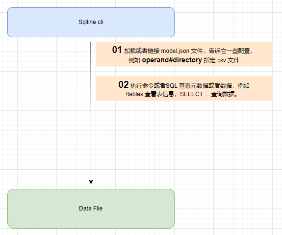
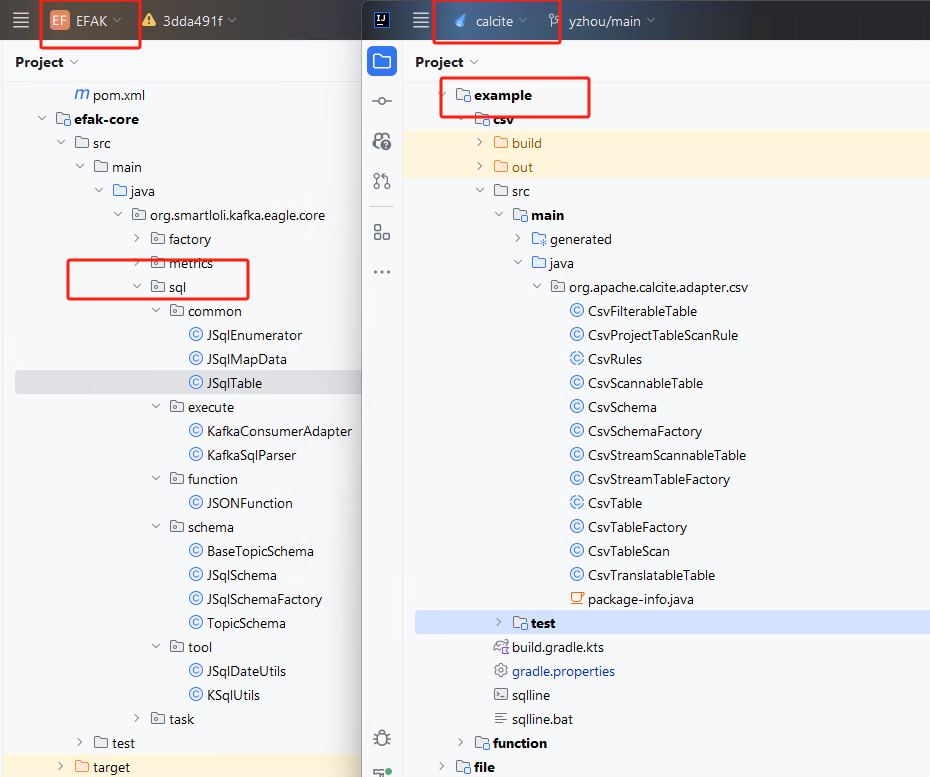
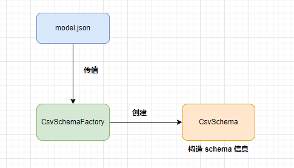
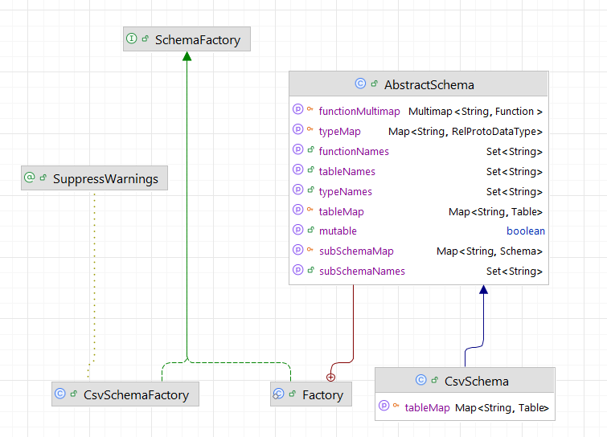
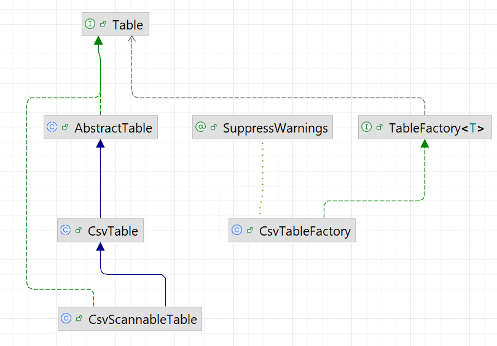

# Calcite - Official - Tutorial CSV 案例说明补充 (不包含执行规则)           

## 引言      
再整理了 Calcite学习分享文章后，对于我来说，对 Calcite 有了新的认识，而该篇 Blog，我将介绍`Calcite源码目录下的 example\csv`案例，这次并不是通过 `sqlline` cli 入手，而是根据代csv 的实现逻辑部分走读一遍 `tutorial`文档。     

>我当时是对 sqlline cli 有感，但对一些概念缺少一些认知。       

>1.`Calcite - Official - Tutorial 扩展`（https://mp.weixin.qq.com/s/H7kbIAvKdIHgF5L_jJH4mg）内容中介绍使用 `sqlline` cli 工具对 CSV文件 进行`SQL 查询`。       
2.`Calcite - 探索 Kafka Eagle KSQL 数据查询`(http://mp.weixin.qq.com/s/55QMA0EI-Lbr3PSj60mQtg)   

## 简单回顾 sqlline 使用    
如下图所示，首先加载`model.json`文件，以及一些配置项，例如`operand#directory`指定 csv 文件路径，其次执行查看元数据或者查询数据，例如 `!tables`、`SELECT * ...`。    
    

有了对 sqlline 了解，接下来如何在`main()`方法中执行。      

## 添加 main() 方法入口    
代码结构如下图所示：   
         

在`calcite\example\csv\src\test\java\org\apache\calcite\test\`目录下，添加`YzhouCsvTest.java`,代码如下： 
```java
package org.apache.calcite.test;
import org.apache.calcite.util.Sources;
import org.junit.jupiter.api.Test;
import java.sql.*;
import java.util.Properties;

public class YzhouCsvTest {
  public static void main(String[] args) throws SQLException {
    Connection connection = null;
    Statement statement = null;
    try {
      Properties info = new Properties();
      info.put("model", Sources.of(Test.class.getResource("/model.json")).file().getAbsolutePath());
      connection = DriverManager.getConnection("jdbc:calcite:", info);
      statement = connection.createStatement();
      print(statement.executeQuery("select * from depts "));
    } finally {
      connection.close();
    }
  }

  private static void print(ResultSet resultSet) throws SQLException {
    final ResultSetMetaData metaData = resultSet.getMetaData();
    final int columnCount = metaData.getColumnCount();
    while (resultSet.next()) {
      for (int i = 1; ; i++) {
        System.out.print(resultSet.getString(i));
        if (i < columnCount) {
          System.out.print(", ");
        } else {
          System.out.println();
          break;
        }
      }
    }
  }
}
```  
`YzhouCsvTest#main()`通过`connection = DriverManager.getConnection("jdbc:calcite:", info);` 加载 `test\resources`下的`model.json`，内容如下,  
```json
{
  "version": "1.0",
  "defaultSchema": "SALES",
  "schemas": [
    {
      "name": "SALES",
      "type": "custom",
      "factory": "org.apache.calcite.adapter.csv.CsvSchemaFactory",
      "operand": {
        "directory": "sales"
      }
    }
  ]
}
```   
operand 参数含义是指从配置文件传来的配置信息，对应前述的JSON文件中的operand配置。后面的代码中会用到该参数。   

执行 main() 后的 Output log:        
```bash
10, Sales
20, Marketing
30, Accounts
```
  
这个结果是符合程序预期的。     

## 目录结构对比   
我们看`EFAK KSQL`和`calcite example\csv` 类名后缀差不多，它们都使用了`自定义表元数据实现`     
    

接下来，回到`tutorial`文档中（https://calcite.apache.org/docs/tutorial.html）      

## Schema discovery    
>https://calcite.apache.org/docs/tutorial.html#schema-discovery           

发现`Schema`, 在`main()`中加载`model.json`文件信息，由于json中的`factory`参数指向了 `CsvSchemaFactory`类，并将 operand参数以 map形式传递给它，CsvSchemaFactory 实现`SchemaFactory接口`，实现了`create()`方法创建 `CsvSchema`对象，而`CsvSchema`继承 `AbstractSchema`类，重写`getTableMap()`方法，必须在该方法中完成`org.apache.calcite.schema.Table`集合准备，例如`Map<String, Table>`类型的集合。  

     

  

>`EFAK KSQL JSqlSchema `和`calcite example\csv CsvSchema` 同样如此。     


## Custom tables
>https://calcite.apache.org/docs/tutorial.html#custom-tables     

`calcite example\csv` 比 `EFAK kSQL` 针对自定义表多了一些了，例如`CsvTableFactory implements TableFactory<CsvTable>`。            
    

>这的确是一个捉摸不透的类，它的作用摘自`ChatGPT`：   
>已经有了 `CsvTable` 类，并且这个类继承自 `AbstractTable`，你并不一定需要再实现 `CsvTableFactory`，除非你想在像 Apache Calcite 这样的框架中动态地注册和创建这个表。    

### 解释
1. **`CsvTable` 继承自 `AbstractTable`**：     
   - 继承 `AbstractTable` 可以让 `CsvTable` 实现 Calcite 的 `Table` 接口，处理表的数据源（如 CSV 文件）。
   - 如果你的 `CsvTable` 已经能够处理 CSV 数据并且符合 Calcite 或其他框架（如 Flink）所需的 `Table` 接口，那么你已经能够在查询中使用它。             

2. **`CsvTableFactory` 的作用**：
   - `TableFactory` 是一种工厂模式，用来动态创建表的实例，通常用于需要根据外部配置（例如配置文件、URL、参数等）来动态地创建表的情况。     
   - 如果你只是定义了一个静态的表（例如直接创建 `CsvTable` 实例），并且不需要动态创建，它就不需要 `TableFactory`。    
   - 但如果你需要在运行时动态地创建 `CsvTable`，或者需要在框架（如 Calcite 或 Flink）中注册该表，`TableFactory` 是非常有用的。    

### 什么时候需要 `TableFactory`         
`TableFactory` 的典型用途是在如下情况下：         
- **动态表创建**：如果你希望能够根据不同的参数动态地创建不同的表，比如从不同的 CSV 文件或不同的目录加载表数据。     
- **框架集成**：在框架（如 Calcite）中，`TableFactory` 是一个标准的机制，可以注册和创建表源。框架可以根据传入的配置（比如 SQL 查询中的表名或其他参数）来创建表。     

后续若涉及到`TableFactory`案例，我们再来讨论它。    

## 定义数据    
`CsvScannableTable` 是 `CsvTable` 的一个扩展，它实现了 `ScannableTable` 接口，提供了一个 `scan()` 方法用于扫描数据并返回 `Enumerable<Object[]>`。这意味着 `CsvScannableTable` 代表一个可以被查询的表，并能够扫描其数据。这个方法实现的目的是将 CSV 数据源转化为可查询的表数据。

让我们逐步分析这个 `scan()` 方法及相关代码：      

### `scan()` 方法
```java
@Override public Enumerable<@Nullable Object[]> scan(DataContext root) {
    JavaTypeFactory typeFactory = root.getTypeFactory();
    final List<RelDataType> fieldTypes = getFieldTypes(typeFactory);
    final List<Integer> fields = ImmutableIntList.identity(fieldTypes.size());
    final AtomicBoolean cancelFlag = DataContext.Variable.CANCEL_FLAG.get(root);
    return new AbstractEnumerable<@Nullable Object[]>() {
        @Override public Enumerator<@Nullable Object[]> enumerator() {
            return new CsvEnumerator<>(source, cancelFlag, false, null,
                CsvEnumerator.arrayConverter(fieldTypes, fields, false));
        }
    };
}
```

### 关键部分解析

#### `JavaTypeFactory typeFactory = root.getTypeFactory();`
- **`typeFactory`**：从 `root`（`DataContext`）中获取 `JavaTypeFactory`，这是用来生成 Java 类型的工厂。Calcite 使用它来推断表的字段类型，确保每个字段的数据类型都能正确转换。
  
#### `final List<RelDataType> fieldTypes = getFieldTypes(typeFactory);`
- **`getFieldTypes(typeFactory)`**：这个方法会返回当前表的字段类型，字段类型是 `RelDataType` 对象，它描述了表中每一列的数据类型。例如，CSV 文件中的列可以是字符串、整数、日期等。

#### `final List<Integer> fields = ImmutableIntList.identity(fieldTypes.size());`
- **`fields`**：这是一个 `ImmutableIntList`，包含每个字段的索引值。它使用 `identity(fieldTypes.size())` 创建了一个简单的从 `0` 到 `N-1` 的整数列表，代表了字段的位置。

#### `final AtomicBoolean cancelFlag = DataContext.Variable.CANCEL_FLAG.get(root);`
- **`cancelFlag`**：这是一个 `AtomicBoolean`，它来自 `DataContext` 中的 `CANCEL_FLAG` 变量。它用于在执行期间标记任务是否需要取消，例如在查询过程中出现异常或用户手动终止查询时使用。

#### `new AbstractEnumerable<@Nullable Object[]>() { ... }`
- **`AbstractEnumerable<@Nullable Object[]>`**：返回一个 `Enumerable` 对象，它是一个可以生成数据行的迭代器。`Enumerable` 是 Calcite 查询计划中常见的接口，允许按需生成行。    

- 该方法的 `enumerator()` 方法将返回一个 `CsvEnumerator`，它是实际负责从 CSV 文件中读取数据并返回数据行的实现。    

#### `new CsvEnumerator<>(...)`
- **`CsvEnumerator`**：这是实际扫描 CSV 数据的核心类。它负责从 CSV 文件中读取数据，并将其转化为 `Object[]` 数组。每个 `Object[]` 数组代表 CSV 中的一行数据。
- 构造函数传入了多个参数，包括：     
  - **`source`**：指向 CSV 数据源的对象，应该是 CSV 文件或文件流。    
  - **`cancelFlag`**：用于取消查询的标志。     
  - **`false`**：表示是否处理某些特定的 CSV 处理逻辑（例如是否允许跳过空行等）。     
  - **`null`**：这个参数通常是一些额外的配置信息（如 CSV 的分隔符、是否有头部等）。    
  - **`CsvEnumerator.arrayConverter(fieldTypes, fields, false)`**：用于将读取的 CSV 数据转换为对象数组，`fieldTypes` 和 `fields` 指定了字段类型和字段索引。      

### 代码作用总结
- **`scan()` 方法**：负责从数据源（例如 CSV 文件）中获取数据，并将数据转换为 `Enumerable<Object[]>`。`Enumerable` 是 Calcite 中的一个接口，用于按需获取数据，它是可迭代的，每次迭代返回一行数据。   

- **`CsvEnumerator`**：它的作用是实现 `Enumerator` 接口，负责从 CSV 文件中读取数据，并将每一行数据转换为一个 `Object[]` 数组。`Enumerator` 是 Calcite 用来表示一个数据源的行迭代器。        

- **`fieldTypes` 和 `fields`**：这两个列表描述了表格的列信息，包括列的类型和列的索引。`arrayConverter()` 使用这些信息来转换每一行的 CSV 数据。      

### 为什么要使用 `scan()` 和 `CsvEnumerator`
- **`scan()` 方法** 提供了一种标准化的方式来扫描表的数据源。在 Calcite 中，所有的表实现都应该提供 `scan()` 方法，这样它就能够被查询引擎（如 SQL 查询）使用。        

- **`CsvEnumerator`** 是一个自定义的迭代器，它实现了 `Enumerator` 接口，负责将原始的 CSV 数据流转换为符合查询需求的结构。它使得 CSV 数据可以像关系型数据库中的表一样被查询。

### 小结  
- `CsvScannableTable` 是一个扩展了 `CsvTable` 并实现了 `ScannableTable` 接口的类，提供了扫描 CSV 数据源并转换成表的能力。     

- `scan()` 方法实现了从 CSV 数据源读取数据并返回 `Enumerable<Object[]>`，它使用 `CsvEnumerator` 来实际扫描 CSV 文件。   

- `CsvEnumerator` 是负责读取 CSV 文件并将每一行转换成对象数组的组件。

通过这种方式，`CsvScannableTable` 实现了 Calcite 框架中表的数据源扫描，能够让你像查询数据库表一样使用 CSV 文件数据。               

>温故而知新 ：）......    

refer      
1.https://calcite.apache.org/docs/tutorial.html                 