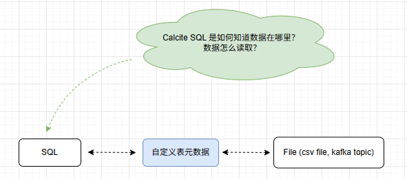

# Calcite -     

## 引言      
在之前发表的关于 Calcite 的微信公众号文章中，**文章列表如下所示**，这些文章的大部分篇幅都在介绍如何通过实现 Calcite 的 `自定义表元数据` 来实践 SQL 查询数据的功能。因此，`元数据的定义` 就像一个 `驱动器`，桥接了 Calcite SQL 与存储介质之间的关系 ... 但就目前实现结果来看，我们仍然可以思考一些不足点。    

    

文章列表：      
* "Calcite - 探索让集合可以像表一样查询" (https://mp.weixin.qq.com/s/Zy8SOCSCRRIBaLjVG4AEKQ)    
* "Calcite - Official - Tutorial CSV 案例说明补充"(https://mp.weixin.qq.com/s/YdKV4V4ToRy0h42brg4PSg)        
* "Calcite - 探索 Kafka Eagle KSQL 数据查询实现" (https://mp.weixin.qq.com/s/55QMA0EI-Lbr3PSj60mQtg)      

>后面的章节是以公众号文章 "Calcite - Official - Tutorial CSV 案例说明补充"(`https://mp.weixin.qq.com/s/YdKV4V4ToRy0h42brg4PSg`)中的 `YzhouCsvTest` 示例代码为基础，进行优化。遗忘或者未阅读过的小伙伴，建议重新阅读文章。     

## 不足点    

>这里的不足点偏向于在实践过程中还可以继续思考，继续补充的地方。       

### 1. 去掉 model.json 文件引用     
在公众号文章 "Calcite - Official - Tutorial CSV 案例说明补充"(`https://mp.weixin.qq.com/s/YdKV4V4ToRy0h42brg4PSg`) 介绍了使用 Calcite 查询 CSV 数据，但 `YzhouCsvTest`示例仅是一个 Demo，因为我们很少会通过 `model.json` 文件来定义元数据，这种声明方式在使用过程中非常不方便。所以，我们使用 `RootSchema` 添加元数据，去掉 `model.json` 文件的引用。代码如下所示：           

**YzhouCsvTest_withoutjson.java**  
```java
public class YzhouCsvTest_withoutjson {

  public static void main(String[] args) throws SQLException {
    Properties props = new Properties();
    props.setProperty("caseSensitive", "false");
    try (Connection connection = DriverManager.getConnection("jdbc:calcite:", props);
         CalciteConnection calciteConnection = connection.unwrap(CalciteConnection.class)) {
      SchemaPlus rootSchema = calciteConnection.getRootSchema();
      File csvDir = new File("javamain-calcite\\src\\main\\resources\\sales");
      CsvSchema csvSchema = new CsvSchema(csvDir, CsvTable.Flavor.SCANNABLE);
      // 动态添加表到模式
      rootSchema.add("depts", csvSchema.getTable("DEPTS"));
      rootSchema.add("sdepts", csvSchema.getTable("SDEPTS"));

      String sql = "select * from depts";
      try (Statement statement = connection.createStatement();
           ResultSet resultSet = statement.executeQuery(sql)) {
        print(resultSet);
      }
    }
  }

  private static void print(ResultSet resultSet) throws SQLException {
    final ResultSetMetaData metaData = resultSet.getMetaData();
    final int columnCount = metaData.getColumnCount();
    while (resultSet.next()) {
      for (int i = 1; ; i++) {
        System.out.print(resultSet.getString(i));
        if (i < columnCount) {
          System.out.print(", ");
        } else {
          System.out.println();
          break;
        }
      }
    }
  }
}
``` 

执行结果：   
```bash
10, Sales
20, Marketing
30, Accounts
```

### 2. 通过 DDL 对元数据操作   
像 model.json 文件定义元数据 或者自定义表元数据，在大多数时候比较偏 `静态`，当程序启动时就决定了元数据的结构信息，这也导致了后期无法对元数据信息做扩展。 例如增加表，视图等操作，都需要重新启动程序。大家可以参考像 Flink SQL Cli 中的 `Catalog`，我们可以像在 MySQL 那样，通过 DDL 语句对元数据进行操作。       

**DdlExample.java**
```java
public class DdlExample {
  public static void main(String[] args) throws SQLException {
    // 1. 配置属性，指定支持 DDL 的解析器
    Properties props = new Properties();
    props.put(
            CalciteConnectionProperty.PARSER_FACTORY.camelName(),
            ServerDdlExecutor.class.getName() + "#PARSER_FACTORY"
    );

    // 2. 创建连接
    try (Connection conn = DriverManager.getConnection("jdbc:calcite:", props);
         Statement stmt = conn.createStatement()) {

      // === 用 SQL 来定义元数据结构 ===
      stmt.execute("CREATE SCHEMA sales");
      stmt.execute("CREATE TABLE sales.depts(deptno int, name varchar(20))");
      stmt.execute("INSERT INTO sales.depts VALUES (1, 'IT'), (2, 'HR')");

      // === 查询数据 ===
      try (ResultSet rs = stmt.executeQuery("SELECT * FROM sales.depts")) {
        print(rs);
      }
    }
  }

  private static void print(ResultSet rs) throws SQLException {
    ResultSetMetaData meta = rs.getMetaData();
    int cols = meta.getColumnCount();
    while (rs.next()) {
      for (int i = 1; i <= cols; i++) {
        System.out.print(rs.getString(i));
        if (i < cols) System.out.print(", ");
      }
      System.out.println();
    }
  }
}
```

执行结果：      
```bash
1, IT
2, HR  
```


### 3. 添加 UDF，校验 SQL  
在 `YzhouCsvTest_withoutjson.java` 代码示例中，我们没有设置 