# Calcite - 探索 Relation Algebra (关系代数)

>Calcite version: 1.35.0        

## Postscript (补充) 
PS: 该篇文章的起头对于博主来说，有些“举步艰难” ！就像很早的公众号文章介绍 JavaCC 是用来定义和生成 Calcite SQL 解析器（Parser）的工具，它涉及到 `.jj` 文件的 `扩展巴科斯范式（EBNF） 的描述语法`,博主为了保证文章上下文的连串性，就需要对其进行扩展实践。该篇也无法像 Apache Calcite `Algebra Doc`(https://calcite.apache.org/docs/algebra.html) 针对 `Relation Algebra` 一笔带过，或者默认读者了解它。    

## 引言  
 (https://mp.weixin.qq.com/s/SgOAByvcS2W6p6UcQCoSjQ) 

在上一篇 `Calcite - 实践 动态 DDL，Calcite SqlParser，SqlValidator，自定义 UDF` 公众号文章内容中的 `YzhouCsvTest_withoutjson.java` 示例代码，我们直接执行 SQL 语句，对数据集进行查询操作。部分代码如下所示，但是在 Apache Calcite 中也提供了另一种方式来构建查询，但需注意：它们本质是一样的, `转换成` Relation Algebra 。       
```java
String sql = "select deptno,name from depts";
try (Statement statement = connection.createStatement();
      ResultSet resultSet = statement.executeQuery(sql)) {
  print(resultSet);
}
```  

接下来，我们开始探索 `Relation Algebra`。       

## “一头雾水” （Calcite 的 Algebra 文档）    

**图01**     
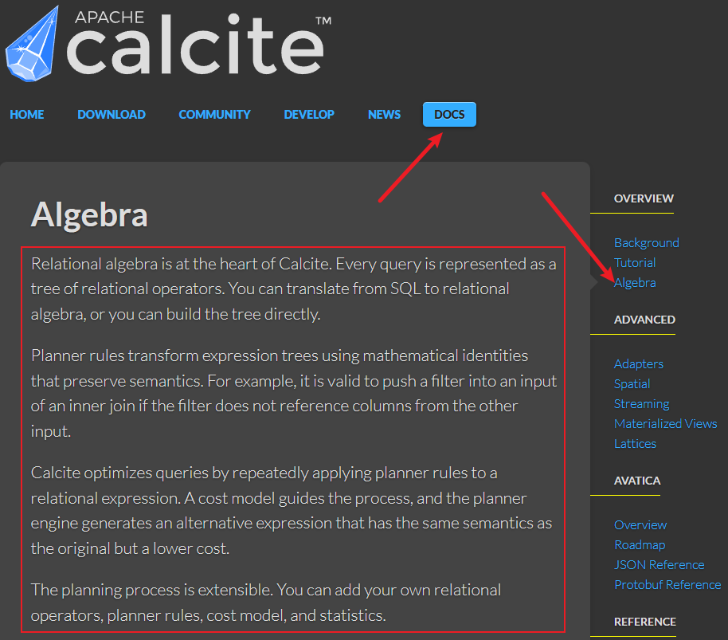           

```bash
Algebra
Relational algebra is at the heart of Calcite. Every query is represented as a tree of relational operators. You can translate from SQL to relational algebra, or you can build the tree directly.

Planner rules transform expression trees using mathematical identities that preserve semantics. For example, it is valid to push a filter into an input of an inner join if the filter does not reference columns from the other input.

Calcite optimizes queries by repeatedly applying planner rules to a relational expression. A cost model guides the process, and the planner engine generates an alternative expression that has the same semantics as the original but a lower cost.

The planning process is extensible. You can add your own relational operators, planner rules, cost model, and statistics.
```

### 开头1
博主在刚开始学习 Apache Calcite 时，对这篇 `Algebra` 文档的理解有些“犯难”，正文如 `图01` 所示，首先文档介绍 `Relational algebra`是 Calcite 的核心概念，任何查询都可以表示为 `a tree of relational operators`, 它告诉我们可以通过 SQL 语句转成 `relational algebra`,也可以通过 `RelBuilder` 构建它。      

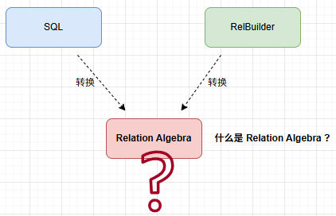   

>PS: 为啥是 `RelBuilder`，在该篇文档中的 `Algebra builder`章节告诉我们了，查看 `图02`。    

**引入 RelBuilder 图02**        
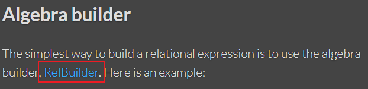    

### 段落2  
段落2首句话翻译过来是：`Planner rules` 使用保持语义的 "数学恒等式" 来转换 "表达式树"; 一句非常简单的描述，它的确让我提出了很多问题，下面我用不同颜色标记出来名词和动词，如图04所示：  

1.`Planner rules` 是什么？       
2.告诉我们用保持语义的 `mathematical identities`，那数学恒等式是什么？ 它用了复数形式 `ties` 那有哪些恒等式，我们又如何理解它？       
3.转换成 `expression tree`, 那之前的形式是什么？ 转换后 `expression tree` 又是什么？ 转换的目的是什么？         

**图4**           
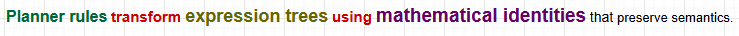     

段落2第二句话翻译过来是：例如，如果过滤条件不引用另一个输入中的列，则可以将过滤条件推入内连接的输入中；     

>这句话你完全可以用 AI 帮你解释，并且它可以给出示例，告诉你怎么回事，但我们又如何理解，这的确是另外一件事，在这个交互过程，博主仍然有些焦虑感，往往用 AI 给出的定义或者名词解释，我很难在不懂的领域来佐证它是否正确，同时我也无法将它作为结论转述给其他人。这是因为它给出答案的 `不确定性`，这里需要与 Code 做一些区分，AI 给出 Code 好坏，大多时候可以通过运行结果来判定它是否正确；     

第二句话我也用不同的颜色标记处动词和名词，如图05 所示：   
1.an input / the other input 它指代什么？ “输入” ?     

**图05**          
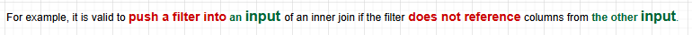  

### 段落3 
段落3原文翻译：Calcite 通过反复对关系表达式应用规划器规则来优化查询。成本模型指导这一过程，规划器引擎生成一个与原始表达式具有相同语义但成本更低的替代表达式。              

>这句子看着特别别扭。如果表述成：`The planner engine` 根据 `a cost model` 算法反复对 `a relational expression` 使用 `planner rules` 来优化查询。其目标是生成一个与原始表达式具有相同语义但成本更低的 `alternative expression`;     

这里又收获了，超多的问题：  
1.`a cost model` 是什么？       
2.反复对`a relational expression` 使用`planner rules`，它告诉我们是 `optimizes queries` 行为，这种行为依据是什么？              
3.`the planner engine` 生成的 `alternative expression` 在上面的段落介绍中，也提到过 `relational expression`;     
4.它介绍说 but a lower cost，说成本更低，我的先知道成本是什么？     

**图06**        
        

### 段落4 
段落4原文翻译：规划过程是可扩展的。你可以添加自己的关系运算符、规划规则、成本模型和统计信息。 

这句话告诉我，很多它的学习方向：自定义 operators，自定义 planner rules，自定义 cost model，自定义 statistics。  

**图07**          
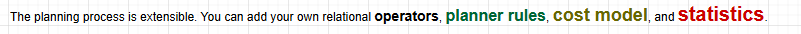             


### 小结     
这几段介绍，虽然句子不长，但提供的信息量还是比较大。对于博主来说，提出了很多需要弄明白的问题。        
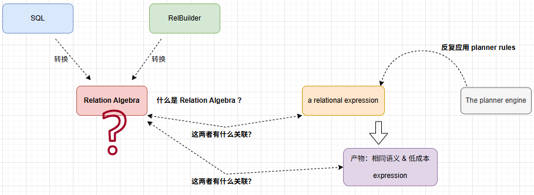              

接下来，开始探索吧！           

## The Relational Algebra（关系代数）    
`Relational Algebra` 相关知识大家可以从两本书中获取，下面将这部分的内容从书中 `摘要`出来。   

### Database System Concepts Seventh Edition (2.6 章节)     
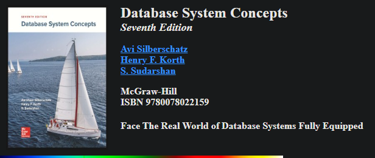   

#### The Relational Algebra   
The relational algebra consists of a set of operations that take one or two relations as
input and produce a new relation as their result.     
（PS:告诉我们，关系代数是由一组 `operations`组成，这些 `operations` 以一个或两个关系为输入，这里第一次出现 `input`, 在上面的 Calicte 文章中也出现 `input`）            

Some of these operations, such as the select, project, and rename operations, are
called unary operations because they operate on one relation. The other operations,
such as union, Cartesian product, and set difference, operate on pairs of relations and
are, therefore, called binary operations.               
（PS：了解到，这些操作可以根据对 `relation`的个数区分成 一元操作 / 二元操作）  

Although the relational algebra operations form the basis for the widely used SQL
query language, database systems do not allow users to write queries in relational algebra. However, there are implementations of relational algebra that have been built for
students to practice relational algebra queries. The website of our book, db-book.com,
under the link titled Laboratory Material, provides pointers to a few such implementations.       
（PS：这里面包含一些隐含的说明是 SQL 不单单是一种可以用作数据查询的语言，更重要的是可通过关系代数（Relation Algebra）进行形式化表示，使得计算机理解和处理查询的语义更加方便。             

关系代数是一种简洁的，形式化的语言，同时也是一种过程化语言。它过程
化地表示了 SQL 的执行逻辑。SQL 查询优化的本质是优化其对应关系代数

尽管数据库不允许直接使用 `relational algebra` 进行查询，但可以访问 `https://db-book.com` 获取该书提供了一些学习案例，然后在 `https://dbis-uibk.github.io/relax/landing` 网站提供的 `RelaX - relational algebra calculator` 功能上进行测试 `Relational Algebra`      

这部分我会在后面实践中，告诉大家 calculator 如何使用。        

**db-book.com**         
   

**关系代数计算器**   
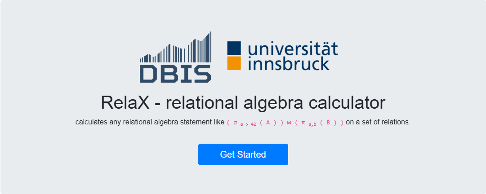    
）

It is worth recalling at this point that since a relation is a set of tuples, relations
cannot contain duplicate tuples. In practice, however, tables in database systems are
permitted to contain duplicates unless a specific constraint prohibits it. But, in discussing the formal relational algebra, we require that duplicates be eliminated, as is
required by the mathematical definition of a set. In Chapter 3 we discuss how relational algebra can be extended to work on multisets, which are sets that can contain
duplicates.               

### 为实操 `Relational Algebra` 运算做准备  
**1.** 首先访问 `https://db-book.com/` 页面，点击 `Sample tables`，获取示例的 DDL `DDL.sql` 和 DML `largeRelationsInsertFile.sql` 语句，下载好它们。     

**Sample tables**             
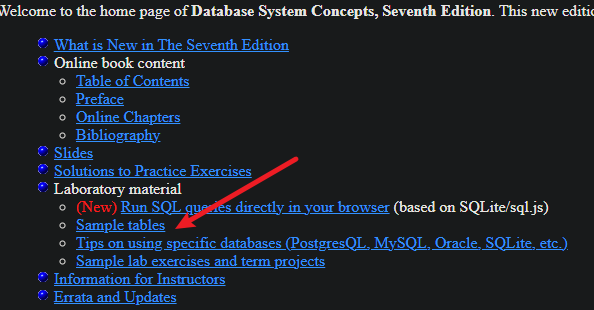         

**下载 DDL，DML**           
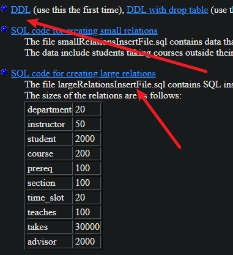       

**2.** 导入 DataSet  
在 `RelaX - relational algebra calculator` 网站中并没有 `Database System Concepts Seventh Edition` 示例数据集，所以需要将下载 DDL & DML 整理成一个符合 `Relax Dataset` 语法规范的数据文件。可以先通过访问 `https://dbis-uibk.github.io/relax/help#tutorial-maintainer-create-dataset` 了解一下。 (PS: 看 doc 介绍那么多，但格式很简单，AI 帮忙搞定)       

语法的格式：          
```bash
group: [数据集名称]

表名 = {
    字段01:string, 字段02:string, 字段03:number ....
    [示例数据]
}

# 多个表名，大括号之间无需逗号隔开   
```

**示例**          
```bash
group: university

time_slot = {
    time_slot_id:string, day:string, start_hr:number, start_min:number, end_hr:number, end_min:number
    "A", "M", 8, 0, 8, 50
    "A", "W", 8, 0, 8, 50
    ...
}

classroom = {
    building:string, room_number:string, capacity:number
    "Lamberton", 134, 10
    "Chandler", 375, 10
    ...
}

department = {
    dept_name:string, building:string, budget:number
    "Civil Eng.", "Chandler", 255041.46
    "Biology", "Candlestick", 647610.55
    ...
}
```

通过 AI 方式，将 SQL 拼接处 `Relax Dataset` 格式数据文件，再将该文件上传到 Gist 


这句话就目前文章的上下文来说`暂时有些无厘头`，它原文中的 `using mathematical identities that preserve semantics`, 


`Planner rules` 先暂时不做过多解释，会在后面的文章的介绍 `如何自定义规则`，这里希望大家别像我一样忽略一个单词 `expression`，准确的说是 `Relational-algebra expression`。   

并且它给出一个 `谓词下推`的示例。 


我该如何理解 Apache Calcite 中的 RelRoot, RelNode, RexNode   


## RelNode    

常见的 RelNode 类型：      
- TableScan - 扫描表     
- Filter - 过滤行     
- Project - 投影列      
- Join - 连接表      
- Aggregate - 聚合（GROUP BY）      
- Sort - 排序       

## RexNode 


RelBuilder.create(config) 方法传递的 config，它定义了 `SqlParser.config()`中设置了 `CaseSensitive` 为 false，也就是忽略大小写，可实际执行结果并不符合我的预期，这里确实有个`很大的疑惑?`  

**YzhouCsvTest_withoutjson_relbuilder.java**
```bash
public class YzhouCsvTest_withoutjson_relbuilder {

  public static void main(String[] args) throws SQLException {
    Properties props = new Properties();
    props.setProperty("caseSensitive", "false");
    props.setProperty("lex", Lex.JAVA.toString());
    try (Connection connection = DriverManager.getConnection("jdbc:calcite:", props);
         CalciteConnection calciteConnection = connection.unwrap(CalciteConnection.class)) {
      SchemaPlus rootSchema = calciteConnection.getRootSchema();
      File csvDir = new File("javamain-calcite\\src\\test\\resources\\sales");
      CsvSchema csvSchema = new CsvSchema(csvDir, CsvTable.Flavor.SCANNABLE);
      // 动态添加表到模式
      rootSchema.add("depts", csvSchema.getTable("DEPTS"));
      rootSchema.add("sdepts", csvSchema.getTable("SDEPTS"));

      FrameworkConfig config = Frameworks.newConfigBuilder()
              .parserConfig(SqlParser.config()
                              .withLex(Lex.JAVA)
                              .withCaseSensitive(false))
              .defaultSchema(rootSchema)
              .build();
      RelBuilder builder = RelBuilder.create(config);
      RelNode rel = builder
              .scan("depts")
              .project(builder.field("deptno"), builder.field("name"))  // 0=DEPTNO, 1=NAME
              .build();

      System.out.println("RelNode tree:");
      System.out.println(org.apache.calcite.plan.RelOptUtil.toString(rel));

      RelRunner runner = connection.unwrap(RelRunner.class);
      try (PreparedStatement preparedStatement = runner.prepareStatement(rel);
           ResultSet resultSet = preparedStatement.executeQuery()) {
        print(resultSet);
      }
    }
  }

  private static void print(ResultSet resultSet) throws SQLException {
    final ResultSetMetaData metaData = resultSet.getMetaData();
    final int columnCount = metaData.getColumnCount();
    while (resultSet.next()) {
      for (int i = 1; ; i++) {
        System.out.print(resultSet.getString(i));
        if (i < columnCount) {
          System.out.print(", ");
        } else {
          System.out.println();
          break;
        }
      }
    }
  }
}
```

输出结果： 
```bash
Exception in thread "main" java.lang.IllegalArgumentException: field [deptno] not found; input fields are: [DEPTNO, NAME]
	at org.apache.calcite.tools.RelBuilder.field(RelBuilder.java:539)
	at org.apache.calcite.tools.RelBuilder.field(RelBuilder.java:522)
	at com.javamain.calcite.csv.YzhouCsvTest_withoutjson_relbuilder.main(YzhouCsvTest_withoutjson_relbuilder.java:46)
```

**resources\sales\DEPTS.csv**
```bash
DEPTNO:int,NAME:string
10,"Sales"
20,"Marketing"
30,"Accounts"
```

 .project(builder.field(0), builder.field(1)) 

Calcite源码中 RelBuilderExample.java   


添加 Project 时，要说明 `.project(builder.field("DEPTNO"), builder.field("NAME"))` 与 `.project(builder.field("NAME"), builder.field("DEPTNO"))` 在打印 RelNode tree 区别，例如： 
```bash
# DEPTNO 在前，NAME 在后
[RelNode tree]
LogicalTableScan(table=[[depts]])

# NAME 在前，DEPTNO 在后
[RelNode tree]
LogicalProject(NAME=[$1], DEPTNO=[$0])
  LogicalTableScan(table=[[depts]])
```

列裁剪（Project 下沉）需要知道“父节点/更上层到底用哪些列”。比如根节点只输出列 A，那就应尽量让下游节点只产出 A；这个信息是自顶向下的，单看某个节点及其子节点无法判断哪些列可以安全丢弃。


refer:        
1.Algebra https://calcite.apache.org/docs/algebra.html         
2.SqlNode,RelNode,RexNode https://lists.apache.org/thread/z3pvzy1fnl6t5m04gd3wv4tntwpf3g52    
3.关系代数计算器 https://dbis-uibk.github.io/relax/landing    