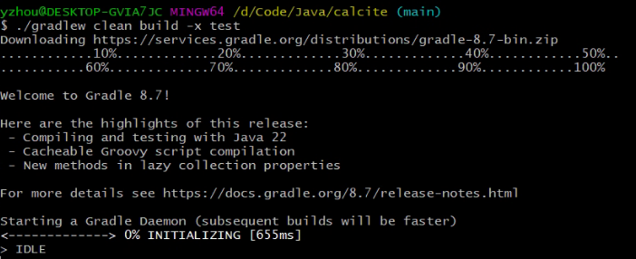
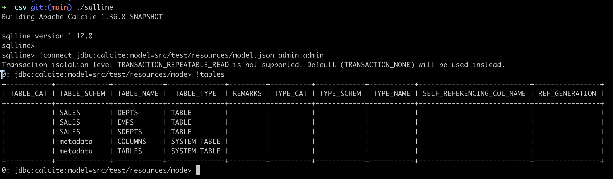
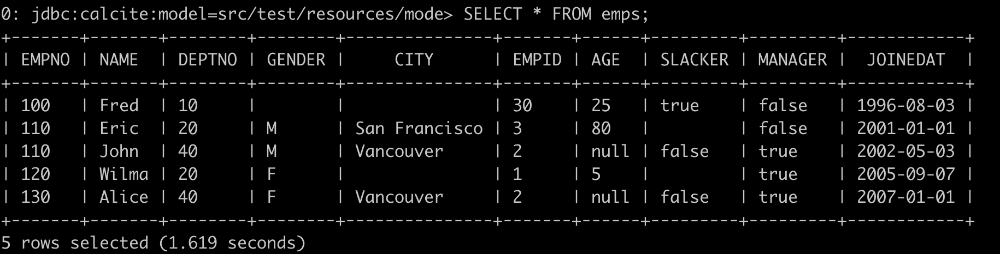
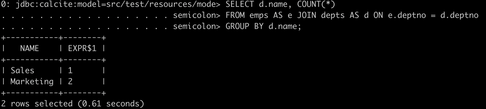
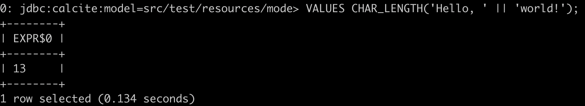
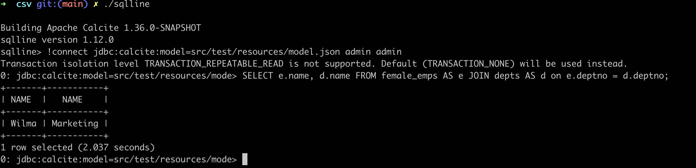
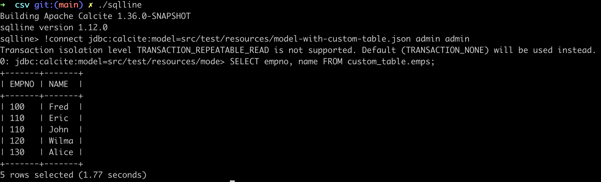
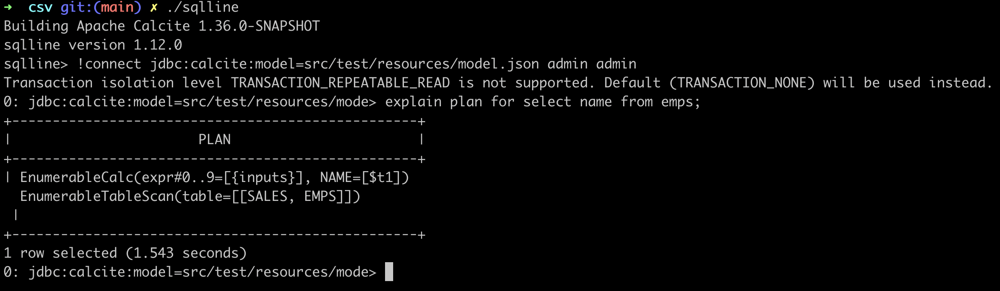
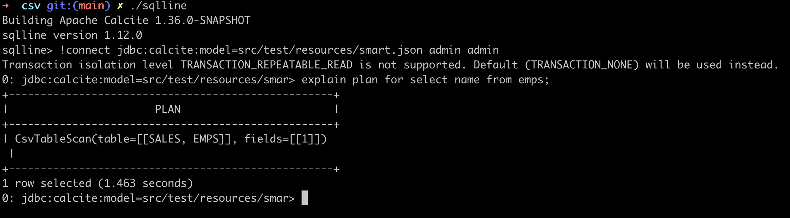

# Official - Tutorial 扩展

## 引言  
这是一个分步教程，展示如何构建和连接到 Calcite。 它使用一个简单的适配器，使 CSV 文件的目录看起来像是包含表的架构。 Calcite 完成剩下的工作，并提供完整的 SQL 接口。  

`Calcite-example-CSV` 是 Calcite 的功能齐全的适配器，可以读取 CSV（逗号分隔值）格式的文本文件。 值得注意的是，几百行 Java 代码就足以提供完整的 SQL 查询功能。        

CSV 还可以用作构建其他数据格式适配器的模板。 虽然代码不多，但是涵盖了几个重要的概念：           
使用 SchemaFactory 和 Schema 接口的用户定义模式；         
* 在模型 JSON 文件中声明模式；          
* 在模型 JSON 文件中声明视图；          
* 使用Table接口的用户定义表；           
* 确定表的记录类型；        
* Table 的简单实现，使用 ScannableTable 接口，直接枚举所有行；      
* 更高级的实现，实现了FilterableTable，并且可以根据简单的谓词过滤掉行；         
* Table 的高级实现，使用 TranslatableTable，使用规划器规则转换为关系运算符。        

## 下载并构建  
你需要 Java（版本 8、9 或 10）和 Git。      
```shell
$ git clone https://github.com/apache/calcite.git
$ ./gradlew clean build -x test # 编译  记得跳过测试 
$ cd calcite/example/csv    
```     

**目录结构如下：**    
```bash  
yzhou@DESKTOP-GVIA7JC MINGW64 /d/Code/Java/calcite/example/csv (main)
$ tree -L 1
.
|-- build
|-- build.gradle.kts
|-- gradle.properties
|-- sqlline
|-- sqlline.bat
`-- src

2 directories, 4 files
```

**执行 sqlline**  
```bash
$ .\sqlline.bat    
```

Output log:    
```bash
PS D:\Code\Java\calcite\example\csv> .\sqlline.bat
Building Apache Calcite 1.38.0-SNAPSHOT
sqlline version 1.12.0
sqlline>
```

>注意：如果你运行环境是 Windows，则命令为 sqlline.bat。       

>使用 gradlew 脚本对 calcite源码进行编译，意味着，我们并不需要提前安装 Gradle   
   

## 查询
现在让我们使用 sqlline（本项目中包含的 SQL shell）连接到 Calcite。      
```shell  
$ ./sqlline
sqlline> !connect jdbc:calcite:model=src/test/resources/model.json admin admin   
```     
Output log:   
```bash
sqlline> !connect jdbc:calcite:model=src/test/resources/model.json admin admin
SLF4J(W): No SLF4J providers were found.
SLF4J(W): Defaulting to no-operation (NOP) logger implementation
SLF4J(W): See https://www.slf4j.org/codes.html#noProviders for further details.
SLF4J(W): Class path contains SLF4J bindings targeting slf4j-api versions 1.7.x or earlier.
SLF4J(W): Ignoring binding found at [jar:file:/C:/Users/yzhou/.gradle/caches/modules-2/files-2.1/org.apache.logging.log4j/log4j-slf4j-impl/2.17.1/84692d456bcce689355d33d68167875e486954dd/log4j-slf4j-impl-2.17.1.jar!/org/slf4j/impl/StaticLoggerBinder.class]
SLF4J(W): See https://www.slf4j.org/codes.html#ignoredBindings for an explanation.
Transaction isolation level TRANSACTION_REPEATABLE_READ is not supported. Default (TRANSACTION_NONE) will be used instead.
0: jdbc:calcite:model=src/test/resources/mode>
```

`执行元数据查询：`     
```shell
0: jdbc:calcite:model=src/test/resources/mode> !tables  
``` 
     

（JDBC 请注意：sqlline 的 !tables 命令只是在后台执行 DatabaseMetaData.getTables()。它还有其他命令来查询 JDBC 元数据，例如 !columns 和 !describe。）         

正如你所看到的，系统中有 5 个表：当前 SALES 模式中的表 EMPS、DEPTS 和 SDEPTS，以及系统元数据模式中的 COLUMNS 和 TABLES。系统表始终存在于 Calcite 中，但其他表由模式的具体实现提供；  

在本例中，EMPS、DEPTS 和 SDEPTS 表基于 `calcite/example/csv/src/test/resources/sales` 目录中的 `EMPS.csv.gz`、`DEPTS.csv` 和 `SDEPTS.csv` 文件。         

让我们对这些表执行一些查询，以显示 Calcite 提供 SQL 的完整实现。首先，表扫描:           
```shell    
0: jdbc:calcite:model=src/test/resources/mode> SELECT * FROM emps;  
``` 
        

Now JOIN and GROUP BY:      
```sql
SELECT d.name, COUNT(*)
FROM emps AS e JOIN depts AS d ON e.deptno = d.deptno
GROUP BY d.name;
```
    

最后，VALUES 运算符生成单行，是测试表达式和 SQL 内置函数的便捷方法：    
```shell
0: jdbc:calcite:model=src/test/resources/mode> VALUES CHAR_LENGTH('Hello, ' || 'world!');   
```
    

Calcite 还有许多其他 SQL 功能。我们没有时间在这里介绍它们。编写更多查询来进行实验。      

## Schema disconvery (Schema 发现)    
现在，how did Calcite find these tables?  请记住，核心 Calcite 对 CSV 文件一无所知。 （作为“没有存储层的数据库”，Calcite 不知道任何文件格式。）Calcite 知道这些表，因为我们告诉它在 calcite-example-csv 项目中运行代码。    

该链中有几个步骤。首先，我们基于模型文件中的模式工厂类定义模式。然后模式工厂创建一个模式，该模式创建多个表，每个表都知道如何通过扫描 CSV 文件来获取数据。最后，在 Calcite 解析查询并计划使用这些表后，Calcite 在执行查询时调用表来读取数据。现在让我们更详细地看看这些步骤。       

>在还没有介绍下面内容之前，需提前知道的是： `我们正在了解的是 !connect jdbc:calcite:model=src/test/resources/model.json admin admin` 处理过程。 而下面多次贴出的JSON 它对应的内容是 calcite/example/csv/src/test/resources/model.json 文件。 我想你看到 指定`jdbc:calcite:model` 参数就懂了。   
**calcite/example/csv/src/test/resources/model.json**    
```json
/*
 * Licensed to the Apache Software Foundation (ASF) under one or more
 * contributor license agreements.  See the NOTICE file distributed with
 * this work for additional information regarding copyright ownership.
 * The ASF licenses this file to you under the Apache License, Version 2.0
 * (the "License"); you may not use this file except in compliance with
 * the License.  You may obtain a copy of the License at
 *
 * http://www.apache.org/licenses/LICENSE-2.0
 *
 * Unless required by applicable law or agreed to in writing, software
 * distributed under the License is distributed on an "AS IS" BASIS,
 * WITHOUT WARRANTIES OR CONDITIONS OF ANY KIND, either express or implied.
 * See the License for the specific language governing permissions and
 * limitations under the License.
 *
 * A JSON model of a simple Calcite schema.
 */
{
  "version": "1.0",
  "defaultSchema": "SALES",
  "schemas": [
    {
      "name": "SALES",
      "type": "custom",
      "factory": "org.apache.calcite.adapter.csv.CsvSchemaFactory",
      "operand": {
        "directory": "sales"
      }
    }
  ]
}
```   

下面接着聊正题      

在 JDBC 连接字符串中，我们给出了 JSON 格式的模型路径。这是模型：            
```json 
{
  version: '1.0',
  defaultSchema: 'SALES',
  schemas: [
    {
      name: 'SALES',
      type: 'custom',
      factory: 'org.apache.calcite.adapter.csv.CsvSchemaFactory',
      operand: {
        directory: 'sales'
      }
    }
  ]
}
```

该模型定义了一个名为“SALES”的单一模式。该模式由插件类 `org.apache.calcite.adapter.csv.CsvSchemaFactory` 提供支持，该类是 `calcite-example-csv` 项目的一部分，并实现 Calcite 接口 SchemaFactory。它的 create 方法实例化一个模式，传入模型文件中的目录参数：      
```java
public Schema create(SchemaPlus parentSchema, String name,
    Map<String, Object> operand) {
  final String directory = (String) operand.get("directory");
  final File base =
      (File) operand.get(ModelHandler.ExtraOperand.BASE_DIRECTORY.camelName);
  File directoryFile = new File(directory);
  if (base != null && !directoryFile.isAbsolute()) {
    directoryFile = new File(base, directory);
  }
  String flavorName = (String) operand.get("flavor");
  CsvTable.Flavor flavor;
  if (flavorName == null) {
    flavor = CsvTable.Flavor.SCANNABLE;
  } else {
    flavor = CsvTable.Flavor.valueOf(flavorName.toUpperCase(Locale.ROOT));
  }
  return new CsvSchema(directoryFile, flavor);
}
```     
在模型的驱动下，模式工厂实例化一个名为“SALES”的单一模式。该模式是 org.apache.calcite.adapter.csv.CsvSchema 的实例，并实现 Calcite 接口 Schema。     

模式的工作是生成表。 （它还可以列出子模式和表函数，但这些是高级功能，calcite-example-csv不支持它们。）这些表实现了 Calcite 的 Table 接口。 CsvSchema 生成的表是 CsvTable 及其子类的实例。       

以下是 CsvSchema 中的相关代码，重写了 AbstractSchema 基类中的 getTableMap() 方法。  
```java
private Map<String, Table> createTableMap() {
  // Look for files in the directory ending in ".csv", ".csv.gz", ".json",
  // ".json.gz".
  final Source baseSource = Sources.of(directoryFile);
  File[] files = directoryFile.listFiles((dir, name) -> {
    final String nameSansGz = trim(name, ".gz");
    return nameSansGz.endsWith(".csv")
        || nameSansGz.endsWith(".json");
  });
  if (files == null) {
    System.out.println("directory " + directoryFile + " not found");
    files = new File[0];
  }
  // Build a map from table name to table; each file becomes a table.
  final ImmutableMap.Builder<String, Table> builder = ImmutableMap.builder();
  for (File file : files) {
    Source source = Sources.of(file);
    Source sourceSansGz = source.trim(".gz");
    final Source sourceSansJson = sourceSansGz.trimOrNull(".json");
    if (sourceSansJson != null) {
      final Table table = new JsonScannableTable(source);
      builder.put(sourceSansJson.relative(baseSource).path(), table);
    }
    final Source sourceSansCsv = sourceSansGz.trimOrNull(".csv");
    if (sourceSansCsv != null) {
      final Table table = createTable(source);
      builder.put(sourceSansCsv.relative(baseSource).path(), table);
    }
  }
  return builder.build();
}

/** Creates different sub-type of table based on the "flavor" attribute. */
private Table createTable(Source source) {
  switch (flavor) {
  case TRANSLATABLE:
    return new CsvTranslatableTable(source, null);
  case SCANNABLE:
    return new CsvScannableTable(source, null);
  case FILTERABLE:
    return new CsvFilterableTable(source, null);
  default:
    throw new AssertionError("Unknown flavor " + this.flavor);
  }
}
```
该模式扫描目录，查找具有适当扩展名的所有文件，并为它们创建表。在本例中，目录是 sales，包含文件 EMPS.csv.gz、DEPTS.csv 和 SDEPTS.csv，这些文件成为表 EMPS、DEPTS 和 SDEPTS。     

## Tables and views in schemas (Schema 中的表和视图)       

`请注意我们不需要在模型中定义任何表；schema 自动生成表。`               

除了自动创建的表之外，你还可以使用架构的 tables 属性定义额外的表。                 

让我们看看如何创建一种重要且有用的表类型，即视图。      

当你编写查询时，视图看起来像表，但它不存储数据。它通过执行查询来得出结果。视图在规划查询时展开，因此查询规划器通常可以执行优化，例如从 SELECT 子句中删除最终结果中未使用的表达式。      

这是定义视图的架构(a schema that defines a views):  
```json 
{
  version: '1.0',
  defaultSchema: 'SALES',
  schemas: [
    {
      name: 'SALES',
      type: 'custom',
      factory: 'org.apache.calcite.adapter.csv.CsvSchemaFactory',
      operand: {
        directory: 'sales'
      },
      tables: [
        {
          name: 'FEMALE_EMPS',
          type: 'view',
          sql: 'SELECT * FROM emps WHERE gender = \'F\''
        }
      ]
    }
  ]
}
``` 

line type: 'view' 将 `FEMALE_EMPS` 标记为视图，而不是常规表或自定义表。请注意，视图定义中的单引号是使用反斜杠转义的，这是 JSON 的正常方式。         

JSON 并不能让编写长字符串变得容易，因此 Calcite 支持替代语法。如果你的视图有很长的 SQL 语句，你可以提供行列表而不是单个字符串：         
```json
{
  name: 'FEMALE_EMPS',
  type: 'view',
  sql: [
    'SELECT * FROM emps',
    'WHERE gender = \'F\''
  ]
}
```
现在我们已经定义了一个视图，我们可以在查询中使用它，就像它是一个表一样。 接下来，我们按照视图示例，在 `model.json` 中添加 `tables` 配置；   

>注意：sqlline 退出指令是 `!quit`。     

再`重新启动 sqlline`后, 执行`!connect jdbc:calcite:model=src/test/resources/model.json admin admin`,然后执行 `FEMALE_EMPS` view的查询。      
```sql
SELECT e.name, d.name FROM female_emps AS e JOIN depts AS d on e.deptno = d.deptno; 
```
  

### Custom tables 
自定义表是其实现由用户定义的代码驱动的表, 它们不需要存在于`custom schema`中。         

`calcite/example/csv/src/test/resources/model-with-custom-table.json` 示例:   
```json
{
  "version": "1.0",
  "defaultSchema": "CUSTOM_TABLE",
  "schemas": [
    {
      "name": "CUSTOM_TABLE",
      "tables": [
        {
          "name": "EMPS",
          "type": "custom",
          "factory": "org.apache.calcite.adapter.csv.CsvTableFactory",
          "operand": {
            "file": "sales/EMPS.csv.gz",
            "flavor": "scannable"
          }
        }
      ]
    }
  ]
}
```
我们可以用通常的方式查询该表, 以下是操作步骤：  
```shell
# 进入目录
cd calcite/example/csv  

# 进入交互模式 
./sqlline 

# 连接 
!connect jdbc:calcite:model=src/test/resources/model-with-custom-table.json admin admin  

# 查询
SELECT empno, name FROM custom_table.emps;    
``` 

  

该Schema 是常规模式，包含一个由 org.apache.calcite.adapter.csv.CsvTableFactory 支持的自定义表，该表实现了 Calcite 接口 TableFactory。它的 create 方法实例化一个 `CsvScannableTable`，传入模型文件中的文件参数：   
```java 
public CsvTable create(SchemaPlus schema, String name,
    Map<String, Object> operand, @Nullable RelDataType rowType) {
  String fileName = (String) operand.get("file");
  final File base =
      (File) operand.get(ModelHandler.ExtraOperand.BASE_DIRECTORY.camelName);
  final Source source = Sources.file(base, fileName);
  final RelProtoDataType protoRowType =
      rowType != null ? RelDataTypeImpl.proto(rowType) : null;
  return new CsvScannableTable(source, protoRowType);
}
```  

实现自定义表通常是实现自定义架构的更简单的替代方案。两种方法最终可能会创建类似的 Table 接口实现，但对于自定义表，你不需要实现元数据发现。 （CsvTableFactory 创建一个 CsvScannableTable，就像 CsvSchema 一样，但表实现不会扫描文件系统中的 .csv 文件。）     

自定义表需要开发者做更多工作（开发者需要显式指定每个表及其文件），但也为开发者提供了更多控制权（例如，为每个表提供不同的参数）。      

## Comments in models (模型中的注解)  
模型可以包含使用 /* ... */ 和 // 语法的注释： 
```json
{
  version: '1.0',
  /* Multi-line
     comment. */
  defaultSchema: 'CUSTOM_TABLE',
  // Single-line comment.
  schemas: [
    ..
  ]
}
```
（注释不是标准 JSON，而是无害的扩展。） 

## Optimizing queries using planner rules (使用规划器规则优化查询)   
到目前为止，只要表不包含大量数据，我们所看到的表实现就很好。但是，如果你的客户表有一百列和一百万行，你宁愿系统不检索每个查询的所有数据。你希望 Calcite 与适配器协商并找到更有效的数据访问方式。     

这种协商是查询优化的一种简单形式。 Calcite 通过添加规划器规则来支持查询优化。规划器规则的运行方式是在查询解析树（例如某种表顶部的项目）中查找模式，并用一组实现优化的新节点替换树中的匹配节点。 

规划器规则也是可扩展的，就像Schema和表一样。因此，如果你想要通过 SQL 访问数据存储，则首先定义自定义表或架构，然后定义一些规则以使访问高效。     
要查看此操作的实际情况，让我们使用规划器规则来访问 CSV 文件中的列子集。让我们对两个非常相似的模式运行相同的查询:  
```shell
./sqlline 

!connect jdbc:calcite:model=src/test/resources/model.json admin admin

explain plan for select name from emps;  
```
  

```shell
./sqlline
!connect jdbc:calcite:model=src/test/resources/smart.json admin admin

explain plan for select name from emps;   
```  

    

`是什么原因导致计划出现差异？`让我们追踪证据的踪迹。在 smart.json 模型文件中，只有一行：  
```
flavor: "translatable"  
```

这会导致使用`flavor = translatable` 创建CsvSchema，并且其 createTable()方法 创建CsvTranslatableTable 而不是 CsvScannableTable 的实例。         

`CsvTranslatableTable` 实现 `TranslatableTable.toRel()` 方法来创建 `CsvTableScan`。表扫描是查询运算符树的叶子。通常的实现是 `EnumerableTableScan`，但我们创建了一个独特的子类型，它将导致规则触发。       

以下是完整的规则：    
```java
public class CsvProjectTableScanRule
    extends RelRule<CsvProjectTableScanRule.Config> {

  /** Creates a CsvProjectTableScanRule. */
  protected CsvProjectTableScanRule(Config config) {
    super(config);
  }

  @Override public void onMatch(RelOptRuleCall call) {
    final LogicalProject project = call.rel(0);
    final CsvTableScan scan = call.rel(1);
    int[] fields = getProjectFields(project.getProjects());
    if (fields == null) {
      // Project contains expressions more complex than just field references.
      return;
    }
    call.transformTo(
        new CsvTableScan(
            scan.getCluster(),
            scan.getTable(),
            scan.csvTable,
            fields));
  }

  private static int[] getProjectFields(List<RexNode> exps) { 
    final int[] fields = new int[exps.size()];
    for (int i = 0; i < exps.size(); i++) {
      final RexNode exp = exps.get(i);
      if (exp instanceof RexInputRef) {
        fields[i] = ((RexInputRef) exp).getIndex();
      } else {
        return null; // not a simple projection
      }
    }
    return fields;
  }

  /** Rule configuration. */
  @Value.Immutable(singleton = false)
  public interface Config extends RelRule.Config {
    Config DEFAULT = ImmutableCsvProjectTableScanRule.Config.builder()
        .withOperandSupplier(b0 ->
            b0.operand(LogicalProject.class).oneInput(b1 ->
                b1.operand(CsvTableScan.class).noInputs()))
        .build();

    @Override default CsvProjectTableScanRule toRule() {
      return new CsvProjectTableScanRule(this);
    }
  }
}
```     
规则的默认实例位于 CsvRules 持有者类中：      
```java   
public abstract class CsvRules {
  public static final CsvProjectTableScanRule PROJECT_SCAN =
      CsvProjectTableScanRule.Config.DEFAULT.toRule();
}
```   

对默认配置（接口 Config 中的 DEFAULT 字段）中的 withOperandSupplier() 方法的调用声明了将导致规则触发的关系表达式模式。如果规划器发现 LogicalProject 的唯一输入是没有输入的 CsvTableScan，则它会调用该规则。     

该规则的变体是可能的。例如，不同的规则实例可能会匹配 CsvTableScan 上的 EnumerableProject。       

`onMatch() 方法生成一个新的关系表达式并调用 RelOptRuleCall.transformTo() 以指示规则已成功触发`。          

#### The query optimization process (查询优化过程)  
关于 Calcite 的查询规划器有多么聪明，有很多话要说，但我们在这里不会说。这种聪明的设计是为了减轻你——计划规则的制定者的负担。   

首先，Calcite不会按规定的顺序触发规则。查询优化过程遵循分支树的许多分支，就像下棋程序检查许多可能的移动序列一样。如果规则 A 和 B 都与查询运算符树的给定部分匹配，则 Calcite 可以同时触发这两个规则。    

其次，Calcite在计划之间进行选择时使用成本，但成本模型并不能阻止规则的触发，这在短期内似乎更昂贵。     

许多优化器都有线性优化方案。如上所述，面对规则 A 和规则 B 之间的选择，这样的优化器需要立即做出选择。它可能有一个策略，例如“将规则 A 应用于整个树，然后将规则 B 应用于整个树”，或者应用基于成本的策略，应用产生更便宜结果的规则。    

Calcite 不需要这样的妥协。这使得组合不同的规则集变得简单。如果你想将识别物化视图的规则与从 CSV 和 JDBC 源系统读取的规则结合起来，你只需为 Calcite 提供所有规则集并告诉它执行即可。    

Calcite 确实使用成本模型。成本模型决定最终使用哪个计划，有时会修剪搜索树以防止搜索空间爆炸，但它永远不会强迫你在规则 A 和规则 B 之间进行选择。这很重要，因为它避免陷入局部最小值在搜索空间中实际上并不是最优的。    

此外（你猜对了）成本模型是可插入的，它所基于的表和查询运算符统计信息也是可插入的。但这可以成为以后的主题。    

### JDBC adapter (JDBC 适配器)  
JDBC 适配器将 JDBC 数据源中的模式映射为 Calcite 模式。    

例如，此模式从 MySQL“foodmart”数据库读取：  
```json
{
  version: '1.0',
  defaultSchema: 'FOODMART',
  schemas: [
    {
      name: 'FOODMART',
      type: 'custom',
      factory: 'org.apache.calcite.adapter.jdbc.JdbcSchema$Factory',
      operand: {
        jdbcDriver: 'com.mysql.jdbc.Driver',
        jdbcUrl: 'jdbc:mysql://localhost/foodmart',
        jdbcUser: 'foodmart',
        jdbcPassword: 'foodmart'
      }
    }
  ]
}
```   
（FoodMart数据库对于使用过Mondrian OLAP引擎的人来说应该很熟悉，因为它是Mondrian的主要测试数据集。要加载数据集，请按照Mondrian的安装说明进行操作。）       

JDBC 适配器会将尽可能多的处理下推到源系统，同时转换语法、数据类型和内置函数。如果 Calcite 查询基于单个 JDBC 数据库中的表，则原则上整个查询应转到该数据库。如果表来自多个 JDBC 源，或者来自 JDBC 和非 JDBC 的混合，Calcite 将使用它可以使用的最有效的分布式查询方法。      

### The cloning JDBC adapter (克隆 JDBC 适配器) 
克隆 JDBC 适配器创建混合数据库。数据源自 JDBC 数据库，但在第一次访问每个表时被读入内存表中。 Calcite 根据这些内存中的表（实际上是数据库的缓存）评估查询。       
例如，以下模型从 MySQL“foodmart”数据库读取表：    
```json 
{
  version: '1.0',
  defaultSchema: 'FOODMART_CLONE',
  schemas: [
    {
      name: 'FOODMART_CLONE',
      type: 'custom',
      factory: 'org.apache.calcite.adapter.clone.CloneSchema$Factory',
      operand: {
        jdbcDriver: 'com.mysql.jdbc.Driver',
        jdbcUrl: 'jdbc:mysql://localhost/foodmart',
        jdbcUser: 'foodmart',
        jdbcPassword: 'foodmart'
      }
    }
  ]
}
``` 
另一种技术是在现有模式之上构建克隆模式。你使用 source 属性来引用模型中先前定义的架构，如下所示：      
```json
{
  version: '1.0',
  defaultSchema: 'FOODMART_CLONE',
  schemas: [
    {
      name: 'FOODMART',
      type: 'custom',
      factory: 'org.apache.calcite.adapter.jdbc.JdbcSchema$Factory',
      operand: {
        jdbcDriver: 'com.mysql.jdbc.Driver',
        jdbcUrl: 'jdbc:mysql://localhost/foodmart',
        jdbcUser: 'foodmart',
        jdbcPassword: 'foodmart'
      }
    },
    {
      name: 'FOODMART_CLONE',
      type: 'custom',
      factory: 'org.apache.calcite.adapter.clone.CloneSchema$Factory',
      operand: {
        source: 'FOODMART'
      }
    }
  ]
}   
```

你可以使用此方法在任何类型的模式（而不仅仅是 JDBC）上创建克隆模式。   
克隆适配器并不是万能的。我们计划开发更复杂的缓存策略，以及更完整、更高效的内存表实现，但现在克隆 JDBC 适配器展示了可能性，并允许我们尝试初始实现。   

### Further topics (更多主题)   
还有许多其他方法可以扩展 Calcite，本教程中尚未描述。适配器(https://calcite.apache.org/docs/adapter.html)规范描述了所涉及的 API。       

refer 
1.https://calcite.apache.org/docs/tutorial.html      