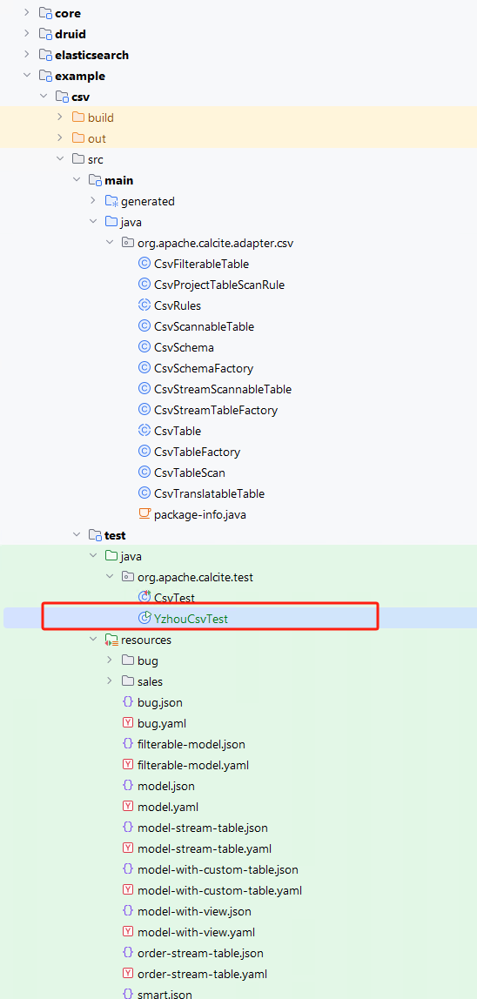

# Calcite - 探索官网示例 CSV的 SQL查询构建过程        

## 引言      
再整理了 Calcite学习分享文章后，对于我来说，对 Calcite 有了新的认识，而该篇 Blog，我将介绍`Calcite源码目录下的 example\csv`案例，这次并不是通过 `sqlline` cli 入手，而是根据代csv 的实现逻辑走读一遍 `tutorial`文档。     

>我当时是对 sqlline cli 有感，但对一些概念缺少一些认知。       

>1.`Calcite - Official - Tutorial 扩展`（https://mp.weixin.qq.com/s/H7kbIAvKdIHgF5L_jJH4mg）内容中介绍使用 `sqlline` cli 工具对 CSV文件 进行`SQL 查询`。       
2.`Calcite - 探索 Kafka Eagle KSQL 数据查询`(http://mp.weixin.qq.com/s/55QMA0EI-Lbr3PSj60mQtg)   

## 简单回顾 sqlline 使用    
如下图所示，首先加载`model.json`文件，以及一些配置项，例如`operand#directory`指定 csv 文件路径，其次执行查看元数据或者查询数据，例如 `!tables`、`SELECT * ...`。    
    

有了对 sqlline 了解，接下来如何在`main()`方法中执行。      

## 添加 main() 方法入口    
代码结构如下图所示：   
         

在`calcite\example\csv\src\test\java\org\apache\calcite\test\`目录下，添加`YzhouCsvTest.java`,代码如下： 
```java
package org.apache.calcite.test;
import org.apache.calcite.util.Sources;
import org.junit.jupiter.api.Test;
import java.sql.*;
import java.util.Properties;

public class YzhouCsvTest {
  public static void main(String[] args) throws SQLException {
    Connection connection = null;
    Statement statement = null;
    try {
      Properties info = new Properties();
      info.put("model", Sources.of(Test.class.getResource("/model.json")).file().getAbsolutePath());
      connection = DriverManager.getConnection("jdbc:calcite:", info);
      statement = connection.createStatement();
      print(statement.executeQuery("select * from depts "));
    } finally {
      connection.close();
    }
  }

  private static void print(ResultSet resultSet) throws SQLException {
    final ResultSetMetaData metaData = resultSet.getMetaData();
    final int columnCount = metaData.getColumnCount();
    while (resultSet.next()) {
      for (int i = 1; ; i++) {
        System.out.print(resultSet.getString(i));
        if (i < columnCount) {
          System.out.print(", ");
        } else {
          System.out.println();
          break;
        }
      }
    }
  }
}
```  
`YzhouCsvTest#main()`通过`connection = DriverManager.getConnection("jdbc:calcite:", info);` 加载 `test\resources`下的`model.json`，内容如下,  
```json
{
  "version": "1.0",
  "defaultSchema": "SALES",
  "schemas": [
    {
      "name": "SALES",
      "type": "custom",
      "factory": "org.apache.calcite.adapter.csv.CsvSchemaFactory",
      "operand": {
        "directory": "sales"
      }
    }
  ]
}
```   
operand 参数含义是指从配置文件传来的配置信息，对应前述的JSON文件中的operand配置。后面的代码中会用到该参数。   

执行 main() 后的 Output log:        
```bash
10, Sales
20, Marketing
30, Accounts
```
  
这个结果是符合程序预期的。     

## 目录结构对比   
我们看`EFAK KSQL`和`calcite example\csv` 类名后缀差不多，它们都使用了`自定义表元数据实现`     
    

接下来，回到`tutorial`文档中（https://calcite.apache.org/docs/tutorial.html）      

## Schema discovery    
>https://calcite.apache.org/docs/tutorial.html#schema-discovery           

发现`Schema`, 在`main()`中加载`model.json`文件信息，由于json中的`factory`参数指向了 `CsvSchemaFactory`类，并将 operand参数以 map形式传递给它，CsvSchemaFactory 实现`SchemaFactory接口`，实现了`create()`方法创建 `CsvSchema`对象，而`CsvSchema`继承 `AbstractSchema`类，重写`getTableMap()`方法，必须在该方法中完成`org.apache.calcite.schema.Table`集合准备，例如`Map<String, Table>`类型的集合。  

     

  

>`EFAK KSQL JSqlSchema `和`calcite example\csv CsvSchema` 同样如此。     


## Custom tables
>https://calcite.apache.org/docs/tutorial.html#custom-tables  


refer      
1.https://calcite.apache.org/docs/tutorial.html                 

