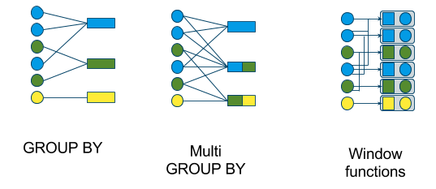
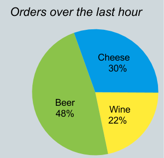

# Official - Streaming - Overview 扩展     

>Calcite 扩展了 SQL 和关系代数以支持流式查询。      

## 引言
流是不断流动且永不停歇的记录集合。`与表不同，流通常不会存储在磁盘上，而是在网络上传输，并在内存中短时间保存`。      

流补充了表，因为它们代表了企业的当前和未来动态，而表则代表了过去。将流归档到表中是非常常见的做法。          

像表一样，你经常希望用基于关系代数的高级语言来查询流，这些查询根据模式进行验证，并经过优化以充分利用可用资源和算法。         

Calcite 的 SQL 是对标准 SQL 的扩展，而不是另一种‘类似 SQL’的语言。这个区别很重要，原因有以下几点：        
* 对于了解常规 SQL 的人来说，学习流 SQL 很容易。        
* 语义是清晰的，因为我们旨在对流生成与表中相同数据相同的结果。       
* 你可以编写结合流和表（或流的历史，基本上是内存表）的查询。        
* 许多现有工具可以生成标准 SQL。         

如果你不使用 `STREAM 关键字`，你将回到常规的标准 SQL。     

>Introduction (https://calcite.apache.org/docs/stream.html#introduction)        

## An example schema        
我们的流式 SQL 示例使用以下架构：     
Orders (rowtime, productId, orderId, units) - a stream and a table   
Products (rowtime, productId, name) - a table    
Shipments (rowtime, orderId) - a stream         

为了在实践中学习，我们先在 MySQL中，创建 3个 测试表，Orders、Products、Shipments,         

### Orders 数据准备  
```sql
create table Orders
(
    rowtime   varchar(50) null,
    productId int         null,
    orderId   int         null,
    units     int         null
);

INSERT INTO yzhou_test.Orders (rowtime, productId, orderId, units) VALUES ('10:17:00', 30, 5, 4);
INSERT INTO yzhou_test.Orders (rowtime, productId, orderId, units) VALUES ('10:17:05', 10, 6, 1);
INSERT INTO yzhou_test.Orders (rowtime, productId, orderId, units) VALUES ('10:18:05', 20, 7, 2);
INSERT INTO yzhou_test.Orders (rowtime, productId, orderId, units) VALUES ('10:18:07', 30, 8, 20);
INSERT INTO yzhou_test.Orders (rowtime, productId, orderId, units) VALUES ('11:02:00', 10, 9, 6);
INSERT INTO yzhou_test.Orders (rowtime, productId, orderId, units) VALUES ('11:04:00', 10, 10, 1);
INSERT INTO yzhou_test.Orders (rowtime, productId, orderId, units) VALUES ('11:09:30', 40, 11, 12);
INSERT INTO yzhou_test.Orders (rowtime, productId, orderId, units) VALUES ('11:24:11', 10, 12, 4);

```

## A simple query   
让我们从最简单的流式查询开始：    
```bash
SELECT STREAM *
FROM Orders;

  rowtime | productId | orderId | units
----------+-----------+---------+-------
 10:17:00 |        30 |       5 |     4
 10:17:05 |        10 |       6 |     1
 10:18:05 |        20 |       7 |     2
 10:18:07 |        30 |       8 |    20
 11:02:00 |        10 |       9 |     6
 11:04:00 |        10 |      10 |     1
 11:09:30 |        40 |      11 |    12
 11:24:11 |        10 |      12 |     4
```

此查询从 Orders 流中读取所有列和行。与任何流式查询一样，它永远不会终止。每当记录到达 Orders 时，它就会输出一条记录。   
键入 `Control-C` 终止查询。  

STREAM 关键字是流式 SQL 的主要扩展。它告诉系统您对传入订单感兴趣，而不是现有订单。查询：    
```bash
SELECT *
FROM Orders;

  rowtime | productId | orderId | units
----------+-----------+---------+-------
 08:30:00 |        10 |       1 |     3
 08:45:10 |        20 |       2 |     1
 09:12:21 |        10 |       3 |    10
 09:27:44 |        30 |       4 |     2

4 records returned.
```

也有效，但会打印出所有现有订单，然后终止。我们将其称为关系查询，而不是流式查询。它具有传统的 SQL 语义。    

Orders 很特殊，因为它既有流又有表。如果您尝试在表上运行流式查询，或在流上运行关系查询，Calcite 会给出错误：    
```bash
SELECT * FROM Shipments;

ERROR: Cannot convert stream 'SHIPMENTS' to a table

SELECT STREAM * FROM Products;

ERROR: Cannot convert table 'PRODUCTS' to a stream  
```

>A simple query (https://calcite.apache.org/docs/stream.html#a-simple-query)      

## Filtering rows   
就像在常规 SQL 中一样，您可以使用`WHERE`子句来过滤行：    
```bash
SELECT STREAM *
FROM Orders
WHERE units > 3;

  rowtime | productId | orderId | units
----------+-----------+---------+-------
 10:17:00 |        30 |       5 |     4
 10:18:07 |        30 |       8 |    20
 11:02:00 |        10 |       9 |     6
 11:09:30 |        40 |      11 |    12
 11:24:11 |        10 |      12 |     4
```   

* Filtering rows (https://calcite.apache.org/docs/stream.html#filtering-rows)   

## Projecting expressions    
在`SELECT`子句中使用表达式来选择要返回的列或计算表达式：    
```bash
SELECT STREAM rowtime,
  'An order for ' || units || ' '
    || CASE units WHEN 1 THEN 'unit' ELSE 'units' END
    || ' of product #' || productId AS description
FROM Orders;

  rowtime | description
----------+---------------------------------------
 10:17:00 | An order for 4 units of product #30
 10:17:05 | An order for 1 unit of product #10
 10:18:05 | An order for 2 units of product #20
 10:18:07 | An order for 20 units of product #30
 11:02:00 | An order by 6 units of product #10
 11:04:00 | An order by 1 unit of product #10
 11:09:30 | An order for 12 units of product #40
 11:24:11 | An order by 4 units of product #10
```

我们建议你始终在`SELECT`子句中包含行时间列。每个流和流查询中都有一个排序的时间戳，使得以后可以进行高级计算，例如 GROUP BY 和 JOIN。     

* Projecting expressions (https://calcite.apache.org/docs/stream.html#projecting-expressions)   

## Tumbling windows   
有多种方法可以计算流上的聚合函数。差异是：     
* 每行输入多少行？     
* 每个传入值是否出现在一个或多个总计中？     
* 什么定义了“窗口”，即构成给定输出行的行集？     
* 结果是流还是关系？    

有多种窗口类型：   
* 翻滚窗口（GROUP BY）   
* 跳跃窗口（多 GROUP BY）   
* 滑动窗口（窗口函数）   
* 层叠窗口（窗口函数）    

下图显示了使用它们的查询类型：   
   

首先，我们将查看一个滚动窗口，它是由流式`GROUP BY`定义的。这是一个例子：    
```bash
SELECT STREAM CEIL(rowtime TO HOUR) AS rowtime,
  productId,
  COUNT(*) AS c,
  SUM(units) AS units
FROM Orders
GROUP BY CEIL(rowtime TO HOUR), productId;`

  rowtime | productId |       c | units
----------+-----------+---------+-------
 11:00:00 |        30 |       2 |    24
 11:00:00 |        10 |       1 |     1
 11:00:00 |        20 |       1 |     7
 12:00:00 |        10 |       3 |    11
 12:00:00 |        40 |       1 |    12
```  

结果是一个流。在 11 点钟，Calcite 会为自 10 点钟以来有订单的每个 ProductId 发出小计，时间戳为 11 点钟。 12点，它会发出11:00到12:00之间发生的订单。每个输入行仅对一个输出行有贡献。  

`Calcite 如何知道 10:00:00 小计已在 11:00:00 完成，以便可以发出它们？`它知道 rowtime 正在增加，并且知道 CEIL(rowtime TO HOUR) 也在增加。因此，一旦它在 11:00:00 或之后看到了一行，它就永远不会看到对 10:00:00 总计有贡献的行。  

递增或递减的列或表达式被称为单调的。  

如果列或表达式的值稍微乱序，并且流具有声明特定值将永远不会再次出现的机制（例如标点符号或水印），则该列或表达式被称为准单调。  

如果 GROUP BY 子句中没有单调或准单调表达式，Calcite 就无法取得进展，并且不允许查询：    
```bash
SELECT STREAM productId,
  COUNT(*) AS c,
  SUM(units) AS units
FROM Orders
GROUP BY productId;

ERROR: Streaming aggregation requires at least one monotonic expression in GROUP BY clause       
```    

单调和准单调列需要在模式中声明。当记录进入流时，单调性被强制执行，并由从该流读取的查询假定。我们建议您为每个流提供一个名为 rowtime 的时间戳列，但您可以将其他列声明为单调的，例如 orderId。
我们在下面讨论标点符号、水印和其他取得进展的方法。      

>Tumbling windows (https://calcite.apache.org/docs/stream.html#tumbling-windows)    

## Tumbling windows, improved     
前面的翻滚窗口示例很容易编写，因为窗口为一小时。对于不是整个时间单位的间隔，例如 2 小时或 2 小时 17 分钟，不能使用 CEIL，并且表达式会变得更加复杂。
Calcite 支持滚动窗口的替代语法：      
```bash
SELECT STREAM TUMBLE_END(rowtime, INTERVAL '1' HOUR) AS rowtime,
  productId,
  COUNT(*) AS c,
  SUM(units) AS units
FROM Orders
GROUP BY TUMBLE(rowtime, INTERVAL '1' HOUR), productId;

  rowtime | productId |       c | units
----------+-----------+---------+-------
 11:00:00 |        30 |       2 |    24
 11:00:00 |        10 |       1 |     1
 11:00:00 |        20 |       1 |     7
 12:00:00 |        10 |       3 |    11
 12:00:00 |        40 |       1 |    12
``` 

如您所见，它返回与上一个查询相同的结果。 TUMBLE 函数返回一个分组键，该键对于最终出现在给定汇总行中的所有行都相同； TUMBLE_END 函数采用相同的参数并返回该窗口结束的时间；还有一个 TUMBLE_START 函数。    

TUMBLE 有一个可选参数来对齐窗口。在以下示例中，我们使用 30 分钟间隔和 0:12 作为对齐时间，因此查询会在每小时过去 12 和 42 分钟发出摘要：   
```bash
SELECT STREAM
  TUMBLE_END(rowtime, INTERVAL '30' MINUTE, TIME '0:12') AS rowtime,
  productId,
  COUNT(*) AS c,
  SUM(units) AS units
FROM Orders
GROUP BY TUMBLE(rowtime, INTERVAL '30' MINUTE, TIME '0:12'),
  productId;

  rowtime | productId |       c | units
----------+-----------+---------+-------
 10:42:00 |        30 |       2 |    24
 10:42:00 |        10 |       1 |     1
 10:42:00 |        20 |       1 |     7
 11:12:00 |        10 |       2 |     7
 11:12:00 |        40 |       1 |    12
 11:42:00 |        10 |       1 |     4
```

>Tumbling windows, improved (https://calcite.apache.org/docs/stream.html#tumbling-windows-improved)     

## Hopping windows    
跳跃窗口是滚动窗口的概括，它允许数据在窗口中保留的时间长于发出间隔。  
例如，以下查询发出时间戳为 11:00 的行，其中包含从 08:00 到 11:00 的数据（如果我们比较迂腐的话，则为 10:59.9），而时间戳为 12:00 的行包含从 09:00 到 11:00 的数据。 12:00。   
```bash
SELECT STREAM
  HOP_END(rowtime, INTERVAL '1' HOUR, INTERVAL '3' HOUR) AS rowtime,
  COUNT(*) AS c,
  SUM(units) AS units
FROM Orders
GROUP BY HOP(rowtime, INTERVAL '1' HOUR, INTERVAL '3' HOUR);

  rowtime |        c | units
----------+----------+-------
 11:00:00 |        4 |    27
 12:00:00 |        8 |    50
```  

在此查询中，由于保留期是发出期的 3 倍，因此每个输入行正好贡献 3 个输出行。想象一下，HOP 函数为传入行生成组键的集合，并将其值放入每个组键的累加器中。例如，HOP(10:18:00, INTERVAL '1' HOUR, INTERVAL '3') 生成 3 个周期  
```bash
[08:00, 09:00)
[09:00, 10:00)
[10:00, 11:00)
```

这为那些对内置函数 HOP 和 TUMBLE 不满意的用户提供了允许用户定义分区函数的可能性。    

我们可以构建复杂的复杂表达式，例如指数衰减的移动平均线：    
```bash
SELECT STREAM HOP_END(rowtime),
  productId,
  SUM(unitPrice * EXP((rowtime - HOP_START(rowtime)) SECOND / INTERVAL '1' HOUR))
   / SUM(EXP((rowtime - HOP_START(rowtime)) SECOND / INTERVAL '1' HOUR))
FROM Orders
GROUP BY HOP(rowtime, INTERVAL '1' SECOND, INTERVAL '1' HOUR),
  productId
```  

Emits:
    a row at 11:00:00 containing rows in [10:00:00, 11:00:00);
    a row at 11:00:01 containing rows in [10:00:01, 11:00:01).

该表达式对最近订单的权重比对旧订单的权重更大。将窗口从 1 小时延长到 2 小时或 1 年实际上对结果的准确性没有影响（但会使用更多的内存和计算）。
请注意，我们在聚合函数 (SUM) 中使用 HOP_START，因为它是一个对于小计中所有行而言都是恒定的值。对于典型的聚合函数（SUM、COUNT 等）来说，这是不允许的。
如果您熟悉 GROUPING SETS，您可能会注意到分区函数可以被视为 GROUPING SETS 的概括，因为它们允许输入行贡献多个小计。 GROUPING SETS 的辅助函数，例如 GROUPING() 和 GROUP_ID，可以在聚合函数内部使用，因此 HOP_START 和 HOP_END 可以以相同的方式使用也就不足为奇了。  

>Hopping windows (https://calcite.apache.org/docs/stream.html#hopping-windows)      

## GROUPING SETS   
GROUPING SETS 对于流式查询有效，前提是每个分组集都包含单调或准单调表达式。    
CUBE 和 ROLLUP 对于流式查询无效，因为它们将产生至少一个聚合所有内容的分组集（如 GROUP BY ()）。     

>GROUPING SETS (https://calcite.apache.org/docs/stream.html#grouping-sets)    

## Filtering after aggregation   
与在标准 SQL 中一样，您可以应用 HAVING 子句来过滤流式 GROUP BY 发出的行：     
```bash
SELECT STREAM TUMBLE_END(rowtime, INTERVAL '1' HOUR) AS rowtime,
  productId
FROM Orders
GROUP BY TUMBLE(rowtime, INTERVAL '1' HOUR), productId
HAVING COUNT(*) > 2 OR SUM(units) > 10;

  rowtime | productId
----------+-----------
 10:00:00 |        30
 11:00:00 |        10
 11:00:00 |        40
```

>Filtering after aggregation (https://calcite.apache.org/docs/stream.html#filtering-after-aggregation)   

## Sub-queries, views and SQL’s closure property    
前面的 HAVING 查询可以使用子查询上的 WHERE 子句来表示：   
```bash
SELECT STREAM rowtime, productId
FROM (
  SELECT TUMBLE_END(rowtime, INTERVAL '1' HOUR) AS rowtime,
    productId,
    COUNT(*) AS c,
    SUM(units) AS su
  FROM Orders
  GROUP BY TUMBLE(rowtime, INTERVAL '1' HOUR), productId)
WHERE c > 2 OR su > 10;

  rowtime | productId
----------+-----------
 10:00:00 |        30
 11:00:00 |        10
 11:00:00 |        40
```  

HAVING 是在 SQL 早期引入的，当时需要一种在聚合后执行过滤器的方法。 （回想一下，WHERE 在行进入 GROUP BY 子句之前对其进行过滤。）    

从那时起，SQL 就成为一种数学封闭语言，这意味着您可以对表执行的任何操作也可以对查询执行。     
SQL的闭包特性非常强大。它不仅使 HAVING 过时（或者至少将其简化为语法糖），而且使视图成为可能：     
```bash
CREATE VIEW HourlyOrderTotals (rowtime, productId, c, su) AS
  SELECT TUMBLE_END(rowtime, INTERVAL '1' HOUR),
    productId,
    COUNT(*),
    SUM(units)
  FROM Orders
  GROUP BY TUMBLE(rowtime, INTERVAL '1' HOUR), productId;

SELECT STREAM rowtime, productId
FROM HourlyOrderTotals
WHERE c > 2 OR su > 10;

  rowtime | productId
----------+-----------
 10:00:00 |        30
 11:00:00 |        10
 11:00:00 |        40
```

FROM 子句中的子查询有时称为“内联视图”，但实际上，它们比视图更基本。视图只是一种方便的方法，通过给片段命名并将它们存储在元数据存储库中，将 SQL 分割成可管理的块。   

许多人发现嵌套查询和视图在流上比在关系上更有用。流式查询是所有连续运行的运算符的管道，并且这些管道通常会变得很长。嵌套查询和视图有助于表达和管理这些管道。   

顺便说一句，WITH 子句可以完成与子查询或视图相同的功能：     
```bash
WITH HourlyOrderTotals (rowtime, productId, c, su) AS (
  SELECT TUMBLE_END(rowtime, INTERVAL '1' HOUR),
    productId,
    COUNT(*),
    SUM(units)
  FROM Orders
  GROUP BY TUMBLE(rowtime, INTERVAL '1' HOUR), productId)
SELECT STREAM rowtime, productId
FROM HourlyOrderTotals
WHERE c > 2 OR su > 10;

  rowtime | productId
----------+-----------
 10:00:00 |        30
 11:00:00 |        10
 11:00:00 |        40
```

>Sub-queries, views and SQL’s closure property (https://calcite.apache.org/docs/stream.html#sub-queries-views-and-sqls-closure-property)  

## Converting between streams and relations   
回顾一下 HourlyOrderTotals 视图的定义。视图是流还是关系？   

它不包含 STREAM 关键字，因此它是一个关系。然而，它是一种可以转换为流的关系。    

您可以在关系查询和流查询中使用它：   
```bash
# A relation; will query the historic Orders table.
# Returns the largest number of product #10 ever sold in one hour.
SELECT max(su)
FROM HourlyOrderTotals
WHERE productId = 10;

# A stream; will query the Orders stream.
# Returns every hour in which at least one product #10 was sold.
SELECT STREAM rowtime
FROM HourlyOrderTotals
WHERE productId = 10;
```  

这种方法不限于视图和子查询。按照 CQL [1] 中规定的方法，流式 SQL 中的每个查询都被定义为关系查询，并使用最顶层 SELECT 中的 STREAM 关键字转换为流。     

如果子查询或视图定义中存在 STREAM 关键字，则它不起作用。     

在查询准备时，Calcite 会确定查询中引用的关系是否可以转换为流或历史关系。    

有时，流会提供其部分历史记录（例如 Apache Kafka [2] 主题中最近 24 小时的数据），但不是全部。在运行时，Calcite 会确定是否有足够的历史记录来运行查询，如果没有，则给出错误。     

>Converting between streams and relations (https://calcite.apache.org/docs/stream.html#converting-between-streams-and-relations)    

## The “pie chart” problem: Relational queries on streams   
需要将流转换为关系的一种特殊情况发生在我所说的“饼图问题”中。想象一下，您需要编写一个带有图表的网页，如下所示，该图表总结了过去一小时内每种产品的订单数量。      
     

但订单流只包含一些记录，而不是一小时的摘要。我们需要对流的历史记录运行关系查询：    
```bash
SELECT productId, count(*)
FROM Orders
WHERE rowtime BETWEEN current_timestamp - INTERVAL '1' HOUR
              AND current_timestamp;
```

如果订单流的历史记录被假脱机到订单表，我们就可以回答查询，尽管成本很高。如果我们能够告诉系统将一小时的摘要具体化到一个表中，随着流的流动而持续维护它，并自动重写查询以使用该表，那就更好了。    

>The “pie chart” problem: Relational queries on streams (The “pie chart” problem: Relational queries on streams)     

## Sorting   
ORDER BY 的故事与 GROUP BY 类似。语法看起来与常规 SQL 类似，但 Calcite 必须确保它能够及时提供结果。因此，它需要在 ORDER BY 键的前沿有一个单调的表达式。       
```bash
SELECT STREAM CEIL(rowtime TO hour) AS rowtime, productId, orderId, units
FROM Orders
ORDER BY CEIL(rowtime TO hour) ASC, units DESC;

  rowtime | productId | orderId | units
----------+-----------+---------+-------
 10:00:00 |        30 |       8 |    20
 10:00:00 |        30 |       5 |     4
 10:00:00 |        20 |       7 |     2
 10:00:00 |        10 |       6 |     1
 11:00:00 |        40 |      11 |    12
 11:00:00 |        10 |       9 |     6
 11:00:00 |        10 |      12 |     4
 11:00:00 |        10 |      10 |     1
```

大多数查询将按照插入的顺序返回结果，因为引擎使用流算法，但您不应该依赖它。例如，考虑一下：    
```bash
SELECT STREAM *
FROM Orders
WHERE productId = 10
UNION ALL
SELECT STREAM *
FROM Orders
WHERE productId = 30;

  rowtime | productId | orderId | units
----------+-----------+---------+-------
 10:17:05 |        10 |       6 |     1
 10:17:00 |        30 |       5 |     4
 10:18:07 |        30 |       8 |    20
 11:02:00 |        10 |       9 |     6
 11:04:00 |        10 |      10 |     1
 11:24:11 |        10 |      12 |     4
```

ProductId = 30 的行显然是无序的，可能是因为 Orders 流是根据 ProductId 进行分区的，并且分区流在不同时间发送数据。    

如果您需要特定的排序，请添加显式的 ORDER BY：     
```bash
SELECT STREAM *
FROM Orders
WHERE productId = 10
UNION ALL
SELECT STREAM *
FROM Orders
WHERE productId = 30
ORDER BY rowtime;

  rowtime | productId | orderId | units
----------+-----------+---------+-------
 10:17:00 |        30 |       5 |     4
 10:17:05 |        10 |       6 |     1
 10:18:07 |        30 |       8 |    20
 11:02:00 |        10 |       9 |     6
 11:04:00 |        10 |      10 |     1
 11:24:11 |        10 |      12 |     4
```

Calcite 可能会通过使用 rowtime 进行合并来实现 UNION ALL，但这只是效率稍低一些。    
您只需要在最外层查询中添加 ORDER BY 即可。例如，如果您需要在 UNION ALL 之后执行 GROUP BY，Calcite 将隐式添加 ORDER BY，以使 GROUP BY 算法成为可能。   

>Sorting (https://calcite.apache.org/docs/stream.html#sorting)   

## Table constructor   
VALUES 子句创建一个包含给定行集的内联表。    

不允许流式传输。行集永远不会改变，因此流永远不会返回任何行。     
```bash
> SELECT STREAM * FROM (VALUES (1, 'abc'));

ERROR: Cannot stream VALUES
```  

>Table constructor (https://calcite.apache.org/docs/stream.html#table-constructor)   

## Sliding windows
标准 SQL 具有可在 SELECT 子句中使用的所谓“分析函数”。与 GROUP BY 不同，它们不会折叠记录。每输入一条记录，就会输出一条记录。但聚合函数是基于多行的窗口。     

让我们看一个例子。     
```bash
SELECT STREAM rowtime,
  productId,
  units,
  SUM(units) OVER (ORDER BY rowtime RANGE INTERVAL '1' HOUR PRECEDING) unitsLastHour
FROM Orders;
```   

该功能毫不费力即可提供强大的功能。根据多个窗口规范，您可以在 SELECT 子句中使用多个函数。     

以下示例返回过去 10 分钟平均订单大小大于上周平均订单大小的订单。  
```bash
SELECT STREAM *
FROM (
  SELECT STREAM rowtime,
    productId,
    units,
    AVG(units) OVER product (RANGE INTERVAL '10' MINUTE PRECEDING) AS m10,
    AVG(units) OVER product (RANGE INTERVAL '7' DAY PRECEDING) AS d7
  FROM Orders
  WINDOW product AS (
    ORDER BY rowtime
    PARTITION BY productId))
WHERE m10 > d7;
```

为了简洁起见，这里我们使用这样的语法：使用 WINDOW 子句部分定义窗口，然后在每个 OVER 子句中细化窗口。如果您愿意，您还可以在 WINDOW 子句中定义所有窗口，或内联定义所有窗口。     

但真正的力量超越了语法。在幕后，该查询维护两个表，并使用 FIFO 队列在小计中添加和删除值。但是您可以访问这些表，而无需在查询中引入联接。    

窗口聚合语法的一些其他功能：    
* 您可以根据行数定义窗口。   
* 该窗口可以引用尚未到达的行。 （流将等待，直到他们到达）。   
* 您可以计算与顺序相关的函数，例如 RANK 和中位数。   

>Sliding windows (https://calcite.apache.org/docs/stream.html#sliding-windows)   

## Cascading windows    
如果我们想要一个为每条记录返回结果的查询（如滑动窗口），但在固定时间段重置总计（如滚动窗口），该怎么办？这种模式称为层叠窗口。这是一个例子：     
```bash
SELECT STREAM rowtime,
  productId,
  units,
  SUM(units) OVER (PARTITION BY FLOOR(rowtime TO HOUR)) AS unitsSinceTopOfHour
FROM Orders;
```

它看起来类似于滑动窗口查询，但单调表达式出现在窗口的 PARTITION BY 子句中。随着行时间从 10:59:59 移动到 11:00:00，FLOOR(rowtime TO HOUR) 从 10:00:00 更改为 11:00:00，因此新分区开始。在新的小时到达的第一行将开始新的总计；第二行的总计由两行组成，依此类推。   

Calcite 知道旧分区将永远不会再次使用，因此会从其内部存储中删除该分区的所有小计。   

使用级联和滑动窗口的分析函数可以组合在同一个查询中。    

>Cascading windows (https://calcite.apache.org/docs/stream.html#cascading-windows)   

## Joining streams to tables   
涉及流的连接有两种：流到表连接和流到流连接。     

如果表的内容没有改变，那么流到表的连接就很简单。此查询通过每种产品的标价丰富了订单流：    
```bash
SELECT STREAM o.rowtime, o.productId, o.orderId, o.units,
  p.name, p.unitPrice
FROM Orders AS o
JOIN Products AS p
  ON o.productId = p.productId;

  rowtime | productId | orderId | units | name   | unitPrice
----------+-----------+---------+-------+ -------+-----------
 10:17:00 |        30 |       5 |     4 | Cheese |        17
 10:17:05 |        10 |       6 |     1 | Beer   |      0.25
 10:18:05 |        20 |       7 |     2 | Wine   |         6
 10:18:07 |        30 |       8 |    20 | Cheese |        17
 11:02:00 |        10 |       9 |     6 | Beer   |      0.25
 11:04:00 |        10 |      10 |     1 | Beer   |      0.25
 11:09:30 |        40 |      11 |    12 | Bread  |       100
 11:24:11 |        10 |      12 |     4 | Beer   |      0.25
```

如果表发生变化会发生什么？例如，假设产品 10 的单价在 11:00 增加到 0.35。 11:00之前下的订单应显示旧价格，11:00之后下的订单应显示新价格。    

实现此目的的一种方法是使用一个表来保存每个版本的开始和结束有效日期，即以下示例中的 ProductVersions：     
```bash
SELECT STREAM *
FROM Orders AS o
JOIN ProductVersions AS p
  ON o.productId = p.productId
  AND o.rowtime BETWEEN p.startDate AND p.endDate

  rowtime | productId | orderId | units | productId1 |   name | unitPrice
----------+-----------+---------+-------+ -----------+--------+-----------
 10:17:00 |        30 |       5 |     4 |         30 | Cheese |        17
 10:17:05 |        10 |       6 |     1 |         10 | Beer   |      0.25
 10:18:05 |        20 |       7 |     2 |         20 | Wine   |         6
 10:18:07 |        30 |       8 |    20 |         30 | Cheese |        17
 11:02:00 |        10 |       9 |     6 |         10 | Beer   |      0.35
 11:04:00 |        10 |      10 |     1 |         10 | Beer   |      0.35
 11:09:30 |        40 |      11 |    12 |         40 | Bread  |       100
 11:24:11 |        10 |      12 |     4 |         10 | Beer   |      0.35
```

实现此目的的另一种方法是使用具有时间支持的数据库（能够查找过去任何时刻的数据库内容），并且系统需要知道 Orders 流的 rowtime 列对应添加到 Products 表的事务时间戳。        

对于许多应用程序来说，不值得花费时间支持或版本化表的成本和精力。应用程序可以接受查询在重播时给出不同的结果：在此示例中，在重播时，产品 10 的所有订单都被分配了较晚的单价 0.35。       

>Joining streams to tables (https://calcite.apache.org/docs/stream.html#joining-streams-to-tables)   

## Joining streams to streams    
如果连接条件以某种方式迫使两个流彼此保持有限距离，则连接两个流是有意义的。在以下查询中，发货日期在订单日期的一小时内：    
```bash
SELECT STREAM o.rowtime, o.productId, o.orderId, s.rowtime AS shipTime
FROM Orders AS o
JOIN Shipments AS s
  ON o.orderId = s.orderId
  AND s.rowtime BETWEEN o.rowtime AND o.rowtime + INTERVAL '1' HOUR;

  rowtime | productId | orderId | shipTime
----------+-----------+---------+----------
 10:17:00 |        30 |       5 | 10:55:00
 10:17:05 |        10 |       6 | 10:20:00
 11:02:00 |        10 |       9 | 11:58:00
 11:24:11 |        10 |      12 | 11:44:00
```

请注意，相当多的订单没有出现，因为它们在一小时内没有发货。当系统收到时间戳为 11:24:11 的订单 10 时，它已经从哈希表中删除了时间戳为 10:18:07 的订单 8（含）之前的订单。     

正如您所看到的，将两个流的单调或准单调列连接在一起的“锁定步骤”对于系统取得进展是必要的。如果它不能推断出锁定步骤，​​它将拒绝执行查询。      

>Joining streams to streams (https://calcite.apache.org/docs/stream.html#joining-streams-to-streams)    

## DML   
不仅查询对流有意义，而且查询也对流有意义。对流运行 DML 语句（INSERT、UPDATE、DELETE，以及它们的罕见表兄弟 UPSERT 和 REPLACE）也是有意义的。    

DML 很有用，因为它允许您具体化流或基于流的表，因此在经常使用值时可以节省精力。    

考虑流应用程序通常如何由查询管道组成，每个查询将输入流转换为输出流。管道的组件可以是视图：     
```bash
CREATE VIEW LargeOrders AS
SELECT STREAM * FROM Orders WHERE units > 1000;
```

或常设 INSERT 语句：    
```bash
INSERT INTO LargeOrders
SELECT STREAM * FROM Orders WHERE units > 1000;
```

它们看起来很相似，并且在这两种情况下，管道中的下一步都可以从 LargeOrders 中读取，而不必担心它是如何填充的。效率上有区别：无论有多少消费者，INSERT语句都做同样的工作；该视图的工作与消费者的数量成正比，特别是如果没有消费者，则该视图不起作用。     

其他形式的 DML 对流也有意义。例如，以下常设 UPSERT 语句维护一个表，该表具体化了最后一小时订单的摘要：      
```bash
UPSERT INTO OrdersSummary
SELECT STREAM productId,
  COUNT(*) OVER lastHour AS c
FROM Orders
WINDOW lastHour AS (
  PARTITION BY productId
  ORDER BY rowtime
  RANGE INTERVAL '1' HOUR PRECEDING)
```

>DML (https://calcite.apache.org/docs/stream.html#dml)    

## Punctuation   
即使单调键中没有足够的值来推出结果，标点符号[5]也允许流查询取得进展。        
（我更喜欢术语“行时间边界”，水印[6]是一个相关概念，但出于这些目的，标点符号就足够了。）   

如果流启用了标点符号，则它可能无法排序，但仍然可以排序。因此，出于语义目的，按照排序流进行工作就足够了。  

顺便说一句，如果无序流是 t 排序（即每条记录保证在其时间戳的 t 秒内到达）或 k 排序（即每条记录保证不超过k 个位置乱序）。因此，对这些流的查询可以与对带有标点符号的流的查询类似地进行规划。  

而且，我们经常希望聚合不基于时间但仍然单调的属性。 “一支球队在获胜状态和失败状态之间转换的次数”就是这样一个单调属性。系统需要自己弄清楚聚合这样的属性是安全的；标点符号不添加任何额外信息。  

我想到了规划者的一些元数据（成本指标）：   
1.该流是否根据给定的属性（或多个属性）排序？    
2.是否可以根据给定属性对流进行排序？ （对于有限关系，答案始终是“是”；对于流，它取决于标点符号的存在或属性和排序键之间的链接。）
3.为了执行这种排序，我们需要引入什么延迟？         
4.执行该排序的成本是多少（CPU、内存等）？   

我们在BuiltInMetadata.Collat​​ion 中已经有了(1)。对于 (2)，对于有限关系，答案始终为“真”。但我们需要为流实现 (2)、(3) 和 (4)。     

>Punctuation (https://calcite.apache.org/docs/stream.html#punctuation)     

## State of the streamPermalink
并非本文中的所有概念都已在 Calcite 中实现。其他的可能在 Calcite 中实现，但不能在特定的适配器中实现，例如 SamzaSQL [3] [4]。  

### 已实现  
* 流式传输 SELECT、WHERE、GROUP BY、HAVING、UNION ALL、ORDER BY 
* FLOOR 和 CEIL 功能  
* 单调性
* 不允许流式传输 VALUES

### 未实现
本文档中提供了以下功能，就好像方解石支持它们一样，但实际上它（尚未）不支持。完全支持意味着参考实现支持该功能（包括负面情况）并且 TCK 对其进行了测试。     

* 流到流连接  
* 流到表 JOIN   
* 流媒体观看   
* 使用 ORDER BY 流式传输 UNION ALL（合并）   
* 流上的关系查询   
* 流式窗口聚合（滑动和级联窗口）   
* 检查子查询和视图中的 STREAM 是否被忽略   
* 检查流式 ORDER BY 不能有 OFFSET 或 LIMIT     
* 历史有限；在运行时，检查是否有足够的历史记录来运行查询。      
* 准单调性      
* HOP 和 TUMBLE（以及辅助 HOP_START、HOP_END、TUMBLE_START、TUMBLE_END）函数       

### To do in this document  
* 重新访问是否可以流式传输 VALUES   
* OVER 子句定义流上的窗口   
* 考虑是否在流查询中允许 CUBE 和 ROLLUP，并了解某些级别的聚合永远不会完成（因为它们没有单调表达式），因此永远不会被发出。    
* 修复 UPSERT 示例以删除过去一小时内未发生的产品记录。   
* 输出到多个流的DML；也许是标准 REPLACE 语句的扩展。     

>State of the stream (https://calcite.apache.org/docs/stream.html#state-of-the-stream)   

## Functions   
以下函数不存在于标准 SQL 中，但在流 SQL 中定义          

### 标量函数：
* FLOOR(dateTime TO IntervalType) 将日期、时间或时间戳值向下舍入为给定的间隔类型  
* CEIL(dateTime TO IntervalType) 将日期、时间或时间戳值舍入到给定的间隔类型  

### 分区函数：
* HOP（t，emit，retain）返回作为跳跃窗口一部分的行的组键的集合   
* HOP（t，emit，retain，align）返回一组键的集合，该行将成为具有给定对齐方式的跳跃窗口的一部分   
* TUMBLE(t, emit) 返回作为滚动窗口一部分的行的组键   
* TUMBLE（t，emit，align）返回一个组键，该行将成为具有给定对齐方式的翻滚窗口的一部分     

TUMBLE(t, e) 相当于 TUMBLE(t, e, TIME '00:00:00')。   
TUMBLE(t, e, a) 等价于 HOP(t, e, e, a)。   
HOP(t, e, r) 相当于 HOP(t, e, r, TIME '00:00:00')。    

>Functions (https://calcite.apache.org/docs/stream.html#functions)     

* References         
[1] Arvind Arasu, Shivnath Babu, and Jennifer Widom (2003) The CQL Continuous Query Language: Semantic Foundations and Query Execution.     
[2] Apache Kafka.   
[3] Apache Samza.   
[4] SamzaSQL.    
[5] Peter A. Tucker, David Maier, Tim Sheard, and Leonidas Fegaras (2003) Exploiting Punctuation Semantics in Continuous Data Streams.   
[6] Tyler Akidau, Alex Balikov, Kaya Bekiroglu, Slava Chernyak, Josh Haberman, Reuven Lax, Sam McVeety, Daniel Mills, Paul Nordstrom, and Sam Whittle (2013) MillWheel: Fault-Tolerant Stream Processing at Internet Scale.     
