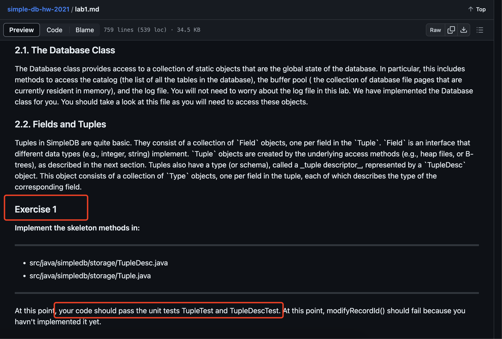

## 简单 DB 实战 

### 1.引言    
在 Github 中存在大量名为`SimpleDB`的仓库，后续了解到是`6.830/6.814: Database Systems (http://db.lcs.mit.edu/6.5830/2021/assign.php)` 课程，该课程介绍如下： 
```bash 
Description

This course relies on primary readings from the database community to introduce graduate students to the foundations of database systems, focusing on basics such as the relational algebra and data model, schema normalization, query optimization, and transactions. It is designed for students who have taken 6.033 (or equivalent); no prior database experience is assumed though students who have taken an undergraduate course in databases are encouraged to attend.

Classes consist of lectures and discussions based on readings from the database literature. Grades in 6.830 are assigned based on a semester long project, as well as two exams and 7 assignments -- 4 labs and 3 problem sets -- of varying length. Grades in 6.814 are based on the same quizzes and assigments as 6.830, except that students may opt to do 2 additional labs in place of the final project. For more information about the readings and assignments, use the links at the top of the page. 
```

这对个人的 DB实践来说，挺不错的一次学习。所以跟着它的 Lab1~Lab6 学习实践。      

### 2.对 MIT6.830 Database Systems 2021 理解  
了解它，如何参与它，本人也确实花了点时间，后面也了解到学校提供了 Github 仓库，但里面的代码大多数是需要你`填空`。 接下来，就详细介绍如何参与进来。   

#### 2.1 了解课程内容 
访问：http://db.lcs.mit.edu/6.5830/2021/assign.php， 查看 `Lecture Slides `章节，列表的右侧都提供了 PDF、PPT、Video（视频部分可在 YouTube 或者 Bilibili观看）。 

**Labs**章节，主要是介绍实践部分, 可分别访问 Github 文档, `特别注意：别忽略这些 md文档，若英语不好，请自行使用翻译软件查看`。因为它介绍了如何参与进去。     

#### 2.2 你要做的   
你需要做的事：  
1）使用 git，克隆仓库代码到本地，项目使用的 Ant 依赖管理，可根据自己理解改成 Maven项目。  
2）阅读每个 Lab md文档，了解需要你做的事情。   
3）什么才是结束。每个练习，仓库都提供对应的单元测试，编写代码后，你首先要确保的是`对应的单元测试能通过`。 那单元测试的case 谁提供？ 可通过仓库中了解下，这块学校已提供好这些，`我们仅仅做的是让它们都能通过测试`。  

  

>在使用 maven 搭建 SimpleDB 项目时，因官网仓库（https://github.com/MIT-DB-Class/simple-db-hw-2021）提供的源码依赖的 lib版本比较老，会存在手动添加 lib操作。             

### 3.Lab     
开始动手吧!!!  谨记，跑通单元测试， 所以，`代码怎么写，要看单元测试怎么测。`        


refer       
1.http://db.lcs.mit.edu/6.5830/2021/assign.php      
2.https://zhuanlan.zhihu.com/p/402325847?utm_id=0       
