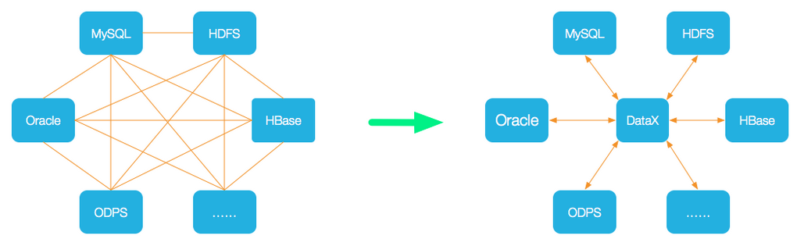
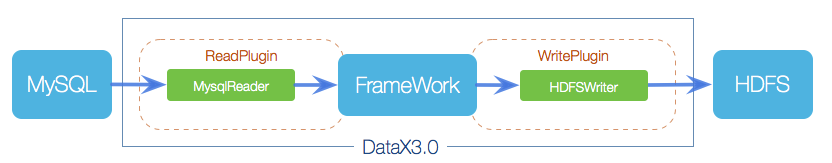
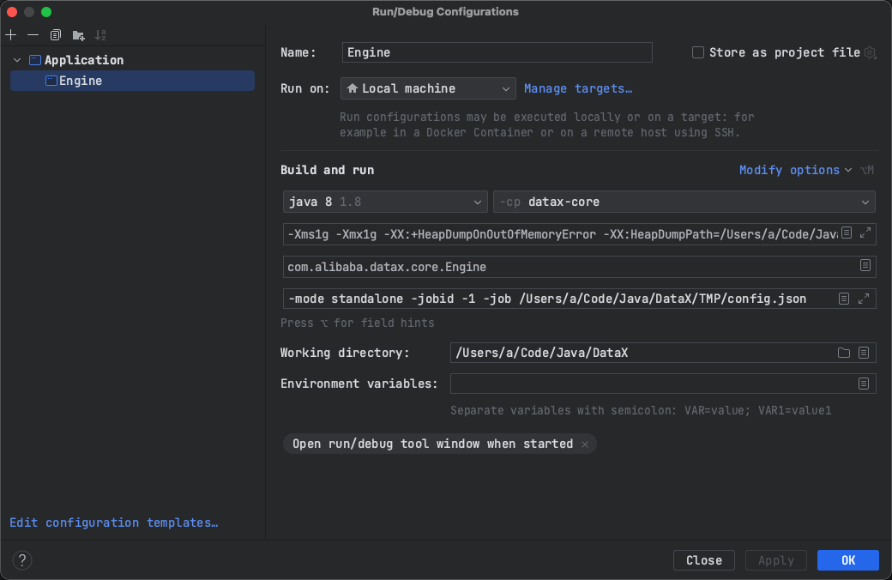

## DataX 调试环境搭建   

>DataX branch: master  

### 介绍    
摘自官网（https://github.com/alibaba/DataX/blob/master/introduction.md）    
DataX 是一个异构数据源离线同步工具，致力于实现包括关系型数据库(MySQL、Oracle等)、HDFS、Hive、ODPS、HBase、FTP等各种异构数据源之间稳定高效的数据同步功能。     
   

* 设计理念   
为了解决异构数据源同步问题，DataX将复杂的网状的同步链路变成了星型数据链路，DataX作为中间传输载体负责连接各种数据源。当需要接入一个新的数据源的时候，只需要将此数据源对接到DataX，便能跟已有的数据源做到无缝数据同步。       

### DataX3.0框架设计 
    

DataX本身作为离线数据同步框架，采用Framework + plugin架构构建。将数据源读取和写入抽象成为Reader/Writer插件，纳入到整个同步框架中。          

* Reader：Reader为数据采集模块，负责采集数据源的数据，将数据发送给Framework。           
* Writer： Writer为数据写入模块，负责不断向Framework取数据，并将数据写入到目的端。              
* Framework：Framework用于连接reader和writer，作为两者的数据传输通道，并处理缓冲，流控，并发，数据转换等核心技术问题。              

### DataX3.0核心架构  
DataX 3.0 开源版本支持单机多线程模式完成同步作业运行，本小节按一个DataX作业生命周期的时序图，从整体架构设计非常简要说明DataX各个模块相互关系。      
**核心模块介绍：**
1.DataX完成单个数据同步的作业，我们称之为Job，DataX接受到一个Job之后，将启动一个进程来完成整个作业同步过程。DataX Job模块是单个作业的中枢管理节点，承担了数据清理、子任务切分(将单一作业计算转化为多个子Task)、TaskGroup管理等功能。        
2.DataXJob启动后，会根据不同的源端切分策略，将Job切分成多个小的Task(子任务)，以便于并发执行。Task便是DataX作业的最小单元，每一个Task都会负责一部分数据的同步工作。          
3.切分多个Task之后，DataX Job会调用Scheduler模块，根据配置的并发数据量，将拆分成的Task重新组合，组装成TaskGroup(任务组)。每一个TaskGroup负责以一定的并发运行完毕分配好的所有Task，默认单个任务组的并发数量为5。     
4.每一个Task都由TaskGroup负责启动，Task启动后，会固定启动Reader—>Channel—>Writer的线程来完成任务同步工作。      
5.DataX作业运行起来之后， Job监控并等待多个TaskGroup模块任务完成，等待所有TaskGroup任务完成后Job成功退出。否则，异常退出，进程退出值非0                 

**DataX调度流程：**     
举例来说，用户提交了一个DataX作业，并且配置了20个并发，目的是将一个100张分表的mysql数据同步到odps里面。 DataX的调度决策思路是：     
1.DataXJob根据分库分表切分成了100个Task。           
2.根据20个并发，DataX计算共需要分配4个TaskGroup。         
3.4个TaskGroup平分切分好的100个Task，每一个TaskGroup负责以5个并发共计运行25个Task。           

### DataX 3.0六大核心优势       

#### 可靠的数据质量监控 
* 完美解决数据传输个别类型失真问题          
DataX旧版对于部分数据类型(比如时间戳)传输一直存在毫秒阶段等数据失真情况，新版本DataX3.0已经做到支持所有的强数据类型，每一种插件都有自己的数据类型转换策略，让数据可以完整无损的传输到目的端。             

* 提供作业全链路的流量、数据量�运行时监控           
DataX3.0运行过程中可以将作业本身状态、数据流量、数据速度、执行进度等信息进行全面的展示，让用户可以实时了解作业状态。并可在作业执行过程中智能判断源端和目的端的速度对比情况，给予用户更多性能排查信息。            

* 提供脏数据探测            
在大量数据的传输过程中，必定会由于各种原因导致很多数据传输报错(比如类型转换错误)，这种数据DataX认为就是脏数据。DataX目前可以实现脏数据精确过滤、识别、采集、展示，为用户提供多种的脏数据处理模式，让用户准确把控数据质量大关！

#### 丰富的数据转换功能
DataX作为一个服务于大数据的ETL工具，除了提供数据快照搬迁功能之外，还提供了丰富数据转换的功能，让数据在传输过程中可以轻松完成数据脱敏，补全，过滤等数据转换功能，另外还提供了自动groovy函数，让用户自定义转换函数。详情请看DataX3的transformer详细介绍。         

#### 精准的速度控制 
还在为同步过程对在线存储压力影响而担心吗？新版本DataX3.0提供了包括通道(并发)、记录流、字节流三种流控模式，可以随意控制你的作业速度，让你的作业在库可以承受的范围内达到最佳的同步速度。          
```
"speed": {
   "channel": 5,
   "byte": 1048576,
   "record": 10000
}
```

#### 强劲的同步性能 
DataX3.0每一种读插件都有一种或多种切分策略，都能将作业合理切分成多个Task并行执行，单机多线程执行模型可以让DataX速度随并发成线性增长。在源端和目的端性能都足够的情况下，单个作业一定可以打满网卡。另外，DataX团队对所有的已经接入的插件都做了极致的性能优化，并且做了完整的性能测试。                

#### 健壮的容错机制 
DataX作业是极易受外部因素的干扰，网络闪断、数据源不稳定等因素很容易让同步到一半的作业报错停止。因此稳定性是DataX的基本要求，在DataX 3.0的设计中，重点完善了框架和插件的稳定性。目前DataX3.0可以做到线程级别、进程级别(暂时未开放)、作业级别多层次局部/全局的重试，保证用户的作业稳定运行。          

* 线程内部重试      
DataX的核心插件都经过团队的全盘review，不同的网络交互方式都有不同的重试策略。           

* 线程级别重试          
目前DataX已经可以实现TaskFailover，针对于中间失败的Task，DataX框架可以做到整个Task级别的重新调度。          

#### 极简的使用体验  
* 易用  
下载即可用，支持linux和windows，只需要短短几步骤就可以完成数据的传输。          

* 详细      
DataX在运行日志中打印了大量信息，其中包括传输速度，Reader、Writer性能，进程CPU，JVM和GC情况等等。           
* 传输过程中打印传输速度、进度等            
* 传输过程中会打印进程相关的CPU、JVM等      
* 在任务结束之后，打印总体运行情况          

>开始调试环境搭建       
### clone 源码  
```shell
git clone git@github.com:alibaba/DataX.git  
```

### 导入Idea 编译、打包 
```shell
# 项目编译
mvn clean package -Dmaven.test.skip=true 

# 若需要打包成可执行包，执行以下命令
mvn -U clean package assembly:assembly -Dmaven.test.skip=true
```

### 安装 python
启动脚本依赖 python  

### 配置Debug环境   
参考 userGuid.md, DataX是使用 python datax.py xxxx的命令启动的， 为了在Idea中调试 datax，我们需要从 datax.py启动脚本中打印 完整的启动命令（包括参数）。 为了知晓，请参考以下几个步骤：  
1.修改 datax.py 脚本在 235行 添加`print('startCommand : ' + startCommand)`打印启动命令      
2.使用`mvn -U clean package assembly:assembly -Dmaven.test.skip=true` datax源码编译打包成可执行程序     
3.修改 打包后的 datax/conf/core.json 中关于 `byte` 参数，将 -1 改成 2000000 即可           
```json
"transport": {
    "channel": {
        "class": "com.alibaba.datax.core.transport.channel.memory.MemoryChannel",
        "speed": {
            "byte": 2000000, // 修改地方        
            "record": -1
        },
        "flowControlInterval": 20,
        "capacity": 512,
        "byteCapacity": 67108864
    },
    "exchanger": {
        "class": "com.alibaba.datax.core.plugin.BufferedRecordExchanger",
        "bufferSize": 32
    }
},
```
4.准备测试用例，`python /path/to/datax/bin/datax.py /path/to/your/job/config.json` 启动 datax           
```json
{
    "job": {
        "setting": {
            "speed": {
                "byte": 1048576
            }
        },
        "content": [
            {
                "reader": {
                    "name": "txtfilereader",
                    "parameter": {
                        "path": ["/Users/a/Code/Java/DataX/TMP/source.txt"],
                        "encoding": "UTF-8",
                        "fieldDelimiter": ","
                    }
                },
                "writer": {
                    "name": "txtfilewriter",
                    "parameter": {
                        "path": "/Users/a/Code/Java/DataX/TMP",
                        "fileName": "target",
                        "writeMode": "truncate",
                        "encoding": "UTF-8",
                        "fieldDelimiter": ","
                    }
                }
            }
        ]
    }
}
```

5.查看data.py 打印的启动命令：  
```
startCommand : java -server -Xms1g -Xmx1g -XX:+HeapDumpOnOutOfMemoryError -XX:HeapDumpPath=/Users/a/Code/Java/DataX/TMP/datax/log -Xms1g -Xmx1g -XX:+HeapDumpOnOutOfMemoryError -XX:HeapDumpPath=/Users/a/Code/Java/DataX/TMP/datax/log -Dloglevel=info -Dfile.encoding=UTF-8 -Dlogback.statusListenerClass=ch.qos.logback.core.status.NopStatusListener -Djava.security.egd=file:///dev/urandom -Ddatax.home=/Users/a/Code/Java/DataX/TMP/datax -Dlogback.configurationFile=/Users/a/Code/Java/DataX/TMP/datax/conf/logback.xml -classpath /Users/a/Code/Java/DataX/TMP/datax/lib/*:.  -Dlog.file.name=ataX_TMP_config_json com.alibaba.datax.core.Engine -mode standalone -jobid -1 -job /Users/a/Code/Java/DataX/TMP/config.json     
```

6.根据启动命令配置 Idea 调试    
如何配置启动：  
          


### 执行 com.alibaba.datax.core.Engine 启动类           
调试 Engine#main()方法即可。           

refer       
1.https://github.com/alibaba/DataX/blob/master/userGuid.md     
2.https://github.com/alibaba/DataX/blob/master/introduction.md              
3.https://www.cnblogs.com/xujq/p/16953054.html                              

