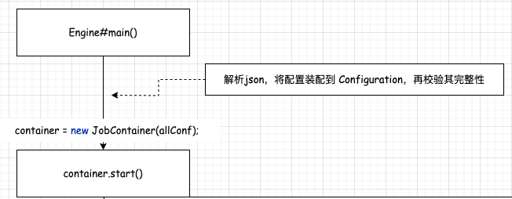

## 了解 DataX Job 启动流程      

### 引言    
上一篇 Blog《调试环境搭建》介绍了 DataX 的架构设计和核心优势，为了更深入了解它的实现机制，本篇主要通过 `MySQL 2 MySQL` 案例来讲解 DataX Job 启动流程。   

### 准备工作 
1.创建 Source yzhou_source_test01 和 Sink yzhou_sink_test01 两张表，后续将 yzhou_source_test01 数据 同步到 yzhou_sink_test01 去， 以下是DDL：    
```sql
# Source yzhou_source_test01 Table
create table yzhou_source_test01
(
    id          int auto_increment
        primary key,
    address     varchar(100) null,
    name        varchar(100) null,
    ext_field01 varchar(100) null
); 

# Sink yzhou_sink_test01 Table
create table yzhou_sink_test01
(
    id          int auto_increment
        primary key,
    address     varchar(100) null,
    name        varchar(100) null,
    ext_field01 varchar(100) null
); 
``` 
>区分 Source 和 Sink 表名，在调试过程较容易通过变量来区分行为。        

2.json 配置介绍
>注意 json配置 关于 content部分需查看 各自 Source ，Sink 的配置, 请查看 `https://github.com/alibaba/DataX`的 `Support Data Channels` 文档。   

示例 MySQL2MySQL.json, 具体配置文件内容如下：  
  
```json
{
    "job": {
        "setting": {
            "speed": {
                "channel": 5,
                "byte": 1048576
            },
            "errorLimit": {
                "record": 0,
                "percentage": 0.02
            }
        },
        "content": [
            {
                "reader": {
                    "name": "mysqlreader",
                    "parameter": {
                        "username": "root",
                        "password": "12345678",
                        "connection": [
                            {
                                "table": ["yzhou_source_test01"],
                                "jdbcUrl": ["jdbc:mysql://localhost:3306/datax_source"]
                            }
                        ],
                        "column": ["id", "name", "address", "ext_field01"]
                    }
                },
                "writer": {
                    "name": "mysqlwriter",
                    "parameter": {
                        "username": "root",
                        "password": "12345678",
                        "writeMode": "insert",
                        "column": ["id", "name", "address", "ext_field01"],
                        "session": [
                            "set session sql_mode='ANSI'"
                        ],
                        "preSql": [
                            "truncate table yzhou_sink_test01"
                        ],
                        "postSql": [
                            "optimize table yzhou_sink_test01"
                        ],
                        "connection": [
                            {
                                "table": ["yzhou_sink_test01"],
                                "jdbcUrl": "jdbc:mysql://localhost:3306/datax_sink"
                            }
                        ]
                    }
                }
            }
        ]
    }
}
```

3.参考上一篇 Blog《调试环境搭建》, 使用 `python /path/to/datax/bin/datax.py /path/to/your/job/mysql2mysql.json` 命令，打印出 java 的启动命令，如下所示：    
```shell
startCommand : java -server -Xms1g -Xmx1g -XX:+HeapDumpOnOutOfMemoryError -XX:HeapDumpPath=/Users/a/Code/Java/DataX/TMP/datax/log -Xms1g -Xmx1g -XX:+HeapDumpOnOutOfMemoryError -XX:HeapDumpPath=/Users/a/Code/Java/DataX/TMP/datax/log -Dloglevel=info -Dfile.encoding=UTF-8 -Dlogback.statusListenerClass=ch.qos.logback.core.status.NopStatusListener -Djava.security.egd=file:///dev/urandom -Ddatax.home=/Users/a/Code/Java/DataX/TMP/datax -Dlogback.configurationFile=/Users/a/Code/Java/DataX/TMP/datax/conf/logback.xml -classpath /Users/a/Code/Java/DataX/TMP/datax/lib/*:.  -Dlog.file.name=TMP_mysql2mysql_json com.alibaba.datax.core.Engine -mode standalone -jobid -1 -job /Users/a/Code/Java/DataX/TMP/mysql2mysql.json
```

根据上面 `startCommand` 配置 Idea 的调试表单。  

### DataX Job 启动流程（MySQL 2 MySQL）    
以 `Engine#main()` 为入口，对 `mysql2mysql.json` 进行`Configuration`实体类的转换，且校验 config的完整性， 进入 `JobContainer#start()`。         
    

```java
/**
 * jobContainer主要负责的工作全部在start()里面，包括init、prepare、split、scheduler、
 * post以及destroy和statistics
 */
@Override
public void start() {
    LOG.info("DataX jobContainer starts job.");

    boolean hasException = false;
    boolean isDryRun = false;
    try {
        this.startTimeStamp = System.currentTimeMillis();
        isDryRun = configuration.getBool(CoreConstant.DATAX_JOB_SETTING_DRYRUN, false);
        if(isDryRun) {
            LOG.info("jobContainer starts to do preCheck ...");
            this.preCheck();
        } else {
            userConf = configuration.clone();
            LOG.debug("jobContainer starts to do preHandle ...");
            this.preHandle();

            LOG.debug("jobContainer starts to do init ...");
            this.init();
            LOG.info("jobContainer starts to do prepare ...");
            this.prepare();
            LOG.info("jobContainer starts to do split ...");
            this.totalStage = this.split();
            LOG.info("jobContainer starts to do schedule ...");
            this.schedule();
            LOG.debug("jobContainer starts to do post ...");
            this.post();

            LOG.debug("jobContainer starts to do postHandle ...");
            this.postHandle();
            LOG.info("DataX jobId [{}] completed successfully.", this.jobId);

            this.invokeHooks();
        }
    } catch (Throwable e) {
        LOG.error("Exception when job run", e);

        hasException = true;

        if (e instanceof OutOfMemoryError) {
            this.destroy();
            System.gc();
        }


        if (super.getContainerCommunicator() == null) {
            // 由于 containerCollector 是在 scheduler() 中初始化的，所以当在 scheduler() 之前出现异常时，需要在此处对 containerCollector 进行初始化

            AbstractContainerCommunicator tempContainerCollector;
            // standalone
            tempContainerCollector = new StandAloneJobContainerCommunicator(configuration);

            super.setContainerCommunicator(tempContainerCollector);
        }

        Communication communication = super.getContainerCommunicator().collect();
        // 汇报前的状态，不需要手动进行设置
        // communication.setState(State.FAILED);
        communication.setThrowable(e);
        communication.setTimestamp(this.endTimeStamp);

        Communication tempComm = new Communication();
        tempComm.setTimestamp(this.startTransferTimeStamp);

        Communication reportCommunication = CommunicationTool.getReportCommunication(communication, tempComm, this.totalStage);
        super.getContainerCommunicator().report(reportCommunication);

        throw DataXException.asDataXException(
                FrameworkErrorCode.RUNTIME_ERROR, e);
    } finally {
        if(!isDryRun) {

            this.destroy();
            this.endTimeStamp = System.currentTimeMillis();
            if (!hasException) {
                //最后打印cpu的平均消耗，GC的统计
                VMInfo vmInfo = VMInfo.getVmInfo();
                if (vmInfo != null) {
                    vmInfo.getDelta(false);
                    LOG.info(vmInfo.totalString());
                }

                LOG.info(PerfTrace.getInstance().summarizeNoException());
                this.logStatistics();
            }
        }
    }
}
```