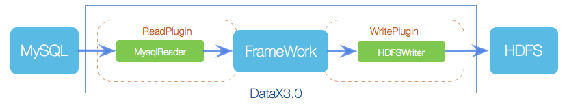
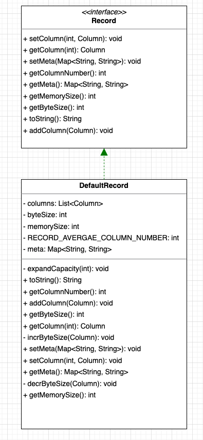
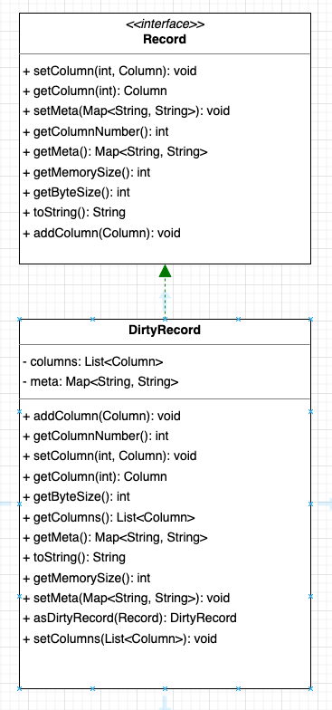

## DataX 整体架构   

>DataX branch: master   
该篇Blog 摘要其他blog，具体请参考 refer部分		

### 简介
DataX本身作为离线数据同步框架，采用Framework + plugin架构构建。将数据源读取和写入抽象成为Reader/Writer插件，纳入到整个同步框架中。			
			

	Reader：Reader�为数据采集模块，负责采集数据源的数据，将数据发送给Framework。	
    Writer： Writer为数据写入模块，负责不断向Framework取数据，并将数据写入到目的端。		
    Framework：Framework用于连接reader和writer，作为两者的数据传输通道，并处理缓冲，流控，并发，数据转换等核心技术问题。		


### 数据统一抽象    
DataX作为一款高性能的异构数据源同步工具，要解决的第一个难点是异构数据基本单位的统一抽象，为此，DataX将每一条数据全部抽象为Record，每一条Record中包含了多个Column，具体代码实现如下：    
**Record.java**
```java
// 数据抽象接口，一条数据将具有以下特性
public interface Record {
    // 增加一列
	public void addColumn(Column column);
    // 设置一列
	public void setColumn(int i, final Column column);
    // 获取某一列
	public Column getColumn(int i);

	public String toString();
    // 获取列数
	public int getColumnNumber();
    // 获取数据占用字节数，单位为byte
	public int getByteSize();
    // 获取数据占用内存数，指的是对象头占用的内存， 单位为byte
	public int getMemorySize();

	public void setMeta(Map<String, String> meta);

	public Map<String, String> getMeta();

}
```     

**Column.java** 
```java
public abstract class Column {
    // 列类型
	private Type type;
    // 列值
	private Object rawData;
    // 列占用的字节数   
	private int byteSize;

	public Column(final Object object, final Type type, int byteSize) {
		this.rawData = object;
		this.type = type;
		this.byteSize = byteSize;
	}

	public Object getRawData() {
		return this.rawData;
	}

	public Type getType() {
		return this.type;
	}

	public int getByteSize() {
		return this.byteSize;
	}

	protected void setType(Type type) {
		this.type = type;
	}

	protected void setRawData(Object rawData) {
		this.rawData = rawData;
	}

	protected void setByteSize(int byteSize) {
		this.byteSize = byteSize;
	}

	public abstract Long asLong();

	public abstract Double asDouble();

	public abstract String asString();

	public abstract Date asDate();
	
	public abstract Date asDate(String dateFormat);

	public abstract byte[] asBytes();

	public abstract Boolean asBoolean();

	public abstract BigDecimal asBigDecimal();

	public abstract BigInteger asBigInteger();

	@Override
	public String toString() {
		return JSON.toJSONString(this);
	}

	public enum Type {
		BAD, NULL, INT, LONG, DOUBLE, STRING, BOOL, DATE, BYTES
	}
}
``` 
在基于这一层抽象的基础上，DataX对于Record有三种不同的实现，分别是：     
* DefaultRecord: 异构数据源传输时的成功记录     
        

* DirtyRecord: 异构数据源之间传输时的失败记录，特指脏数据   
            

以上便是DataX中基本的传输子单位，无论是reader插件和writer插件都是将原始数据源的每一条数据转换成为以上的对象。       

### main()入口执行逻辑	  
在了解完DataX中基本的传输单位，请参考上一篇Blog "调试环境搭建.md" 了解 DataX启动main 入口，下面会梳理它的执行逻辑		
**main() 入口**
```java
public static void main(String[] args) throws Exception {
	int exitCode = 0;
	try {
		Engine.entry(args);
	} catch (Throwable e) {
		exitCode = 1;
		LOG.error("\n\n经DataX智能分析,该任务最可能的错误原因是:\n" + ExceptionTracker.trace(e));

		if (e instanceof DataXException) {
			DataXException tempException = (DataXException) e;
			ErrorCode errorCode = tempException.getErrorCode();
			if (errorCode instanceof FrameworkErrorCode) {
				FrameworkErrorCode tempErrorCode = (FrameworkErrorCode) errorCode;
				exitCode = tempErrorCode.toExitValue();
			}
		}

		System.exit(exitCode);
	}
	System.exit(exitCode);
}
```
由main()可知，一切都是从Engine.entry(args)这个方法开始，接下来分析一下这个方法究竟做了哪些工作：	
1.命令行解析参数		
**Engine#entry()**		
```java
public static void entry(final String[] args) throws Throwable {
	Options options = new Options();
	options.addOption("job", true, "Job config.");
	options.addOption("jobid", true, "Job unique id.");
	options.addOption("mode", true, "Job runtime mode.");

	BasicParser parser = new BasicParser();
	CommandLine cl = parser.parse(options, args);

	String jobPath = cl.getOptionValue("job");

	// 如果用户没有明确指定jobid, 则 datax.py 会指定 jobid 默认值为-1
	String jobIdString = cl.getOptionValue("jobid");
	RUNTIME_MODE = cl.getOptionValue("mode");

	Configuration configuration = ConfigParser.parse(jobPath);	
	
	......
}	
```
* job：job json路径		
* jobid：当前job的id，如果用户未显式指定，那么将会被置为-1			
* mode：当前job的运行模式，当前DataX开源版本只支持Standalone模式		

2.解析配置，ConfigParser.parse(jobPath)，往配置中加入系统默认项，用户只提供job部分，补上其余common core entry job plugin配置项			

3.打印当前jvm虚拟机信息		
```java
//打印vmInfo
VMInfo vmInfo = VMInfo.getVmInfo();
if (vmInfo != null) {
	LOG.info(vmInfo.toString());
}
```	

4.打印当前配置		
```java
LOG.info("\n" + Engine.filterJobConfiguration(configuration) + "\n");

LOG.debug(configuration.toJSON());		
```

5.配置校验		
```java
ConfigurationValidate.doValidate(configuration);		
```

6.启动任务	
```java
Engine engine = new Engine();
engine.start(configuration);
```	

### 任务执行逻辑	
此时程序进入到了Engine.start(configuration)的执行流程，在这一步中经历以下环节：		
1.绑定Column转换格式，这一步会在配置中指定以下信息：	
```java
public void start(Configuration allConf) {

	// 绑定column转换信息
	ColumnCast.bind(allConf);
```
* 字符串转换格式			
* 日期转换格式		
* 字节编码格式		

2.初始化PluginLoader，PluginLoader可以理解是所有数据同步插件的统一加载器，在这一步中实际上是任务将当前的任务配置赋值给了PluginLoader一份：			
```java
/**
 * 初始化PluginLoader，可以获取各种插件配置
 */
LoadUtil.bind(allConf);		
```

3.实例化任务容器，判断配置中`core.container.model`是job还是jobGroup，如果是job，那么实例化JobContainer，如果是jobGroup实例化TaskGroupContainer			
```java
boolean isJob = !("taskGroup".equalsIgnoreCase(allConf
			.getString(CoreConstant.DATAX_CORE_CONTAINER_MODEL)));
	//JobContainer会在schedule后再行进行设置和调整值
	int channelNumber =0;
	AbstractContainer container;
	long instanceId;
	int taskGroupId = -1;
	if (isJob) {
		allConf.set(CoreConstant.DATAX_CORE_CONTAINER_JOB_MODE, RUNTIME_MODE);
		container = new JobContainer(allConf);
		instanceId = allConf.getLong(
				CoreConstant.DATAX_CORE_CONTAINER_JOB_ID, 0);

	} else {
		container = new TaskGroupContainer(allConf);
		instanceId = allConf.getLong(
				CoreConstant.DATAX_CORE_CONTAINER_JOB_ID);
		taskGroupId = allConf.getInt(
				CoreConstant.DATAX_CORE_CONTAINER_TASKGROUP_ID);
		channelNumber = allConf.getInt(
				CoreConstant.DATAX_CORE_CONTAINER_TASKGROUP_CHANNEL);
	}
```

4.初始化性能追踪器，使用单例模式，一个jvm进程中只存在一个PerfTrace			
```java	
//缺省打开perfTrace
boolean traceEnable = allConf.getBool(CoreConstant.DATAX_CORE_CONTAINER_TRACE_ENABLE, true);
boolean perfReportEnable = allConf.getBool(CoreConstant.DATAX_CORE_REPORT_DATAX_PERFLOG, true);

//standalone模式的 datax shell任务不进行汇报
if(instanceId == -1){
	perfReportEnable = false;
}

Configuration jobInfoConfig = allConf.getConfiguration(CoreConstant.DATAX_JOB_JOBINFO);
//初始化PerfTrace
PerfTrace perfTrace = PerfTrace.getInstance(isJob, instanceId, taskGroupId, traceEnable);
```	

5.启动容器	
```java
container.start();
```	

### 容器执行逻辑	
任务容器被启动后，会执行任务生命周期的每一个阶段 	 				    
1.preHandle：用户可配置任务处理前的前置处理逻辑，这个前置处理逻辑处于writer或者reader中      
2.init：任务初始化阶段，初始化reader和writer（使用自定义的classLoader进行类加载），调用reader和writer的init()方法  
3.prepare：任务准备阶段，实际上调用reader和writer的prepare()方法  
4.split：任务分片，调整channel数，其实也就是任务的并发  
	a.判断是否设置了字节限制job.setting.speed.byte，如果是，根据字节限制配置计算channel数量  
    b.判断是否设置了条数限制job.setting.speed.record，如果是，根据条数限制配置计算channel数量  
    c.取以上1 2步的最小值  
    d.如果1 2步都没有设置，取配置中的job.setting.speed.channel来确定channel数量			
    e.调整channel数量  
    f.根据channel数量切分configuration，包括readerConfig和writerConfig，切分逻辑在每个插件中具体实现的，在切分好配置之后会将配置覆盖进 job.content中  
5.schedule：任务调度执行阶段，根据第四步中确定的并发数进行任务调度工作  
    a.根据上面的split中算出的channel数，设置taskGroup的数量，默认一个taskGroup中运行5个channel，切分configuration，为每个taskGroup创建自己的configuration  
    b.开始对taskGroupConfigurations进行调度，底层使用线程池，通过taskGroup的数量来确定线程池的线程个数  
    c.启动线程，TaskGroupContainerRunner，每一个TaskGroupContainerRunner中包含了一个TaskGroupContainer，实际上执行任务核心逻辑的容器是TaskGroupContainer，TaskGroupContainer会为每个channel创建TaskExecutor，TaskExecutor是执行子任务的最小单位  
    d.while循环监控taskGroup运行状态，等待每个子任务完成和数据情况的上报，并收集  
6.post：任务执行结束后阶段  
    a.还原线程上下文类加载器  
    b.调用writer和reader的post方法  
7.postHandler：任务结束后后置处理逻辑，这个后置处理逻辑处于writer或者reader中  
8.invokeHooks：DataX预留的spi接口，用户可自定义spi插件来丰富整个同步任务的生命周期  
实际上我认为如果是一个数据任务执行的话，1和6阶段完全不必要存在，但是如果是任务之间DAG调度，这两个阶段就可以派上用场，是否阿里在这里阉割了DAG调度的功能，咱也不知道，就在这瞎猜猜而已  


### 总结	
从代码逻辑上看，DataX的代码流程是比较清晰且设计思路明确的，之所以它能够实现高效的异构数据源同步工作，总共实现了以下这么几点：  
1.实现了对数据的统一抽象  
2.实现了对作业生命周期的分割和管理  
3.实现了对作业的切片与任务的并发  
4.实现了对作业的全流程监控  


refer   
1.https://mp.weixin.qq.com/s?__biz=MzIxOTM5NjAzNA==&amp;mid=2247484594&amp;idx=1&amp;sn=49f0d1e28a19c1efed565279f776cf00&amp;chksm=97daa61fa0ad2f09173f22d20e24a05b7d60d4b019a1f3575d406d6cb2c8df251e85b2b05fd2&amp;scene=21#wechat_redirect            
