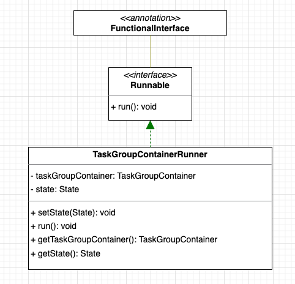
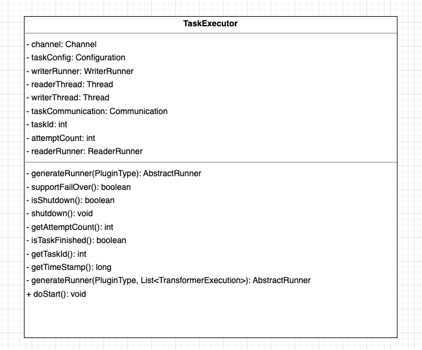

## DataX 调度流程	

>DataX branch: master           
该篇Blog 摘要其他blog，具体请参考 refer部分	        

### 调度流程解析    
### 确认最终任务需要的channel数量

>注意：channel是子任务数据传输的内存模型，后续文章将详细剖析，在这里可以暂且认为就是任务分片数量        

在任务周期中含有一个split()阶段，在这个阶段做了两件事情：       
1.通过配置项计算出建议的并发channel数量     
2.执行reader插件中的的实际切片逻辑，并根据数量切分configuration，请注意，这一步计算出的数量可能小于第一步配置的并发数       

所以在真正调度阶段，需要根据split()阶段中计算的两个值，计算出最终的channel数量     
**JobContainer#schedule()**
```java
private void schedule() {
    /**
     * 这里的全局speed和每个channel的速度设置为B/s
     */
    int channelsPerTaskGroup = this.configuration.getInt(
            CoreConstant.DATAX_CORE_CONTAINER_TASKGROUP_CHANNEL, 5);
    int taskNumber = this.configuration.getList(
            CoreConstant.DATAX_JOB_CONTENT).size();

    this.needChannelNumber = Math.min(this.needChannelNumber, taskNumber);
    PerfTrace.getInstance().setChannelNumber(needChannelNumber);
```

#### 通过channel数量分配taskGroup
在计算出真正需要的channel数量之后，根据每个TaskGroup应该被分配任务的个数，计算TaskGroup的个数：     
```java
/**
 * 通过获取配置信息得到每个taskGroup需要运行哪些tasks任务
 */

List<Configuration> taskGroupConfigs = JobAssignUtil.assignFairly(this.configuration,
        this.needChannelNumber, channelsPerTaskGroup);

LOG.info("Scheduler starts [{}] taskGroups.", taskGroupConfigs.size());
```     
任务的分配是由JobAssignUtil去进行，而且从方法名称assignFairly也可以知晓，分配的逻辑是公平分配，使用的Round Robin算法，轮询分配到每个TaskGroup中，在此就简单贴一下分配的核心源码：   
**JobAssignUtil#doAssign()**    
```java
/**
 * /**
 * 需要实现的效果通过例子来说是：
 * <pre>
 * a 库上有表：0, 1, 2
 * b 库上有表：3, 4
 * c 库上有表：5, 6, 7
 *
 * 如果有 4个 taskGroup
 * 则 assign 后的结果为：
 * taskGroup-0: 0,  4,
 * taskGroup-1: 3,  6,
 * taskGroup-2: 5,  2,
 * taskGroup-3: 1,  7
 *
 * </pre>
 */
private static List<Configuration> doAssign(LinkedHashMap<String, List<Integer>> resourceMarkAndTaskIdMap, Configuration jobConfiguration, int taskGroupNumber) {
    List<Configuration> contentConfig = jobConfiguration.getListConfiguration(CoreConstant.DATAX_JOB_CONTENT);

    Configuration taskGroupTemplate = jobConfiguration.clone();
    taskGroupTemplate.remove(CoreConstant.DATAX_JOB_CONTENT);

    List<Configuration> result = new LinkedList<Configuration>();

    List<List<Configuration>> taskGroupConfigList = new ArrayList<List<Configuration>>(taskGroupNumber);
    for (int i = 0; i < taskGroupNumber; i++) {
        taskGroupConfigList.add(new LinkedList<Configuration>());
    }

    int mapValueMaxLength = -1;

    List<String> resourceMarks = new ArrayList<String>();
    for (Map.Entry<String, List<Integer>> entry : resourceMarkAndTaskIdMap.entrySet()) {
        resourceMarks.add(entry.getKey());
        if (entry.getValue().size() > mapValueMaxLength) {
            mapValueMaxLength = entry.getValue().size();
        }
    }

    int taskGroupIndex = 0;
    for (int i = 0; i < mapValueMaxLength; i++) {
        for (String resourceMark : resourceMarks) {
            if (resourceMarkAndTaskIdMap.get(resourceMark).size() > 0) {
                int taskId = resourceMarkAndTaskIdMap.get(resourceMark).get(0);
                taskGroupConfigList.get(taskGroupIndex % taskGroupNumber).add(contentConfig.get(taskId));
                taskGroupIndex++;

                resourceMarkAndTaskIdMap.get(resourceMark).remove(0);
            }
        }
    }

    Configuration tempTaskGroupConfig;
    for (int i = 0; i < taskGroupNumber; i++) {
        tempTaskGroupConfig = taskGroupTemplate.clone();
        tempTaskGroupConfig.set(CoreConstant.DATAX_JOB_CONTENT, taskGroupConfigList.get(i));
        tempTaskGroupConfig.set(CoreConstant.DATAX_CORE_CONTAINER_TASKGROUP_ID, i);

        result.add(tempTaskGroupConfig);
    }

    return result;
}
``` 
ok，已经确定完了taskGroup的个数以及每个taskGroup的channel数，接下来就到了真正启动任务的环节：       
**JobContainer#schedule()**
```java
/**
 * schedule首先完成的工作是把上一步reader和writer split的结果整合到具体taskGroupContainer中,
 * 同时不同的执行模式调用不同的调度策略，将所有任务调度起来
 */
private void schedule() {
    /**
     * 这里的全局speed和每个channel的速度设置为B/s
     */
    int channelsPerTaskGroup = this.configuration.getInt(
            CoreConstant.DATAX_CORE_CONTAINER_TASKGROUP_CHANNEL, 5);
    int taskNumber = this.configuration.getList(
            CoreConstant.DATAX_JOB_CONTENT).size();

    this.needChannelNumber = Math.min(this.needChannelNumber, taskNumber);
    PerfTrace.getInstance().setChannelNumber(needChannelNumber);

    /**
     * 通过获取配置信息得到每个taskGroup需要运行哪些tasks任务
     */

    List<Configuration> taskGroupConfigs = JobAssignUtil.assignFairly(this.configuration,
            this.needChannelNumber, channelsPerTaskGroup);

    LOG.info("Scheduler starts [{}] taskGroups.", taskGroupConfigs.size());

    ExecuteMode executeMode = null;
    AbstractScheduler scheduler;
    try {
        executeMode = ExecuteMode.STANDALONE;
        scheduler = initStandaloneScheduler(this.configuration);

        //设置 executeMode
        for (Configuration taskGroupConfig : taskGroupConfigs) {
            taskGroupConfig.set(CoreConstant.DATAX_CORE_CONTAINER_JOB_MODE, executeMode.getValue());
        }

        if (executeMode == ExecuteMode.LOCAL || executeMode == ExecuteMode.DISTRIBUTE) {
            if (this.jobId <= 0) {
                throw DataXException.asDataXException(FrameworkErrorCode.RUNTIME_ERROR,
                        "在[ local | distribute ]模式下必须设置jobId，并且其值 > 0 .");
            }
        }

        LOG.info("Running by {} Mode.", executeMode);

        this.startTransferTimeStamp = System.currentTimeMillis();

        scheduler.schedule(taskGroupConfigs);

        this.endTransferTimeStamp = System.currentTimeMillis();
    } catch (Exception e) {
        LOG.error("运行scheduler 模式[{}]出错.", executeMode);
        this.endTransferTimeStamp = System.currentTimeMillis();
        throw DataXException.asDataXException(
                FrameworkErrorCode.RUNTIME_ERROR, e);
    }

    /**
     * 检查任务执行情况
     */
    this.checkLimit();
}

```

整个任务从scheduler.schedule(taskGroupConfigs)处被启动，在这个方法中，又调用了 startAllTaskGroup(configurations)：    
**ProcessInnerScheduler#startAllTaskGroup()**  
```java
@Override
public void startAllTaskGroup(List<Configuration> configurations) {
    this.taskGroupContainerExecutorService = Executors
            .newFixedThreadPool(configurations.size());

    for (Configuration taskGroupConfiguration : configurations) {
        TaskGroupContainerRunner taskGroupContainerRunner = newTaskGroupContainerRunner(taskGroupConfiguration);
        this.taskGroupContainerExecutorService.execute(taskGroupContainerRunner);
    }

    this.taskGroupContainerExecutorService.shutdown();
}
```     
实际上DataX底层对于每个taskGroup都启动了一个线程`TaskGroupContainerRunner`，采用线程池的方式实现并发操作  


### TaskGroupContainerRunner    
TaskGroupContainerRunner是线程子单位，作为最上层的封装，直接提交到线程池中执行：    
            

**TaskGroupContainerRunner.java**
```java
public class TaskGroupContainerRunner implements Runnable {

	private TaskGroupContainer taskGroupContainer;

	private State state;

	public TaskGroupContainerRunner(TaskGroupContainer taskGroup) {
		this.taskGroupContainer = taskGroup;
		this.state = State.SUCCEEDED;
	}

	@Override
	public void run() {
		try {
            Thread.currentThread().setName(
                    String.format("taskGroup-%d", this.taskGroupContainer.getTaskGroupId()));
            this.taskGroupContainer.start();
			this.state = State.SUCCEEDED;
		} catch (Throwable e) {
			this.state = State.FAILED;
			throw DataXException.asDataXException(
					FrameworkErrorCode.RUNTIME_ERROR, e);
		}
	}

	public TaskGroupContainer getTaskGroupContainer() {
		return taskGroupContainer;
	}

	public State getState() {
		return state;
	}

	public void setState(State state) {
		this.state = state;
	}
}
``` 
从代码上看，真正核心的并发子单位是TaskGroupContainer    

### TaskGroupContainer   
来到真正核心的TaskContainer中，这里真正启动了任务，TaskContainer主要做了以下事情：          
1.注册task  
**TaskGroupContainer#start()**      
```java
this.containerCommunicator.registerCommunication(taskConfigs);
```

2.启动task，每个子任务也就是最小的并发单位的执行器是TaskExecutor            
```java
TaskExecutor taskExecutor = new TaskExecutor(taskConfigForRun, attemptCount);
taskStartTimeMap.put(taskId, System.currentTimeMillis());
taskExecutor.doStart();
```

3.循环监控task状态，如果出现失败会进行重试      
```java
int attemptCount = 1;
TaskExecutor lastExecutor = taskFailedExecutorMap.get(taskId);
if(lastExecutor!=null){
    attemptCount = lastExecutor.getAttemptCount() + 1;
    long now = System.currentTimeMillis();
    long failedTime = lastExecutor.getTimeStamp();
    if(now - failedTime < taskRetryIntervalInMsec){  //未到等待时间，继续留在队列
        continue;
    }
    if(!lastExecutor.isShutdown()){ //上次失败的task仍未结束
        if(now - failedTime > taskMaxWaitInMsec){
            markCommunicationFailed(taskId);
            reportTaskGroupCommunication(lastTaskGroupContainerCommunication, taskCountInThisTaskGroup);
            throw DataXException.asDataXException(CommonErrorCode.WAIT_TIME_EXCEED, "task failover等待超时");
        }else{
            lastExecutor.shutdown(); //再次尝试关闭
            continue;
        }
    }else{
        LOG.info("taskGroup[{}] taskId[{}] attemptCount[{}] has already shutdown",
                this.taskGroupId, taskId, lastExecutor.getAttemptCount());
    }
}
```

### TaskExecutor

从这个类里面可以看见，做核心传输逻辑的变量是两个线程，一个写的线程，一个读的线程，在doStart方法中，启动了这两个线程：    
**TaskExecutor#doStart()**          
```java
public void doStart() {
    this.writerThread.start();

    // reader没有起来，writer不可能结束
    if (!this.writerThread.isAlive() || this.taskCommunication.getState() == State.FAILED) {
        throw DataXException.asDataXException(
                FrameworkErrorCode.RUNTIME_ERROR,
                this.taskCommunication.getThrowable());
    }

    this.readerThread.start();

    // 这里reader可能很快结束
    if (!this.readerThread.isAlive() && this.taskCommunication.getState() == State.FAILED) {
        // 这里有可能出现Reader线上启动即挂情况 对于这类情况 需要立刻抛出异常
        throw DataXException.asDataXException(
                FrameworkErrorCode.RUNTIME_ERROR,
                this.taskCommunication.getThrowable());
    }

}
```
至此，整个任务被完全启动了起来。            

### 总结    
DataX整个调度依赖于java底层线程池，它对任务进行分片后并将子任务使用Round Robin算法划分到各个任务组，以一个任务组为基本线程放进线程池并启动；同时一个子任务也包含两个线程去实现写读的流程，DataX能实现精准的流控在于它底层对分片的控制，至此，DataX的全部调度流程概括如下：          
1.根据流控、并发配置确定分片数量        
2.根据分片数量确定TaskGroup数量     
3.通过Round Robin算法分配task至TaskGroup        
4.启动TaskGroup     
5.每个TaskGroup启动多个TaskExecutor     
6.TaskExecutor启动ReaderThread和WriterThread        


refer	
1.https://mp.weixin.qq.com/s?__biz=MzIxOTM5NjAzNA==&mid=2247484630&idx=1&sn=d4dd62d4eb6e8e441d4762ff0c079041&chksm=97daa67ba0ad2f6d63fb857130e3fb1248718cb93cdb83572489a8fd248c879d3645bc5f301d&scene=178&cur_album_id=2372044552615706625#rd	

