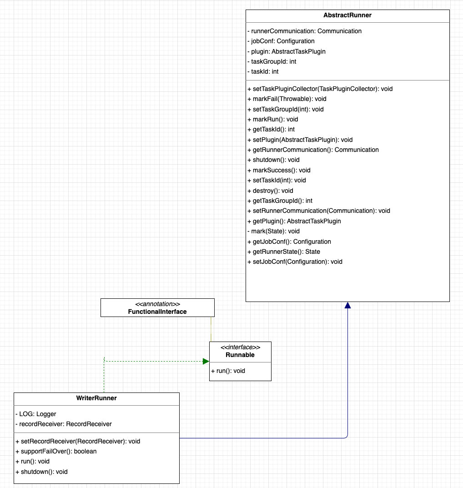
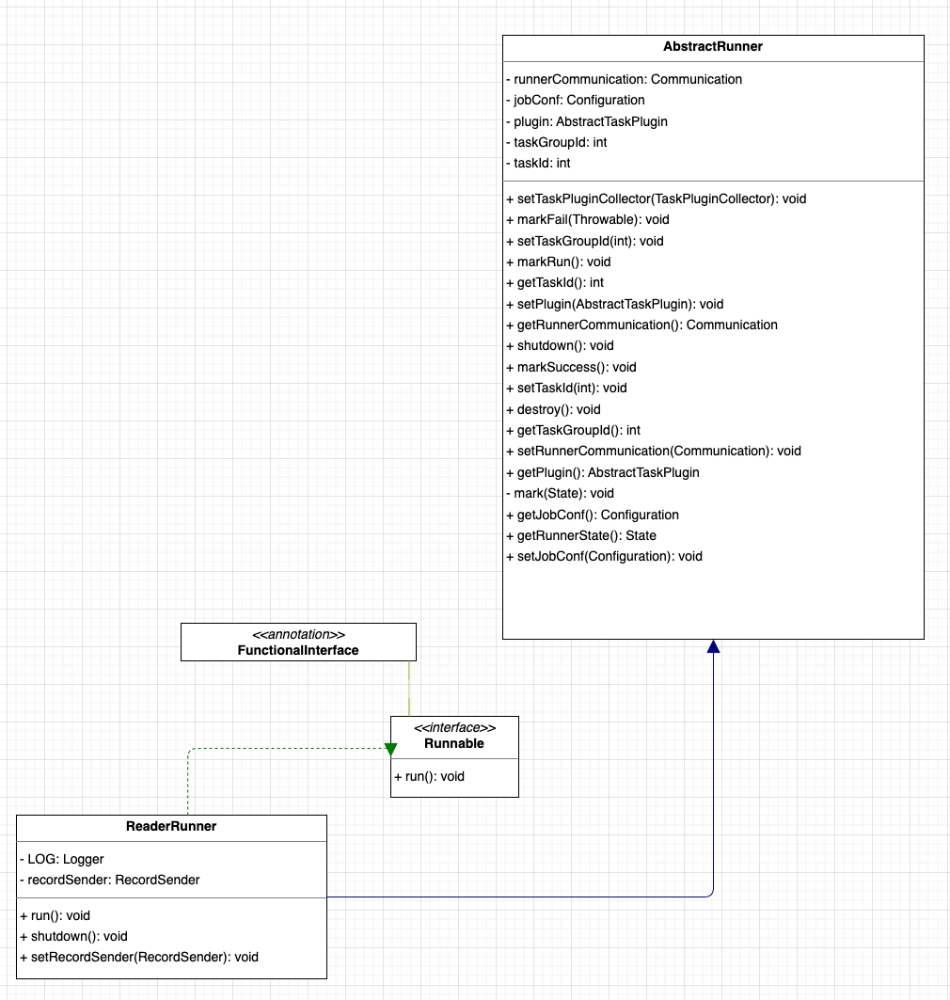
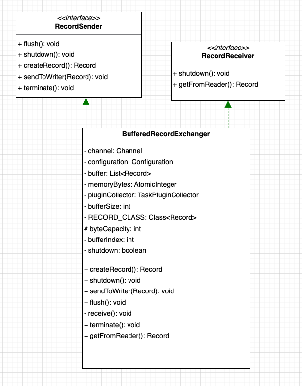
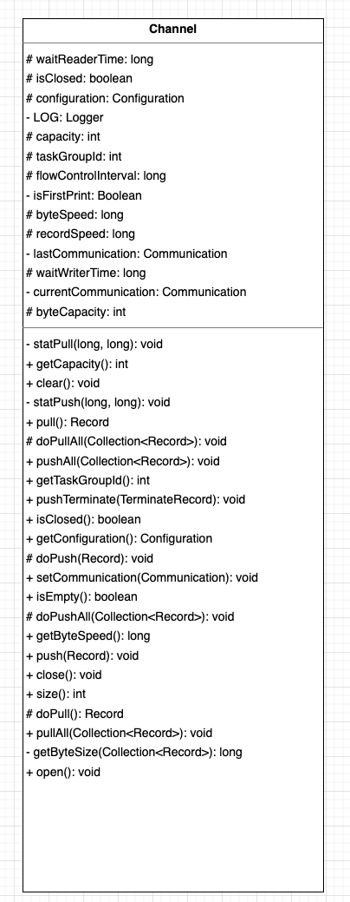
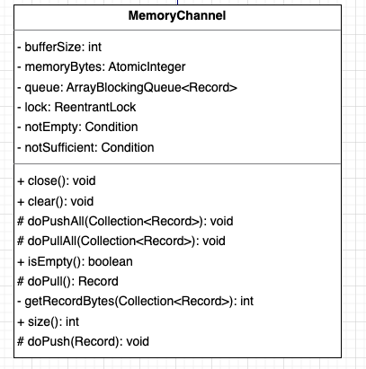

## DataX 数据传输  

>DataX branch: master   
该篇Blog 摘要其他blog，具体请参考 refer部分		    

### 引言
之前DataX Blog提到，DataX核心运行子单位是TaskExecutor，一个TaskExecutor中会拥有两个线程，分别是WriterThread和ReaderThread，这两个线程承担着整个数据传输的重任，所以今天整篇文章的重点将围绕这两个线程展开，如果读者阅读至此觉得概念晦涩难懂，请移步我之前的两篇文章去先了解一下整个DataX的原理和架构：          

### 线程的创建  
来到TaskGroupContainer源码中，找到TaskExecutor新建WriterThread和ReaderThread的地方：            
```java
/**
 * 生成writerThread
 */
writerRunner = (WriterRunner) generateRunner(PluginType.WRITER);
this.writerThread = new Thread(writerRunner,
        String.format("%d-%d-%d-writer",
                jobId, taskGroupId, this.taskId));
//通过设置thread的contextClassLoader，即可实现同步和主程序不通的加载器
this.writerThread.setContextClassLoader(LoadUtil.getJarLoader(
        PluginType.WRITER, this.taskConfig.getString(
                CoreConstant.JOB_WRITER_NAME)));

/**
 * 生成readerThread
 */
readerRunner = (ReaderRunner) generateRunner(PluginType.READER,transformerInfoExecs);
this.readerThread = new Thread(readerRunner,
        String.format("%d-%d-%d-reader",
                jobId, taskGroupId, this.taskId));
```
承载线程执行的Runner都是由generateRunner这个方法生成：      
```java
private AbstractRunner generateRunner(PluginType pluginType, List<TransformerExecution> transformerInfoExecs) {
    AbstractRunner newRunner = null;
    TaskPluginCollector pluginCollector;

    switch (pluginType) {
        case READER:
            newRunner = LoadUtil.loadPluginRunner(pluginType,
                    this.taskConfig.getString(CoreConstant.JOB_READER_NAME));
            newRunner.setJobConf(this.taskConfig.getConfiguration(
                    CoreConstant.JOB_READER_PARAMETER));

            pluginCollector = ClassUtil.instantiate(
                    taskCollectorClass, AbstractTaskPluginCollector.class,
                    configuration, this.taskCommunication,
                    PluginType.READER);

            RecordSender recordSender;
            if (transformerInfoExecs != null && transformerInfoExecs.size() > 0) {
                recordSender = new BufferedRecordTransformerExchanger(taskGroupId, this.taskId, this.channel,this.taskCommunication ,pluginCollector, transformerInfoExecs);
            } else {
                recordSender = new BufferedRecordExchanger(this.channel, pluginCollector);
            }

            ((ReaderRunner) newRunner).setRecordSender(recordSender);

            /**
             * 设置taskPlugin的collector，用来处理脏数据和job/task通信
             */
            newRunner.setTaskPluginCollector(pluginCollector);
            break;
        case WRITER:
            newRunner = LoadUtil.loadPluginRunner(pluginType,
                    this.taskConfig.getString(CoreConstant.JOB_WRITER_NAME));
            newRunner.setJobConf(this.taskConfig
                    .getConfiguration(CoreConstant.JOB_WRITER_PARAMETER));

            pluginCollector = ClassUtil.instantiate(
                    taskCollectorClass, AbstractTaskPluginCollector.class,
                    configuration, this.taskCommunication,
                    PluginType.WRITER);
            ((WriterRunner) newRunner).setRecordReceiver(new BufferedRecordExchanger(
                    this.channel, pluginCollector));
            /**
             * 设置taskPlugin的collector，用来处理脏数据和job/task通信
             */
            newRunner.setTaskPluginCollector(pluginCollector);
            break;
        default:
            throw DataXException.asDataXException(FrameworkErrorCode.ARGUMENT_ERROR, "Cant generateRunner for:" + pluginType);
    }

    newRunner.setTaskGroupId(taskGroupId);
    newRunner.setTaskId(this.taskId);
    newRunner.setRunnerCommunication(this.taskCommunication);

    return newRunner;
}
```     
代码虽有些冗余，但是我还是全部贴了出来，我认为这里对于整个流程的理解很重要，如果读者不愿意仔细研读，我在这里简单概括一下就是DataX使用自己定义的类加载器去加载对应插件防止出现jar包冲突的情况，同时为不同类型（Reader或Writer）的插件去初始化对应的内存交换模型，但这里还没有出现数据交换的相关信息，好消息是内存交换模型出现了，接下来我们将逐渐揭开数据传输的真正面纱。        

### WriterRunner与ReaderRunner

#### WriterRunner   
        
```java
@Override
public void run() {
    Validate.isTrue(this.recordReceiver != null);

    Writer.Task taskWriter = (Writer.Task) this.getPlugin();
    //统计waitReadTime，并且在finally end
    PerfRecord channelWaitRead = new PerfRecord(getTaskGroupId(), getTaskId(), PerfRecord.PHASE.WAIT_READ_TIME);
    try {
        channelWaitRead.start();
        LOG.debug("task writer starts to do init ...");
        PerfRecord initPerfRecord = new PerfRecord(getTaskGroupId(), getTaskId(), PerfRecord.PHASE.WRITE_TASK_INIT);
        initPerfRecord.start();
        taskWriter.init();
        initPerfRecord.end();

        LOG.debug("task writer starts to do prepare ...");
        PerfRecord preparePerfRecord = new PerfRecord(getTaskGroupId(), getTaskId(), PerfRecord.PHASE.WRITE_TASK_PREPARE);
        preparePerfRecord.start();
        taskWriter.prepare();
        preparePerfRecord.end();
        LOG.debug("task writer starts to write ...");

        PerfRecord dataPerfRecord = new PerfRecord(getTaskGroupId(), getTaskId(), PerfRecord.PHASE.WRITE_TASK_DATA);
        dataPerfRecord.start();
        taskWriter.startWrite(recordReceiver);

        dataPerfRecord.addCount(CommunicationTool.getTotalReadRecords(super.getRunnerCommunication()));
        dataPerfRecord.addSize(CommunicationTool.getTotalReadBytes(super.getRunnerCommunication()));
        dataPerfRecord.end();

        LOG.debug("task writer starts to do post ...");
        PerfRecord postPerfRecord = new PerfRecord(getTaskGroupId(), getTaskId(), PerfRecord.PHASE.WRITE_TASK_POST);
        postPerfRecord.start();
        taskWriter.post();
        postPerfRecord.end();

        super.markSuccess();
    } catch (Throwable e) {
        LOG.error("Writer Runner Received Exceptions:", e);
        super.markFail(e);
    } finally {
        LOG.debug("task writer starts to do destroy ...");
        PerfRecord desPerfRecord = new PerfRecord(getTaskGroupId(), getTaskId(), PerfRecord.PHASE.WRITE_TASK_DESTROY);
        desPerfRecord.start();
        super.destroy();
        desPerfRecord.end();
        channelWaitRead.end(super.getRunnerCommunication().getLongCounter(CommunicationTool.WAIT_READER_TIME));
    }
}
```     

在WriterRunner核心run方法中，主要进行了对Writer插件各个生命周期的调用和每个阶段的耗时统计，但最重要的是我们发现了WriterRunner开始写数据的入口：         
```java
taskWriter.startWrite(recordReceiver);
```

对于WriterThread取数据然后再写数据的媒介是这个神秘的recordReceiver，在上面创建线程的同时我们也发现了有代码会设置recordReceiver：        
```java
((WriterRunner) newRunner).setRecordReceiver(new BufferedRecordExchanger(
                    this.channel, pluginCollector));
```
综上所述，写线程的写操作核心依赖RecordReceiver      

#### ReaderRunner
       
```java
@Override
public void run() {
    assert null != this.recordSender;

    Reader.Task taskReader = (Reader.Task) this.getPlugin();

    //统计waitWriterTime，并且在finally才end。
    PerfRecord channelWaitWrite = new PerfRecord(getTaskGroupId(), getTaskId(), PerfRecord.PHASE.WAIT_WRITE_TIME);
    try {
        channelWaitWrite.start();

        LOG.debug("task reader starts to do init ...");
        PerfRecord initPerfRecord = new PerfRecord(getTaskGroupId(), getTaskId(), PerfRecord.PHASE.READ_TASK_INIT);
        initPerfRecord.start();
        taskReader.init();
        initPerfRecord.end();

        LOG.debug("task reader starts to do prepare ...");
        PerfRecord preparePerfRecord = new PerfRecord(getTaskGroupId(), getTaskId(), PerfRecord.PHASE.READ_TASK_PREPARE);
        preparePerfRecord.start();
        taskReader.prepare();
        preparePerfRecord.end();

        LOG.debug("task reader starts to read ...");
        PerfRecord dataPerfRecord = new PerfRecord(getTaskGroupId(), getTaskId(), PerfRecord.PHASE.READ_TASK_DATA);
        dataPerfRecord.start();
        taskReader.startRead(recordSender);
        recordSender.terminate();

        dataPerfRecord.addCount(CommunicationTool.getTotalReadRecords(super.getRunnerCommunication()));
        dataPerfRecord.addSize(CommunicationTool.getTotalReadBytes(super.getRunnerCommunication()));
        dataPerfRecord.end();

        LOG.debug("task reader starts to do post ...");
        PerfRecord postPerfRecord = new PerfRecord(getTaskGroupId(), getTaskId(), PerfRecord.PHASE.READ_TASK_POST);
        postPerfRecord.start();
        taskReader.post();
        postPerfRecord.end();
        // automatic flush
        // super.markSuccess(); 这里不能标记为成功，成功的标志由 writerRunner 来标志（否则可能导致 reader 先结束，而 writer 还没有结束的严重 bug）
    } catch (Throwable e) {
        LOG.error("Reader runner Received Exceptions:", e);
        super.markFail(e);
    } finally {
        LOG.debug("task reader starts to do destroy ...");
        PerfRecord desPerfRecord = new PerfRecord(getTaskGroupId(), getTaskId(), PerfRecord.PHASE.READ_TASK_DESTROY);
        desPerfRecord.start();
        super.destroy();
        desPerfRecord.end();

        channelWaitWrite.end(super.getRunnerCommunication().getLongCounter(CommunicationTool.WAIT_WRITER_TIME));

        long transformerUsedTime = super.getRunnerCommunication().getLongCounter(CommunicationTool.TRANSFORMER_USED_TIME);
        if (transformerUsedTime > 0) {
            PerfRecord transformerRecord = new PerfRecord(getTaskGroupId(), getTaskId(), PerfRecord.PHASE.TRANSFORMER_TIME);
            transformerRecord.start();
            transformerRecord.end(transformerUsedTime);
        }
    }
}
``` 

在ReaderRunner核心run方法中，主要进行了对Reader插件各个生命周期的调用和每个阶段的耗时统计，但最重要的是我们发现了ReaderRunner开始读数据的入口： 
```java
taskReader.startRead(recordSender);
```

对于ReaderThread写数据的媒介是这个神秘的recordSender，在上面创建线程的同时我们也发现了有代码会设置recordSender：    
```java
((ReaderRunner) newRunner).setRecordSender(recordSender);
```

综上所述，读线程的读操作核心依赖RecordSender ，读线程和写线程各自拥有着对应的内存交换模型去交换数据，所以接下来的研究核心将转向RecorderReceiver和RecordSender               


#### RecordReceiver     
```java
public interface RecordReceiver {

	public Record getFromReader();

	public void shutdown();
}
```     
打开RecordReceiver的源码，发现它是个接口，实际上实现形式有三种，从字面命名可以看出，有1对1交换实现，还有1对多缓存交换实现，在实际DataX代码中为提高性能使用的是BufferedRecordExchanger：     
```java
RecordSender recordSender;
if (transformerInfoExecs != null && transformerInfoExecs.size() > 0) {
    recordSender = new BufferedRecordTransformerExchanger(taskGroupId, this.taskId, this.channel,this.taskCommunication ,pluginCollector, transformerInfoExecs);
} else {
    recordSender = new BufferedRecordExchanger(this.channel, pluginCollector);
}

((ReaderRunner) newRunner).setRecordSender(recordSender);
```


#### RecordSender   
```java
public interface RecordSender {

	public Record createRecord();

	public void sendToWriter(Record record);

	public void flush();

	public void terminate();

	public void shutdown();
}
```     
和RecordReceiver一致，同样RecordSender也是一个接口，实际上实现形式和RecordSender一致，在实际DataX代码中为提高性能使用的是BufferedRecordExchanger：      
```java
((WriterRunner) newRunner).setRecordReceiver(new BufferedRecordExchanger(
        this.channel, pluginCollector));
```


#### BufferedRecordExchanger    
    
BufferedRecordExchanger实现了对应两个接口，而且在类中我们发现了之前提过的Channel内存模型对象，通过Channel内存模型对象在RecordSender和RecordReceiver之间交换数据，来仔细看一下对应的getFromReader()和sendToWriter(Record)方法：      
**BufferedRecordExchanger#sendToWriter()**
```java
@Override
public void sendToWriter(Record record) {
    if(shutdown){
        throw DataXException.asDataXException(CommonErrorCode.SHUT_DOWN_TASK, "");
    }

    Validate.notNull(record, "record不能为空.");

    if (record.getMemorySize() > this.byteCapacity) {
        this.pluginCollector.collectDirtyRecord(record, new Exception(String.format("单条记录超过大小限制，当前限制为:%s", this.byteCapacity)));
        return;
    }

    boolean isFull = (this.bufferIndex >= this.bufferSize || this.memoryBytes.get() + record.getMemorySize() > this.byteCapacity);
    if (isFull) {
        flush();
    }

    this.buffer.add(record);
    this.bufferIndex++;
    memoryBytes.addAndGet(record.getMemorySize());
}
```

```java
@Override
public void flush() {
    if(shutdown){
        throw DataXException.asDataXException(CommonErrorCode.SHUT_DOWN_TASK, "");
    }
    this.channel.pushAll(this.buffer);
    this.buffer.clear();
    this.bufferIndex = 0;
    this.memoryBytes.set(0);
}
```

发送过程逻辑很简单，一个很一般的buffer思路，生成数据先写入buffer，buffer满了统一写入到channel               
```java
@Override
public Record getFromReader() {
    if(shutdown){
        throw DataXException.asDataXException(CommonErrorCode.SHUT_DOWN_TASK, "");
    }
    boolean isEmpty = (this.bufferIndex >= this.buffer.size());
    if (isEmpty) {
        receive();
    }

    Record record = this.buffer.get(this.bufferIndex++);
    if (record instanceof TerminateRecord) {
        record = null;
    }
    return record;
}
``` 

```java
private void receive() {
    this.channel.pullAll(this.buffer);
    this.bufferIndex = 0;
    this.bufferSize = this.buffer.size();
}
``` 

读取过程逻辑同样很简单，先从buffer读，buffer空了从channel中再次读取     

### Channel 
由上文可知，Channel是数据存储的基本单位，用户可以根据不同需求去自定义实现这个规范：     
        

内存模型里定义了统计限速行为以及数据推拉行为，定义了核心的消费者生产者模型，在DataX源码中，目前开源了的只有一种Channel的模型实现 `MemoryChannel`        
        

比较核心的两个方法是doPush和doPull：    
**MemoryChannel#doPush() , MemoryChannel#doPull()**
```java
@Override
protected void doPush(Record r) {
    try {
        long startTime = System.nanoTime();
        this.queue.put(r);
        waitWriterTime += System.nanoTime() - startTime;
        memoryBytes.addAndGet(r.getMemorySize());
    } catch (InterruptedException ex) {
        Thread.currentThread().interrupt();
    }
}

@Override
protected Record doPull() {
    try {
        long startTime = System.nanoTime();
        Record r = this.queue.take();
        waitReaderTime += System.nanoTime() - startTime;
        memoryBytes.addAndGet(-r.getMemorySize());
        return r;
    } catch (InterruptedException e) {
        Thread.currentThread().interrupt();
        throw new IllegalStateException(e);
    }
}
``` 
由源码可知，doPull和doPush方法主要是通过queue对象进行数据的交换，实际上queue底层的实现是ArrayBlockQueue，push数据是调用queue的take方法 ，pull方法调用queue的take方法，至此，整个DataX数据交换流程结束。             

### 总结    
本篇文章我们从更细致的角度分析了Reader和Writer插件之间的数据交换流程和原理，总体概括一下，DataX实现并发数据传输和交换的特点如下：           
1.抽象统一数据内存模型，清晰明确的表达出一个保存数据的内存模型需要哪些功能      
2.抽象统一数据交换模型，清晰明确的表达出生产者消费者模型            
3.利用同一个抽象内存模型协调生产者和消费者之间的关系        
4.使用多线程实现读写异步执行        
5.合理利用缓存理论提高数据传输的性能            


