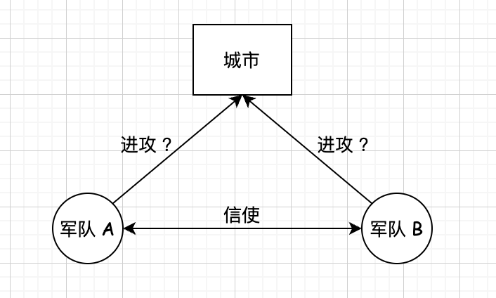

## 分布式算法 两个经典思想实验 两将军问题            

两将军问题(Two Generals'Problem) 是计算机领域中的一个思想实验，是指两支由不同的将军领导的军队，正准备进攻一座坚固的城市。军队在城市附近的两个山丘扎营，中间有一个山谷将两个山丘隔开,两个将军交流的唯一方法是派遣信使穿越山谷。然而,山谷被城市的守卫者占领,并且途经该山谷传递信息的信使有可能会被俘虏，如下图所示：      
  

这座城市防守坚固,`要想顺利占领它,两支军队必须同时进攻。如果同一时间仅一支军队进攻，将会战败`。两支军队的行动和行动结果的关系如下表所示。            

| 军队 A      | 军队 B |  结果  |
| :-------- | :--------| :-- |
| 不进攻  | 不进攻 |  无事发生   |
| 不进攻     |   进攻 |  军队 B 战败  |
| 进攻     |   不进攻 |  军队 A 战败  |
| 进攻     |   进攻 |  占领城市  |

因此，两位将军必须通过信使沟通并约定攻击时间，并且他们都必须确保另一位将军知道自己己同意了进攻计划。 但由于传递确认消息的信使可能被俘虏造成消息丢失，即使双方不断确认已收到对方的上一条信息，也无法确保对方已与自己达成共识。       

我们一步步分析为什么达成一致进攻的共识难以实现。首先,将军A 向将军B 传递消息“8月4日9时整进攻”。然而，派遣信使后,将军A 不知道信使是否成功穿过敌方领土,如下图所示。由于担心自己成为唯一的“攻军队,将军A 可能会犹豫是否按计划进攻。       

      

为了消除不确定性,将军 B 可以向将军 A 返回确认消息:“我收到了您的消息,并将在8月4日9时整进攻”。但如下图所示,传递确认消息的信使同样可能会被敌方俘虏。由于担心将军A 在没有收到确认消息的情况下退缩,将军B又会犹豫是否按计划进攻。  

  

再次发送确认消息看上去可以解决问题--将军 A 再让新信使发送确认消息:“我已收到您对8月4日9时攻击计划的确认”。但是,将军A 的新信使也可能被俘虏。显然，无论进行多少轮确认，都无法使两位将军确保对方已同意进攻计划。两位将军总是会怀疑他们派遣的最后一位使者是否顺利穿过敌方领土。    

两将军问题虽然已被证明无解,但计算机科学家们仍然找到了工程上的解决方案，我们熟悉的传输控制协议 (TCP)的“三次握手”就是两将军问题的一个工程解。    

这个思想实验还表明，`在一个分布式系统中，一个节点没有办法确认另一个节点的状态,一个节点想要知道某个节点的状态的唯一方法是通过发送信息进行交流来尽量得知`。这跟人与人之间的交流类似，我们没有心灵感应,所以让别人知道你的想法的唯一方式是通过语言、文字或肢体语言等来交流。        

