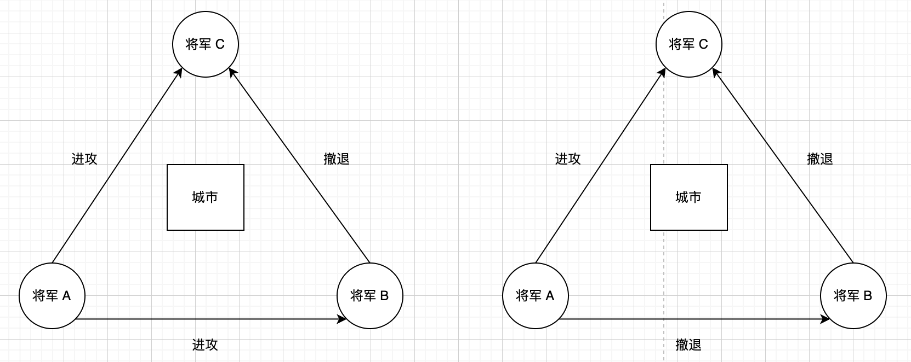

## 分布式算法 两个经典思想实验 拜占庭将军问题01        

### 引言    
先简单说一下“拜占庭”这个词的由来。拜占庭是一座古希腊城市,以该城为中心发展成东罗马帝国(即拜占庭帝国),后更名为君士坦丁堡,自此成为东罗马帝国的首都,也就是现在土耳其的伊斯坦布尔。为什么这个古希腊城市会和分布式系统扯上关系呢?因为这个问题的提出者 Leslie Lamport 觉得,死锁问题得益于 Dijkstra 的“哲学家就餐故事”而得到了超出预期的关注。于是他也编了一个拜占庭将军故事,果不其然,论文发表后,这个故事广为传颂。这种“标题党”讲故事带来的讨论让 Leslie Lamport 感到很过瘾，于是他又在他研究分布式共识算法的论文（著名的 Paxos 算法）中编了一个故事,可是那个故事就不怎么招人待见了。       

### 介绍    
拜占庭将军问题 和两将军问题类似。同样,多个拜占庭将军各率领一支军队,想要占领一座防守坚固的城市，将军们还是只能通过信使进行交流。为了简化问题,将各支军队的行动策略限定为进攻或者撤离两种。`因为部分军队进攻、部分军队撤离可能会导致灾难性后果，所以各位将军必须通过投票来达成一致的策略，即所有军队一起进攻或者所有军队一起撤离`。这种情况是两将军问题的扩展，可以有三支或更多军队,如下图所示为三支军队的情况:    

    

拜占庭将军问题的挑战在于，`将军中可能出现叛徒，他们会试图故意误导和迷惑其他将军来破坏整个军事行动`。如下图所示,将军C从将军A和将军B那里收到两个互相矛盾的信息,此时将军C无法确定谁是叛徒。因为可能有两种情况,第一种情况是将军 告诉将军B和将军C进攻,而将军B却告诉将军C撤退,这种情况是将军B撒谎;而第二种情况是将军A 发送互相矛盾的命令,告诉将军C进攻却告诉将军B撤退,显然是将军A 撒谎了。

在最坏的情况下,背叛的将领可能串通起来,选择性地发送投票信息,破坏整个军事行动。而拜占庭将军问题就是要确保所有忠实的将领在同一个计划上达成共识(无论进攻还是撤退)我们不可能指定叛变的将领做什么,所以我们能做的最好的事情就是让忠诚的将领们达成共识。    

我们将在后续的Blog 介绍如何解决拜占庭将军问题。本篇Blog 主要介绍拜占庭故障这类系统模型。上述故事映射到分布式系统，将军便是计算机,信使就是通信系统，而拜占庭故障模型描述的就是系统中某些成员计算机不仅会发生故障和出现错误，甚至会故意篡改、破坏和控制系统的系统模型。           

        

