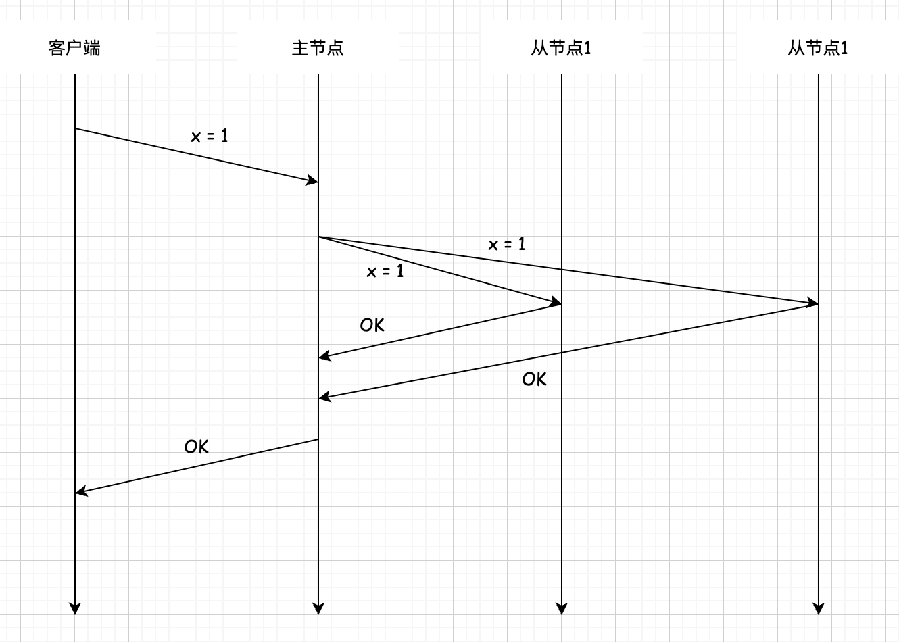
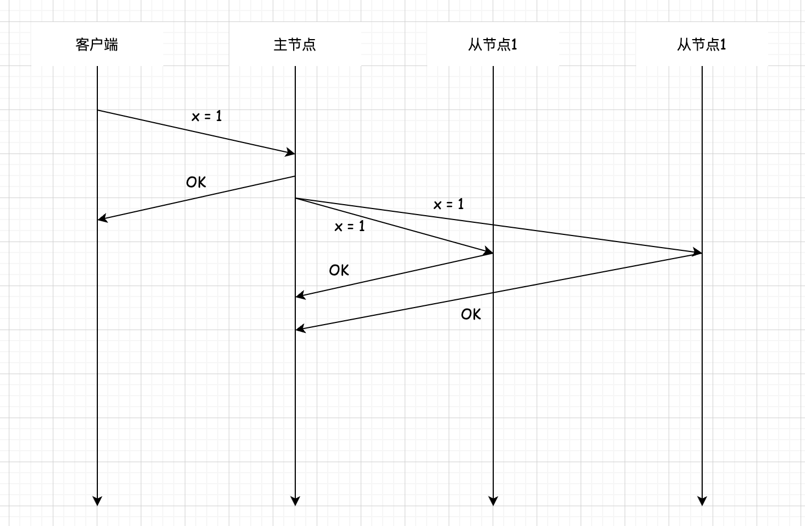
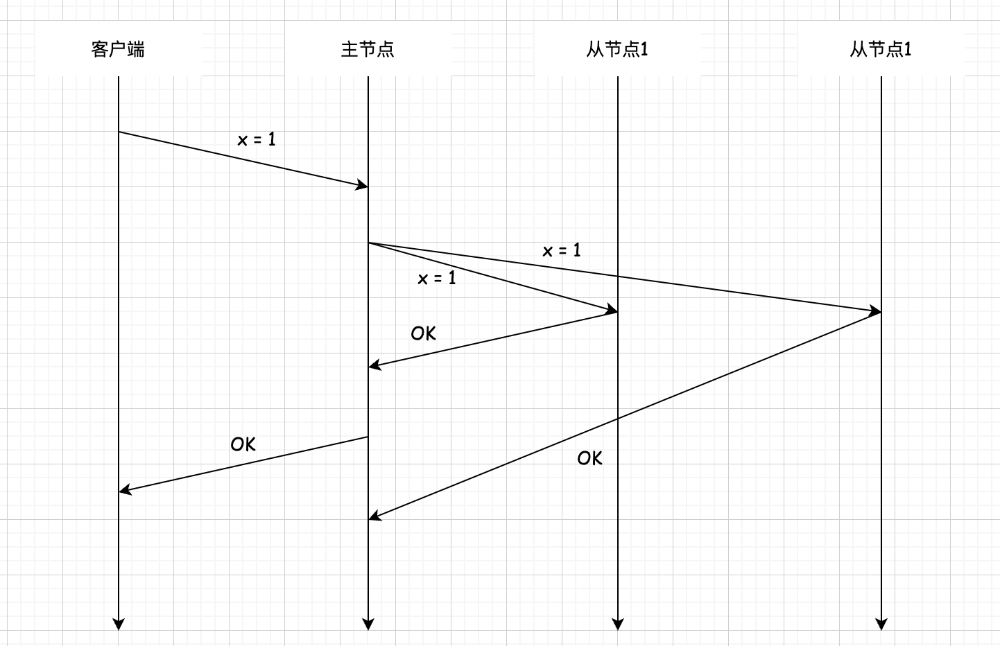

## 分布式数据 复制 单主复制 

### 单主(Single-Master)复制     
单主复制也叫主从复制或主从同步,即指定系统中的一个副本为主节点(有 Leader,Master或 Primary等多种叫法),客户端的写请求必须发送到主节点;其余的副本称为从节点(对应Follower、Slave 或 Backup)，从节点只能处理读请求，并从主节点同步最新的数据。        

主节点收到写请求时，除了将数据写入本地存储，还要负责将这次数据变更同步给所有从节点，以确保所有的副本保持数据一致。数据变更同步具体是同步操作日志还是转发请求，不同的系统有着不同的实现。        

根据系统以何种方式同步数据,又可以将单主复制分为三类,分别为同步复制、异步复制和半同步复制。      

**同步复制(Synchronous Replication)** 如下图所示。同步复制中的主节点执行完一个写请求(或一个事务)后,必须等待所有的从节点都执行完毕,并收到确认信息后，才可以回复客户端写入成功。  

      

同步复制保证了所有节点都写入完成后才返回给客户端,后续无论客户端从哪个副本读,都能读到刚才写入的数据。此外,同步复制还提升了数据可用性，即使主节点在写入完成后立即宕机，这次写入的数据也不会丢失。   

显而易见的是,因为主节点必须等待直到所有副本写入完成,写请求的性能必然会受到影响。如果碰巧某个时刻从节点 1/0 负载过高导致处理请求很慢,那么将严重影响整个写请求。      

**异步复制(Asynchronous Replication)** 中主节点执行完写请求后，会立即将结果返回给客户端，无须等待其他副本是否写入完成。整个流程如下图所示。     

      

由于主节点不需要再等待从节点写入完成,异步复制不会影响写请求的性能。但异步复制会潜在影响副本数据的一致性和持久性。例如,如果客户端收到写请求完成的响应后,立即去某个从节点读取数据,而此时写入操作还未同步到该副本，那么客户端会发现自己读不到刚才明明写入成功的数据一这种情况也许会导致客户端产生奇怪的行为。除此之外，如果主节点在本地写入完成后立即宕机,那么写操作可能并没有同步到从节点上,如果此时强行将从节点提升为主节点,那么新的主节点上的数据并不完整,一个明明已经完成的写操作可能会丢失。      

**半同步复制(Semisynchronous Replication)** 是介于同步复制和异步复制之间的一种复制机制,如下图所示。主节点只需要等待至少一个从节点同步写操作并返回完成信息即可,不需要等待所有的节点都完成。这等价于,有一个从节点是同步复制,其余的从节点则是异步复制,保证至少有两个节点拥有最新的数据副本,该从节点能随时接替主节点的工作。        

  

三种不同的同步方式适用于不同的业务场景,可以根据不同的需求进行选择。 
总的来说，单主复制的主要优点有:     
* 简单易懂，易于实现。      
* 仅在主节点执行并发写操作,能够保证操作的顺序,避免了还要考虑如何处理各个节点数据冲突这类复杂的情况,这个特性使得单主复制更容易支持事务类操作,分布式事务是非常消耗性能的。    
* 对于大量读请求工作负载的系统,单主复制是可扩展的,可以通过增加多个从节点来提升读的性能。        

单主复制的主要缺点有:   
* 面对大量写请求工作负载时系统很难进行扩展,因为系统只有一个主节点,写请求的性能瓶颈由单个节点(主节点)决定。  
* 当主节点宕机时,从节点提升为主节点不是即时的,可能会造成一些停机时间,甚至产生错误。 

对于第2个缺点需要展开分析。一般来说,分布式系统执行故障切换有两种方法:手动切换和自动切换。对于手动切换的情况,一般由运维人员根据数据完整性来选择新的主节点，这是最安全的方法，但由于需要人工介入，可能导致较长的停机时间。另一种方法是自动切换,即从节点通过心跳超时检测到主节点已经宕机,然后尝试成为整个集群的主节点。这种方式更快,不需要人工介入,能够自动容错,但也相对危险。倘若两个从节点同时检测到主节点失效,或者网络分区导致从节点认为主节点失效,但其实主节点仍然正常工作，这两种情况都会导致集群产生两个主节点。这种情况称为“脑裂(Split Brain)”,两个主节点都在处理写请求,可能造成数据损坏之类的灾难性后果。          

自动切换最重要的问题是如何使系统中只有一个主节点，同时在主节点出现故障时自动、正确地选举出新主节点?该问题被称为领导者选举问题,关于领导者选举的方法将在后面详细介绍。    

处理从节点的故障恢复就简单许多,如果从节点由于网络分区长时间无法与主节点同步,导致数据滞后,则可以通过日志偏移量与主节点继续同步数据。如果从节点故障不可恢复,则可以换上新的从节点重新复制主节点的数据。        

目前广泛使用的数据库 PostgreSQL 和 MySOL 都支持单主复制,也都支持同步、异步或半同步复制。单主复制可以说是最常见、最为广泛使用的一种复制方式。  