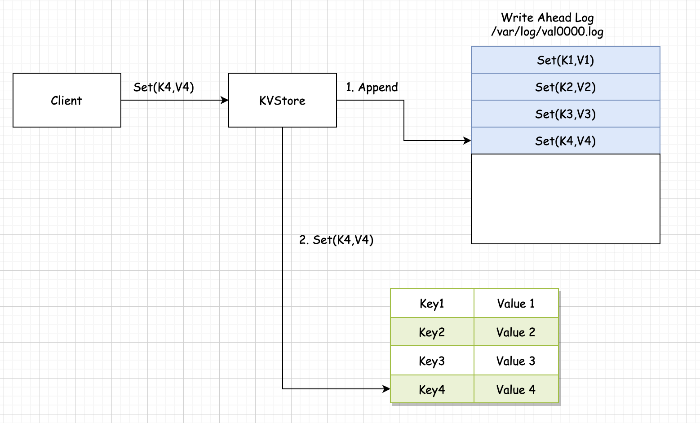
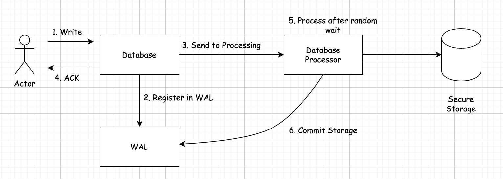
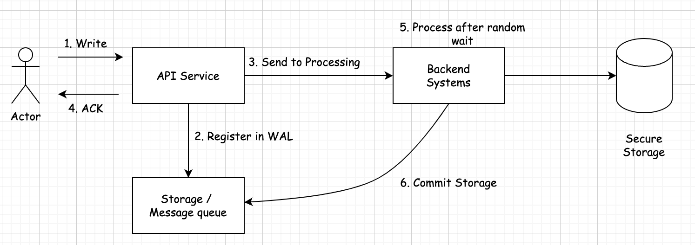

## Write-Ahead Log (预写日志)         

### 引言    
通过将每个状态更改作为命令持久化到仅附加日志中，无需将存储数据结构刷新到磁盘，即可提供持久性保证。也被称为：`提交日志`。    

### 问题    
即使存储数据的服务器机器出现故障，也需要强大的耐用性保证。一旦服务器同意执行某项操作，即使它失败并重启，失去所有内存中的状态，它也应该执行这个操作。    

### 方法        
      

在硬盘上的一个文件中存储每个状态更改作为一个命令。对于每个服务器进程，维护一个单独的日志，该日志被顺序追加。一个顺序追加的单一日志，简化了重启时日志的处理以及后续在线操作（当日志被追加新命令时）。每个日志条目都被赋予一个唯一的标识符。独特的日志标识符有助于实现日志上的某些其他操作，如分段日志或使用低水位标记等清理日志。日志更新可以通过单一更新队列来实现。        

/**************************************************************/

### 什么是预写日志以及如何实现预写日志  
数据库是令人惊叹的软件工具。目前有针对所有口味和口味的数据库。关系型和非关系型，特定于时间序列、键值存储、文档存储。最有可能的是，无论您的需求是什么，您都有一个为您量身定制的数据库。      

这并不意味着它们是简单或琐碎的软件系统。除了提供安全存储之外，数据库还提供查询功能以及大量其他功能，而无需深入了解分布式数据库和数据存储的详细信息。        

数据库研究历来是计算机科学中的一个重要主题，因此我们有大量有趣的算法和想法，旨在解决各种存储需求。      

因此，如果我们查看数据库内部，我们将能够找到非常酷的东西，而且，如果幸运的话，我们也许能够将这些伟大的、经过验证的想法用于其他类型的软件系统。          

今天我想谈谈预写日志，它是数据库通常用来提供原子性和持久性的一系列模式和技术。因此，在这篇文章中我们将看到：            
* 预写日志（WAL 从现在开始）如何工作，一个非常简单的想法。      
* 它们是如何实现的，没那么简单。（这部分将提供解释+ https://github.com/lant/wal ）        
* 我们如何在数据库世界之外使用它们。              

### WAL 如何工作    
WAL 的思想与“事件溯源”架构非常相似，其中一系列事件或命令以确定性方式将系统从状态 A 带到状态 B。如果我们以相同的顺序将这些事件应用于处于状态 A 的系统，我们将始终达到状态 B。

如果我们将这个想法发展成一个复杂的软件系统，我们会发现每次执行命令以发展状态时，都会出现很多问题。我们可以找到应用更改的情况、未应用更改的情况以及将更改应用到导致系统不一致的中间点的情况。

因此，为了正确且确定地做事，WAL 技术在将更改应用到状态之前将事件持久存储到持久存储中。如果系统在更新过程中崩溃，我们总是可以转到持久存储，检索更改并再次执行。          

基本上，WAL 基于“仅附加、辅助、磁盘驻留结构”。  
让我们回顾一下这句话，因为它包含了很多有趣的信息：          
* 仅追加。该数据结构只能扩展，这是可以对数据结构执行的最简单的操作之一，特别是当该结构驻留在物理存储中时。WAL 依赖于速度，以免成为正常操作的瓶颈。      

* 辅助的。WAL 不会向成功的正常操作添加“附加功能”，它只是一种从错误中恢复并提高弹性的技术。没有其他的。      

* 磁盘驻留。正如我们所说，该技术依赖于确保系统可以从存储的数据中恢复，因此数据需要安全地保存到耐用介质中，以便在出现故障时能够幸存。


WAL 的实际应用示例：        
* 用户将更改写入数据库。    
* 数据库接收更改。    
* 数据库将更改作为“命令”写入 WAL 中。   
* 数据库将更改写入正确的表中，但遗憾的是，当更改写入系统时，有人绊倒了电缆，服务器关闭了。      

没问题，因为当数据库系统重新启动时将检查 WAL 文件并意识到更改未被应用。系统将从 WAL 获取命令并将更改执行到引擎中。

虽然这是一个非常简单的想法，但我们只是描述了快乐之路。任何有经验的开发人员都会意识到，有很多事情可能会出错，并且需要仔细实施此技术。        

>正如您已经意识到的，该技术最重要的部分是`系统能够非常快速地将命令写入持久数据存储中`。         

### WAL 是如何实现的    
正如我们所看到的，该技术的初始部分并不是火箭科学，并且考虑到我们使用正确的编程语言和正确的操作系统，确保更改实际上持久保存到磁盘中非常简单。所以，第一步是：    
* 接收操作。    
* 将操作保留到磁盘中。确保它持续存在。      
* 继续正常操作。        

在我们进入血淋淋的细节之前，让我们停止解释，让我们看一些代码。(https://github.com/lant/wal)             

让我们一起走向幸福之路吧。在本例中，我们将实现一些非常简单的事情。  

我们可以从定义 WAL 操作的接口开始。目前我们正在研究基本的，所以让我们做一个write接受一个 `key`和一个 `value` 的操作，为了简单起见，我们将从只接受 `String` 开始。       

**Wal.java**
```java
public interface Wal {
    boolean write(String key, String value);
}
``` 

现在我们将实现这个接口：    
```java
public boolean write(String key, String value) {
    // "serialise"
    String serialised = key + "-" + value + "\n";
    try {
        // write into the file.
        this.fileOutputStream.write(serialised.getBytes());
        // make sure that the data is actually persisted into disk.
        this.fileOutputStream.flush();
    } catch (IOException e) {
        logger.error("Could not write into WAL file", e);
        return false;
    }
    return true;
}
```
from https://github.com/lant/wal/blob/0.1/src/main/java/com/github/lant/wal/text/TextFileWal.java   

一个简单的用法示例可以在以下位置找到：  
```java
public void writeKeyValue(String key, String value) {
        if (!wal.write(key, value)) {
            throw new RuntimeException("Could not persist data.");
        }
        data.put(key, value);
}
```
from https://github.com/lant/wal/blob/0.1/src/main/java/com/github/lant/wal/example/Database.java

>完整的代码位置：https://github.com/lant/wal/tree/0.1 （请注意分支名）          

正如您所看到的，我开始实施基础知识以加快掌握这些概念。目前（标签：v1）是一个`玩具项目`：  
* 序列化：键和值未序列化，只是作为文本转储到文件中。        
* 文件：该文件是一堆文本行，以\n        

一旦我们成功实现并测试了基础知识，我们就可以考虑真正棘手的部分。在这篇文章中，我们将深入探讨：

* WAL 的大小始终在增加。WAL是一个不断追加的数据结构，这意味着它会变得越来越大。我们应该用它做什么？什么时候存档/删除是安全的？              

* 如何使用 WAL 来恢复崩溃后的状态？这可能看起来很简单，但事实并非如此，有很多极端情况，“暴力方法”并不总是有效。     

* 如何让WAL高效。WAL 是一种辅助数据结构，我们使用它来提高系统的弹性。当然，我们不希望我们的系统因此变得更加脆弱和缓慢！     

### 控制 WAL 文件大小       
WAL 文件或定义的文件将始终增长。而且这种增长需要高效、快速。这就是我们总是追加数据的原因，因为追加既快速又简单。

如果我们必须管理物理文件中的删除或更新，则操作的成本会高得多，因此即使我们删除一条记录，当我们将“删除命令”记录到日志中时，文件也会增长。

我们时不时地需要做一些清洁工作。当没有人关心WAL文件中的数据时，我们将能够执行这些清理操作。那是什么时候呢？这取决于系统。   

让我们看一下两个不同的案例：

* 单一系统：这是最简单的场景，其中单个系统正在处理请求。该系统可能使用 WAL 来提高弹性，因此该系统是唯一在发生错误时消耗 WAL 的系统。这样做的结果是，当系统成功地将数据提交到主存储系统（表，......）时，WAL 中的数据可以被丢弃，因为这对于恢复数据没有帮助。已经被拯救了。      

* 分布式系统。WAL 在分布式系统（例如分布式数据库）中更有意义。在单实例服务情况下，数据被写入 WAL 并立即处理并存储在主存储系统中（例如 DB 的情况）。这可能非常快。       

当我们谈论分布式系统时，数据需要保存到这个特定节点，然后复制到系统的其他节点。数据复制肯定会更慢，因为它需要访问网络。访问网络既缓慢又危险。`这就是WAL的闪光点`。如果出现网络错误，我们始终可以从 WAL 重试从一个实例到另一个实例的命令。        

正如我们刚刚看到的，只有当所有客户端都成功地将命令“提交”到主存储中时，我们才能删除（或存档）WAL。       

因此，如果我们回到代码，这意味着我们需要做很多不同的事情：      

1.该文件是不可变的，因此我们无法删除其中的部分内容。理想的情况是删除整个内容。因此，我们必须实现限制文件大小的功能，当达到该大小时，我们将创建一个新文件并从那里继续。  

2.WAL 接口将实现一个commit方法，该方法将指示我们刚刚存储在 WAL 文件中的记录可以被删除。     

3.一旦我们知道该文件的所有内容都可以被丢弃，就会有一个删除文件的过程。让我们仔细考虑一下这一点，因为这需要对其余代码无害，因为我们不想因为我们正在检查和删除文件而使系统变慢。          

让我们回到代码，您会发现需要进行大量更改。

>如果您想跳过小示例，您可以直接跳转到项目标记 0.2 处的代码。(https://github.com/lant/wal/tree/c366ea75f3627c023e6f6332e4eee0b04a7f3d3f)        

首先，我们必须实现“滚动”wal 文件功能。这由两部分组成。第一个是检测 WAL 文件已满，我们需要启动一个新文件。第二部分是滚动它们并删除它们。     

为此，我们将修改该TextFileWal.java文件。我们将引入一个 `MAX_FILE_LENGTH`大小（在示例中为 1mb），并且添加在启动时检测目录中是否存在先前文件的功能。如果存在现有文件，系统将打开最新的文件来存储新数据。     

```java
// let's see if we already had some WAL files in there.
OptionalInt previousIdx = walFileUtils.getPreviousIdx();
  if (previousIdx.isPresent()) {
    // check the size.
    if (Files.size(Path.of(baseDir.toString(), getWalFileName(previousIdx.getAsInt()))) < MAX_FILE_LENGTH) {
        // continue with this one
       currentWalFileIdx = previousIdx.getAsInt();
       logger.info("Found a previous wal file idx, we'll continue with it. Starting at: " + currentWalFileIdx);
    } else {
      // let's go for a new one.
      currentWalFileIdx = previousIdx.getAsInt() + 1;
      logger.info("Found a previous wal file idx, too big to reuse. Starting at: " + currentWalFileIdx);
    }
}
```
from https://github.com/lant/wal/blob/c366ea75f3627c023e6f6332e4eee0b04a7f3d3f/src/main/java/com/github/lant/wal/text/TextFileWal.java

另一个重要的部分是能够检测到文件已满，因此我们将启动一个新文件并继续在其中写入：        
```java
// write into the file.
this.fileOutputStream.write(serialised.getBytes());
// make sure that the data is actually persisted into disk.
this.fileOutputStream.flush();

// check size
if (Files.size(this.currentWalFile.toPath()) >= MAX_FILE_LENGTH) {
    // roll file
    currentWalFileIdx++;
    String nextFile = getWalFileName(currentWalFileIdx);
    logger.info("Rolling wal file to " + nextFile);
    this.currentWalFile = Path.of(rootDirectory, nextFile).toFile();
    this.fileOutputStream = new FileOutputStream(this.currentWalFile);
}
```
from https://github.com/lant/wal/blob/c366ea75f3627c023e6f6332e4eee0b04a7f3d3f/src/main/java/com/github/lant/wal/text/TextFileWal.java#L76       

这将使我们拥有一个充满 WAL 文件和所有数据的目录，但是等等，这不是我们想要的。我们希望在数据处理完成后将它们删除。

为了检测记录何时已成功处理（因此可删除），我将更改将数据序列化到磁盘的方式。我将为每条记录添加一个键，它将是一个时间戳。另外，我将向 WAL 接口添加一个新方法，让系统获取commit已经处理过的记录。            

其背后的想法是能够检测到在特定时间提交的记录已经被保存。这意味着之前提交的所有记录也可以被删除。        

>这可能不是非常准确，因为时间戳可能是重复的。在现实世界中使用时间戳可能是一种不好的做法。为了将该系统投入实际生产，我们应该使用基于时间的 UUIDS之类的东西 (https://www.ietf.org/archive/id/draft-peabody-dispatch-new-uuid-format-01.html?ref=surviving-software-architecture.ghost.io)         

对于这个特定的项目来说 millisecond，时间戳并理解如果我们提交一条记录就意味着我们可以删除所有以前的记录，这是非常好的，但与往常一样，在实现真正的系统之前应该彻底考虑这些假设。

因此，添加功能的代码commit：            
```java
@Override
public void commit(long walId) {
  cleaningProcess.setLatestIdx(walId);
}
```

您将看到有一个新类，名为`CleaningProcess`，这是一个将在另一个线程中运行的系统，该线程将处理删除操作。              

我们不想减慢我们的系统或阻止它，因为我们已经填充了一个 WAL 文件，我们需要删除旧的文件，所以我将它实现为一个非常简单的后台进程，它时不时地异步运行而不会阻塞处理客户端请求的主线程。             

它的使用非常简单。它将（连续）接收系统保存的最新密钥。然后，当系统执行时，它将获取最新值，并在所有 WAL 文件中查找以检测哪些可以删除。           

对于这个特定的实现，我决定使用基于时间的计划，尝试每 10 秒清理一次文件。                

有趣的部分是这个：      
```java
private void cleanup(long latestIdx) throws IOException {
    logger.info("Starting clean up process");
    // list files in order
    List<Path> walFiles = Files.list(Path.of("/tmp/wal/"))
            .sorted().collect(Collectors.toList());
    // exclude the current idx
    walFiles.remove(walFiles.size() - 1);
    // for each file:
    for (Path walFile : walFiles) {
        String lastRecord = "";
        String currentLine = "";
        try (BufferedReader fileReader =
                        new BufferedReader(new FileReader(walFile.toFile()))) {
            while ((currentLine = fileReader.readLine()) != null) {
                lastRecord = currentLine;
            }
        }
        long lastRecordIdx = Long.parseLong(lastRecord.split("-")[0]);
        if (lastRecordIdx < latestIdx) {
            logger.info("The last idx contained in " + walFile.getFileName() +" is smaller that " +
                    "the commit record ["+lastRecordIdx+"]. Deleting WAL file.");
            Files.deleteIfExists(walFile);
        }
    }
}
```     
from https://github.com/lant/wal/blob/c366ea75f3627c023e6f6332e4eee0b04a7f3d3f/src/main/java/com/github/lant/wal/text/CleaningProcess.java#L34  

这将遍历文件，查找充满已提交数据的文件并将其删除。          

### 失败后恢复状态  
到目前为止，我们一直在为构建预写日志的主要用例奠定基础，该用例能够在问题发生时恢复状态。            

为了做到这一点，我们需要对系统进行一些更改。首先，我专注于改变我们测试的方式。          

到目前为止，“Database”类是包装 HashMap 的虚拟类。它确实起到了作用，但我们使用此实现来测试恢复场景是完全不可能的。       

如果您查看0.3 版本(https://github.com/lant/wal/releases/tag/0.3?ref=surviving-software-architecture.ghost.io)标记，您会发现 Database 类要复杂得多。我们不详细讨论这一点，但为了代表真实的数据库或真实的消费者，我创建了以下系统：               
      

最重要的部分是能够将记录返回ack给客户端，而无需实际处理记录。       

处理可能会失败并且可能会很慢，但我们不在乎，因为该操作已成功存储到 WAL 中，这意味着在发生故障时我们可以恢复它。         

就 WAL 系统本身而言，我们引入了一些重要的变化：   
1.我们添加一个操作，数据库处理器在将数据成功存储到磁盘后将commit使用该操作。    

2.当系统commits需要存储已提交到系统中的ID时，因为这是我们在发生故障时需要使用的idx。所以这也需要存储到磁盘中。在我们的实现中，我们将其存储在 /tmp/wal/commit.log     

3.我们实现了一个新方法，每次数据库启动时getBacklog都会执行该方法：  
    a.获取提交的最新索引commit.log      
    b.遍历存储中的所有 WAL 文件，查看是否有索引大于最后提交的索引的文件。这意味着数据存储在 WAL 中，但不由处理器处理。 需要重播此操作。        
    c.重放未处理的操作。    

>这样做，我们确保我们的数据库速度很快，因为它可以异步处理记录，同时保持故障恢复能力。       

### 我们如何在数据库之外使用 WAL 技术？     
正如我们所看到的，WAL 在数据库系统中非常有意义。此外，考虑到该技术是作为引擎的一部分实现的，操作速度快，可以依赖底层操作系统，并且它们不是分布式的。        

我们可以在其他地方使用它吗？        

是的。假设我们有以下用例：      
* 具有 API 的系统（如 REST 微系统）         
* 关键且不平凡的操作（可能需要一些时间来处理）        
* 高负载。      

根据这些要求，正确实现响应和错误处理非常重要。正如我们在本博客的其他文章中讨论的那样，我们感兴趣的 HTTP 状态代码是（从服务器的角度来看）：          
* HTTP 20X：收到您的请求，我接受了它。从现在开始就是我的问题了。        
* HTTP 40X：收到您的请求，但错误。你的问题。我不会用它做任何事。        
* HTTP 50X：收到您的请求，不知道发生了什么。祝你好运。              

正如您从描述中看到的，我不喜欢 50X 系列状态，因为它们没有提供有关下一步的任何信息。服务收到操作了吗？它执行了吗？不是吗？是不是半路失败了？客户端可以重试吗？如果是事务性操作会发生什么？该服务是幂等的，所以我可以重试吗？

因此，了解数据库引擎和具有 REST/RPC API 的服务之间的差异，建议是：      
1.系统接收客户端的请求。  
2.系统验证请求。      
3.如果请求无效，则返回 400 错误（客户端有责任修复并重试）     
4.如果请求有效，请安全存储该请求。            
5.返回 201 或 202。
6.做好实际工作。      

我们可以很容易地识别出2、3、4描述了WAL技术。如果我们在系统中实现 WAL 技术，我们可以安全地确保请求最终得到处理：     
      

正如您所看到的，该图与之前的图完全相同，只是将组件名称从 java 系统中的本地组件更改为更通用的系统。      

### 总结    
这篇文章描述了预写日志技术的概念，解释了如何在本地系统（例如数据存储）中使用它，然后将概念和技术外推到更大的体系结构中。

请记住，如果您查看Github中的 POC 代码(https://github.com/lant/wal)，那么这篇博文会更有意义。

此外，其中的代码具有 POC 质量并且适合教育用途。虽然该技术已实现并且按预期工作，但存在几个问题（主要集中在性能），需要重新实现才能在生产或严重环境中使用。


推荐资源：  
1.https://engineering.linkedin.com/distributed-systems/log-what-every-software-engineer-should-know-about-real-time-datas-unifying   

2.https://github.com/facebook/rocksdb/wiki/WAL-Recovery-Modes     


refer       
1.https://github.com/lant/wal   
2.https://surviving-software-architecture.ghost.io/write-ahead-logging/         
3.https://www.ietf.org/archive/id/draft-peabody-dispatch-new-uuid-format-01.html            

