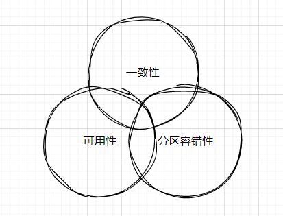

## CAP定理      

CAP定理，也称为布鲁尔定理，是描述分布式计算系统中三个基本属性之间的基本权衡关系的一个理论模型。`CAP 是 Consistency（一致性）、Availability（可用性）、Partition Tolerance（分区容错性）的首字母缩写`。         

      

- 一致性（Consistency）：一致性指的是数据在所有节点之间是否能保持同步。如果一个系统在执行完成后，所有节点都能看到同样的数据，那么就称该系统为一致的。       

- 可用性（Availability）：可用性意味着系统的每个请求都能获得响应，而不论响应是否最新或者正确。对于高可用性的系统来说，对于每个请求都能返回一个结果，而且能在一个预定义的时间内完成。    

- 分区容错性（Partition Tolerance）：分区容错性是指在网络环境出现问题的情况下，系统能否继续保持运行。如果一个系统不能在网络分区的情况下继续运行，那么就认为该系统没有分区容错性。       

对于一个分布式系统来说，这三个属性不可能同时达到。最多只能同时满足其中的两个。比如，我们可能需要牺牲一致性来获得高可用性和分区容错性，或者牺牲可用性来获得一致性和分区容错性。  

CAP 定理对于分布式系统的设计是一个很重要的参考。对于需要在分布式条件下运行的系统来说.如何在 致性、可用性和分区容错性中取舍，或者说要弱化哪 个属性，是首先需要考虑的问题 从经验上来说，可用性或 致性往往是被弱化的对象。     

对于要求高可用性的系统来说，往往会保留强-致性 典型的例子就是延迟处理，利用Message Queue 之类的中间件，在后台逐个处理队列中的请求，当处理完毕时，系统达到强一致性状态 但是要求强一致性的系统，比如元数据系统、分布式数据库系统，它们的可用性往往是有上限的。     