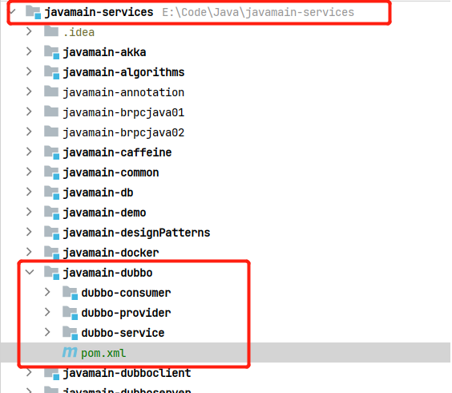

## Spring Boot集成Dubbo 3.x脚手架   

>dubbo version: 3.0.1

### 1.创建pom聚合工程   
首先看下整个聚合工程结构:   


> 注意：javamain-dubbo 已存在父工程，所以在添加spring boot依赖时，就不能配置parent，而使用`dependencyManagement`管理    

**创建步骤**    

* javamain-dubbo
创建空项目，仅保留`pom.xml`即可

* dubbo-provider，dubbo-consumer
在`javamain-dubbo`项目基础上使用`Spring Initializer`模板创建module即可，如下：  


* dubbo-service 
在`javamain-dubbo`项目基础上使用`Maven Archetype`模板创建module即可, 如下： 


### 2.配置父子工程pom.xml

**配置工程父子关系 &&　配置父子工程pom.xml第三方依赖**    
* 父工程 `javamain-dubbo` pom.xml如下： 
```
<parent>
    <groupId>com.xinzhuxiansheng.javaproject</groupId>
    <artifactId>javamain-services</artifactId>
    <version>1.0-SNAPSHOT</version>
</parent>

<modelVersion>4.0.0</modelVersion>
<artifactId>javamain-dubbo</artifactId>
<!-- 增加packaging类型 -->
<packaging>pom</packaging>

<modules>
    <module>dubbo-provider</module>
    <module>dubbo-consumer</module>
    <module>dubbo-service</module>
</modules>

<properties>
    <project.build.sourceEncoding>UTF-8</project.build.sourceEncoding>
    <project.reporting.outputEncoding>UTF-8</project.reporting.outputEncoding>
    <java.version>1.8</java.version>

    <dubbo.version>3.0.1</dubbo.version>
    <curator.version>4.3.0</curator.version>
</properties>

<dependencyManagement>
    <dependencies>
        <dependency>
            <!-- Import dependency management from Spring Boot -->
            <groupId>org.springframework.boot</groupId>
            <artifactId>spring-boot-dependencies</artifactId>
            <version>2.5.4</version>
            <type>pom</type>
            <scope>import</scope>
        </dependency>
        <dependency>
            <groupId>org.springframework.cloud</groupId>
            <artifactId>spring-cloud-dependencies</artifactId>
            <version>2020.0.3</version>
            <type>pom</type>
            <scope>import</scope>
        </dependency>

        <!-- 增加dubbo依赖包管理 -->
        <dependency>
            <groupId>org.apache.dubbo</groupId>
            <artifactId>dubbo</artifactId>
            <version>${dubbo.version}</version>
        </dependency>
        <dependency>
            <groupId>org.apache.dubbo</groupId>
            <artifactId>dubbo-dependencies-zookeeper</artifactId>
            <version>${dubbo.version}</version>
            <type>pom</type>
        </dependency>
        <dependency>
            <groupId>org.apache.zookeeper</groupId>
            <artifactId>zookeeper</artifactId>
            <version>3.7.0</version>
        </dependency>
        <dependency>
            <groupId>org.apache.curator</groupId>
            <artifactId>curator-framework</artifactId>
            <version>${curator.version}</version>
        </dependency>
        <dependency>
            <groupId>org.apache.curator</groupId>
            <artifactId>curator-recipes</artifactId>
            <version>${curator.version}</version>
        </dependency>
    </dependencies>
</dependencyManagement>

<dependencies>

</dependencies>

<build>
    <plugins>
        <plugin>
            <artifactId>maven-compiler-plugin</artifactId>
            <configuration>
                <source>${java.version}</source>
                <target>${java.version}</target>
                <encoding>UTF-8</encoding>
            </configuration>
        </plugin>
    </plugins>
</build>
```

* 子工程 `dubbo-consumer` pom.xml如下：     
```
<modelVersion>4.0.0</modelVersion>

<parent>
    <groupId>com.xinzhuxiansheng.javaproject</groupId>
    <artifactId>javamain-dubbo</artifactId>
    <version>1.0-SNAPSHOT</version>
    <relativePath>../pom.xml</relativePath>
</parent>

<groupId>com.xinzhuxiansheng.javaproject</groupId>
<artifactId>dubbo-consumer</artifactId>
<version>0.0.1-SNAPSHOT</version>
<name>dubbo-consumer</name>
<description>dubbo-consumer</description>

<properties>
    <java.version>1.8</java.version>
</properties>
<dependencies>
    <dependency>
        <groupId>org.springframework.boot</groupId>
        <artifactId>spring-boot-starter</artifactId>
    </dependency>

    <dependency>
        <groupId>org.springframework.boot</groupId>
        <artifactId>spring-boot-starter-test</artifactId>
        <scope>test</scope>
    </dependency>

    <!-- 增加dubbo依赖包管理 -->
    <dependency>
        <groupId>org.apache.dubbo</groupId>
        <artifactId>dubbo</artifactId>
    </dependency>
    <dependency>
        <groupId>org.apache.dubbo</groupId>
        <artifactId>dubbo-dependencies-zookeeper</artifactId>
        <type>pom</type>
    </dependency>

    <dependency>
        <groupId>org.apache.zookeeper</groupId>
        <artifactId>zookeeper</artifactId>
    </dependency>
    <dependency>
        <groupId>org.apache.curator</groupId>
        <artifactId>curator-framework</artifactId>
    </dependency>
    <dependency>
        <groupId>org.apache.curator</groupId>
        <artifactId>curator-recipes</artifactId>
    </dependency>

    <dependency>
        <groupId>com.xinzhuxiansheng.javaproject</groupId>
        <artifactId>dubbo-service</artifactId>
        <version>0.0.1-SNAPSHOT</version>
    </dependency>
</dependencies>

<build>
    <plugins>
        <plugin>
            <groupId>org.springframework.boot</groupId>
            <artifactId>spring-boot-maven-plugin</artifactId>
        </plugin>
    </plugins>
</build>
```

* 子工程 `dubbo-provider` pom.xml如下： 
```
<parent>
    <groupId>com.xinzhuxiansheng.javaproject</groupId>
    <artifactId>javamain-dubbo</artifactId>
    <version>1.0-SNAPSHOT</version>
    <relativePath>../pom.xml</relativePath>
</parent>

<groupId>ccom.xinzhuxiansheng.javaproject</groupId>
<artifactId>dubbo-provider</artifactId>
<version>0.0.1-SNAPSHOT</version>
<name>dubbo-producer</name>
<description>dubbo-producer</description>

<properties>
    <java.version>1.8</java.version>
</properties>
<dependencies>
    <dependency>
        <groupId>org.springframework.boot</groupId>
        <artifactId>spring-boot-starter</artifactId>
    </dependency>

    <dependency>
        <groupId>org.springframework.boot</groupId>
        <artifactId>spring-boot-starter-test</artifactId>
        <scope>test</scope>
    </dependency>

    <!-- 增加dubbo依赖包管理 -->
    <dependency>
        <groupId>org.apache.dubbo</groupId>
        <artifactId>dubbo</artifactId>
    </dependency>
    <dependency>
        <groupId>org.apache.dubbo</groupId>
        <artifactId>dubbo-dependencies-zookeeper</artifactId>
        <type>pom</type>
    </dependency>

    <dependency>
        <groupId>org.apache.zookeeper</groupId>
        <artifactId>zookeeper</artifactId>
    </dependency>
    <dependency>
        <groupId>org.apache.curator</groupId>
        <artifactId>curator-framework</artifactId>
    </dependency>
    <dependency>
        <groupId>org.apache.curator</groupId>
        <artifactId>curator-recipes</artifactId>
    </dependency>

    <dependency>
        <groupId>com.xinzhuxiansheng.javaproject</groupId>
        <artifactId>dubbo-service</artifactId>
        <version>0.0.1-SNAPSHOT</version>
    </dependency>
</dependencies>

<build>
    <plugins>
        <plugin>
            <groupId>org.springframework.boot</groupId>
            <artifactId>spring-boot-maven-plugin</artifactId>
        </plugin>
    </plugins>
</build>
```

* 子工程 `dubbo-provider` pom.xml如下： 
```
<parent>
    <groupId>com.xinzhuxiansheng.javaproject</groupId>
    <artifactId>javamain-dubbo</artifactId>
    <version>1.0-SNAPSHOT</version>
    <relativePath>../pom.xml</relativePath>
</parent>


<groupId>com.xinzhuxiansheng.javaproject</groupId>
<artifactId>dubbo-service</artifactId>
<version>0.0.1-SNAPSHOT</version>
<name>dubbo-service</name>
<description>dubbo-service</description>

<properties>
    <java.version>1.8</java.version>
</properties>

<dependencies>

</dependencies>

```

### 3.添加配置
**添加日志文件 && 默认端口号**  

* 在子工程 `dubbo-consumer`,`dubbo-provider` 将application.properties修改为yaml格式文件，再添加以下配置：   
```yaml
server:
  port: 8081 # 端口自行定义

logging:
  config: classpath:logback.xml
```

并都添加`logback.xml`文件，内容如下:    
```
<configuration>
    <appender name="STDOUT" class="ch.qos.logback.core.ConsoleAppender">
        <encoder>
            <pattern>%highlight(%-5level) (%file:%line\)- %m%n</pattern>
            <charset>UTF-8</charset>
        </encoder>
    </appender>

    <root level="info">
        <appender-ref ref="STDOUT" />
    </root>
</configuration>
```

以上等操作完成后，Spring Boot集成Dubbo3.x也初步完成。项目配置简单可自行修改。  

>源码请参考: https://github.com/xinzhuxiansheng/javamain-services/tree/main/javamain-dubbo  