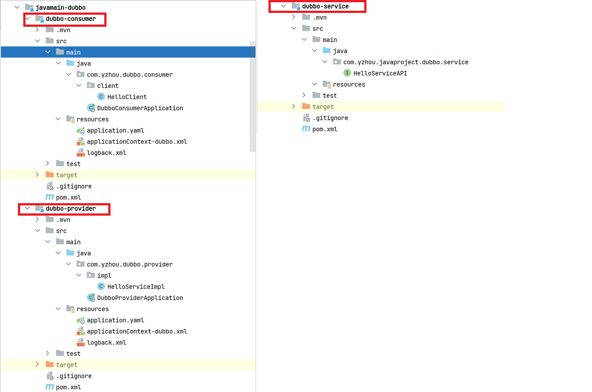

## Dubbo 3.x入门实操 sayHello

### 引言
在上一篇《Spring Boot集成Dubbo 3.x脚手架》的内容基础上，本篇主要介绍，Dubbo3.x入门实操 sayHello。

### sayHello调用
首先看下子工程的目录结构:   
  

**在子工程dubbo-service定义 HelloServiceAPI 接口**   
```java
public interface HelloServiceAPI {
    String sayHello(String message);
}
```

**在子工程dubbo-provider定义 HelloServiceImpl 实现 HelloServiceAPI接口的sayHello方法**  
```java
public class HelloServiceImpl implements HelloServiceAPI {
    @Override
    public String sayHello(String message) {
        return "Producer reponse: Hello " + message;
    }
}
```
在`resources`文件夹中创建`applicationContext-dubbo.xml`文件，内容如下:  
```
<?xml version="1.0" encoding="UTF-8"?>
<beans xmlns="http://www.springframework.org/schema/beans"
       xmlns:xsi="http://www.w3.org/2001/XMLSchema-instance"
       xmlns:dubbo="http://dubbo.apache.org/schema/dubbo"
       xsi:schemaLocation="
            http://www.springframework.org/schema/beans
            http://www.springframework.org/schema/beans/spring-beans-4.3.xsd
            http://dubbo.apache.org/schema/dubbo
            http://dubbo.apache.org/schema/dubbo/dubbo.xsd">

    <!-- 提供方应用信息，用于计算依赖关系,name可以随便起名，但是不能重复 -->
    <dubbo:application name="hello-world-provider"/>

    <!-- 使用zookeeper为注册中心，客户端使用curator -->
    <dubbo:registry address="zookeeper://local.dev.com:2181" client="curator"/>

    <dubbo:protocol name="dubbo" dispatcher="all" threadpool="fixed" threadname="devpool" threads="200" queues="0"/>
    <dubbo:service id="providerService"
                   interface="com.yzhou.javaproject.dubbo.service.HelloServiceAPI"
                   ref="iProviderService"/>

    <bean id="iProviderService" class="com.yzhou.dubbo.provider.impl.HelloServiceImpl"/>
</beans>
```

当provider启动时需要导入`applicationContext-dubbo.xml` ，所以在`DubboProviderApplication`启动类中添加`ImportResource`注解    
```java
@SpringBootApplication
@ImportResource(locations = {"classpath:applicationContext-dubbo.xml"})
public class DubboProviderApplication {

    public static void main(String[] args) {
        SpringApplication.run(DubboProviderApplication.class, args);
    }

}
```

>需注意，在启动provider服务时，先启动zookeeper，再修改`applicationContext-dubbo.xml`中zk的地址。    


**在子工程dubbo-consumer 的启动类中通过bean的上下文获取HelloServiceAPI接口调用sayHello()**      
同样像 子工程dubbo-provider一样，在resources目录下创建`applicationContext-dubbo.xml`文件，内容如下：    
```
<?xml version="1.0" encoding="UTF-8"?>
<beans xmlns="http://www.springframework.org/schema/beans"
       xmlns:xsi="http://www.w3.org/2001/XMLSchema-instance"
       xmlns:dubbo="http://dubbo.apache.org/schema/dubbo"
       xsi:schemaLocation="
            http://www.springframework.org/schema/beans
            http://www.springframework.org/schema/beans/spring-beans-4.3.xsd
            http://dubbo.apache.org/schema/dubbo
            http://dubbo.apache.org/schema/dubbo/dubbo.xsd">

    <!-- 提供方应用信息，用于计算依赖关系,name可以随便起名，但是不能重复 -->
    <dubbo:application name="hello-world-consumer">
        <!-- qos默认开启，为了不与producer端口冲突，需要修改此内容 -->
<!--        <dubbo:parameter key="qos.enable" value="true"/>-->
<!--        <dubbo:parameter key="qos.accept.foreign.ip" value="false"/>-->
<!--        <dubbo:parameter key="qos.port" value="33333"/>-->
    </dubbo:application>

    <!-- 使用zookeeper为注册中心，客户端使用curator -->
    <dubbo:registry address="zookeeper://local.dev.com:2181" client="curator"/>

    <!-- 演示集群容错调用 -->
    <dubbo:reference id="providerService" cluster="failover" retries="5"
                     interface="com.yzhou.javaproject.dubbo.service.HelloServiceAPI" />

</beans>
```
> 注意：同样也需要在启动类导入dubbo配置以及修改zookeeper地址。  

在启动类中调用sayHello()        
```java
@SpringBootApplication
@ImportResource(locations = {"classpath:applicationContext-dubbo.xml"})
public class DubboConsumerApplication {

    public static void main(String[] args) {
        ConfigurableApplicationContext context = SpringApplication.run(DubboConsumerApplication.class, args);

        HelloServiceAPI providerService = context.getBean("providerService", HelloServiceAPI.class);
        String message = "yzhou";
        System.out.println(providerService.sayHello(message));
    }
}
```

先启动provider服务，再启动consumer服务即可。以上就完成了入门实操 sayHello()方法的调用。


