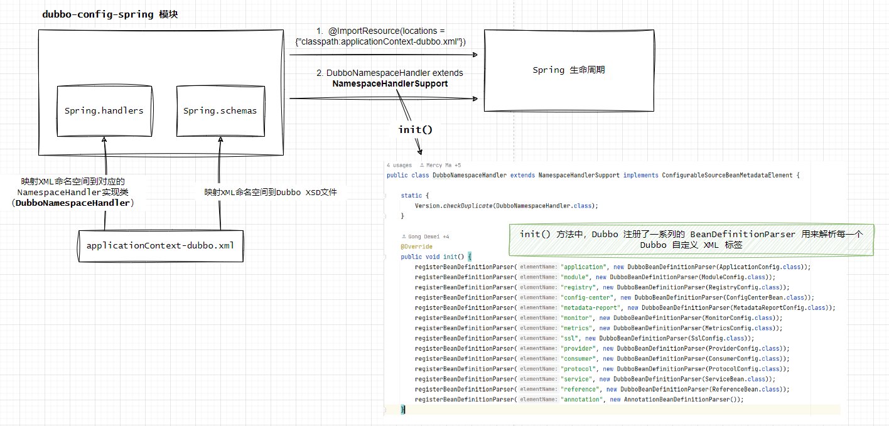
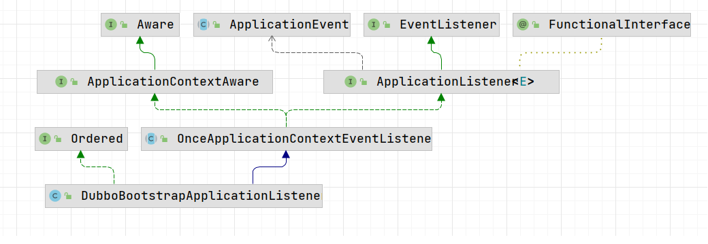

## Provider 服务注册过程剖析

>dubbo version: 3.0.1

### 基于xml的配置解析过程
上一篇《Dubbo 3.x入门实操 sayHello》介绍了，子项目dubbo-consumer调用了子项目dubbo-provider实现的sayHello()方法，在子项目dubbo-provider中，我们仅是在resources目录下添加了一个`applicationContext-dubbo.xml`配置以及在`DubboProviderApplication`启动中添加了`@ImportResource(locations = {"classpath:applicationContext-dubbo.xml"})` 注解， 仅两步就完成了子项目dubbo-provider的暴露， 那么接下以`ImportResource`注解为线索展开探讨：   

此时有以下几个疑问: 
* "applicationContext-dubbo.xml"中像 **<dubbo:application ...**这种标签，Spring Boot是如何认识的？      

>注意：Dubbo支持多种配置形式，目前只介绍xml形式的配置。 

#### applicationContext-dubbo.xml解析
Dubbo利用Spring XML schema扩展机制，在源码`dubbo-config-spring`模块的`resources.META-INF`目录下，你能看到**dubbo.xsd**，它内容定义了`applicationContext-dubbo.xml`标签和对应的属性。比如Dubbo中的<dubbo:xxxx>等      

那Spring Boot又是如何知道它的存在呢？ 当Spring在解析到`自定义的namespace标签`时（例如<dubbo:service>标签），会查找对应的spring.schemas和spring.handlers文件, 最终触发Dubbo的DubboNamespaceHandler类来进行初始化和解析。 至于Spring具体是如何解析的，可以参考Spring源码BeanDefinitionParserDelegate#parseCustomElement(Element, BeanDefinition)。 可以参考官方文档： https://docs.spring.io/spring-framework/docs/4.2.x/spring-framework-reference/html/xsd-configuration.html。 下面解释下spring.schemas和spring.handlers： 
* Spring.handlers文件 映射XML命名空间到对应的NamespaceHandler实现类  
* Spring.schemas文件 则映射XML命名空间到Dubbo XSD文件

      

每个 registerBeanDefinitionParser() 方法的调用都在 NamespaceHandler 中注册了一个用于解析特定元素的 BeanDefinitionParser。第一个参数是要解析的 XML 元素的名称（如 "application"、"registry"、"service" 等等），第二个参数是 BeanDefinitionParser 实现，这个实现知道如何将 XML 元素转换为一个 Bean 定义。例如，ApplicationConfig.class 对应 <dubbo:application> 标签，RegistryConfig.class 对应 <dubbo:registry> 标签，等等。 

这就是 DubboNamespaceHandler 的 init() 方法的主要作用。它使得 Spring 框架能够理解和解析 Dubbo 的自定义 XML 标签。   

### 基于`Spring ApplicationListener`接口事件驱动 初始化Dubbo
先介绍下`ApplicationListener`接口, 它是Spring事件驱动模型的一个关键部分，通过实现ApplicationListener接口并定义对应的`onApplicationEvent`方法来监听Spring上下文中发生的事件。含义就是当Spring下文初始化时或者刷新时，就会触发`自定义事件`。          

    

**DubboBootstrapApplicationListener**继承OnceApplicationContextEventListener抽象类，并且实现了 `ApplicationListener`接口的onApplicationContextEvent()方法。

>这里先放一个？？？？， 因为在《Dubbo3.x入门实操 sayHello》并没有使用dubbo-spring-boot依赖，那么

refer
1.https://www.jianshu.com/p/81e214a8cd5b
2.https://docs.spring.io/spring-framework/docs/4.2.x/spring-framework-reference/html/xsd-configuration.html