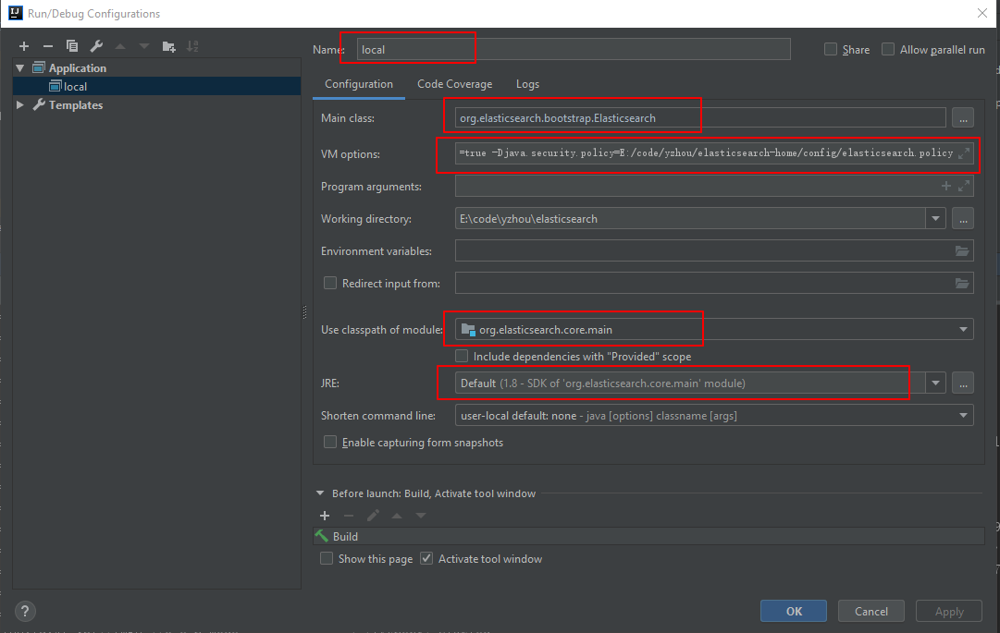
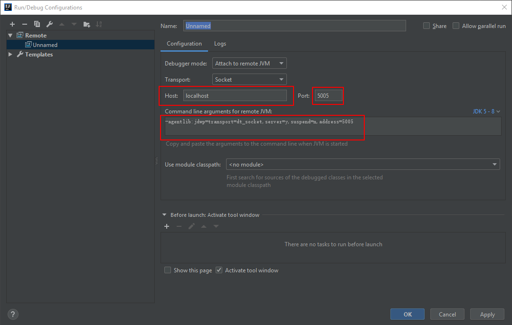

**`正文`**
[TOC]

### 编译项目，打包
>注意：
Elasticsearch的源码编译对环境jdk ，gradle版本有要求
文中涉及到的Elasticsearch版本为6.1.2 ，jdk 1.8 ，gradle 4.7


```shell
gradle assemble
#若想去掉"SNAPSHOT",则可以在编译时添加-Dbuild.snapshot=false
gradle assemble -Dbuild.snapshot=false
#完整的打包文件位于./distribution目录，包含tar、zip等多个格式。
```

### 环境搭建
1. 编译环境安装配置 准备JDK和Gradle  
2. github下载源码，将工程导入IntelliJ IDEA
```shell
#进入Elasticsearch源码根目录中，执行： (生成IntelliJ的项目文件，建立类之间的引用)
gradle idea
#执行结果显示"BUILD SUCCESSFUL"
```

### 本地运行，调试项目
1.在IntelliJ IDEA 配置Run, 如下图所示：


**说明**：
1. `Main class`: org.elasticsearch.bootstrap.Elasticsearch

2. `VM options`: -Des.path.home=E:/code/yzhou/elasticsearch-home -Des.path.conf=E:/code/yzhou/elasticsearch-home/config -Xms1g -Xmx1g -Dlog4j2.disable.jmx=true -Djava.security.policy=E:/code/yzhou/elasticsearch-home/config/elasticsearch.policy

3. `Use classpath of module`: org.elasticsearh.core.main

4. `JRE`: 选择module 默认的JDK

>注意：VM options参数配置: 我们需要先为调试环境准备运行时要用的elasticsearch-home目录，因为Elasticsearch需要从其中加载模块，读取配置，写入数据和日志。在你的环境上选择一个位置建立elasticsearch-home目录(名称可以任意)。然后将Elasticsearch的安装包里面的 config,modules,plugins 拷贝到 elasticsearch-home目录中

**参数**

| 参数      |    说明 |
| -------- |--------|
| -Des.path.home  | 指定eshome目录所在路径名 |
| -Des.path.conf      |   指定配置文件所在的路径名，后续调整节点配置时修改其下的配置文件 |
| -Xms1g      |  设置JVM初始堆内存大小1GB |
| -Xmx1g      |  设置JVM最大允许分配的堆内存为1GB |
| -Dlog4j2.disable.jmx=true      |  这个是jvm.options文件中默认配置，不加会报"access denied" 等错误，但在IDE中启动Elasticsearch不会加载JVM.options文件，这个文件是在Elasticsearch的启动脚本elasticsearch,elasticsearch.bat中加载的 |
| -Djava.security.policy      |  同样是权限问题(不配置的话部分环境上会遇到access denied问题)，配置policy文件路径，policy文件内内容如下：grant{  permission javax.management.MBeanTruxPermission "register";    permission javax.management.MBeanTruxPermission "createMBeanServer";   permission java.lang.RuntimePermission "createClassLoader";};|


### 远程调试
1. 先配置远程调试节点，在jvm.options文件中加入下面参数
```shell
#启动/重启 ES节点时，添加如下参数
-agentlib:jdwp=transport=dt_socket,server=y,suspend=n,address=5005
```
在启动成功后，日志信息中会有"Listening for transport dt_socket at address:5005"信息。

2. 使用Idea配置 "Run" 启动项。


**说明**：
1. `Host，Port` : 配置ES远程节点 ip与端口
2. `Command line arguments for remote JVM` : -agentlib:jdwp=transport=dt_socket,server=y,suspend=n,address=5005

>注意：远程调试情况下 ，一定要保证Elasticsearch的版本与 IDE的Elasticsearch版本保持一致
若果需要调试启动过程，则可以设置suspendcy，让程序等待调试器连接后再开始执行。

