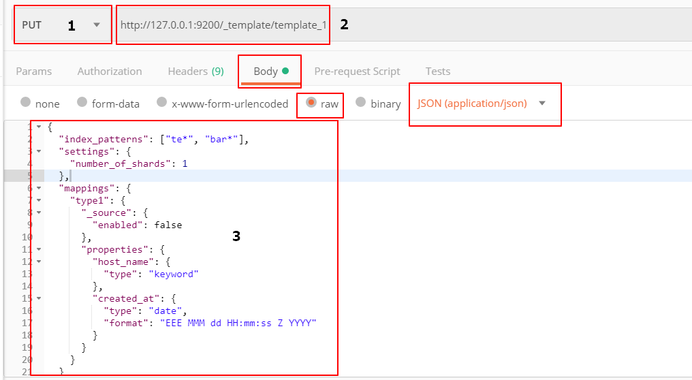

**`正文`**

[TOC]

>前言:Elasticsearch 将会在 Elasticsearch8.0版本移除 Transport Client (TCP协议)，所以 我们更应该多了解REST Client(HTTP协议)，官网参考链接：https://www.elastic.co/guide/en/elasticsearch/client/java-api/current/transport-client.html

## Elasticsearch的RESTful api
`下面请求，使用postman工具模拟HTTP协议请求的,格式请参考下面示例图`


标记 1,2,3 请根据操作情况 修改
1: HTTP协议 请求方法
2：url
3：参数


### Indices APIs
参考官网文档: https://www.elastic.co/guide/en/elasticsearch/reference/6.3/indices.html

#### 创建索引
1：PUT
2：http://127.0.0.1:9200/page-log-2019-05-12
3:
若按照Elasticsearch的索引缺省值的默认赋值，那么请求体为空。
若提前创建好template，并且template的index_patterns能匹配上 page-log-*，那么请求体为空。
若按照请求的参数设置索引配置项，请参考settings的配置
{
    "settings":{
        "index":{"number_of_shards":3,"number_of_replicas":2}
    }
}

#### 删除索引
1：DELETE
2：http://127.0.0.1:9200/page-log-2019-05-12
3: 无

#### 获取索引
1：GET
2：http://127.0.0.1:9200/page-log-2019-05-12
3：无

#### 关闭索引
1：POST
2：http://127.0.0.1:9200/page-log-2019-05-12/_close
3：无

#### 更新索引配置
1：PUT
2：http://127.0.0.1:9200/page-log-2019-05-12/_settings
3：
{
    "index":{"number_of_replicas":4}
}

#### 添加索引映射
1：PUT
2：http://127.0.0.1:9200/page-log-2019-05-12
3：比如添加mappings
{
    "mappings":{
        "app-mobile-web-log": {
            "properties": {
                "pageurl": {
                "type": "keyword"
                },
                "time": {
                "type": "long"
                },
                "ua": {
                "type": "keyword"
                },
                "srvtime": {
                "type": "date"
                },
                "log_type": {
                "type": "keyword"
                }
            },
            "_all": {
                "enabled": false
            }
        }
    }
}

#### 获取索引的映射mappings
1：GET
2：http://127.0.0.1:9200/page-log-2019-05-12/_mapping/page-log
3：无

### Index Templates
参考官网文档：https://www.elastic.co/guide/en/elasticsearch/reference/6.3/indices-templates.html

#### 添加新模板
1：PUT
2：http://127.0.0.1:9200/_template/template_1
3：
```json
{
  "index_patterns": ["te*", "bar*"],
  "settings": {
    "number_of_shards": 1
  },
  "mappings": {
    "type1": {
      "_source": {
        "enabled": false
      },
      "properties": {
        "host_name": {
          "type": "keyword"
        },
        "created_at": {
          "type": "date",
          "format": "EEE MMM dd HH:mm:ss Z YYYY"
        }
      }
    }
  }
}
```
模板json格式说明：
**index_patterns** 
模板匹配哪些索引,多数情况下，会使用`*` 通配符 进行模糊匹配 例如: te*,bar* ,表示 te和bar开头索引会匹配上template_1模板

**settings**
settings根据配置项生效周期，分为：
static index settings：在索引创建 或者 在关闭的索引的操作 才能生效
dynamic index settings：操作完api，立即生效

| static index settings 配置项  |    描述 |
| :-------- |:--------|
| index.number_of_shards  | 默认是5, 一个索引最大设置的分片数是1024个，也可以参数化设置 索引的最大数：export ES_JAVA_OPTS="-Des.index.max_number_of_shards=128"|
| index.shard.check_on_startup     |   分片在打开前是否要检查是否有损坏，默认是false ，官网文档给的警告：Expert only. Checking shards may take a lot of time on large indices|
| index.codec      |    索引压缩格式 |
| index.routing_partition_size      |   自定义的路由值可以路由到的分片数。默认是1 |
| index.load_fixed_bitset_filters_eagerly      |   是否设置嵌套查询预加载缓存，默认是true |

| dynamic index settings 配置项  |    描述 |
| :-------- |:--------|
| index.number_of_shards  | 每个主分片拥有的副本数，默认是1|
| index.auto_expand_replicas     |   根据集群中数据节点数自动扩展副本数，可以设置区间eg：(0-5)或者(0-all) 默认是false|
| index.refresh_interval      |    设置数据刷新频率，默认是1s刷新，意思是：数据写1s后 就可以被搜到，如果不需要那么高的搜索实时性，应该降低索引refresh周期 |
| index.max_result_window      |   from size api 查询数据最大条数，默认是10000. from size api在数据量大时会消耗大量内存，不建议使用，请参考Scroll 或者 Search After api文档 |
| index.max_inner_result_window     |   子嵌套查询或顶部的聚合查询 默认返回：100，嵌套查询和顶部的聚合查询需要的内存大小与from size的查询数有关系|
| index.max_rescore_window     |  后续慢慢补 |
| index.max_docvalue_fields_search     |  ... |
| index.max_script_fields     | 后续慢慢补  |
| index.max_ngram_diff     |  ... |
| index.max_shingle_diff     |   |
| index.blocks.read_only     |   |
| index.blocks.read_only_allow_delete     |   |
| index.blocks.read     |   |
| index.blocks.write    |   |
| index.blocks.metadata     |   |
| index.max_refresh_listeners     |   |
| index.highlight.max_analyzed_offset    |   |
| index.max_terms_count     |   |
| index.routing.allocation.enable    |   |
| index.routing.rebalance.enable    |   |
| index.gc_deletes    |   |


**mappings**
参考链接：https://www.elastic.co/guide/en/elasticsearch/reference/6.3/mapping.html

#### 删除模板
1：DELETE
2：http://127.0.0.1:9200/_template/template_1
3：无

#### 查询模板信息
1：GET
2：http://127.0.0.1:9200/_template/template_1
3：无

#### 判断模板是否存在
1：HEAD
2：http://127.0.0.1:9200/_template/template_1
3：无

#### 修改模板
1：PUT
2：http://127.0.0.1:9200/_template/template_1
3：
```json
{
    "index_patterns" : ["te*"],
    "order" : 1,
    "settings" : {
        "number_of_shards" : 1
    },
    "mappings" : {
        "type1" : {
            "_source" : { "enabled" : true }
        }
    }
}
```


