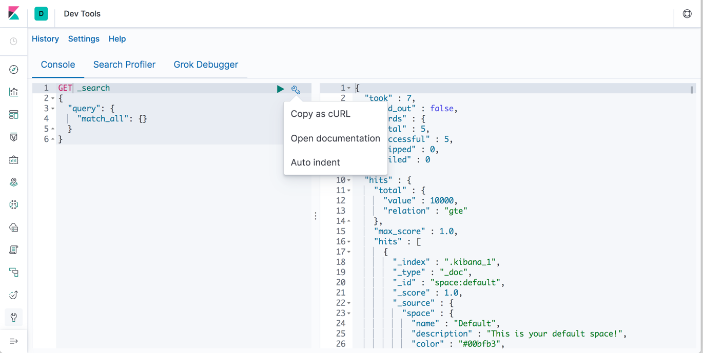

**`正文`**

[TOC]

>前言：Elasticsearch 提供了RESTful风格的搜索和数据分析引擎

这里，我们重点说下，利用RESTful api 我们可以干什么？
在了解api 之前，我们先知道kibana的Dev Tools？

## kibana Dev Tools
官网参考地址：https://www.elastic.co/guide/en/kibana/current/devtools-kibana.html
1. Console
    能简化我们的RESTful api的请求工作，及返回结果能自动格式化。有利于我们查看

2. ?v、?help 

**操作对比**

```shell
#Dev Tools的 Console
GET /_search
{
  "query": {
    "match_all": {}
  }
}

#Curl
curl -XGET "http://localhost:9200/_search" -d'
{
  "query": {
    "match_all": {}
  }
}'
```

下面内容，是基于 __Dev Tools工具__ 操作的。

## cat APIS
>cat的一波操作，对了解Elasticsearch集群的健康，节点统计等等有一些帮助，比如 能找出内存使用偏高,查看每个节点磁盘，分片等等基础信息。

官网参考链接：https://www.elastic.co/guide/en/elasticsearch/reference/current/cat.html
* 通过 GET 请求发送 cat 命名可以列出所有可用的 API：
```shell
GET /_cat
#结果：
=^.^=
/_cat/allocation
/_cat/shards
/_cat/shards/{index}
/_cat/master
/_cat/nodes
/_cat/tasks
/_cat/indices
/_cat/indices/{index}
/_cat/segments
/_cat/segments/{index}
/_cat/count
/_cat/count/{index}
/_cat/recovery
/_cat/recovery/{index}
/_cat/health
/_cat/pending_tasks
/_cat/aliases
/_cat/aliases/{alias}
/_cat/thread_pool
/_cat/thread_pool/{thread_pools}
/_cat/plugins
/_cat/fielddata
/_cat/fielddata/{fields}
/_cat/nodeattrs
/_cat/repositories
/_cat/snapshots/{repository}
/_cat/templates
```

### 下面就介绍 `上面api` 的含义

| cat api      |    描述 |
| :-------- | --------:|
| /_cat/allocation | 查看集群多少分片分配给每个数据节点和使用多少磁盘空间 |
| /_cat/shards     | 查看集群全部索引分片信息 |
| /_cat/shards/{index}      |    查看单个索引分片信息 |
| /_cat/master | 查看集群主节点的host,ip,node基本信息 |
| /_cat/nodes     |   查看集群节点的ip，cpu，内存等等基本信息|
| /_cat/tasks      | 查看集群所有节点的执行操作任务情况 |
| /_cat/indices | 查看集群全部索引信息 |
| /_cat/indices/{index}     |  查看单个索引信息 |
| /_cat/segments      | 查看集群Lucene 段的生成情况 |
| /_cat/segments/{index} | 查看集群某个索引 Lucene 段的生成情况 |
| /_cat/count    | 查看整个集群的文档个数 |
| /_cat/count/{index}      | 查看单个索引的文档个数 |
| /_cat/recovery | 查看集群索引分片恢复的视图，包括正在进行和先前已完成的恢复 |
| /_cat/recovery/{index}     |   查看集群某个 索引分片恢复的视图，包括正在进行和先前已完成的恢复 |
| /_cat/health      | 查看集群健康状况|
| /_cat/pending_tasks | 查看集群挂起的任务情况 |
| /_cat/aliases     | 查看集群配置的所有别名信息,比如 索引关联，过滤器，路由信息 |
| /_cat/aliases/{alias}      |  查看集群配置的某个别名信息,比如 索引关联，过滤器，路由信息 |
| /_cat/thread_pool | 查看集群全部节点线程池统计情况，有线程池活动个数，队列大小，被拒绝个数 |
| /_cat/thread_pool/{thread_pools}     |  查看集群某个节点线程池统计情况，有线程池活动个数，队列大小，被拒绝个数 |
| /_cat/plugins      |  查看集群节点正在运行的插件列表 |
| /_cat/fielddata | 查看集群全部数据节上fielddata使用堆内存的大小 |
| /_cat/fielddata/{fields}     |   查看集群数据节上某个fielddata使用堆内存的大小 |
| /_cat/nodeattrs      |  查看集群全部节点自定义的属性信息|
| /_cat/repositories |查看集群中注册的全部快照仓库 |
| /_cat/snapshots/{repository}     |  查看集群中注册的某个快照仓库 |
| /_cat/templates      |   查看集群存在的所有模板 |


**详细介绍下，下面几个命令**
1. GET /_cat/segments?v
```shell
#执行结果
index                           shard prirep ip           segment generation docs.count docs.deleted     size size.memory committed searchable version compound
app-xxx-2019-04-25-10           0     p      127.0.0.1 _ay            394     152458          102     70mb      137153 true      true       7.3.1   false
app-xxx-2019-04-25-10           0     p      127.0.0.1 _e1            505      37654           25   17.9mb       46949 true      true       7.3.1   false
app-xxx-2019-04-25-10           0     p      127.0.0.1 _gu            606      52798           40   24.9mb       59217 true      true       7.3.1   false
```

输出结果中在前两列给出了索引名称,分片数量.如果你想了解某一个具体的索引的更多关于段信息,你需要在哎请求URL中添加索引名称,比如/_cat/segments/test，你也可以这样同时指定多个索引名称/_cat/segments/test,test1

**下面的列会显示额外的监控信息:**

**prirep**
当前段是属于主分片还是副本分片

**ip**
当前段所在的分片的ip地址

**segment**
当前段的名称，来自于生成的段,该名称被用来在内部生成当前分片下的段文件所在的目录下的段文件名.

**generation**
generation数值代表当前段每次有内容写入的时候都会递增.段的名称都来自于该值.

**docs.count**
该值是当前段中不包含删除文档的文档数量.请注意,这是面向lucene的文档数量,因此该值会包含隐藏文档(如nested类型文档)

**docs.deleted**
当前段中所存储的已经标记为删除状态的文档数量,如果这个数大于0就完全没问题.删除文档所占用的空间会随着端合并而进行回收.

**size**
当前段所占用的磁盘空间大小

**size.memory**
为了更加高效的检索,所有的段都会存储一些数据在内存中.该字段就是显示这些段所占用的内存容量大小

**committed**
不管段内容是否同步到磁盘上,那些提交过的段信息都会从一个硬件重启中存活下来,不需要担心出现错误，未提交段的数据也存储在事务日志中，以便Elasticsearch能够在下一次启动时重新恢复更改.

**searchable**
该段内容是否能被检索,如果该字段的值是false,则很有可能意味着段信息已经被刷新到磁盘中但是还没有进行刷新操作来让其内容可以被检索.

**version**
当前段底层所用到的lucene的版本

**compound**
说明该段内容是否存储在复合文件中.如果该值为true,则意味着Lucene将所有段文件合并成一个单独的段文件,这样能够节省文件描述符.

s
2. GET /_cat/thread_pool?v
```shell
#执行结果
node_name      name                active queue rejected
rack1_xxx_1 analyze                  0     0        0
rack1_xxx_1 fetch_shard_started      0     0        0
rack1_xxx_1 fetch_shard_store        0     0        0
rack1_xxx_1 flush                    0     0        0
rack1_xxx_1 force_merge              0     0        0
rack1_xxx_1 generic                  0     0        0
rack1_xxx_1 get                      0     0        0
rack1_xxx_1 index                    0     0        0
rack1_xxx_1 listener                 0     0        0
rack1_xxx_1 management               1     0        0
rack1_xxx_1 ml_autodetect            0     0        0
rack1_xxx_1 ml_datafeed              0     0        0
rack1_xxx_1 ml_utility               0     0        0
```

cat thread pool 允许在请求URL中接受一个thread_pool_patterns来指定一个逗号分隔符隔开的列表来匹配获取哪些线程池的名称
```shell
GET /_cat/thread_pool/generic?v&h=id,name,active,rejected,completed
```
**线程池字段说明**

| 字段      |    描述 |
| :-------- | --------:| 
| type  | 线程池的当前类型(fixed或scaling) | 
| active     |   当前线程池中处于active状态的线程数量 |  
| size     |   当前线程池中的线程数量  |  
| queue    |   当前线程池中处于队列中的线程数量 | 
| queue_size    |    当前线程池中处于队列中的线程数量 | 
| rejected    |    线程执行器拒绝的任务数量 | 
| largest    |    当前线程池中曾经处于active状态的最高线程数量 | 
| completed    |    线程执行器已经完成的任务数量  | 
| min    |    当前线程池中能够允许active线程的最小数量 | 
| max    |    当前线程池中能够允许active线程的最大数量 | 
| keep_alive    |    线程存活时间配置  | 

**其他字段**

| 字段      |    描述 |
| :-------- | --------:| 
| node_id  | 唯一的节点ID | 
| ephemeral_id     |   临时节点ID  |  
| pid     |   当前节点的进程ID   |  
| host    |   当前节点的host 名称 | 
| ip    |    当前节点绑定的IP地址 |
| port    |    当前节点绑定的传输端口 |