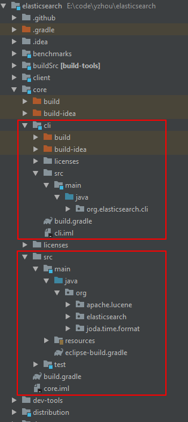
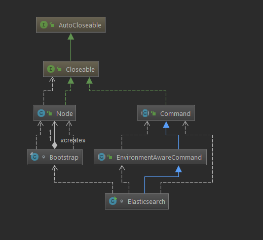
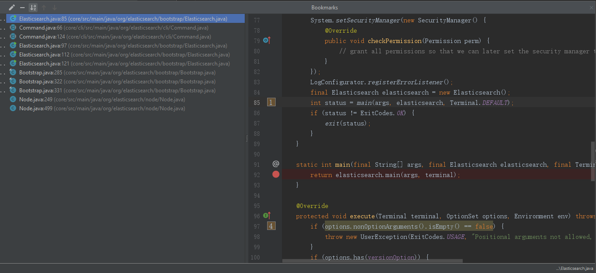

**`正文`**

[TOC]

>引言：在 "ES源码编译及导入Idea" 的文章中，谈到在idea中配置Elasticsearch的启动路径 **org.elasticsearch.bootstrap.Elasticsearch**, 所以我们直接看Elasticsearch里面的Main方法；


### 在我们还没看到代码之前，有2个关键字了解下：
1. JOpt Simple
2. Google Guice
3. Idea Bookmarks
_至少明白 它们能做什么？_

## 1.elasticsearch启动子项目 core
### 先查看下 core工程 目录结构


### 了解涉及到的类


### 了解Bookmarks debug顺序



## 2.构建启动环境
在 "ES源码编译及导入Idea" 的文章中，我在 "Run"配置了如下参数:
```shell
-Des.path.home=E:/code/yzhou/elasticsearch-home 
-Des.path.conf=E:/code/yzhou/elasticsearch-home/config 
-Xms1g -Xmx1g 
-Dlog4j2.disable.jmx=true 
-Djava.security.policy=E:/code/yzhou/elasticsearch-home/config/elasticsearch.policy
```
-Dxxx 是java运行参数的语法，如果要在代码中获得参数 使用
```shell
System.getProperty("propertyName");#就能拿到参数值
```

Elasticsearch 继承EnvironmentAwareCommand类 ，重写了execute 抽象方法,在execute中调用了createEnv方法。
```java
@Override
    protected void execute(Terminal terminal, OptionSet options) throws Exception {
        ...省去判断是否存在key部分

        putSystemPropertyIfSettingIsMissing(settings, "path.data", "es.path.data");
        putSystemPropertyIfSettingIsMissing(settings, "path.home", "es.path.home");
        putSystemPropertyIfSettingIsMissing(settings, "path.logs", "es.path.logs");

        execute(terminal, options, createEnv(terminal, settings));
    }
```
在createEnv() `final String esPathConf = System.getProperty("es.path.conf");` ,然后利用esPathConf 变量 来拼接环境路径：
```java
    /** Create an {@link Environment} for the command to use. Overrideable for tests. */
    protected Environment createEnv(final Terminal terminal, final Map<String, String> settings) throws UserException {
        final String esPathConf = System.getProperty("es.path.conf");
        if (esPathConf == null) {
            throw new UserException(ExitCodes.CONFIG, "the system property [es.path.conf] must be set");
        }
        return InternalSettingsPreparer.prepareEnvironment(Settings.EMPTY, terminal, settings, getConfigPath(esPathConf));
    }
```
其实，看到这里 还不是最终的Environment，下面的Node节点init时候，再次拿到新的Environment对象，这个我后面接着说

## 3. 启动Node
从 -Dxxx 到 Environment对象，一波配置获取后，接着检查ES的keystore安全策略，检查Lucence版本 checkLucene().... 接着就到了Bootstrap class 中setup(),start() 两个核心方法

### Bootstarp.setup(true, environment);
二话不说先丢过来一段代码：
```java
private void setup(boolean addShutdownHook, Environment environment) throws BootstrapException {
        Settings settings = environment.settings();

        try {
            spawner.spawnNativePluginControllers(environment);
        } catch (IOException e) {
            throw new BootstrapException(e);
        }
        // 锁定内存空间，是否启用系统调用筛选器
        initializeNatives(
                environment.tmpFile(),
                BootstrapSettings.MEMORY_LOCK_SETTING.get(settings),
                BootstrapSettings.SYSTEM_CALL_FILTER_SETTING.get(settings),
                BootstrapSettings.CTRLHANDLER_SETTING.get(settings));

        // initialize probes before the security manager is installed
        initializeProbes();

        //设置jvm关闭的回调的钩子，释放内存空间
        if (addShutdownHook) {
            Runtime.getRuntime().addShutdownHook(new Thread() {
                @Override
                public void run() {
                    try {
                        IOUtils.close(node, spawner);
                        LoggerContext context = (LoggerContext) LogManager.getContext(false);
                        Configurator.shutdown(context);
                    } catch (IOException ex) {
                        throw new ElasticsearchException("failed to stop node", ex);
                    }
                }
            });
        }

        try {
            // look for jar hell
            JarHell.checkJarHell();
        } catch (IOException | URISyntaxException e) {
            throw new BootstrapException(e);
        }

        // Log ifconfig output before SecurityManager is installed
        IfConfig.logIfNecessary();

        // install SM after natives, shutdown hooks, etc.
        try {
            Security.configure(environment, BootstrapSettings.SECURITY_FILTER_BAD_DEFAULTS_SETTING.get(settings));
        } catch (IOException | NoSuchAlgorithmException e) {
            throw new BootstrapException(e);
        }

        node = new Node(environment) {
            @Override
            protected void validateNodeBeforeAcceptingRequests(
                final BootstrapContext context,
                final BoundTransportAddress boundTransportAddress, List<BootstrapCheck> checks) throws NodeValidationException {
                BootstrapChecks.check(context, boundTransportAddress, checks);
            }
        };
    }
```
setup()方法最后，构造一个新的Node实例，在Node构造函数里面的 ModulesBuilder对象
```java
ModulesBuilder modules = new ModulesBuilder();
```
ModulesBuilder.createinjector() 方法。利用Google Guice的 注入实例方式的基础上，封装了
org.elasticsearch.common.inject ,
```java
modules.add(b -> {
                    b.bind(Node.class).toInstance(this);
                    b.bind(NodeService.class).toInstance(nodeService);
                    b.bind(NamedXContentRegistry.class).toInstance(xContentRegistry);
                    b.bind(PluginsService.class).toInstance(pluginsService);
                    b.bind(Client.class).toInstance(client);
                    b.bind(NodeClient.class).toInstance(client);
                    b.bind(Environment.class).toInstance(this.environment);
                    b.bind(ThreadPool.class).toInstance(threadPool);
                    b.bind(NodeEnvironment.class).toInstance(nodeEnvironment);
                    b.bind(ResourceWatcherService.class).toInstance(resourceWatcherService);
                    b.bind(CircuitBreakerService.class).toInstance(circuitBreakerService);
                    b.bind(BigArrays.class).toInstance(bigArrays);
                    b.bind(ScriptService.class).toInstance(scriptModule.getScriptService());
                    b.bind(AnalysisRegistry.class).toInstance(analysisModule.getAnalysisRegistry());
                    b.bind(IngestService.class).toInstance(ingestService);
                    b.bind(UsageService.class).toInstance(usageService);
                    b.bind(NamedWriteableRegistry.class).toInstance(namedWriteableRegistry);
                    b.bind(MetaDataUpgrader.class).toInstance(metaDataUpgrader);
                    b.bind(MetaStateService.class).toInstance(metaStateService);
                    b.bind(IndicesService.class).toInstance(indicesService);
                    b.bind(SearchService.class).toInstance(newSearchService(clusterService, indicesService,
                        threadPool, scriptModule.getScriptService(), bigArrays, searchModule.getFetchPhase(),
                        responseCollectorService));
                    b.bind(SearchTransportService.class).toInstance(searchTransportService);
                    b.bind(SearchPhaseController.class).toInstance(new SearchPhaseController(settings, bigArrays,
                            scriptModule.getScriptService()));
                    b.bind(Transport.class).toInstance(transport);
                    b.bind(TransportService.class).toInstance(transportService);
                    b.bind(NetworkService.class).toInstance(networkService);
                    b.bind(UpdateHelper.class).toInstance(new UpdateHelper(settings, scriptModule.getScriptService()));
                    b.bind(MetaDataIndexUpgradeService.class).toInstance(metaDataIndexUpgradeService);
                    b.bind(ClusterInfoService.class).toInstance(clusterInfoService);
                    b.bind(GatewayMetaState.class).toInstance(gatewayMetaState);
                    b.bind(Discovery.class).toInstance(discoveryModule.getDiscovery());
                    {
                        RecoverySettings recoverySettings = new RecoverySettings(settings, settingsModule.getClusterSettings());
                        processRecoverySettings(settingsModule.getClusterSettings(), recoverySettings);
                        b.bind(PeerRecoverySourceService.class).toInstance(new PeerRecoverySourceService(settings, transportService,
                                indicesService, recoverySettings));
                        b.bind(PeerRecoveryTargetService.class).toInstance(new PeerRecoveryTargetService(settings, threadPool,
                                transportService, recoverySettings, clusterService));
                    }
                    httpBind.accept(b);
                    pluginComponents.stream().forEach(p -> b.bind((Class) p.getClass()).toInstance(p));
                }
            );
```


### Bootstarp.start();
```java
 private void start() throws NodeValidationException {
    //启动node节点
    node.start();
    //启动监听 jvm Runtime的异常
    keepAliveThread.start();
}
```

node.start() 拿到inject对象 开始执行各个类的 start()
```java
public Node start() throws NodeValidationException {
        if (!lifecycle.moveToStarted()) {
            return this;
        }

        Logger logger = Loggers.getLogger(Node.class, NODE_NAME_SETTING.get(settings));
        logger.info("starting ...");
        pluginLifecycleComponents.forEach(LifecycleComponent::start);

        injector.getInstance(MappingUpdatedAction.class).setClient(client);
        injector.getInstance(IndicesService.class).start();
        injector.getInstance(IndicesClusterStateService.class).start();
        injector.getInstance(SnapshotsService.class).start();
        injector.getInstance(SnapshotShardsService.class).start();
        injector.getInstance(RoutingService.class).start();
        injector.getInstance(SearchService.class).start();
        nodeService.getMonitorService().start();

        final ClusterService clusterService = injector.getInstance(ClusterService.class);

        final NodeConnectionsService nodeConnectionsService = injector.getInstance(NodeConnectionsService.class);
        nodeConnectionsService.start();
        clusterService.setNodeConnectionsService(nodeConnectionsService);

        injector.getInstance(ResourceWatcherService.class).start();
        injector.getInstance(GatewayService.class).start();
        Discovery discovery = injector.getInstance(Discovery.class);
        clusterService.getMasterService().setClusterStatePublisher(discovery::publish);

        // Start the transport service now so the publish address will be added to the local disco node in ClusterService
        TransportService transportService = injector.getInstance(TransportService.class);
        transportService.getTaskManager().setTaskResultsService(injector.getInstance(TaskResultsService.class));
        transportService.start();
        assert localNodeFactory.getNode() != null;
        assert transportService.getLocalNode().equals(localNodeFactory.getNode())
            : "transportService has a different local node than the factory provided";
        final MetaData onDiskMetadata;
        try {
            // we load the global state here (the persistent part of the cluster state stored on disk) to
            // pass it to the bootstrap checks to allow plugins to enforce certain preconditions based on the recovered state.
            if (DiscoveryNode.isMasterNode(settings) || DiscoveryNode.isDataNode(settings)) {
                onDiskMetadata = injector.getInstance(GatewayMetaState.class).loadMetaState();
            } else {
                onDiskMetadata = MetaData.EMPTY_META_DATA;
            }
            assert onDiskMetadata != null : "metadata is null but shouldn't"; // this is never null
        } catch (IOException e) {
            throw new UncheckedIOException(e);
        }
        validateNodeBeforeAcceptingRequests(new BootstrapContext(settings, onDiskMetadata), transportService.boundAddress(), pluginsService
            .filterPlugins(Plugin
            .class)
            .stream()
            .flatMap(p -> p.getBootstrapChecks().stream()).collect(Collectors.toList()));

        clusterService.addStateApplier(transportService.getTaskManager());
        // start after transport service so the local disco is known
        discovery.start(); // start before cluster service so that it can set initial state on ClusterApplierService
        clusterService.start();
        assert clusterService.localNode().equals(localNodeFactory.getNode())
            : "clusterService has a different local node than the factory provided";
        transportService.acceptIncomingRequests();
        discovery.startInitialJoin();
        // tribe nodes don't have a master so we shouldn't register an observer         s
        final TimeValue initialStateTimeout = DiscoverySettings.INITIAL_STATE_TIMEOUT_SETTING.get(settings);
        if (initialStateTimeout.millis() > 0) {
            final ThreadPool thread = injector.getInstance(ThreadPool.class);
            ClusterState clusterState = clusterService.state();
            ClusterStateObserver observer = new ClusterStateObserver(clusterState, clusterService, null, logger, thread.getThreadContext());
            if (clusterState.nodes().getMasterNodeId() == null) {
                logger.debug("waiting to join the cluster. timeout [{}]", initialStateTimeout);
                final CountDownLatch latch = new CountDownLatch(1);
                observer.waitForNextChange(new ClusterStateObserver.Listener() {
                    @Override
                    public void onNewClusterState(ClusterState state) { latch.countDown(); }

                    @Override
                    public void onClusterServiceClose() {
                        latch.countDown();
                    }

                    @Override
                    public void onTimeout(TimeValue timeout) {
                        logger.warn("timed out while waiting for initial discovery state - timeout: {}",
                            initialStateTimeout);
                        latch.countDown();
                    }
                }, state -> state.nodes().getMasterNodeId() != null, initialStateTimeout);

                try {
                    latch.await();
                } catch (InterruptedException e) {
                    throw new ElasticsearchTimeoutException("Interrupted while waiting for initial discovery state");
                }
            }
        }


        if (NetworkModule.HTTP_ENABLED.get(settings)) {
            injector.getInstance(HttpServerTransport.class).start();
        }

        if (WRITE_PORTS_FILE_SETTING.get(settings)) {
            if (NetworkModule.HTTP_ENABLED.get(settings)) {
                HttpServerTransport http = injector.getInstance(HttpServerTransport.class);
                writePortsFile("http", http.boundAddress());
            }
            TransportService transport = injector.getInstance(TransportService.class);
            writePortsFile("transport", transport.boundAddress());
        }

        logger.info("started");

        pluginsService.filterPlugins(ClusterPlugin.class).forEach(ClusterPlugin::onNodeStarted);

        return this;
    }
```


