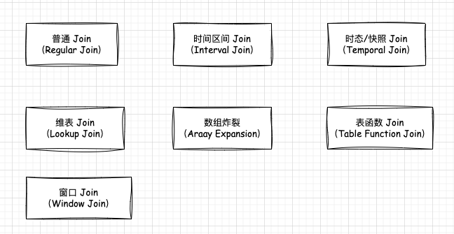

## Flink SQL Join 类型

### 介绍   
Flink SOL中可以支特多种流数据Join的类型, 下面来看一下:  

* Regular Join:    (普通Join)     
* Interval Join:   (时间区间Join)    
* Temporal Join:   (快照Voin域者是时态Join)   
* Lookup Join:     (维表Join)       
* Array Expansion: (数组炸裂)   
* Table Function Join: (表函数Join)         
* Window Join:     (窗口Join)   

这就是Flink SOL支持的Join类型 那接下来我们来详细分析一下这些Join类型。  

### Regular Join(普通Join)  
普通Join其实就是常规的双流Join，通过关联条件去关联两条实时数据流,对应的其实就是Flink SOL中的两个动态表的Join, 普通Join支特常规的Inner Join和Outer Join。 Outer Join对应的就是Left Join, Right Join利Full Join。针对这几种Join方式，`Inner Join在SQL语句中可以简写为Join, 在双流Join时，只有左右两边数据流中的数据都关联上了,才会输出结果 +[L,R], 结果中会包含这两条流中的数据。`    

* Left Join(Left Outer Join) 它属于简写形式，完整写法是Left Outer Join, 在双流Join时,只要左边数据流中的数据到达了。无论是否关联到右边数据流中的数据都会输出结果。如果关联到右边数据流中的数据了,则输出完整的结果 +[L,R]。如果没有关联到右边数据流中的数据, 则会使用 null 进行补全, 然后输出 +[L,null] 。 当右边数据流中的数据到达之后，也会到左边的数据流中进行关联 , 如果发现左边数据流之前输出过没有关联到的数据则会产生回徹流,将之前使用 null 补全的数据回撤掉 -[L,null] ,最后再重新输出关联后的数据 +[L,R]  

* Right Join(Right Outer Join) 它属于简写形式，完整写法是Right Outer Join，在双流Join时, 他的执行逻辑和Left Join 正好相反。 

* Full Join(Full Outer Join) 它属于简写形式，完整写法是Full Quter Join。双流Join时。左边或者右边数据流中数据到达了之后,无论是否关联到另一侧数据流中的数据，都会输出结果。 针对左边的数据流来说, 如果关联到了右边数据流中的数据，则输出 +[L,R] , 如果没有关联到。则输出 +[L,null]，针对右边的数据流来说，如果关联到了左边数据流中的数据, 则输出 +[L,R], 如果没有关联到，则输出 +[null,R], 针对这些没有关联的数据, 后期当数据到达之后，会产生回撤流, 将之前包含 null 的数据回撤掉, 再补全输出完整结果。   

