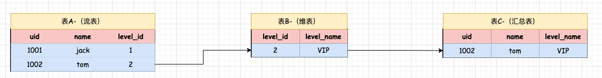
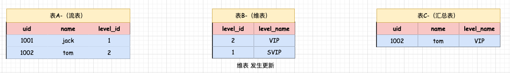
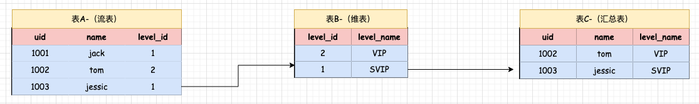

## Flink SQL 维表 Join  

### 介绍    
维表Join 是流与外部存储系统的Join, 例如 Redis,MySQL,HBase 等这些存储系统, Lookup的字面意思是实时查找的意思,而实时的一些维度数据一股都是存储在Redis、MySQL、HBase 等中的，这就是维表 Join的由来， 维表Join属于一种特殊的快照Join。所以他们的SQL JOIN 语法格式是一样的。`维表Join 对应的是一条实时数据流 Join外部存储的维度数据，外部存储的维度数据称为维表。 `       

那么双流Join和维表Join之间到底有什么区别？  
* 双流Join: 任意流中的数据发生了变化，另一个流都可以感知到。   
     
* 维表Join: 维表中数据发生变化的时候。流表中的历史数据是感知不到的, 相当于流表中的数据只能和维表当时的数据快照进行关联。     

### Join过程讲解    
    

首先看上面图，表A是一个流表,里面存储的是用户的基础信息其中有一个 level_id 字段, 存储的是等级id，具体的等级名称需要到表B中去关联, 所以这里的表B是一个维表，表B对应的存储系统可以是Redis、MySQL等。 当表A中的1001这条数据过来的时候, 会根据 level_id 的值主动到表B中去关联，发现关联不上就执行结束了， 当表A中的1002这条据过来的时候也会根据level_id的值主动到表B中去关联，此时可以关联上, 所以就输出关联后的数据了。            

    

注意, 表B不是一个流表，所以表B中数据新增的时候不会触发关联操作, 只有表A主动去关联表B，表B不会主动关联表A。此时表B这个维表中更新了一条数据, 警加了一条level_id为1的数据。 但是之前表A中level_id 为1的数据已经无法关联了, 它属于历史数据了， 继续向下看这个图:    

   

此时表A中进来了一条1003的数据。他的level_id 为1，所以到表B中是可以关联到数据，最终输出关联后的结果, 这就是维表loin的执行流程。          

针对维表JOIN 有一些注意事项：   
* 第一点：只支持 inner join 和 left join， 因为维表join属于特珠的快照join，只能支持左流主动到维表中关联数据。       

* 第二点：核心语法是FOR SYSTEM_TIME AS OF 和快照join的核心语法一样。    

* 第三点：维表join关联只能支持处理时间, 不支持事件时间。因为维表中没有事件时间甚至于维表中压根就没有时间字段。      

* 第四点：维表不需要定义主键，不是这须的，但是在快照join中右表是必须要定义主键的。  

* 地物点：JOIN的关联条件中必须包含等值条件，虽然说维表中没有主键字段,但是在关联的时候还是需要指定一个等值的关联条件， 这就是维表loin的一些特点。    

