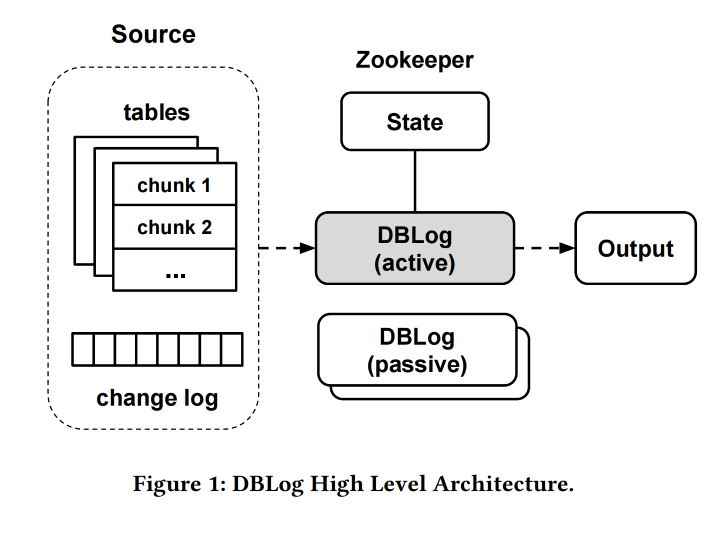
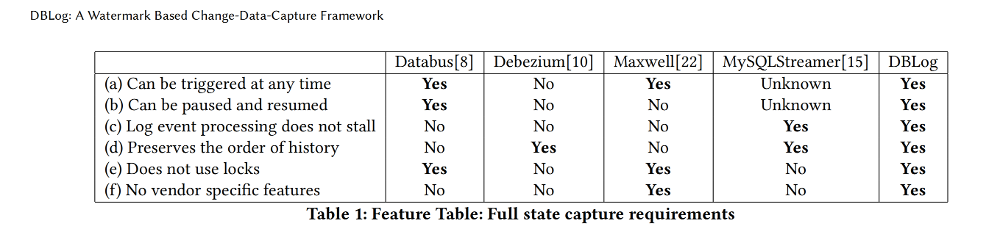
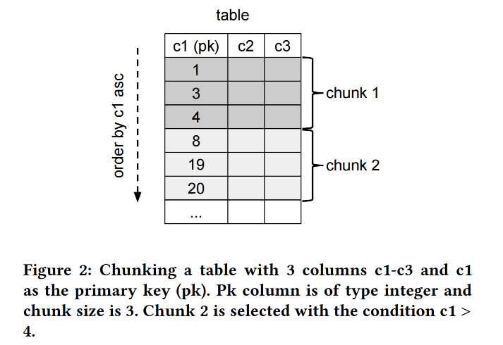
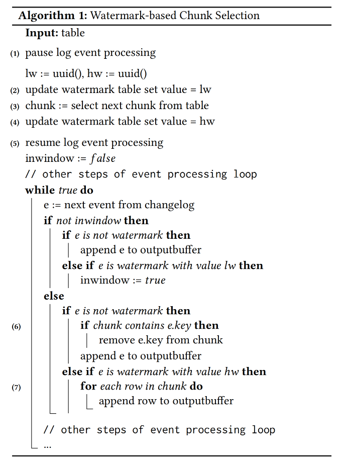
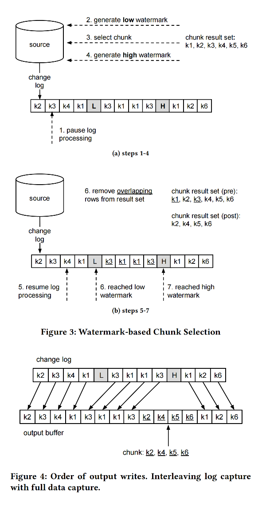

## DBLog 论文

>翻译

### 摘要

应用程序通常使用多种异构数据库是一个常见的模式，每种数据库都用于满足特定的需求，例如存储数据的规范形式或提供高级搜索功能。因此，应用程序希望能够保持多个数据库的同步。我们观察到了一系列试图解决此问题的独特模式，例如双写和分布式事务。然而，这些方法在可行性、稳健性和维护性方面都存在局限性。最近出现的一种替代方法是利用变更数据捕获（CDC）从数据库的事务日志中捕获已更改的行，并最终以低延迟将它们传递到下游。为了解决数据同步问题，还需要复制数据库的完整状态，而事务日志通常不包含更改的完整历史。与此同时，有些用例需要事务日志事件的高可用性，以确保数据库尽可能地保持同步。       

为了解决上述挑战，我们开发了一个名为DBLog的新型数据库CDC框架。DBLog采用基于水印的方法，允许我们将事务日志事件与我们直接从表中选择的行交错，以捕获完整状态。我们的解决方案允许日志事件在处理选择时继续进行，而不会停滞。可以随时在所有表上、特定表上或表的特定主键上触发选择。DBLog分块执行选择并跟踪进度，允许它们暂停和恢复。水印方法不使用锁，并且对源的影响最小。DBLog目前在Netflix的数十个微服务中投入生产使用。        

**关键词**
数据库，复制，变更数据捕获  

### 1 引言
Netflix 使用数百个微服务，每天在数据层执行数万亿次操作。由于没有单一的数据库设计可以满足所有需求，每个微服务都可以使用多种异构数据库。例如，一个服务可以使用 MySQL、PostgreSQL、Aurora 或 Cassandra 来处理操作数据，并使用 Elasticsearch 进行索引功能。为了保持多个数据库的同步，我们开发了一个名为 Delta [7] 的数据增强和同步平台。其中一个关键要求是从源到派生存储的传播延迟很低，并且事件流高度可用。实现这一点的关键要求是拥有变更数据捕获（CDC），它允许近乎实时地从数据库捕获已更改的行，并最终将这些行传播到下游消费者[11]。CDC 对于需要保持多个异构数据库同步的用例越来越受欢迎[8, 12, 16]，并解决了传统技术（如双写和分布式事务[13]）存在的挑战。      

在数据库系统中，事务日志通常只有有限的保留时间，并不能保证包含所有的更改历史。因此，还需要捕获数据库的完整状态。在Netflix的生产环境中进行数据同步操作时，我们确定了一些关于完整状态捕获的需求。我们希望：(a) 在任何时候都能触发完整状态的捕获。这是因为完整状态不仅在开始时需要，而且在之后的任何时候都可能需要。例如，如果数据库从备份中恢复，或者在下游出现数据丢失或损坏时进行修复。还有一些情况只需要修复部分数据，例如，如果确定下游的特定行集已经损坏。 (b) 在任何时候都能暂停或恢复，这样在重新启动过程后，对于大表的完整状态捕获不需要从头开始。 (c) 同时捕获事务日志事件和完整状态，而不会阻塞其中任何一个。有些用例需要事务日志事件的高可用性，以保证与源的复制延迟保持在最小。 (d) 防止时间旅行，当将事件传输到派生的数据存储时，保留历史的顺序。这样，行的早期版本（如会员账户的居住地址）不会在后来的版本之后传送。因此，解决方案必须结合事务日志事件和完整状态，以保留更改的历史。 (e) 将其提供为一个平台。因此，最大限度地减少对源数据库的影响至关重要。否则，这可能会妨碍平台的采纳，尤其是对于流量较大的用例。在这方面，我们希望避免使用诸如表锁这样的原语，因为它们可能会阻塞应用程序的写入流量。 (f) 能够在我们在生产中使用的各种关系数据库管理系统（RDMBS）上运行，例如MySQL、PostgreSQL、Aurora [19]等。为了实现这一点，我们希望避免使用特定于供应商的功能。         

基于这些需求，我们开发了DBLog。DBLog作为一个进程运行，并采用基于水印的方法，允许事务日志事件与我们直接从表中选择的行交错，以捕获数据库的完整状态。我们的解决方案允许日志事件在执行选择时继续进行，而不会停滞。可以随时在所有表上、特定表上或表的特定主键上触发选择。DBLog分块处理选择，并在状态存储（目前是Zookeeper）中跟踪进度，允许它们从上次完成的块暂停和恢复。水印方法不使用表锁，因此对源数据库的影响最小。DBLog使用相同的格式将捕获的事件传送到输出，无论其来源是事务日志还是表选择。输出可以是像Kafka [21]这样的流，如果有多个消费者消费事件，这是一个常见的选择。但是，DBLog也可以直接写入数据存储或APIs。    

  

DBLog还考虑到了高可用性（HA），采用了一个主-备架构，其中一次只有一个DBLog进程处于活动状态，多个被动进程处于待机状态，如果需要，可以接管并恢复工作。因此，下游消费者可以确信在源头发生变化后不久就能接收到行数据。图1描述了DBLog的高级架构。     

### 2 相关工作
我们评估了一系列现有的解决方案，如：Databus [8]、Debezium [10]、Maxwell [22]、MySQLStreamer [15]、SpinalTap [6] 和 Wormhole [16]。现有的解决方案在从事务日志捕获事件方面都很相似，并使用相同的底层协议和API，如MySQL的binlog复制协议或PostgreSQL的复制插槽。捕获的事件被序列化成专有的事件格式并发送到输出，通常是Kafka。像SpinalTap和Wormhole这样的一些解决方案只提供日志处理，而没有内置的捕获数据库完整状态的能力，这种情况下，需要在带外处理完整状态的捕获。有些现有的解决方案具有捕获完整状态的内置能力。由于事务日志通常只有有限的保留时间，因此不能用来重建完整的源数据集。现有的解决方案以不同的方式解决这个问题，各有利弊。        

Databus [8]拥有一个引导服务，该服务从源读取事务日志事件并将其存储在另一个数据库中。如果下游消费者需要初始化或进行修复，他们可以访问这个引导服务。引导后，消费者开始处理来自引导前时间的日志事件，以便有重叠并且不会错过任何事件。从日志中的追赶可能导致时间旅行，其中来自引导的行状态可能具有更近的行状态，而后来从日志中捕获了较旧的状态。最终，将从事务日志中发现最新的状态。     

Debezium [10] 通过使用表锁和在一个事务中跨所有表运行选择来为MySQL和PostgreSQL捕获一个一致的快照。然后从事务之后的时间捕获事务日志中的事件，一旦选择了所有现有的行。根据实现和数据库，这种锁定的持续时间可以是短暂的，或者可以持续整个选择过程，例如在MySQL RDS [10]中。在后一种情况下，写入流量被阻塞，直到选择了所有的行，对于大型数据库，这可能是一个很长的时间段。      

在Maxwell [22]中，通过暂停事务日志处理来执行转储，然后从所需的表中选择行。之后，日志事件处理恢复。这种方法容易出现时间旅行，其中选择可以返回行的更近的值，而后来从日志中捕获了较旧的值。最终，最新的状态将从日志中被消耗。

MySQLStreamer [15]在源头为每个表创建一个副本，即复制表。然后，将原始表中的行分块插入到复制表中，从而产生插入的事务日志条目。使用MySQL黑洞引擎创建复制表，这样插入不会占用表空间，同时仍然生成事务日志事件。使用锁定来确保不违反历史的顺序。然后，MySQLStreamer服务从事务日志中消费事件，并能够检测到来自复制表的事件，将它们标记为原始表的事件。这样，下游消费者接收到的每个表的事件要么来源于实际的应用程序更改，要么来源于复制表。    

表1列出了我们在第1节中列举的关于捕获完整状态的要求，并在现有的解决方案中进行了比较。我们发现没有现有的方法能满足所有的要求。一些限制是由设计导致的，比如首先尝试选择一个一致的快照，然后再捕获日志事件。选择特定于供应商的功能（如MySQL的黑洞引擎）是另一个观察到的问题，它禁止了跨数据库的代码重用。一些解决方案还使用表锁，这可能会在短时间或长时间内阻塞应用程序的写入流量。鉴于这些观察，我们决定实施一种新的处理转储的方法，一种满足我们所有要求的方法。       

  

### 3 DBLOG
DBLog是一个基于Java的框架，能够从数据库的事务日志中捕获已更改的行，并通过在表上执行选择来捕获数据库的完整状态。选择是分块执行的，并与日志事件交错，这样日志事件处理不会长时间停滞。这是通过使用基于水印的方法来实现的。可以在运行时通过API执行选择。这允许最初或在以后的某个时间用完整状态引导DBLog的输出进行修复。如果输出是启用了日志压缩的Kafka，那么下游消费者可以通过从Kafka读取事件来引导，这些事件将包含完整的数据集，并通过附加从源捕获的已更改的行来不断更新。对于只有一个消费者的用例，DBLog也可以直接向数据存储或API发出事件。       

我们设计了这个框架，使得对数据库的影响最小。如有需要，可以暂停和恢复选择。这既与故障恢复相关，也与数据库达到瓶颈时停止处理相关。我们还避免了对表的锁定，因此不会阻塞应用程序的写入。我们使用Zookeeper [1]来存储与日志事件处理和块选择相关的进度。我们还使用Zookeeper进行领导者选举，以确定活动进程，而其他进程保持空闲作为被动备份。我们选择Zookeeper是因为它的成熟度、读写的低延迟、在需要时支持线性可读性[20]，以及如果节点的法定人数是可达的，它对写入的可用性。我们构建DBLog时考虑到了可插拔性，允许根据需要交换实现，从而可以用另一个数据存储替换Zookeeper。

以下小节将更详细地解释事务日志捕获和完整状态捕获。      

#### 3.1 事务日志捕获
该框架要求数据库为按提交顺序的每个更改的行发出一个事件。在MySQL和PostgreSQL中，存在一个复制协议，其中数据库在提交时间后不久通过TCP套接字将事件传递给DBLog。事件可以是以下类型：创建、更新或删除。对于我们的用例，我们假设事件包含操作发生时的所有列值。尽管如此，如果捕获了列的子集，DBLog也可以使用。对于每个事件，我们假设有一个日志序列号（LSN），它是事务日志上的事件的偏移量，并被编码为一个8字节的单调递增的数字。    

每个事件都被序列化为DBLog事件格式，并被追加到一个输出缓冲区，该缓冲区是内存中的并且是DBLog进程的一部分。另一个线程然后从输出缓冲区消费事件，并按顺序将它们发送到实际的输出。输出是一个简单的接口，允许插入任何目的地，如流、数据存储，或通常是任何具有API的服务。       

我们还捕获了模式更改。模式更改捕获的性质因数据库而异，因此日志中可能有模式更改增量，或者数据库可能在每个发出的事件中包含模式信息。由于空间限制，本文没有涉及我们在DBlog中如何处理模式捕获。         

#### 3.2 完整状态捕获
由于事务日志通常具有有限的保留时间，因此它们不能用于重建完整的源数据集。当尝试解决这个问题时，两个主要的挑战是确保日志处理不会停滞，并且历史的顺序得到保留。解决此问题的一个现有解决方案是在源数据库创建每个表的副本，并分块填充它，这样复制的行将以正确的顺序出现在事务日志中。然后，人们可以消费事务日志事件，并接收所有行的最新状态和更改的行[15]。然而，这种解决方案会消耗源的写入I/O并需要额外的磁盘空间。通过使用特定于供应商的功能，如MySQL的黑洞引擎，可以防止占用额外的表空间。

我们开发了一个解决方案来解决这个问题，该解决方案只使用常用的数据库功能，并尽可能减少对源数据库的影响。我们没有实际将行的最新状态写入事务日志，而是从表中分块选择行，并在内存中将块与我们从事务日志捕获的事件相邻。这是以一种保留日志事件历史的方式完成的。      

我们的解决方案允许在任何时候通过API提取所有表、特定表或表的特定主键的完整状态。选择是按表执行的，并且是按配置的大小分块的。通过按升序主键排序表并包括行来选择块，其中主键大于前一个块的最后一个主键。为了最大程度地减少对源数据库的影响，这个查询必须高效运行。出于这些原因，DBLog要求数据库提供一个高效的主键范围扫描，我们只允许在具有主键的表上进行选择。图2用一个简单的例子说明了块选择。           

我们在Zookeeper中存储了已完成块的最后一行，这样我们可以在最后完成的块之后暂停和恢复。块需要以一种保留日志更改历史的方式进行处理，这样返回旧值的块选择不能覆盖从事务日志捕获的新状态，反之亦然。为了实现这一点，我们在事务日志中创建了可识别的水印事件，这样我们就可以对块选择进行排序。水印是通过在源数据库创建的表来实现的。该表存储在一个专用的命名空间中，因此与应用表不会发生冲突。只插入了一个行，该行存储一个通用唯一标识符（UUID）值。然后通过更新该行的UUID值生成一个水印。行更新导致了一个更改事件，最终被DBLog捕获。      

算法1描述了基于水印的方法来选择特定表的下一个块。只要表还有剩余的块，就重复该算法。日志事件处理会短暂暂停（步骤1）。通过更新水印表生成水印（步骤2和4）。块选择发生在两个水印之间，并且块存储在内存中（步骤3）。写入高水印后，我们恢复日志事件处理，将接收到的日志事件发送到输出，并在日志中监视低水印事件。一旦接收到低水印事件，我们开始从内存中的块中删除所有在水印之间更改的主键的行（步骤6）。一旦接收到高水印事件，我们最终将所有剩余的块条目追加到输出缓冲区，然后再以顺序方式处理日志事件（步骤7）。     

步骤3的块选择需要返回代表到某个历史点的已提交更改的状态。或者等效地：选择在事务日志的特定位置上执行，考虑到那一点的已提交事务。数据库通常不会公开选择在事务日志上的执行位置（MariaDB是一个例外[9]）。我们方法的核心思想是确定事务日志上的一个窗口，该窗口保证包含块选择。通过写入低水印打开窗口，然后运行选择，然后通过写入高水印关闭窗口。由于选择的确切位置未知，因此将删除所有与该窗口内的日志事件冲突的所选块行。这确保块选择不能覆盖日志更改的历史记录。为了使这个工作，我们必须从低水印写入的时间或之后读取表状态（包括在低水印写入后和读取前提交的更改是可以的）。更一般地说，要求块选择看到其执行之前提交的更改。我们将这种能力定义为“非过时读取”。此外，由于之后写入了高水印，我们要求选择在此之前执行。       

图3a和3b说明了块选择的水印算法。我们提供了一个具有主键k1到k6的表的示例。每个更改日志条目代表主键的创建、更新或删除事件。图中的步骤对应于算法1的标签。在图3a中，我们展示了水印生成和块选择（步骤1到4）。在步骤2和4更新水印表会创建两个更改事件（用闪电突出显示），这些事件最终通过更改日志接收。在图3b中，我们关注在水印之间出现的主键从结果集中删除的选定块行（步骤5到7）。

[注：由于文本中没有实际的图形，所以这只是对描述的文字解释。在实际的图形上，这些步骤和事件应该会更加清晰。]  

#### 3.3 数据库支持
为了使用DBLog，数据库需要从按提交顺序的线性历史中发出更改的行，并支持非过时的读取。这些条件由MySQL、PostgreSQL、MariaDB等系统满足，因此这个框架可以在这些类型的数据库中统一使用。       

到目前为止，DBLog支持MySQL、PostgreSQL和Aurora。在所有情况下，日志事件都按提交顺序由数据库提供[2][4]，并且通过对单个选择事务的读已提交隔离级别可以进行非过时的读取[3][5]。为了集成日志事件，对于MySQL，我们使用MySQL二进制日志连接器[17]，它实现了binlog复制协议。对于PostgreSQL，我们使用wal2json插件[18]的复制槽。通过流复制协议接收更改，该协议由PostgreSQL Java数据库连接（JDBC）驱动程序实现。确定每次捕获更改的模式在MySQL和PostgreSQL之间有所不同。在PostgreSQL中，wal2json包含列名和类型以及列值。在MySQL中，作为binlog事件接收模式更改增量。       

通过使用SQL和JDBC，集成了完整状态捕获，只需要实现块选择和水印更新。MySQL和PostgreSQL使用相同的代码，也可以用于其他支持JDBC的数据库。转储处理本身不依赖于SQL或JDBC，并允许集成满足DBLog框架要求的数据库，即使它们不是RDBMS数据库。       

### 4 DBLog在生产中的应用

DBLog是Netflix的MySQL和PostgreSQL连接器的基础。它们都在我们称为Delta [7]的数据同步和丰富平台中使用。自2018年以来，DBLog一直在生产中运行，截至本文写作时，它已在Netflix的约30个生产用途服务中部署。这些用例跨越了异构数据复制、数据库活动日志记录和模式迁移。    

异构数据复制：为了跟踪生产情况，搜索与电影相关的所有数据至关重要。这涉及由单独的团队管理的数据，每个团队都拥有不同的业务实体，如剧集、人才和交易。这些服务在AWS RDS中使用MySQL或PostgreSQL存储其数据。DBLog部署到每个涉及的数据存储，并将完整的数据集和实时更改捕获到输出流中。然后将流连接并摄取到ElasticSearch中的公共搜索索引中，提供跨所有涉及实体的搜索。  

数据库活动日志记录：DBLog也用于记录数据库活动，以便可以用来检查数据库上发生了哪些更改。在这种情况下，捕获了更改的行并将其传送到流中。然后流处理器将事件传播到ElasticSearch（用于短期存储）和Hive（用于长期存储）。在ElasticSearch中使用Kibana构建活动仪表板，以便团队可以检查每个表发生的操作数量。这用于检查数据变异模式，并且在新服务代码发布后出现错误，检测到意外模式（例如插入到表中的下降）至关重要。 

模式迁移：当团队将一个MySQL数据库迁移到另一个数据库，并在第二个数据库中使用新的表结构时。DBLog部署在旧数据库上，既可以捕获完整状态，也可以捕获新的更改，并将它们写入流中。然后，Flink作业消费这些数据，将它们转换为新的表模式格式，并将它们写入新数据库。这样，可以通过在填充的新模式上运行来提前验证新数据库的读取，而写入仍然发生在旧模式上。在后续步骤中，写入流量也可以发生在新模式上，并且可以停止旧数据库上的流量。       

### 5 结论

在本文中，我们介绍了一个新颖的基于水印的CDC框架。DBLog的功能不仅扩展了从数据库事务日志实时捕获更改的行，还作为一个集成的提供来提取数据库的完整状态。此外，DBLog为用户提供端点，以便随时请求完整状态并执行它，而不会阻塞日志事件处理。这是通过在表上执行选择来实现的，这些选择是分块的，并将获取的行与日志事件交错，以便两者都可以进展。同时，由于基于水印的方法，始终保留了历史的原始顺序，而不使用源数据库上的锁。此外，还制定了控制措施，允许节流块选择，或在需要时暂停和恢复。当在非常大的表上捕获完整状态并且进程崩溃时，这尤其相关，因此不需要从头开始重复该过程。DBLog旨在将事件传递给任何输出，无论是数据库、流还是API。这些功能为同步多个数据系统开辟了新的途径。   

由于Netflix操作了数百个具有独立数据需求的微服务，DBLog已成为Netflix数据同步和丰富平台的基础。它消除了应用程序开发人员在维护多个数据存储中的复杂性。DBLog及其基于水印的方法旨在为RDBMS类型的数据库工作。作为下一步，我们正在研究其他CDC框架以支持不属于DBLog框架的数据库，例如多主NoSQL数据库，如Apache Cassandra [14]。目标是支持与DBLog类似的功能，即：随时捕获完整状态的能力，与日志事件交错，并对源产生最小的影响。  

致谢

我们要感谢按字母顺序排列的以下同事为DBLog的开发做出的贡献：Josh Snyder、Raghuram Onti Srinivasan、Tharanga Gamaethige和Yun Wang。       

REFERENCES  
[1] 2010. Apache Zookeeper. https://zookeeper.apache.org/.  
[2] 2020. MySQL 5.7 Reference Manual - 5.4.4 The Binary Log. https://dev.mysql.
com/doc/refman/5.7/en/binary-log.html.  
[3] 2020. MySQL 5.7 Reference Manual - Consistent Nonlocking Reads. https:
//dev.mysql.com/doc/refman/5.7/en/innodb-consistent-read.html.  
[4] 2020. PostgreSQL 9.6 Documentation - Logical Decoding Output Plugins. https:
//www.postgresql.org/docs/9.6/logicaldecoding-output-plugin.html.   
[5] 2020. PostgreSQL 9.6 Documentation - Transaction Isolation. https://www.
postgresql.org/docs/9.6/transaction-iso.html#XACT-READ-COMMITTED.   
[6] Airbnb. 2018. Change Data Capture (CDC) service. https://github.com/airbnb/
SpinalTap.  
[7] Andreas Andreakis, Falguni Jhaveri, Ioannis Papapanagiotou, Mark Cho, Poorna
Reddy, and Tongliang Liu. 2019. Delta: A Data Synchronization and Enrichment Platform. https://netflixtechblog.com/delta-a-data-synchronization-andenrichment-platform-e82c36a79aee.  
[8] Shirshanka Das, Chavdar Botev, Kapil Surlaker, Bhaskar Ghosh, Balaji Varadarajan, Sunil Nagaraj, David Zhang, Lei Gao, Jemiah Westerman, Phanindra Ganti,
Boris Shkolnik, Sajid Topiwala, Alexander Pachev, Naveen Somasundaram, and
Subbu Subramaniam. 2012. All aboard the Databus!: Linkedin’s scalable consistent change data capture platform.. In SoCC, Michael J. Carey and Steven
Hand (Eds.). ACM, 18. http://dblp.uni-trier.de/db/conf/cloud/socc2012.html#
DasBSGVNZGWGSTPSS12 
[9] Maria DB. 2020. Enhancements for START TRANSACTION WITH CONSISTENT
SNAPSHOT. https://mariadb.com/kb/en/enhancements-for-start-transactionwith-consistent-snapshot/.       
[10] Debezium documentation. 2020. Debezium Connector for MySQL. Snapshots section. https://debezium.io/documentation/reference/1.2/connectors/mysql.html#
how-the-mysql-connector-performs-database-snapshots_debezium.   
[11] Martin Kleppmann. 2017. Designing Data-Intensive Applications. O’Reilly,
Beijing. https://www.safaribooksonline.com/library/view/designing-dataintensive-applications/9781491903063/    
[12] Martin Kleppmann, Alastair R. Beresford, and Boerge Svingen. 2019. Online event
processing. Commun. ACM 62, 5 (2019), 43–49. https://doi.org/10.1145/3312527    
[13] Kleppmann, Martin. 2015. Using logs to build a solid data infrastructure (or: why
dual writes are a bad idea). https://www.confluent.io/blog/using-logs-to-builda-solid-data-infrastructure-or-why-dual-writes-are-a-bad-idea.    
[14] Avinash Lakshman and Prashant Malik. 2010. Cassandra: a decentralized structured storage system. ACM SIGOPS Operating Systems Review 44, 2 (2010), 35–40.     
[15] Prem Santosh Udaya Shankar. 2016. Streaming MySQL tables in real-time to
Kafka. https://engineeringblog.yelp.com/2016/08/streaming-mysql-tables-inreal-time-to-kafka.html.  
[16] Yogeshwer Sharma, Philippe Ajoux, Petchean Ang, David Callies, Abhishek
Choudhary, Laurent Demailly, Thomas Fersch, Liat Atsmon Guz, Andrzej Kotulski, Sachin Kulkarni, Sanjeev Kumar, Harry Li, Jun Li, Evgeniy Makeev, Kowshik
Prakasam, Robbert Van Renesse, Sabyasachi Roy, Pratyush Seth, Yee Jiun Song,
Benjamin Wester, Kaushik Veeraraghavan, and Peter Xie. 2015. Wormhole:
Reliable Pub-Sub to Support Geo-replicated Internet Services. In 12th USENIX
Symposium on Networked Systems Design and Implementation (NSDI 15). USENIX
Association, Oakland, CA, 351–366. https://www.usenix.org/conference/nsdi15/
technical-sessions/presentation/sharma  
[17] Stanley Shyiko. 2010. MySQL Binary Log Connector. https://github.com/shyiko/
mysql-binlog-connector-java.    
[18] Euler Taveira. 2014. wal2json - JSON output plugin for changeset extraction.
https://https://github.com/eulerto/wal2json.    
[19] Alexandre Verbitski, Anurag Gupta, Debanjan Saha, Murali Brahmadesam,
Kamal Gupta, Raman Mittal, Sailesh Krishnamurthy, Sandor Maurice, Tengiz
Kharatishvili, and Xiaofeng Bao. 2017. Amazon aurora: Design considerations
for high throughput cloud-native relational databases. In Proceedings of the 2017
ACM International Conference on Management of Data. 1041–1052.      
[20] Paolo Viotti and Marko Vukoliundefined. 2016. Consistency in Non-Transactional
Distributed Storage Systems. ACM Comput. Surv. 49, 1, Article 19 (June 2016),
34 pages. https://doi.org/10.1145/2926965   
[21] Guozhang Wang, Joel Koshy, Sriram Subramanian, Kartik Paramasivam, Mammad
Zadeh, Neha Narkhede, Jun Rao, Jay Kreps, and Joe Stein. 2015. Building a
Replicated Logging System with Apache Kafka. Proc. VLDB Endow. 8, 12 (Aug.
2015), 1654–1655. https://doi.org/10.14778/2824032.2824063  
[22] Zendesk. 2014. Maxwell’s daemon, a MySQL-to-JSON Kafka producer. https:
//github.com/zendesk/maxwell.   

refer   
1.https://arxiv.org/pdf/2010.12597v1.pdf        
2.https://netflixtechblog.com/dblog-a-generic-change-data-capture-framework-69351fb9099b    
3.https://www.infoq.cn/article/f5vbmcffdpg0tocgok35 

