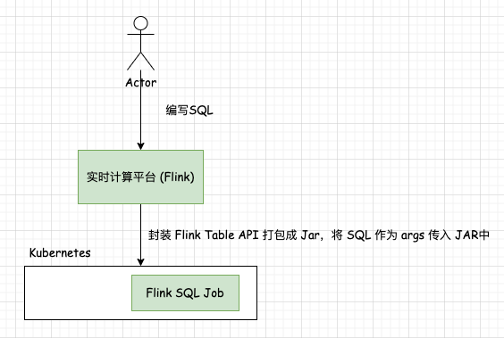

## Flink SQL 项目搭建   

>该项目目的是简化Flink SQL的开发步骤    

### 背景    
生产Job业务场景，我们几乎很少会去用 `Flink SQL Cli` 提交 SQL Job，多数情况下会基于实时计算平台平台（Flink）编写Flink SQL后部署Flink SQL Job。    
      

在学习或者测试Flink SQL功能过程，Flink为我们提供了两种`Flink SQL Cli` 和 `Flink Table API & SQL`调用方式， Flink SQL Cli固然好用，但在真实生产环境，几乎是使用`Flink Table API & SQL`方式部署Flink Job，`Shell`固然好用，但对于平台化来说这肯定是远远不够。 而使用`Flink Table API & SQL`方式则增加了我们开发成本，例如下面示例：   
```java
public class Demo6_Exercise {
    public static void main(String[] args) {
        TableEnvironment tenv = TableEnvironment.create(EnvironmentSettings.inStreamingMode());

        // 建表（数据源表）
        tenv.executeSql(
                "create table t_person                                 "
                        + " (                                                   "
                        + "   id int,                                           "
                        + "   name string,                                      "
                        + "   nick string,                                      "
                        + "   age int,                                          "
                        + "   gender string                                     "
                        + " )                                                   "
                        + " WITH (                                              "
                        + "  'connector' = 'kafka',                             "
                        + "  'topic' = 'yzhoutp01',                              "
                        + "  'properties.bootstrap.servers' = 'yzhou.com:9092',   "
                        + "  'properties.group.id' = 'g1',                      "
                        + "  'scan.startup.mode' = 'earliest-offset',           "
                        + "  'format' = 'json',                                 "
                        + "  'json.fail-on-missing-field' = 'false',            "
                        + "  'json.ignore-parse-errors' = 'true'                "
                        + " )                                                   "
        );


        // 建表（目标表）
        // kafka 连接器，不能接受  UPDATE 修正模式的数据，只能接受INSERT模式的数据
        // 而我们的查询语句产生的结果，存在UPDATE模式，就需要另一种 连接器表（upsert-kafka）来接收
        tenv.executeSql(
                "create table t_nick_cnt                               "
                        + " (                                                   "
                        + "   nick string primary key not enforced,             "
                        + "   user_cnt bigint                                   "
                        + " )                                                   "
                        + " WITH (                                              "
                        + "  'connector' = 'upsert-kafka',                      "
                        + "  'topic' = 'yzhoutp02',                           "
                        + "  'properties.bootstrap.servers' = 'yzhou.com:9092',   "
                        + "  'key.format' = 'json' ,                            "
                        + "  'value.format' = 'json'                            "
                        + " )                                                   "
        );


        // 查询 并 打印
        //TableResult tableResult = tenv.executeSql("select nick,count(distinct id) as user_cnt from t_person group by nick");
        tenv.executeSql(
                "insert into t_nick_cnt " +
                        "select nick,count(distinct id) as user_cnt from t_person group by nick");

    }
}
``` 

你肯定能想到接下来的日子里，你都需要创建一个Class，里面包含不同的SQL语句，需手动拼接 SQL 语句， 所以 这里提出一个优化， 可否将 Flink SQL放入项目`resources`目录下，对于不同的SQL，我们只需新增一个SQL文件，在`main`指定不同的SQL文件路径即可。  

### 优化项目
从 resources 目录在读取 SQL,在利用`;`分割 SQL，再分别执行。 此处需注意的是在DEV 过程中，我们希望将结果打印出来，则将 `tableResult.print();` 注释放开即可。  
代码如下：      
```java
public class SqlRunner_PrintResult {

    private static final Logger LOG = LoggerFactory.getLogger(SqlRunner_PrintResult.class);

    private static final String STATEMENT_DELIMITER = ";"; // a statement should end with `;`
    private static final String LINE_DELIMITER = "\n";

    private static final String COMMENT_PATTERN = "(--.*)|(((\\/\\*)+?[\\w\\W]+?(\\*\\/)+))";

    public static void main(String[] args) throws Exception {
        String scriptFilePath = "/Users/a/Code/Java/flink-tutorial/flink-sql/src/main/resources/MySQLCDCSource.sql";
        if (args.length == 1) {
            scriptFilePath = args[0];
        }

        String script = FileUtils.readFileUtf8(new File(scriptFilePath));
        List<String> statements = parseStatements(script);

        //建立Stream环境，设置并行度为1
        StreamExecutionEnvironment env = StreamExecutionEnvironment.getExecutionEnvironment().setParallelism(1);
        env.setRestartStrategy(RestartStrategies.fixedDelayRestart(
                3, // 尝试重启的次数
                Time.of(10, TimeUnit.SECONDS) // 间隔
        ));
        //建立Table环境
        StreamTableEnvironment tableEnvironment = StreamTableEnvironment.create(env);
        TableResult tableResult = null;
        for (String statement : statements) {
            LOG.info("Executing:\n{}", statement);
            System.out.println("Executing: " + statement);
            tableResult = tableEnvironment.executeSql(statement);
        }
//        ** executeSql是一个异步的接口，在idea里面跑的话，直接就结束了，需要手动拿到那个executeSql的返回的TableResult
        //tableResult.getJobClient().get().getJobExecutionResult().get();
        tableResult.print();
    }

    public static List<String> parseStatements(String script) {
        String formatted = formatSqlFile(script).replaceAll(COMMENT_PATTERN, "");
        List<String> statements = new ArrayList<String>();

        StringBuilder current = null;
        boolean statementSet = false;
        for (String line : formatted.split("\n")) {
            String trimmed = line.trim();
            if (trimmed == null || trimmed.length() < 1) {
                continue;
            }
            if (current == null) {
                current = new StringBuilder();
            }
            if (trimmed.startsWith("EXECUTE STATEMENT SET")) {
                statementSet = true;
            }
            current.append(trimmed);
            current.append("\n");
            if (trimmed.endsWith(STATEMENT_DELIMITER)) {
                if (!statementSet || trimmed.equals("END;")) {
                    // SQL语句不能以分号结尾
                    statements.add(current.toString().replace(";", ""));
                    current = null;
                    statementSet = false;
                }
            }
        }
        return statements;
    }

    public static String formatSqlFile(String content) {
        String trimmed = content.trim();
        StringBuilder formatted = new StringBuilder();
        formatted.append(trimmed);
        if (!trimmed.endsWith(STATEMENT_DELIMITER)) {
            formatted.append(STATEMENT_DELIMITER);
        }
        formatted.append(LINE_DELIMITER);
        return formatted.toString();
    }

}
```

示例SQL：   
```sql
-- witch 参数 https://ververica.github.io/flink-cdc-connectors/master/content/connectors/mysql-cdc%28ZH%29.html#id6
CREATE TABLE `yzhou_source_yzhou_test01`
(
    `id`      INT    NOT NULL COMMENT '',
    `name`    STRING NOT NULL COMMENT '',
    `address` STRING COMMENT '',
    PRIMARY KEY (id) NOT ENFORCED
)
    WITH
        (
        'connector' = 'mysql-cdc',
        'hostname' = '127.0.0.1',
        'port' = '3306',
        'username' = 'root',
        'password' = '12345678',
        'database-name' = 'yzhou_test',
        'table-name' = 'users',
        'server-id' = '5401',
        'scan.startup.mode' = 'initial'
        );

select * from yzhou_source_yzhou_test01;
```

完成以上即可。 :)

refer   
1.https://nightlies.apache.org/flink/flink-docs-release-1.17/docs/dev/table/overview/   
