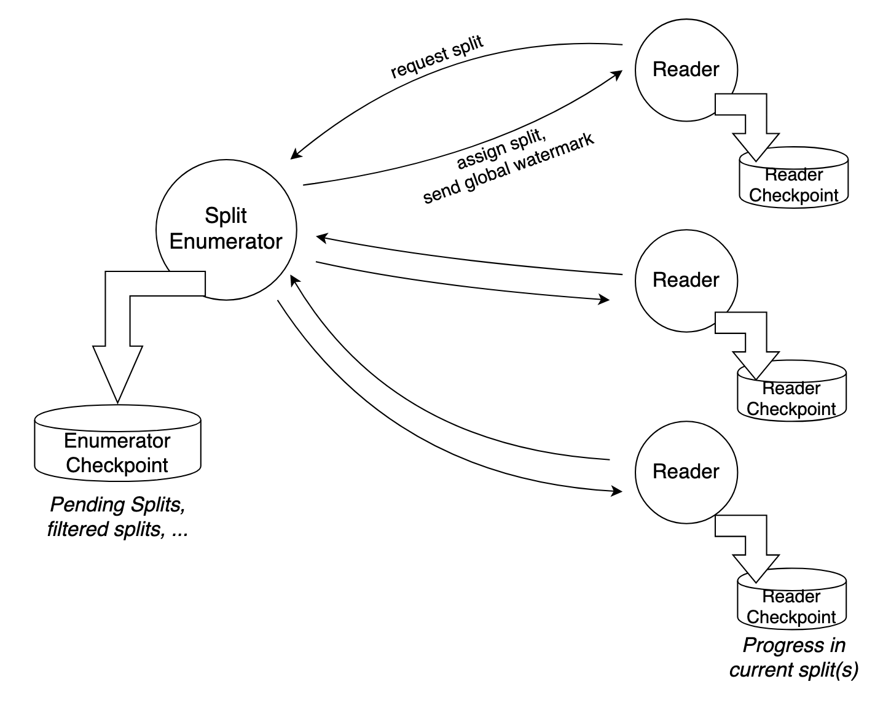
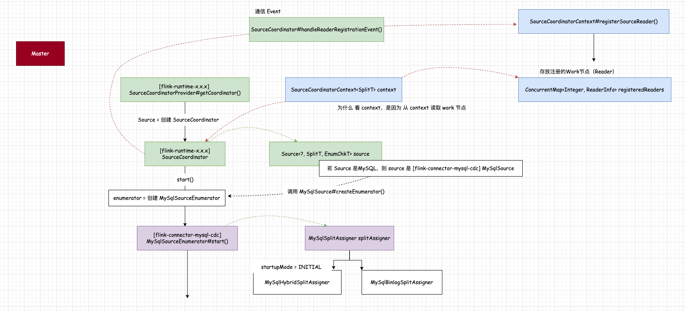
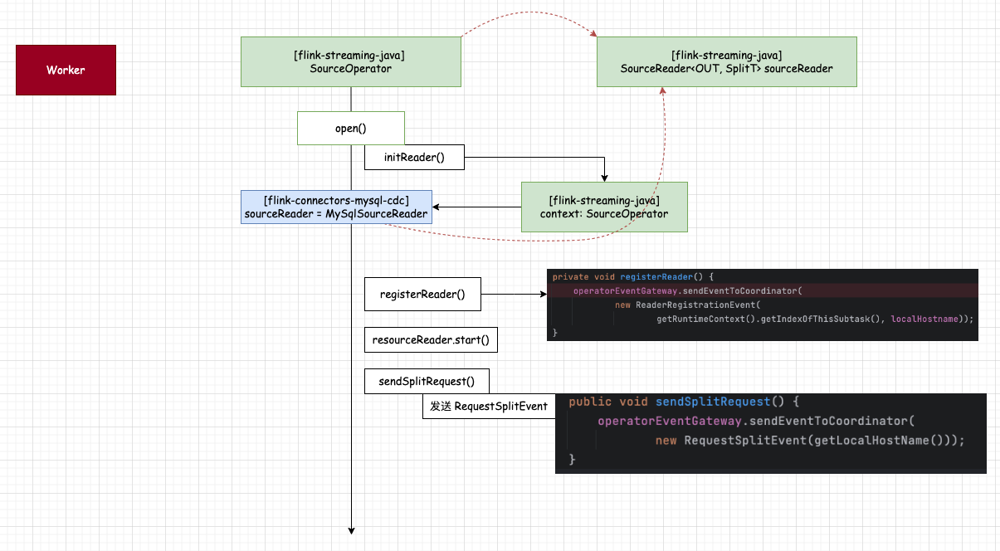
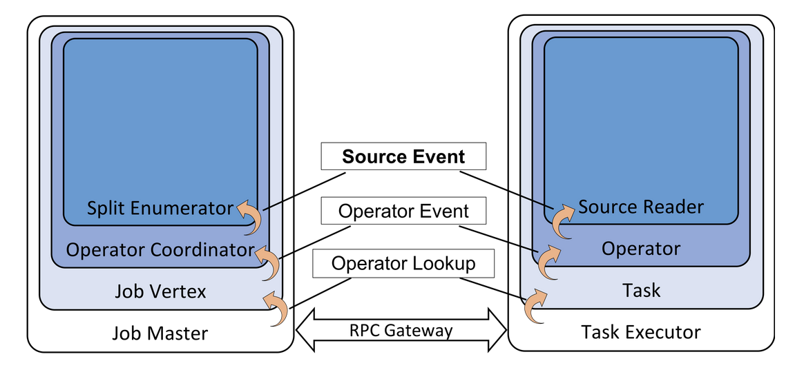
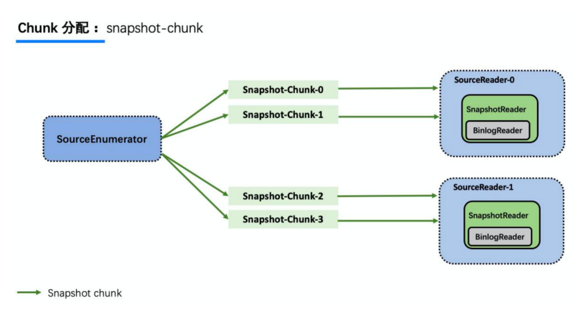
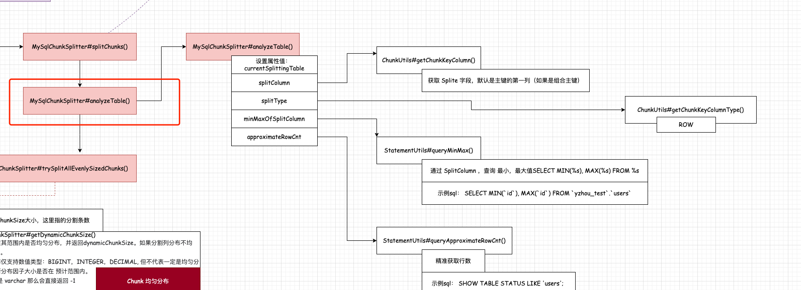
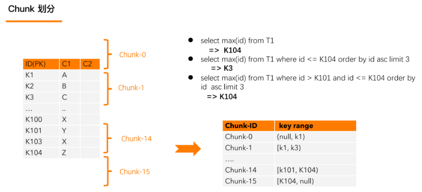
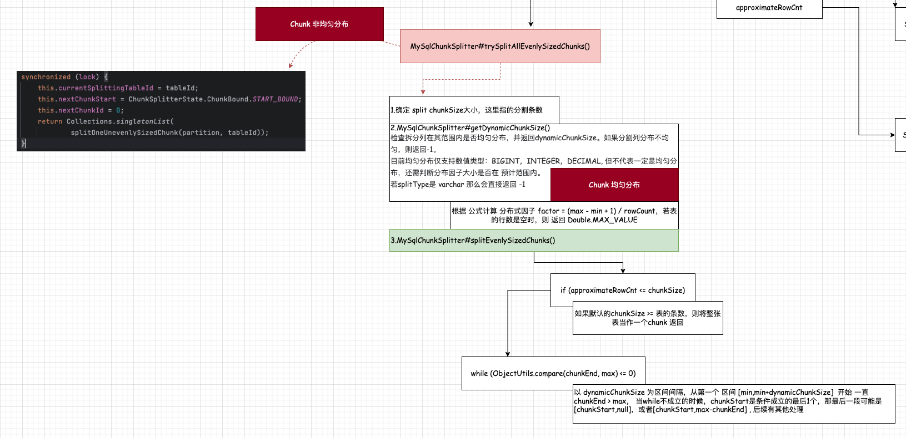

## Flink CDC 2.4 原理分析   

>flink-cdc-connectors version: 2.4.0, 随着版本迭代,FLIP-27仅可做参考，避免实际代码处理与该FLIP有较大不同。  

### Flink CDC 演进      
该篇幅不过多阐述，本人也是直接上手flink cdc 2.x,没有 1.x 实战经验，所以下面算是摘抄其他的内容：     
Flink CDC 1.x的底层是基于debezium来实现的，通过捕获变更数据（Change Data Capture）来实现从不同的数据源采集数据, 以MySQL CDC为例，`Flink CDC Connectors`项目设置`server-id`参数模拟自身是MySQL集群中的 **Slave**节点。从而读取Master Binlog数据。但在支持 全量+增量 模式下，为了保证 snapshot 阶段数据的一致性，通过对表加锁来实现，全局锁可能导致数据库被夯住，特别在表特别大的时候，仅在单并发处理下（1.x 只支持单并发），那加锁的时间出现不可评估， 通过其他Blog了解到 1.x 全量读取阶段不支持 checkpoint，那么 fail后只能重新读取。           
    
大伙可参考 `https://cwiki.apache.org/confluence/display/FLINK/FLIP-27%3A+Refactor+Source+Interface` 中的**Motivation** 章节，以下是ChatGPT直翻内容：    
```
**动机**    

此FLIP旨在解决当前流处理源接口（SourceFunction）的若干问题/缺陷，并同时统一批处理和流处理API之间的源接口。我们想要解决的缺陷或问题点包括：  

1. 当前分别为批处理和流处理执行实现了不同的源。 

2. "工作发现"（例如：切片、分区等）的逻辑和实际的"读取"数据逻辑在SourceFunction接口和DataStream API中是交织在一起的，导致了像Kafka和Kinesis源这样的复杂实现。   

3. 分区/碎片/切片在接口中并不明确。这使得以与源无关的方式实现某些功能变得困难，例如事件时间对齐、每个分区的水印、动态切片分配、工作窃取。例如，Kafka和Kinesis消费者都支持每个分区的水印，但在Flink 1.8.1中，只有Kinesis消费者支持事件时间对齐（选择性地从切片中读取，以确保我们在事件时间中均匀前进）。     

4. 检查点锁定由源函数"拥有"。实现必须确保在锁定下进行元素发射和状态更新。Flink没有办法优化它如何处理这个锁。            
    - 该锁并不是一个公平锁。在锁争用下，某些线程可能无法获得锁（例如检查点线程）。          
    - 这也妨碍了对操作员采用无锁的actor/邮箱式线程模型。            

5. 没有公共的构建模块，这意味着每个源自己都实现了一个复杂的线程模型。这使得实现和测试新的源变得困难，并增加了对现有源的贡献的门槛。         
```

>注意：`snapshot`阶段是指**未同步前DB阶段**     


Flink CDC 2.x 为了解决以上痛点，借鉴 Netflix DBLog 的无锁算法，并基于 FLIP-27 实战， 以达成以下目标：       
1.无锁  
2.全量阶段支持 水平扩展
3.全量阶段支持 checkpoint (断点续传)   

### Separating Work Discovery from Reading (工作节点发现从读取中分离出来)

源有两个主要组件：  
**1.SplitEnumerator**：发现并分配切片（文件、分区等）。    
**2.Reader**：从切片中实际读取数据。    

SplitEnumerator与旧的批处理源接口的功能相似，它创建并分配切片。它只运行一次，不并行运行（但未来如果需要，可以考虑并行化）。     
它可能运行在JobManager上或在TaskManager上的一个任务中（参见下文“在哪里运行Enumerator”）。   
**示例**：

- 在**文件源**中，SplitEnumerator列出所有文件（可能将它们细分为块/范围）。      
- 对于**Kafka源**，SplitEnumerator查找源应该从中读取的所有Kafka分区。   

Reader从分配的切片中读取数据。读取器包含了当前源接口的大部分功能。  
一些读取器可能会一个接一个地读取一系列有界的切片，而另一些可能会并行地读取多个（无界）切片。  

Enumerator和Reader之间的这种分离允许不同的枚举策略与切片读取器进行混合和匹配。例如，当前的Kafka连接器有不同的分区发现策略，这些策略与代码的其他部分交织在一起。有了新的接口，我们只需要一个切片读取器实现，并且可以有几个切片Enumerator用于不同的分区发现策略。     

通过这两个组件封装核心功能，主要的Source接口本身只是一个用于创建切片Enumerator和读取器的工厂。   

    


下面，我们通过 MySQL CDC案例来分析Master-Worker的构成，这里特意提到MySQL是因为不同SQL所创建的接口实现类也不同。        

```sql
CREATE TABLE `yzhou_source_yzhou_test01`
(
    `id`      INT    NOT NULL COMMENT '',
    `name`    STRING NOT NULL COMMENT '',
    `address` STRING COMMENT '',
    PRIMARY KEY (id) NOT ENFORCED
)
    WITH
        (
        'connector' = 'mysql-cdc',
        'hostname' = '127.0.0.1',
        'port' = '3306',
        'username' = 'root',
        'password' = '12345678',
        'database-name' = 'yzhou_test',
        'table-name' = 'users',
        'server-id' = '5401',
        'scan.startup.mode' = 'initial'
        );

select * from yzhou_source_yzhou_test01;
```

#### Master 
 

Flink 运行时会根据SQL的with的SPI参数来构造相关的实现类，可查看 SourceCoordinator 的构造方法中涉及变量 source (MySqlSource), 执行start() 会调用 `MySqlSource#createEnumerator()` 创建 MySqlSourceEnumerator, 根据上面介绍 `SplitEnumerator`主要负责`发现并分配切片`，所以不难发现 MySqlSourceEnumerator 的构造过程中，会根据`startupMode`参数来创建 不同的`MySqlSplitAssigner`接口实现类，当 startupMode=INITIAL 创建的是`MySqlHybridSplitAssigner`,反之是`MySqlBinlogSplitAssigner`。 

我想这里通过接口编程思维，已经不太难了解 `SplitEnumerator` + `MySqlSplitAssigner` 所具备的大致功能。 接下来我们除了分配分片，那SplitEnumerator又是如何处理Work 发现的。     

在`MySqlSourceEnumerator#getRegisteredReader()`方法中可得知，`readers`是从`SourceCoordinatorContext<SplitT> context` 对象下的 `ConcurrentMap<Integer, ReaderInfo> registeredReaders`集合中得到。 
```java
private int[] getRegisteredReader() {
    return this.context.registeredReaders().keySet().stream()
            .mapToInt(Integer::intValue)
            .toArray();
}
``` 

根据 `registeredReaders`的put()方法可知，只有在 `SourceCoordinator#handleReaderRegistrationEvent()`方法中调用了put()，而 xxxEvent()方法主要负责网络请求，同理，Worker中的Reader在启动时会发起 registration请求。        


#### Worker
    

Reader注册的逻辑想对比较简单，我们直接看 `SourceOperator#open()`方法中，通过调用`registerReader()` 完成Reader register。        
```java
// Register the reader to the coordinator.
registerReader();
```

通过对Master-Worker结构的梳理，与 FLIP-27 class 关系基本一致。          

        


#### SplitEnumerator的分配切片（Chunks）   
该篇Blog开头提到 Flink CDC 1.x针对 `全量阶段`只能单并发运行，那么该章节主要来介绍Flink CDC 2.x对这块了哪些优化。        

在**Separating Work Discovery from Reading** 章节中介绍 `SplitEnumerator`与 `Reader`构建 Master-Worker结构，Flink CDC 2.x 对 snapshot阶段的数据按照一定规则进行分割，然后将任务拆分后，分散给`Reader`，让它们来分段读取。这真的是妥妥的**分布式调度中的分片任务**。     

    

**分割数据**    
    
`MySqlSnapshotSplitAssigner#open()`  
```java
@Override
public void open() {
    // 创建jdbc conn
    chunkSplitter.open();
    // 根据 sql 查找拆分表
    discoveryCaptureTables();
    // 发现新表
    captureNewlyAddedTables();
    // 启动异步拆分表
    startAsynchronouslySplit();
}
```
open()方法中，重点看 `startAsynchronouslySplit()`方法的执行, 忽略checkpoint相关的逻辑，来看 `MySqlSnapshotSplitAssigner#splitTable()`方法逻辑。     

```java
private void splitChunksForRemainingTables() {
    try {
        // restore from a checkpoint and start to split the table from the previous
        // checkpoint
        if (chunkSplitter.hasNextChunk()) {
            LOG.info(
                    "Start splitting remaining chunks for table {}",
                    chunkSplitter.getCurrentSplittingTableId());
            splitTable(chunkSplitter.getCurrentSplittingTableId());
        }

        // split the remaining tables
        for (TableId nextTable : remainingTables) {
            splitTable(nextTable);
        }
    } catch (Throwable e) {
        synchronized (lock) {
            if (uncaughtSplitterException == null) {
                uncaughtSplitterException = e;
            } else {
                uncaughtSplitterException.addSuppressed(e);
            }
            // Release the potential waiting getNext() call
            lock.notify();
        }
    }
}
```

`MySqlSnapshotSplitAssigner#splitTable()`,在do...while循环中使用了`synchronized (lock)`,可以确定是 `MySqlSourceEnumerator` 串行拆分 Table。 

```java
private void splitTable(TableId nextTable) {
    LOG.info("Start splitting table {} into chunks...", nextTable);
    long start = System.currentTimeMillis();
    int chunkNum = 0;
    boolean hasRecordSchema = false;
    // split the given table into chunks (snapshot splits)
    do {
        synchronized (lock) {
            List<MySqlSnapshotSplit> splits;
            try {
                splits = chunkSplitter.splitChunks(partition, nextTable);
            } catch (Exception e) {
                throw new IllegalStateException(
                        "Error when splitting chunks for " + nextTable, e);
            }

            if (!hasRecordSchema && !splits.isEmpty()) {
                hasRecordSchema = true;
                final Map<TableId, TableChanges.TableChange> tableSchema = new HashMap<>();
                tableSchema.putAll(splits.iterator().next().getTableSchemas());
                tableSchemas.putAll(tableSchema);
            }
            final List<MySqlSchemalessSnapshotSplit> schemaLessSnapshotSplits =
                    splits.stream()
                            .map(MySqlSnapshotSplit::toSchemalessSnapshotSplit)
                            .collect(Collectors.toList());
            chunkNum += splits.size();
            remainingSplits.addAll(schemaLessSnapshotSplits);
            if (!chunkSplitter.hasNextChunk()) {
                remainingTables.remove(nextTable);
            }
            lock.notify();
        }
    } while (chunkSplitter.hasNextChunk());
    long end = System.currentTimeMillis();
    LOG.info(
            "Split table {} into {} chunks, time cost: {}ms.",
            nextTable,
            chunkNum,
            end - start);
}
```

`MySqlChunkSplitter#splitChunks()`, 
```java
@Override
public List<MySqlSnapshotSplit> splitChunks(MySqlPartition partition, TableId tableId)
        throws Exception {
    if (!hasNextChunk()) {
        analyzeTable(partition, tableId);
        Optional<List<MySqlSnapshotSplit>> evenlySplitChunks =
                trySplitAllEvenlySizedChunks(partition, tableId);
        if (evenlySplitChunks.isPresent()) {
            return evenlySplitChunks.get();
        } else {
            synchronized (lock) {
                this.currentSplittingTableId = tableId;
                this.nextChunkStart = ChunkSplitterState.ChunkBound.START_BOUND;
                this.nextChunkId = 0;
                return Collections.singletonList(
                        splitOneUnevenlySizedChunk(partition, tableId));
            }
        }
    } else {
        Preconditions.checkState(
                currentSplittingTableId.equals(tableId),
                "Can not split a new table before the previous table splitting finish.");
        if (currentSplittingTable == null) {
            analyzeTable(partition, currentSplittingTableId);
        }
        synchronized (lock) {
            return Collections.singletonList(splitOneUnevenlySizedChunk(partition, tableId));
        }
    }
}
``` 

`MySqlChunkSplitter#analyzeTable()`                   
    

currentSplittingTable是表的schema信息，     

splitColumn是chunk拆分列， 需特别 若有主键表，则无需指定 `scan.incremental.snapshot.chunk.key-column`,仅支持从主键中选择一列（下标为0的列），在无主键表，该`scan.incremental.snapshot.chunk.key-column`字段必填，并且选择的列必须是非空类型（NOT NULL）。        

splitTyp拆分类型是 ROW,         

minMaxOfSplitColumn通过 SplitColumn，查询最小，最大值SELECT MIN(%s), MAX(%s) FROM %s, 示例sql： 
```sql
SELECT MIN(`id`), MAX(`id`) FROM `yzhou_test`.`users`;
```
如果主键是字符串，那么按照`字典顺序`排序，

approximateRowCnt是获取行数，示例sql：      
```sql
SHOW TABLE STATUS LIKE 'users'; 
```

    

```java
/** Analyze the meta information for given table. */
private void analyzeTable(MySqlPartition partition, TableId tableId) {
    try {
        currentSplittingTable =
                mySqlSchema.getTableSchema(partition, jdbcConnection, tableId).getTable();
        splitColumn =
                ChunkUtils.getChunkKeyColumn(
                        currentSplittingTable, sourceConfig.getChunkKeyColumns());
        splitType = ChunkUtils.getChunkKeyColumnType(splitColumn);
        minMaxOfSplitColumn = queryMinMax(jdbcConnection, tableId, splitColumn.name());
        approximateRowCnt = queryApproximateRowCnt(jdbcConnection, tableId);
    } catch (Exception e) {
        throw new RuntimeException("Fail to analyze table in chunk splitter.", e);
    }
}
```

`MySqlChunkSplitter#trySplitAllEvenlySizedChunks()` 
    
chunkSize等于`scan.incremental.snapshot.chunk.size`，默认大小是8096,这里的单位是条数。      

```java
private Optional<List<MySqlSnapshotSplit>> trySplitAllEvenlySizedChunks(
        MySqlPartition partition, TableId tableId) {
    LOG.debug("Try evenly splitting table {} into chunks", tableId);
    final Object min = minMaxOfSplitColumn[0];
    final Object max = minMaxOfSplitColumn[1];
    if (min == null || max == null || min.equals(max)) {
        // empty table, or only one row, return full table scan as a chunk
        return Optional.of(
                generateSplits(
                        partition, tableId, Collections.singletonList(ChunkRange.all())));
    }

    final int chunkSize = sourceConfig.getSplitSize();
    final int dynamicChunkSize =
            getDynamicChunkSize(tableId, splitColumn, min, max, chunkSize, approximateRowCnt);
    if (dynamicChunkSize != -1) {
        LOG.debug("finish evenly splitting table {} into chunks", tableId);
        List<ChunkRange> chunks =
                splitEvenlySizedChunks(
                        tableId, min, max, approximateRowCnt, chunkSize, dynamicChunkSize);
        return Optional.of(generateSplits(partition, tableId, chunks));
    } else {
        LOG.debug("beginning unevenly splitting table {} into chunks", tableId);
        return Optional.empty();
    }
}
```

`MySqlChunkSplitter#getDynamicChunkSize()`, 
isEvenlySplitColumn()方法会判断 splitColumn 是否是均匀分布，目前仅支持数值类型为均匀分布：BIGINT，INTEGER，DECIMAL。 若是其他则是非均匀分布，直接返回 -1, 此处需明确一点，并不都是数值类型都是均匀分布，还需判断分布因子的范围区间是否在`distributionFactorUpper` 和 `distributionFactorLower` 之间。   
distributionFactorUpper 取决于 `chunk-key.even-distribution.factor.upper-bound` 参数  
distributionFactorLower 取决于 `chunk-key.even-distribution.factor.lower-bound` 参数      
distributionFactor 分布式因子，会根据 公式计算 分布式因子 factor = (max - min + 1) / rowCount，若表的行数是空时，则 返回 Double.MAX_VALUE       
dataIsEvenlyDistributed 判断 分布因子 distributionFactor 是否在`distributionFactorUpper` 和 `distributionFactorLower` 之间      
如果 分布因子代表的是均匀分布，那么最小值取整处理，chunkSize 至少为 1。         

>注意，dynamicChunkSize 不要与 MySqlChunkSplitter#trySplitAllEvenlySizedChunks()的 chunkSize 混淆，后续会在拆分表时用到。   

```java
private int getDynamicChunkSize(
        TableId tableId,
        Column splitColumn,
        Object min,
        Object max,
        int chunkSize,
        long approximateRowCnt) {
    if (!isEvenlySplitColumn(splitColumn)) {
        return -1;
    }
    final double distributionFactorUpper = sourceConfig.getDistributionFactorUpper();
    final double distributionFactorLower = sourceConfig.getDistributionFactorLower();
    double distributionFactor =
            calculateDistributionFactor(tableId, min, max, approximateRowCnt);
    boolean dataIsEvenlyDistributed =
            doubleCompare(distributionFactor, distributionFactorLower) >= 0
                    && doubleCompare(distributionFactor, distributionFactorUpper) <= 0;
    LOG.info(
            "The actual distribution factor for table {} is {}, the lower bound of evenly distribution factor is {}, the upper bound of evenly distribution factor is {}",
            tableId,
            distributionFactor,
            distributionFactorLower,
            distributionFactorUpper);
    if (dataIsEvenlyDistributed) {
        // the minimum dynamic chunk size is at least 1
        return Math.max((int) (distributionFactor * chunkSize), 1);
    }
    return -1;
}
```

`MySqlChunkSplitter#splitEvenlySizedChunks()` ，该方法主要负责是 根据一定间距规则，拆分表，返回表的区间集合。       
**if (approximateRowCnt <= chunkSize)** 如果默认的chunkSize >= 表的条数，则将整张表当作一个chunk 返回 
**while (ObjectUtils.compare(chunkEnd, max) <= 0)** 以 dynamicChunkSize 为区间间隔，从第一个 区间 [min,min+dynamicChunkSize]  开始 一直 chunkEnd > max， 当while不成立的时候，chunkStart是条件成立的最后1个,再处于余数即可。              

```java
@VisibleForTesting
public List<ChunkRange> splitEvenlySizedChunks(
        TableId tableId,
        Object min,
        Object max,
        long approximateRowCnt,
        int chunkSize,
        int dynamicChunkSize) {
    LOG.info(
            "Use evenly-sized chunk optimization for table {}, the approximate row count is {}, the chunk size is {}, the dynamic chunk size is {}",
            tableId,
            approximateRowCnt,
            chunkSize,
            dynamicChunkSize);
    if (approximateRowCnt <= chunkSize) {
        // there is no more than one chunk, return full table as a chunk
        return Collections.singletonList(ChunkRange.all());
    }

    final List<ChunkRange> splits = new ArrayList<>();
    Object chunkStart = null;
    Object chunkEnd = ObjectUtils.plus(min, dynamicChunkSize);
    while (ObjectUtils.compare(chunkEnd, max) <= 0) {
        splits.add(ChunkRange.of(chunkStart, chunkEnd));
        chunkStart = chunkEnd;
        try {
            chunkEnd = ObjectUtils.plus(chunkEnd, dynamicChunkSize);
        } catch (ArithmeticException e) {
            // Stop chunk split to avoid dead loop when number overflows.
            break;
        }
    }
    // add the ending split
    splits.add(ChunkRange.of(chunkStart, null));
    return splits;
}
```

现在回到 `MySqlChunkSplitter#splitChunks()` 通过上面的 `trySplitAllEvenlySizedChunks()` 可知道 split 的规则，若是均匀分布则直接返回分割段集合`List<MySqlSnapshotSplit>` ,若是非均匀分布，那又如何处理呢？   


**分配任务**        


refer       
1.https://cwiki.apache.org/confluence/display/FLINK/FLIP-27%3A+Refactor+Source+Interface    
2.https://debezium.io/       
3.https://zhjwpku.com/2022/01/16/flink-cdc-2-0-analysis.html    


