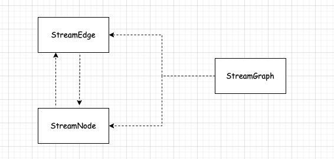
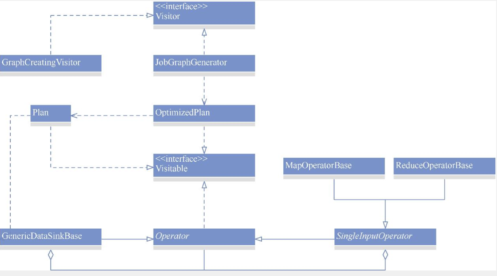
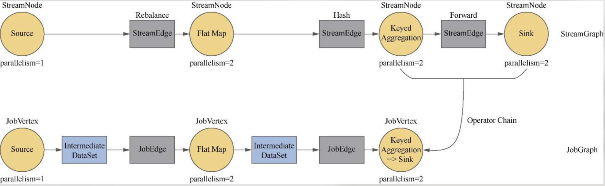

## Flink的执行图        
>Flink version: 1.14.6
>该篇Blog 主要摘要《Flink核心技术：源码剖析与特性开发》，并且会利用源码分析处理流程     

该篇Blog 将StreamGraph、JobGraph和ExecutionGraph定义为执行图的不同层次。        

### StreamGraph的生成   
在StreamExecutionEnvironment的execute()方法中，会调用getStreamGraph()方法以生成 StreamGraph():      

其中调用getStreamGraphGenerator()方法会返回一个StreamGraphGenerator对象：   
```java
private StreamGraphGenerator getStreamGraphGenerator(List<Transformation<?>> transformations) {
    if (transformations.size() <= 0) {
        throw new IllegalStateException(
                "No operators defined in streaming topology. Cannot execute.");
    }

    return new StreamGraphGenerator(transformations, config, checkpointCfg, configuration)
            .setStateBackend(defaultStateBackend)
            .setChangelogStateBackendEnabled(changelogStateBackendEnabled)
            .setSavepointDir(defaultSavepointDirectory)
            .setChaining(isChainingEnabled)
            .setUserArtifacts(cacheFile)
            .setTimeCharacteristic(timeCharacteristic)
            .setDefaultBufferTimeout(bufferTimeout)
            .setSlotSharingGroupResource(slotSharingGroupResources);
}
``` 
上述代码中，通过StreamGraphGenerator的构造方法生成一个实例对象，并且给该对象设置多个属性。  

#### StreamGraphGenerator分析       
下面是StreamGraphGenerator中的一些重要字段。    
* transformations: Transformation类型，这个字段的值指向执行环境中的transformations字段。        
* chaining: 用于设置是否开启链接。如果开启，则可能实现把多个算子链接在一起，这样就可以把他们部署到一个任务中执行。  
* scheduleMode: ScheduleMode类型，表示调度策略  
* jobName: 表示作业的名称。 
* streamGraph：StreamGraph类型  
* alreadTransformed: Map<Transformtion<?>, Collection<Intger>>类型，记录已经完成转换的Transformation对象。          

StreamGraphGenerator的构造方法和各种set()方法的作用就是在对这些字段赋值，其中很重要的是将执行环境中的transformations字段赋值给StreamGraphGenerator的transformations字段。               
通过上面的代码可知调用generate()方法会生成一个完整的StreamGraph对象并返回。该方法的实现代码如下：   
```java
public StreamGraph generate() {
    streamGraph = new StreamGraph(executionConfig, checkpointConfig, savepointRestoreSettings);
    streamGraph.setEnableCheckpointsAfterTasksFinish(
            configuration.get(
                    ExecutionCheckpointingOptions.ENABLE_CHECKPOINTS_AFTER_TASKS_FINISH));
    shouldExecuteInBatchMode = shouldExecuteInBatchMode();
    configureStreamGraph(streamGraph);

    alreadyTransformed = new HashMap<>();
    // 完成所有 Transformation 对象的转换，填充 StreamGraph
    for (Transformation<?> transformation : transformations) {
        transform(transformation);
    }

    streamGraph.setSlotSharingGroupResource(slotSharingGroupResources);

    setFineGrainedGlobalStreamExchangeMode(streamGraph);

    for (StreamNode node : streamGraph.getStreamNodes()) {
        if (node.getInEdges().stream().anyMatch(this::shouldDisableUnalignedCheckpointing)) {
            for (StreamEdge edge : node.getInEdges()) {
                edge.setSupportsUnalignedCheckpoints(false);
            }
        }
    }

    final StreamGraph builtStreamGraph = streamGraph;
    // 清空状态 
    alreadyTransformed.clear();
    alreadyTransformed = null;
    streamGraph = null;
    // 返回构建好的完整的 StreamGraph 对象  
    return builtStreamGraph;
}
```
显而易见，主要的逻辑都在transform()方法中实现       
```java
private Collection<Integer> transform(Transformation<?> transform) {
    // 如果alreadTransformed字段中已经包含该 Transformations对象，则直接取出并返回
    if (alreadyTransformed.containsKey(transform)) {
        return alreadyTransformed.get(transform);
    }

    LOG.debug("Transforming " + transform);

    if (transform.getMaxParallelism() <= 0) {

        // if the max parallelism hasn't been set, then first use the job wide max parallelism
        // from the ExecutionConfig.
        int globalMaxParallelismFromConfig = executionConfig.getMaxParallelism();
        if (globalMaxParallelismFromConfig > 0) {
            transform.setMaxParallelism(globalMaxParallelismFromConfig);
        }
    }

    transform
            .getSlotSharingGroup()
            .ifPresent(
                    slotSharingGroup -> {
                        final ResourceSpec resourceSpec =
                                SlotSharingGroupUtils.extractResourceSpec(slotSharingGroup);
                        if (!resourceSpec.equals(ResourceSpec.UNKNOWN)) {
                            slotSharingGroupResources.compute(
                                    slotSharingGroup.getName(),
                                    (name, profile) -> {
                                        if (profile == null) {
                                            return ResourceProfile.fromResourceSpec(
                                                    resourceSpec, MemorySize.ZERO);
                                        } else if (!ResourceProfile.fromResourceSpec(
                                                        resourceSpec, MemorySize.ZERO)
                                                .equals(profile)) {
                                            throw new IllegalArgumentException(
                                                    "The slot sharing group "
                                                            + slotSharingGroup.getName()
                                                            + " has been configured with two different resource spec.");
                                        } else {
                                            return profile;
                                        }
                                    });
                        }
                    });

    // call at least once to trigger exceptions about MissingTypeInfo
    transform.getOutputType();

    @SuppressWarnings("unchecked")
    final TransformationTranslator<?, Transformation<?>> translator =
            (TransformationTranslator<?, Transformation<?>>)
                    translatorMap.get(transform.getClass());

    // 按照 Transformation对象的具体实现类对其进行转换  
    Collection<Integer> transformedIds;
    if (translator != null) {
        transformedIds = translate(translator, transform);
    } else {
        transformedIds = legacyTransform(transform);
    }

    // need this check because the iterate transformation adds itself before
    // transforming the feedback edges
    // 将已经转换的 Transformation 对象添加到 alreadyTransformed字段中
    if (!alreadyTransformed.containsKey(transform)) {
        alreadyTransformed.put(transform, transformedIds);
    }

    return transformedIds;
}
```
代码实现的核心逻辑分为下面4步。
（1）如果alreadyTransformed字段中已经包含该Transformation对象，则直接取出并返回。           
（2）按照Transformation对象的具体实现类对其进行转换。这里用if-else语句罗列了所有Transformation的实现类。这提示我们，如果想要自定义一种转换操作，则需要新实现一种Transformation，并且在这里需要添加一个条件判断的分支，以便使自定义的Transformation完成转换。            
（3）将已经转换的Transformation对象添加到alreadyTransformed字段中。     
（4）给StreamGraph对象设置一些属性值。主要是把Transformation对象中的属性值（如name、uid等值）赋值给StreamGraph中的对应节点。            

介绍StreamGraphGenerator中的determineSlotSharingGroup()方法：           
```java
private String determineSlotSharingGroup(String specifiedGroup, Collection<Integer> inputIds) {
    if (specifiedGroup != null) { // 如果指定了SlotSharingGroup, 则返回指定的值     
        return specifiedGroup;
    } else { // 如果没有指定，则按照如下规则设置值  
        String inputGroup = null;
        for (int id : inputIds) { // 遍历输入节点的id
            String inputGroupCandidate = streamGraph.getSlotSharingGroup(id); // 获取输入节点的SlotSharingGroup值，如果之前没有赋过值，则将输入节点的值赋值给当前节点；如果已经赋过值，且该值跟输入节点的值不同，则返回默认值。     
            if (inputGroup == null) {
                inputGroup = inputGroupCandidate;
            } else if (!inputGroup.equals(inputGroupCandidate)) {
                return DEFAULT_SLOT_SHARING_GROUP;
            }
        }
        return inputGroup == null ? DEFAULT_SLOT_SHARING_GROUP : inputGroup;
    }
}
```
通过调用这个方法，可以确定该算子的SlotSharingGroup。SlotSharingGroup在判断算子是否可以进行链接时会被用到。          


#### StreamGraph分析    
StreamGraphGenerator构建了StreamGraph，还在不少方法中调用了StreamGraph添加节点和边的方法。StreamGraph实现了Pipeline接口。该接口没有定义任何方法，仅是为了表示DataStream中的StreamGraph和DataSet中的Plan都属于Pipeline类型           

#### StreamNode 和 StreamEdge   
它们分别表示节点和边。它们与StreamGraph的关系如下图所示。      
        

**1. StreamNode**
StreamNode的核心字段如下： 
* parallelism：表示并行度。         
* maxParallelism：表示最大并行度。          
* operatorName：表示算子名称。          
* slotSharingGroup：表示共享槽组。          
* statePartitioner1：KeySelector类型，表示键的提取器。          
* statePartitioner2：KeySelector类型，表示键的提取器。如果有两个数据流汇聚到一起，则这个字段表示第二个数据流的KeySelector对象。             
* operatorFactory：StreamOperatorFactory类型。StreamOperatorFactory是一个接口，表示一个工厂类，具有生成StreamOperator实例的功能。           
* inEdges：StreamEdge类型，表示这个StreamNode对象的入边。           
* outEdges：StreamEdge类型，表示这个StreamNode对象的出边。              
* jobVertexClass：Class类型，表示该任务的执行类。           
* transformationUID：表示转换操作的uid。            

上述的许多字段是直接从Transformation对象传递来的。StreamNode主要提供了添加入边和出边的方法：    
```java
public void addInEdge(StreamEdge inEdge) {
    checkState(
            outEdges.stream().noneMatch(inEdge::equals),
            "Adding not unique edge = %s to existing outEdges = %s",
            inEdge,
            inEdges);
    if (inEdge.getTargetId() != getId()) {
        throw new IllegalArgumentException("Destination id doesn't match the StreamNode id");
    } else {
        inEdges.add(inEdge);
    }
}

public void addOutEdge(StreamEdge outEdge) {
    checkState(
            outEdges.stream().noneMatch(outEdge::equals),
            "Adding not unique edge = %s to existing outEdges = %s",
            outEdge,
            outEdges);
    if (outEdge.getSourceId() != getId()) {
        throw new IllegalArgumentException("Source id doesn't match the StreamNode id");
    } else {
        outEdges.add(outEdge);
    }
}
```

**2. StreamEdge**   
StreamEdge表示连接两个节点的边，其核心字段如下:     
* edgeId：表示边的id。        
* sourceId：表示输入的算子id。                      
* targetId：表示输出的算子id。          
* outputPartitioner：StreamPartitioner类型，表示分区器。            
* sourceOperatorName：表示输入的算子名称。          
* targetOperatorName：表示输出的算子名称。          
* shuffleMode：ShuffleMode类型，表示上下游算子的数据交换方式。          

StreamEdge中维护了上下游算子的一些关系，如输出关系等。这样，在TaskManager生成任务的实例时，就可以从边中获得分区器等信息             

### Plan的生成      
Graph是针对DataStream API构造的执行图。在DataSetAPI中，这个执行图称为Plan。         
在ExecutionEnvironment的execute()方法中，会调用createProgramPlan()方法以生成Plan：  
```java
private Plan createPlan() {
    final OperatorTranslation translator = new OperatorTranslation();
    final Plan plan = translator.translateToPlan(sinks, jobName);

    if (defaultParallelism > 0) {
        plan.setDefaultParallelism(defaultParallelism);
    }
    plan.setExecutionConfig(config);
    return plan;
}     
``` 
这里的OperatorTranslation就相当于生成StreamGraph时用到的StreamGraphGenerator。      

#### OperatorTranslation分析    
OperatorTranslation类只有一个字段，即translated，是Map类型，用来维护已经转换的Operator对象。这里的Operator是org.apache.Flink.api.common.operators.Operator类，并非继承自DataSet类的org.apache.Flink.api.java.operators.Operator类，前者正是由后者转换而来的。           
转换时调用的方法为translateToPlan()：               
```java
public Plan translateToPlan(List<DataSink<?>> sinks, String jobName) {
    List<GenericDataSinkBase<?>> planSinks = new ArrayList<>();

    for (DataSink<?> sink : sinks) {
        planSinks.add(translate(sink));
    }

    Plan p = new Plan(planSinks);
    p.setJobName(jobName);
    return p;
}
```     
这个过程同样可以与StreamGraph的进行对比。递归地处理每一个sink，调用translate()方法对其进行转换。最终，将结果封装成Plan对象并返回。          
translate()方法如下：       
```java
private <T> GenericDataSinkBase<T> translate(DataSink<T> sink) {

    // translate the input recursively
    Operator<T> input = translate(sink.getDataSet());

    // translate the sink itself and connect it to the input
    GenericDataSinkBase<T> translatedSink = sink.translateToDataFlow(input);

    translatedSink.setResources(sink.getMinResources(), sink.getPreferredResources());

    return translatedSink;
}
```
对于translateToDataFlow()方法，之前已经介绍过，它会把DataSet等相关类转换成org.apache.Flink.api.common.operators.Operator类。这里调用的translate()方法是另一个重载方法：         
```java 
private <T> Operator<T> translate(DataSet<T> dataSet) {
    while (dataSet instanceof NoOpOperator) {
        dataSet = ((NoOpOperator<T>) dataSet).getInput();
    }

    // check if we have already translated that data set (operation or source)
    Operator<?> previous = this.translated.get(dataSet);
    if (previous != null) {

        // Union operators may only have a single output.
        // We ensure this by not reusing previously created union operators.
        // The optimizer will merge subsequent binary unions into one n-ary union.
        if (!(dataSet instanceof UnionOperator)) {
            // all other operators are reused.
            @SuppressWarnings("unchecked")
            Operator<T> typedPrevious = (Operator<T>) previous;
            return typedPrevious;
        }
    }

    // 按照 dataSet 对象的不同类型对其进行转换      
    Operator<T> dataFlowOp;

    if (dataSet instanceof DataSource) {
        DataSource<T> dataSource = (DataSource<T>) dataSet;
        dataFlowOp = dataSource.translateToDataFlow();
        dataFlowOp.setResources(
                dataSource.getMinResources(), dataSource.getPreferredResources());
    } else if (dataSet instanceof SingleInputOperator) {
        SingleInputOperator<?, ?, ?> singleInputOperator =
                (SingleInputOperator<?, ?, ?>) dataSet;
        dataFlowOp = translateSingleInputOperator(singleInputOperator);
        dataFlowOp.setResources(
                singleInputOperator.getMinResources(),
                singleInputOperator.getPreferredResources());
    } else if (dataSet instanceof TwoInputOperator) {
        TwoInputOperator<?, ?, ?, ?> twoInputOperator = (TwoInputOperator<?, ?, ?, ?>) dataSet;
        dataFlowOp = translateTwoInputOperator(twoInputOperator);
        dataFlowOp.setResources(
                twoInputOperator.getMinResources(), twoInputOperator.getPreferredResources());
    } else if (dataSet instanceof BulkIterationResultSet) {
        BulkIterationResultSet<?> bulkIterationResultSet = (BulkIterationResultSet<?>) dataSet;
        dataFlowOp = translateBulkIteration(bulkIterationResultSet);
        dataFlowOp.setResources(
                bulkIterationResultSet.getIterationHead().getMinResources(),
                bulkIterationResultSet.getIterationHead().getPreferredResources());
    } else if (dataSet instanceof DeltaIterationResultSet) {
        DeltaIterationResultSet<?, ?> deltaIterationResultSet =
                (DeltaIterationResultSet<?, ?>) dataSet;
        dataFlowOp = translateDeltaIteration(deltaIterationResultSet);
        dataFlowOp.setResources(
                deltaIterationResultSet.getIterationHead().getMinResources(),
                deltaIterationResultSet.getIterationHead().getPreferredResources());
    } else if (dataSet instanceof DeltaIteration.SolutionSetPlaceHolder
            || dataSet instanceof DeltaIteration.WorksetPlaceHolder) {
        throw new InvalidProgramException(
                "A data set that is part of a delta iteration was used as a sink or action."
                        + " Did you forget to close the iteration?");
    } else {
        throw new RuntimeException(
                "Error while creating the data flow plan for the program: Unknown operator or data set type: "
                        + dataSet);
    }

    this.translated.put(dataSet, dataFlowOp);

    // take care of broadcast variables
    translateBcVariables(dataSet, dataFlowOp);

    return dataFlowOp;
}
```
代码实现的核心逻辑与StreamGraph转换过程的一致。如果dataSet对象属于DataSource类型，则调用其translateToDataFlow()方法完成转换；如果属于SingleInputOperator类型，则调用translateSingleInputOperator()方法，如下：          
```java
private <I, O> org.apache.flink.api.common.operators.Operator<O> translateSingleInputOperator(
        SingleInputOperator<?, ?, ?> op) {

    @SuppressWarnings("unchecked")
    SingleInputOperator<I, O, ?> typedOp = (SingleInputOperator<I, O, ?>) op;

    @SuppressWarnings("unchecked")
    DataSet<I> typedInput = (DataSet<I>) op.getInput();

    Operator<I> input = translate(typedInput);

    org.apache.flink.api.common.operators.Operator<O> dataFlowOp =
            typedOp.translateToDataFlow(input);

    if (op instanceof UdfOperator<?>) {
        @SuppressWarnings("unchecked")
        SingleInputUdfOperator<I, O, ?> udfOp = (SingleInputUdfOperator<I, O, ?>) op;

        // set configuration parameters
        Configuration opParams = udfOp.getParameters();
        if (opParams != null) {
            dataFlowOp.getParameters().addAll(opParams);
        }

        if (dataFlowOp instanceof org.apache.flink.api.common.operators.SingleInputOperator) {
            org.apache.flink.api.common.operators.SingleInputOperator<?, O, ?> unaryOp =
                    (org.apache.flink.api.common.operators.SingleInputOperator<?, O, ?>)
                            dataFlowOp;
            // set the semantic properties
            unaryOp.setSemanticProperties(udfOp.getSemanticProperties());
        }
    }

    return dataFlowOp;
}
``` 
在这个方法中，仍然是调用translateToDataFlow()方法完成转换，对于dataSet对象属于其他类型的情况也是一样的。            

#### Plan分析       
Plan类实现了Pipeline接口，同时还实现了Visitable接口。Visitable接口定义了一个方法：      
```java
public interface Visitable<T extends Visitable<T>> {

    /**
     * Contains the logic to invoke the visitor and continue the traversal. Typically invokes the
     * pre-visit method of the visitor, then sends the visitor to the children (or predecessors) and
     * then invokes the post-visit method.
     *
     * <p>A typical code example is the following:
     *
     * <pre>{@code
     * public void accept(Visitor<Operator> visitor) {
     *     boolean descend = visitor.preVisit(this);
     *     if (descend) {
     *         if (this.input != null) {
     *             this.input.accept(visitor);
     *         }
     *         visitor.postVisit(this);
     *     }
     * }
     * }</pre>
     *
     * @param visitor The visitor to be called with this object as the parameter.
     * @see Visitor#preVisit(Visitable)
     * @see Visitor#postVisit(Visitable)
     */
    void accept(Visitor<T> visitor);
}
```     
这里用到了设计模式中的访问者模式。accept()方法接收一个Visitor对象，该对象大致可以被理解为优化规则，它会访问每一个Visitable对象，对其进行一些修改。Visitable、Visitor等的关系如下图所示。            
            

Plan的核心字段如下:         
* sinks：GenericDataSinkBase<?>类型。       
* jobName：表示作业名称。           
* defaultParallelism：表示默认设置的并行度。            
* jobId：JobID类型，表示作业的唯一标识          

据对 OperatorTranslation 的分析，可了解到转换生成的org.apache.Flink.api.common.operators. Operator对象全部会被封装到sinks字段中。随后就可以在accept()方法中对sinks进行优化了：          
```java
public void accept(Visitor<Operator<?>> visitor) {
    for (GenericDataSinkBase<?> sink : this.sinks) {
        sink.accept(visitor);
    }
}
```

### 从StreamGraph到JobGraph         
从StreamGraph到JobGraph的转换如图所示。      
            
StreamNode与JobVertex对应，StreamEdge与JobEdge对应。在JobGraph中，用IntermediateDataSet来表示JobVertex的输出            
从StreamGraph到JobGraph的转换调用的是FlinkPipelineTranslationUtil的静态方法getJobGraph()：          
```java 
public static JobGraph getJobGraph(
        Pipeline pipeline, Configuration optimizerConfiguration, int defaultParallelism) {
    // 根据pipeline 对象的具体类型返回对应的 pipelineTranslator
    FlinkPipelineTranslator pipelineTranslator = getPipelineTranslator(pipeline);

    // 完成从 pipeling 到 JobGraph的转换        
    return pipelineTranslator.translateToJobGraph(
            pipeline, optimizerConfiguration, defaultParallelism);
}
```     
上述代码首先调用了getPipelineTranslator()方法，获取了对应的translator       
```java
private static FlinkPipelineTranslator getPipelineTranslator(Pipeline pipeline) {
    PlanTranslator planTranslator = new PlanTranslator();

    if (planTranslator.canTranslate(pipeline)) {
        return planTranslator;
    }

    StreamGraphTranslator streamGraphTranslator = new StreamGraphTranslator();

    if (streamGraphTranslator.canTranslate(pipeline)) {
        return streamGraphTranslator;
    }

    throw new RuntimeException(
            "Translator "
                    + streamGraphTranslator
                    + " cannot translate "
                    + "the given pipeline "
                    + pipeline
                    + ".");
}
``` 
如果pipeline是StreamGraph类型，则返回StreamGraphTranslator；如果pipeline是Plan类型，则返回PlanTranslator：      
StreamGraphTranslator的translateToJobGraph()方法如下：      
```java
public JobGraph translateToJobGraph(
        Pipeline pipeline, Configuration optimizerConfiguration, int defaultParallelism) {
    checkArgument(
            pipeline instanceof StreamGraph, "Given pipeline is not a DataStream StreamGraph.");

    StreamGraph streamGraph = (StreamGraph) pipeline;
    return streamGraph.getJobGraph(null);
}
```     
其中调用的是StreamGraph的getJobGraph()方法：        
```java
public static JobGraph createJobGraph(StreamGraph streamGraph, @Nullable JobID jobID) {
    return new StreamingJobGraphGenerator(streamGraph, jobID).createJobGraph();
}
```
所有的转换逻辑发生在StreamingJobGraphGenerator中。          

#### StreamingJobGraphGenerator分析         
StreamingJobGraphGenerator是JobGraph的生成器，它的核心字段如下:     
* streamGraph：StreamGraph类型。            
* jobVertices：Map<Integer, JobVertex>类型，用于维护JobGraph中的节点。          
* jobGraph：JobGraph类型。          
* builtVertices：Collection<Integer>类型，用于维护已经构建的StreamNode的id。            
* physicalEdgesInOrder：StreamEdge类型，表示物理边的集合，排除了链接内部的边。          
* chainedConfigs：Map<Integer, Map<Integer, StreamConfig>> 类型，保存链接信息。         
* vertexConfigs：Map<Integer, StreamConfig>类型，保存节点信息。         
* chainedNames：Map<Integer, String>类型，表示链接的名称                    

述字段中，许多字段与链接有关。从StreamGraph到JobGraph的转换中，很重要的事情是将可以链接在一起的任务链接起来，这样它们可以作为同一个任务实现串行执行，从而可以达到节省资源、提高效率的目的。     
调用createJobGraph()方法可以生成JobGraph：      
```java
private JobGraph createJobGraph() {
    // 验证
    preValidate();
    // 设置调度方式，计算哈希值等   
    jobGraph.setJobType(streamGraph.getJobType());

    jobGraph.enableApproximateLocalRecovery(
            streamGraph.getCheckpointConfig().isApproximateLocalRecoveryEnabled());

    // Generate deterministic hashes for the nodes in order to identify them across
    // submission iff they didn't change.
    Map<Integer, byte[]> hashes =
            defaultStreamGraphHasher.traverseStreamGraphAndGenerateHashes(streamGraph);

    // Generate legacy version hashes for backwards compatibility
    List<Map<Integer, byte[]>> legacyHashes = new ArrayList<>(legacyStreamGraphHashers.size());
    for (StreamGraphHasher hasher : legacyStreamGraphHashers) {
        legacyHashes.add(hasher.traverseStreamGraphAndGenerateHashes(streamGraph));
    }
    // 将任务链接在一起，创建节点 JobVertex 和 边 JobEdge
    setChaining(hashes, legacyHashes);
    // 设置物理边
    setPhysicalEdges();
    // 设置内存槽组
    setSlotSharingAndCoLocation();
    // 设置内存占比
    setManagedMemoryFraction(
            Collections.unmodifiableMap(jobVertices),
            Collections.unmodifiableMap(vertexConfigs),
            Collections.unmodifiableMap(chainedConfigs),
            id -> streamGraph.getStreamNode(id).getManagedMemoryOperatorScopeUseCaseWeights(),
            id -> streamGraph.getStreamNode(id).getManagedMemorySlotScopeUseCases());
    // 配置检查点、保存点参数   
    configureCheckpointing();

    jobGraph.setSavepointRestoreSettings(streamGraph.getSavepointRestoreSettings());

    final Map<String, DistributedCache.DistributedCacheEntry> distributedCacheEntries =
            JobGraphUtils.prepareUserArtifactEntries(
                    streamGraph.getUserArtifacts().stream()
                            .collect(Collectors.toMap(e -> e.f0, e -> e.f1)),
                    jobGraph.getJobID());

    for (Map.Entry<String, DistributedCache.DistributedCacheEntry> entry :
            distributedCacheEntries.entrySet()) {
        jobGraph.addUserArtifact(entry.getKey(), entry.getValue()); // 设置分布式缓存文件   
    }

    // set the ExecutionConfig last when it has been finalized
    try {
        jobGraph.setExecutionConfig(streamGraph.getExecutionConfig()); // 设置运行时的配置
    } catch (IOException e) {
        throw new IllegalConfigurationException(
                "Could not serialize the ExecutionConfig."
                        + "This indicates that non-serializable types (like custom serializers) were registered");
    }

    addVertexIndexPrefixInVertexName();

    setVertexDescription();
    // 返回完整的 JobGraph 对象
    return jobGraph;
}
```
上述代码的步骤如下。        
（1）进行一些转换前的验证，比如检验配置是否有冲突等。           
（2）设置调度方式、计算哈希值等。       
（3）将任务链接在一起，创建节点JobVertex和边JobEdge。这是整个过程中最重要的一步。           
（4）设置物理边。           
（5）设置共享槽组。         
（6）设置内存占比。             
（7）配置检查点、保存点参数。           
（8）设置分布式缓存文件。               
（9）设置运行时的配置。         
（10）返回完整的JobGraph对象            
接下来对其中一些步骤进行详细介绍。      


第1步是进行一些转换前的验证 
```java
private void preValidate() {
    CheckpointConfig checkpointConfig = streamGraph.getCheckpointConfig();

    if (checkpointConfig.isCheckpointingEnabled()) {
        // temporarily forbid checkpointing for iterative jobs
        if (streamGraph.isIterative() && !checkpointConfig.isForceCheckpointing()) {
            throw new UnsupportedOperationException(
                    "Checkpointing is currently not supported by default for iterative jobs, as we cannot guarantee exactly once semantics. "
                            + "State checkpoints happen normally, but records in-transit during the snapshot will be lost upon failure. "
                            + "\nThe user can force enable state checkpoints with the reduced guarantees by calling: env.enableCheckpointing(interval,true)");
        }
        if (streamGraph.isIterative()
                && checkpointConfig.isUnalignedCheckpointsEnabled()
                && !checkpointConfig.isForceUnalignedCheckpoints()) {
            throw new UnsupportedOperationException(
                    "Unaligned Checkpoints are currently not supported for iterative jobs, "
                            + "as rescaling would require alignment (in addition to the reduced checkpointing guarantees)."
                            + "\nThe user can force Unaligned Checkpoints by using 'execution.checkpointing.unaligned.forced'");
        }
        if (checkpointConfig.isUnalignedCheckpointsEnabled()
                && !checkpointConfig.isForceUnalignedCheckpoints()
                && streamGraph.getStreamNodes().stream().anyMatch(this::hasCustomPartitioner)) {
            throw new UnsupportedOperationException(
                    "Unaligned checkpoints are currently not supported for custom partitioners, "
                            + "as rescaling is not guaranteed to work correctly."
                            + "\nThe user can force Unaligned Checkpoints by using 'execution.checkpointing.unaligned.forced'");
        }

        ClassLoader classLoader = Thread.currentThread().getContextClassLoader();
        for (StreamNode node : streamGraph.getStreamNodes()) {
            StreamOperatorFactory operatorFactory = node.getOperatorFactory();
            if (operatorFactory != null) {
                Class<?> operatorClass = operatorFactory.getStreamOperatorClass(classLoader);
                // 如果 StreamOperator 对象实现了 InputSelectable 接口，则抛出异常，因为目前类型不支持开启检查点机制        
                if (InputSelectable.class.isAssignableFrom(operatorClass)) {

                    throw new UnsupportedOperationException(
                            "Checkpointing is currently not supported for operators that implement InputSelectable:"
                                    + operatorClass.getName());
                }
            }
        }
    }

    if (checkpointConfig.isUnalignedCheckpointsEnabled()
            && getCheckpointingMode(checkpointConfig) != CheckpointingMode.EXACTLY_ONCE) {
        LOG.warn("Unaligned checkpoints can only be used with checkpointing mode EXACTLY_ONCE");
        checkpointConfig.enableUnalignedCheckpoints(false);
    }
}
```
抛出异常的条件已在注释中给出。
第2步是设置调度方式、计算哈希值等。调度方式的值直接从StreamGraph中获得。计算哈希值的过程较为复杂，概括来说就是如果用指定了uid，则根据uid生成，否则根据拓扑结构生成。注意，这里生成了3个对象，一个是hashes，一个是legacyHashes，还有一个是chainedOperatorHashes。hashes的数据类型是映射（Map），键为节点id，值为哈希值。legacyHashes的数据类型和含义与hashes的一样，只不过它的哈希值是由用户指定的userHash加上另一种算法计算出来的，这是为了显式地指定哈希值，以免版本变动导致哈希值不一致。chainedOperatorHashes的数据类型为Map<Integer, Tuple2<byte[],byte[]>>，其值是一个列表（List），是将链接在一起的算子的哈希值放在同一个列表中进行维护。在setChaining()方法中就能看到它的值是如何被填充的。          


refer   
1.《Flink核心技术：源码剖析与特性开发》     


