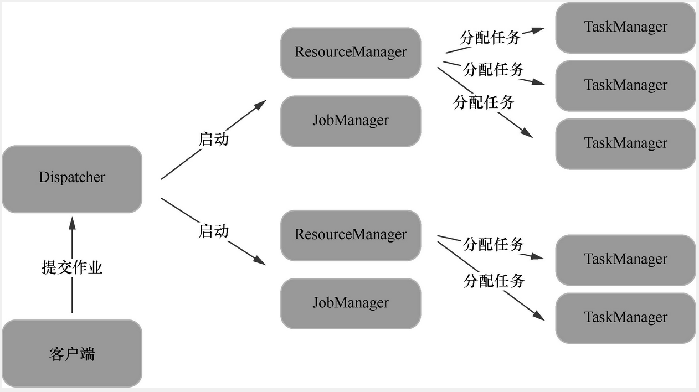

## Flink的运行时架构        

Flink的运行时架构由一个Flink Master和一个或多个任务管理器（TaskManager）组成。其中Flink Master包括3个独立的组件：资源管理器（ResourceManager）、派发器（Dispatcher）和作业管理器（JobManager）。Flink的运行时架构如图所示：     
          

很多时候可以将上图所示的架构简化成一个JobManager和一个或多个TaskManager，这是典型的Master-Worker模式。其中，JobManager主要用于协调分布式任务的执行，包括调度任务、协调容错机制等；TaskManager主要用于负责任务的具体执行和任务间数据的传输。集群中至少有一个JobManager和一个TaskManager。        

这里需要注意的是，Flink在版本迭代过程中，其架构也在不断优化。1.10版本的Flink源码工程中已经没有叫作JobManager或者TaskManager的类。有些文章或图书中会将某些运行在同一进程中的组件统称为作业管理器或任务管理器。本书将Flink-runtime模块下的org.apache.Flink.runtime. jobmaster.JobMaster类视为架构层面的作业管理器角色，将同一模块下的org.apache.Flink.runtime.taskexecutor.TaskExecutor类视为架构层面的任务管理器角色，依据如下：    
```java
public class JobMaster extends PermanentlyFencedRpcEndpoint<JobMasterId>
        implements JobMasterGateway, JobMasterService {
            ......
}
```
此外，Flink的运行时架构中还有两个组件——派发器和资源管理器，它们分别在提交作业和分配资源时发挥着重要作用。这两个组件在源码中分别对应Dispatcher（位于Flink-runtime模块的org.apache.Flink.runtime.dispatcher包下）和ResourceManager（位于Flink-runtime模块的org.apache. Flink.runtime.resourcemanager包下）的实现类。          
```java
public abstract class Dispatcher extends PermanentlyFencedRpcEndpoint<DispatcherId>
        implements DispatcherGateway {
            ......
}
```     
考虑到学习的便捷，本章会在本地模式下对这些组件进行介绍，同时也建议读者在本地模式下进行调试，这并不会影响到对它们的核心功能及交互方式的理解。                
希望在学习完本章后，读者能够了解                
* 作业管理器、任务管理器、派发器和资源管理器的核心功能；            
* 作业管理器、任务管理器、派发器和资源管理器之间的交互逻辑。            

### 客户端代码的运行            
Flink程序启动后，会先运行客户端的代码，直到生成JobGraph后，将作业提交到派发器。Flink程序读取基本配置、初始化执行环境、运行用户代码和生成JobGraph等逻辑全部发生在这一阶段。这里直接从执行环境的execute()方法开始分析。           
对于StreamExecutionEnvironment，它的execute()方法如下：             
```java
public JobExecutionResult execute() throws Exception {
        return execute(getStreamGraph());
}

public JobExecutionResult execute(String jobName) throws Exception {
    Preconditions.checkNotNull(jobName, "Streaming Job name should not be null.");
    final StreamGraph streamGraph = getStreamGraph();
    streamGraph.setJobName(jobName);
    return execute(streamGraph);
}

@Internal
public JobExecutionResult execute(StreamGraph streamGraph) throws Exception {
    final JobClient jobClient = executeAsync(streamGraph);

    try {
        final JobExecutionResult jobExecutionResult;

        if (configuration.getBoolean(DeploymentOptions.ATTACHED)) {
            jobExecutionResult = jobClient.getJobExecutionResult().get();
        } else {
            jobExecutionResult = new DetachedJobExecutionResult(jobClient.getJobID());
        }

        jobListeners.forEach(
                jobListener -> jobListener.onJobExecuted(jobExecutionResult, null));

        return jobExecutionResult;
    } catch (Throwable t) {
        // get() on the JobExecutionResult Future will throw an ExecutionException. This
        // behaviour was largely not there in Flink versions before the PipelineExecutor
        // refactoring so we should strip that exception.
        Throwable strippedException = ExceptionUtils.stripExecutionException(t);

        jobListeners.forEach(
                jobListener -> {
                    jobListener.onJobExecuted(null, strippedException);
                });
        ExceptionUtils.rethrowException(strippedException);

        // never reached, only make javac happy
        return null;
    }
}
```     
以上是StreamGraph的生成过程。       
在最后一个execute()方法中，主要是获取并返回JobExecutionResult对象，并在这个过程中触发监听器。通过JobExecutionResult对象，就可以获取累加器等对象。                   
作业的执行交给了executeAsync()方法来实现：          
```java
public final JobClient executeAsync() throws Exception {
        return executeAsync(getStreamGraph());
    }

@PublicEvolving
public JobClient executeAsync(String jobName) throws Exception {
    Preconditions.checkNotNull(jobName, "Streaming Job name should not be null.");
    final StreamGraph streamGraph = getStreamGraph();
    streamGraph.setJobName(jobName);
    return executeAsync(streamGraph);
}

@Internal
public JobClient executeAsync(StreamGraph streamGraph) throws Exception {
    checkNotNull(streamGraph, "StreamGraph cannot be null.");
    checkNotNull(
            configuration.get(DeploymentOptions.TARGET),
            "No execution.target specified in your configuration file.");

    final PipelineExecutorFactory executorFactory =
            executorServiceLoader.getExecutorFactory(configuration);

    checkNotNull(
            executorFactory,
            "Cannot find compatible factory for specified execution.target (=%s)",
            configuration.get(DeploymentOptions.TARGET));

    CompletableFuture<JobClient> jobClientFuture =
            executorFactory
                    .getExecutor(configuration)
                    .execute(streamGraph, configuration, userClassloader);

    try {
        JobClient jobClient = jobClientFuture.get();
        jobListeners.forEach(jobListener -> jobListener.onJobSubmitted(jobClient, null));
        return jobClient;
    } catch (ExecutionException executionException) {
        final Throwable strippedException =
                ExceptionUtils.stripExecutionException(executionException);
        jobListeners.forEach(
                jobListener -> jobListener.onJobSubmitted(null, strippedException));

        throw new FlinkException(
                String.format("Failed to execute job '%s'.", streamGraph.getJobName()),
                strippedException);
    }
}
```
上述方法的核心逻辑是获取PipelineExecutorFactory对象，利用该对象获取PipelineExecutor对象并调用execute()方法执行作业。若通过客户端启动，则executorServiceLoader字段的值是通过客户端设置并传递到执行环境中的；若在本地模式下启动则为默认的DefaultExecutorServiceLoader类对象。它的getExecutorFactory()方法如下：           
```java
public PipelineExecutorFactory getExecutorFactory(final Configuration configuration) {
    checkNotNull(configuration);

    final ServiceLoader<PipelineExecutorFactory> loader =
            ServiceLoader.load(PipelineExecutorFactory.class);

    final List<PipelineExecutorFactory> compatibleFactories = new ArrayList<>();
    final Iterator<PipelineExecutorFactory> factories = loader.iterator();
    while (factories.hasNext()) {
        try {
            final PipelineExecutorFactory factory = factories.next();
            if (factory != null && factory.isCompatibleWith(configuration)) {
                compatibleFactories.add(factory);
            }
        } catch (Throwable e) {
            if (e.getCause() instanceof NoClassDefFoundError) {
                LOG.info("Could not load factory due to missing dependencies.");
            } else {
                throw e;
            }
        }
    }

    if (compatibleFactories.size() > 1) {
        final String configStr =
                configuration.toMap().entrySet().stream()
                        .map(e -> e.getKey() + "=" + e.getValue())
                        .collect(Collectors.joining("\n"));

        throw new IllegalStateException(
                "Multiple compatible client factories found for:\n" + configStr + ".");
    }

    if (compatibleFactories.isEmpty()) {
        throw new IllegalStateException("No ExecutorFactory found to execute the application.");
    }

    return compatibleFactories.get(0);
}
```
该方法使用服务提供者接口（Service Provider Interface，SPI）机制发现所有的PipelineExecutorFactory实现类，再根据配置configuration选择出符合条件的factory对象。在本地模式下选择出的就是LocalExecutorFactory对象。LocalExecutorFactory的getExecutor()方法如下：         
```java
public PipelineExecutor getExecutor(final Configuration configuration) {
    return LocalExecutor.create(configuration);
}
```
因此，得到的执行器PipelineExecutor对象就是一个LocalExecutor对象。LocalExecutor类的字段包括一个Function对象，如下：          
```java
private final Function<MiniClusterConfiguration, MiniCluster> miniClusterFactory;   
```
这个Function类就是JDK的Function类，表示一个函数，传入MiniClusterConfiguration对象，返回MiniCluster对象。从上面的create()方法和LocalExecutor的构造方法得知，这个字段的值就是MiniCluster的构造方法。而LocalExecutor的execute()方法如下：          
```java
public CompletableFuture<JobClient> execute(
        Pipeline pipeline, Configuration configuration, ClassLoader userCodeClassloader)
        throws Exception {
    checkNotNull(pipeline);
    checkNotNull(configuration);

    Configuration effectiveConfig = new Configuration();
    effectiveConfig.addAll(this.configuration);
    effectiveConfig.addAll(configuration);

    // we only support attached execution with the local executor.
    checkState(configuration.getBoolean(DeploymentOptions.ATTACHED));

    final JobGraph jobGraph = getJobGraph(pipeline, effectiveConfig);

    return PerJobMiniClusterFactory.createWithFactory(effectiveConfig, miniClusterFactory)
            .submitJob(jobGraph, userCodeClassloader);
}
```     
在LocalExecutor中将StreamGraph对象转换成了JobGraph对象，然后将JobGraph对象进行了提交。          
而对于ExecutionEnvironment，不仅整个流程与StreamExecutionEnvironment的一致，方法的实现也几乎一致：          
```java
public JobExecutionResult execute() throws Exception {
        return execute(getJobName());
    }

public JobExecutionResult execute(String jobName) throws Exception {
    final JobClient jobClient = executeAsync(jobName);

    try {
        if (configuration.getBoolean(DeploymentOptions.ATTACHED)) {
            lastJobExecutionResult = jobClient.getJobExecutionResult().get();
        } else {
            lastJobExecutionResult = new DetachedJobExecutionResult(jobClient.getJobID());
        }

        jobListeners.forEach(
                jobListener -> jobListener.onJobExecuted(lastJobExecutionResult, null));

    } catch (Throwable t) {
        // get() on the JobExecutionResult Future will throw an ExecutionException. This
        // behaviour was largely not there in Flink versions before the PipelineExecutor
        // refactoring so we should strip that exception.
        Throwable strippedException = ExceptionUtils.stripExecutionException(t);

        jobListeners.forEach(
                jobListener -> {
                    jobListener.onJobExecuted(null, strippedException);
                });
        ExceptionUtils.rethrowException(strippedException);
    }

    return lastJobExecutionResult;
}
``` 
稍有不同的是，Plan对象是在executeAsync()方法中生成的，最后同样进入了LocalExecutor的execute()方法。          
在LocalExecutor的execute()方法中，在调用createWithFactory()方法创建PerJobMiniClusterFactory对象后，调用其submitJob()方法提交JobGraph对象：                  

