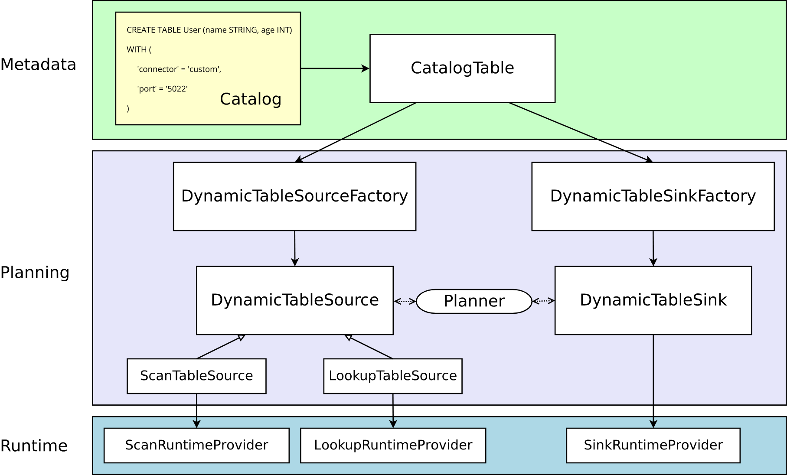

## Flink 自定义数据源 Connector 

>特别标注： 懂啥写啥，可能不成体系

"凡事开头难" - 只好从 Flink 官网开始： https://nightlies.apache.org/flink/flink-docs-release-1.15/zh/docs/dev/table/sourcessinks/ (可惜1.15 该章节仍然是中文，若需要中文，可查看1.17 文档 https://nightlies.apache.org/flink/flink-docs-release-1.17/zh/docs/dev/table/sourcessinks/#source-%e7%ab%af%e7%9a%84%e5%8a%9f%e8%83%bd%e6%8e%a5%e5%8f%a3)  





"自定义 Sources & Sinks"的开发成本还是比较低的, 我对文档有些解读结果：

1.通过固定工厂类实现动态Source，和动态Sink
通过实现 org.apache.flink.table.factories.DynamicTableSourceFactory 接口完成一个工厂类，来生产 DynamicTableSource 类。
通过实现 org.apache.flink.table.factories.DynamicTableSinkFactory 接口完成一个工厂类，来生产 DynamicTableSink 类

并且需使用Java SPI机制，定义`META-INF/services/org.apache.flink.table.factories.Factory`。  

2.在上一步创建动态表时，需定义动态表的读取方式
在读取动态表时，表中数据可以是以下情况之一：
* changelog 流（支持有界或无界），在 changelog 流结束前，所有的改变都会被源源不断地消费，由 `ScanTableSource` 接口表示。  
* 处于一直变换或数据量很大的外部表，其中的数据一般不会被全量读取，除非是在查询某个值时，由 `LookupTableSource` 接口表示。 

一个类可以同时实现这两个接口，Planner 会根据查询的 Query 选择相应接口中的方法。 

**了解 Scan Table Source & Lookup Table Source**    
Scan Table Source
在运行期间，ScanTableSource 接口会按行扫描外部存储系统中所有数据。  
被扫描的数据可以是 insert、update、delete 三种操作类型，因此数据源可以用作读取 changelog （支持有界或无界）。在运行时，返回的 changelog mode 表示 Planner 要处理的操作类型。    
在常规批处理的场景下，数据源可以处理 insert-only 操作类型的有界数据流。 
在常规流处理的场景下，数据源可以处理 insert-only 操作类型的无界数据流。 
在变更日志数据捕获（即 CDC）场景下，数据源可以处理 insert、update、delete 操作类型的有界或无界数据流。  
可以实现更多的功能接口来优化数据源，比如实现 SupportsProjectionPushDown 接口，这样在运行时在 source 端就处理数据。在 org.apache.flink.table.connector.source.abilities 包下可以找到各种功能接口，更多内容可查看 source abilities table。    
实现 ScanTableSource 接口的类必须能够生产 Flink 内部数据结构，因此每条记录都会按照org.apache.flink.table.data.RowData 的方式进行处理。Flink 运行时提供了转换机制保证 source 端可以处理常见的数据结构，并且在最后进行转换。  

Lookup Table Source
在运行期间，LookupTableSource 接口会在外部存储系统中按照 key 进行查找。 
相比于ScanTableSource，LookupTableSource 接口不会全量读取表中数据，只会在需要时向外部存储（其中的数据有可能会一直变化）发起查询请求，惰性地获取数据。   
同时相较于ScanTableSource，LookupTableSource 接口目前只支持处理 insert-only 数据流。    
暂时不支持扩展功能接口，可查看 org.apache.flink.table.connector.source.LookupTableSource 中的文档了解更多。 
LookupTableSource 的实现方法可以是 TableFunction 或者 AsyncTableFunction，Flink运行时会根据要查询的 key 值，调用这个实现方法进行查询。  
```

>特别注意： 下面是可优化的功能点：  

接口 	描述
SupportsFilterPushDown 	支持将过滤条件下推到 DynamicTableSource。为了更高效处理数据，source 端会将过滤条件下推，以便在数据产生时就处理。    

SupportsLimitPushDown 	支持将 limit（期望生产的最大数据条数）下推到 DynamicTableSource。   

SupportsPartitionPushDown 	支持将可用的分区信息提供给 planner 并且将分区信息下推到 DynamicTableSource。在运行时为了更高效处理数据，source 端会只从提供的分区列表中读取数据。   

SupportsProjectionPushDown 	支持将查询列(可嵌套)下推到 DynamicTableSource。为了更高效处理数据，source 端会将查询列下推，以便在数据产生时就处理。如果 source 端同时实现了 SupportsReadingMetadata，那么 source 端也会读取相对应列的元数据信息。  

SupportsReadingMetadata 	支持通过 DynamicTableSource 读取列的元数据信息。source 端会在生产数据行时，在最后添加相应的元数据信息，其中包括元数据的格式信息。   

SupportsWatermarkPushDown 	支持将水印策略下推到 DynamicTableSource。水印策略可以通过工厂模式或 Builder 模式来构建，用于抽取时间戳以及水印的生成。在运行时，source 端内部的水印生成器会为每个分区生产水印。 

SupportsSourceWatermark 	支持使用 ScanTableSource 中提供的水印策略。当使用 CREATE TABLE DDL 时，<可以使用>       

SOURCE_WATERMARK() 来告诉 planner 调用这个接口中的水印策略方法。    

SupportsRowLevelModificationScan 	支持将读数据的上下文 RowLevelModificationScanContext 从 ScanTableSource 传递给实现了    

SupportsRowLevelDelete，SupportsRowLevelUpdate 的 sink 端。     


### 解析器  


### 运行时的实现    


refer   
1.https://nightlies.apache.org/flink/flink-docs-release-1.17/zh/docs/dev/table/sourcessinks/            
2.https://nightlies.apache.org/flink/flink-docs-release-1.17/zh/docs/dev/table/sourcessinks/#source-%e7%ab%af%e7%9a%84%e5%8a%9f%e8%83%bd%e6%8e%a5%e5%8f%a3  
3.https://github.com/dongkelun/flink-learning/tree/master/flink-http-connector      
4.https://cloud.tencent.com/developer/article/2291286       
