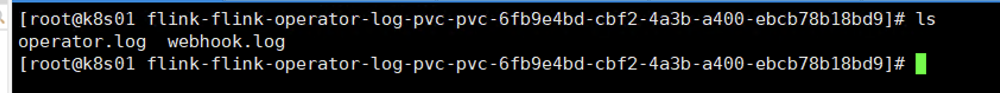

## Flink on K8s Operator 日志持久化 

>注意 Operator 版本

1.编写日志 operator-log-pvc.yaml    
vim operator-log-pvc.yaml   

```yaml
#flink-kubernetes-operator log 持久化存储pvc
apiVersion: v1
kind: PersistentVolumeClaim
metadata:
  name: flink-operator-log-pvc  # operator log pvc名称
  namespace: flink   # 指定归属的名命空间
spec:
  storageClassName: nfs-storage   #sc名称，更改为实际的sc名称
  accessModes:
    - ReadWriteMany   #采用ReadWriteMany的访问模式
  resources:
    requests:
      storage: 1Gi    #存储容量，根据实际需要更改
```


2.创建日志pvc
kubectl apply -f operator-log-pvc.yaml  

3.查看pvc   
kubectl get pvc -n flink    

4.查看pv 
kubectl get pv | grep flink 

5.修改helm/values.yaml文件，添加log4j配置信息   
cd /root/flink-operator/helm    
vim values.yaml 

```yaml
defaultConfiguration:
  log4j-operator.properties: |+
    # Flink Operator Logging Overrides
    # rootLogger.level = DEBUG
    # logger.operator.name= org.apache.flink.kubernetes.operator
    # logger.operator.level = DEBUG
    rootLogger.appenderRef.file.ref = LogFile
    appender.file.name = LogFile
    appender.file.type = File
    appender.file.append = false
    appender.file.fileName = ${sys:log.file}
    appender.file.layout.type = PatternLayout
    appender.file.layout.pattern = %d{yyyy-MM-dd HH:mm:ss,SSS} %-5p %-60c %x - %m%n
  log4j-console.properties: |+
    # Flink Deployment Logging Overrides
    # rootLogger.level = DEBUG

# ** Set the jvm start up options for webhook and operator
jvmArgs:
  webhook: "-Dlog.file=/opt/flink/log/webhook.log"
  operator: "-Dlog.file=/opt/flink/log/operator.log"
```


6.修改helm/templates/flink-operator.yaml，挂载flink-operator-log-pvc    
cd /root/flink-operator/helm/templates
vim flink-operator.yaml 

>修改 挂载点 flink-operator-log 

```yaml
spec:
  securityContext:
    {{- toYaml .Values.podSecurityContext | nindent 8 }}
  {{- with .Values.imagePullSecrets }}
  imagePullSecrets:
    {{- toYaml . | nindent 8 }}
  {{- end }}
  serviceAccountName: {{ include "flink-operator.serviceAccountName" . }}
  containers:
    - name: {{ .Chart.Name }}
      image: "{{ .Values.image.repository }}:{{ .Values.image.tag | default .Chart.AppVersion }}"
      imagePullPolicy: {{ .Values.image.pullPolicy }}
      command: ["/docker-entrypoint.sh", "operator"]
      {{- if .Values.metrics.port }}
      ports:
        - containerPort: {{ .Values.metrics.port }}
          name: metrics
          protocol: TCP
      {{- end }}
      env:
        - name: TZ
          value: Asia/Shanghai
        - name: OPERATOR_NAMESPACE
          value: {{ .Release.Namespace }}
        - name: OPERATOR_NAME
          value: {{ include "flink-operator.name" . }}
        - name: FLINK_CONF_DIR
          value: /opt/flink/conf
        - name: FLINK_PLUGINS_DIR
          value: /opt/flink/plugins
        - name: LOG_CONFIG
          value: -Dlog4j.configurationFile=/opt/flink/conf/log4j-operator.properties
        - name: JVM_ARGS
          value: {{ .Values.jvmArgs.operator }}
        {{- range $k, $v := .Values.operatorPod.env }}
        - name: {{ $v.name }}
          value: {{ $v.value }}
        {{- end }}
      securityContext:
        {{- toYaml .Values.operatorSecurityContext | nindent 12 }}
      volumeMounts:
        - name: flink-operator-log
          mountPath: /opt/flink/log
        - name: flink-operator-config-volume
          mountPath: /opt/flink/conf
        {{- if .Values.operatorVolumeMounts.create }}
        {{- toYaml .Values.operatorVolumeMounts.data | nindent 12 }}
        {{- end }}
    {{- if eq (include "webhook-enabled" .) "true" }}
    - name: flink-webhook
      image: "{{ .Values.image.repository }}:{{ .Values.image.tag | default .Chart.AppVersion }}"
      imagePullPolicy: {{ .Values.image.pullPolicy }}
      command: ["/docker-entrypoint.sh", "webhook"]
      env:
        - name: TZ
          value: Asia/Shanghai
        - name: WEBHOOK_KEYSTORE_PASSWORD
          valueFrom:
            secretKeyRef:
            {{- if .Values.webhook.keystore.useDefaultPassword }}
            name: flink-operator-webhook-secret
            key: password
            {{- else }}
            {{- with .Values.webhook.keystore.passwordSecretRef }}
            {{- toYaml . | nindent 18 }}
            {{- end }}
            {{- end }}
        - name: WEBHOOK_KEYSTORE_FILE
          value: "/certs/keystore.p12"
        - name: WEBHOOK_KEYSTORE_TYPE
          value: "pkcs12"
        - name: WEBHOOK_SERVER_PORT
          value: "9443"
        - name: LOG_CONFIG
          value: -Dlog4j.configurationFile=/opt/flink/conf/log4j-operator.properties
        - name: JVM_ARGS
          value: {{ .Values.jvmArgs.webhook }}
        - name: FLINK_CONF_DIR
          value: /opt/flink/conf
        - name: FLINK_PLUGINS_DIR
          value: /opt/flink/plugins
        - name: OPERATOR_NAMESPACE
          value: {{ .Release.Namespace }}
      securityContext:
        {{- toYaml .Values.webhookSecurityContext | nindent 12 }}
      volumeMounts:
        - name: flink-operator-log
          mountPath: /opt/flink/log
        - name: keystore
          mountPath: "/certs"
          readOnly: true
        - name: flink-operator-config-volume
          mountPath: /opt/flink/conf
    {{- end }}
  volumes:
    - name: flink-operator-log
      persistentVolumeClaim:
        claimName: flink-operator-log-pvc
    - name: flink-operator-config-volume
      configMap:
        name: flink-operator-config
        items:
          - key: flink-conf.yaml
            path: flink-conf.yaml
          - key: log4j-operator.properties
            path: log4j-operator.properties
          - key: log4j-console.properties
            path: log4j-console.properties
```


7.卸载现有的Flink Kubernetes Operator   
helm uninstall flink-kubernetes-operator -n flink   

kubectl -n flink delete configmap kube-root-ca.crt; kubectl -n flink delete svc --all; kubectl -n flink delete secret --all; kubectl -n flink delete serviceaccount --all; kubectl -n flink delete role --all; kubectl -n flink delete rolebinding --all;   

8.重新安装Flink Kubernetes Operator     
cd /root/flink-operator/helm    
helm install -f values.yaml flink-kubernetes-operator . --namespace flink --create-namespace    

>检查 Operator log  
  

9.测试，提交作业    
kubectl apply -f application-deployment-with-hostalises.yaml     

10.查看作业Pod  
kubectl get all -n flink    

11.网页查看 
http://flink.k8s.io:32469/flink/application-deployment-with-hostalises/#/overview

https://k8s01:32469/#/login 

12.删除作业     
kubectl delete-f application-deployment-with-hostalises.yaml