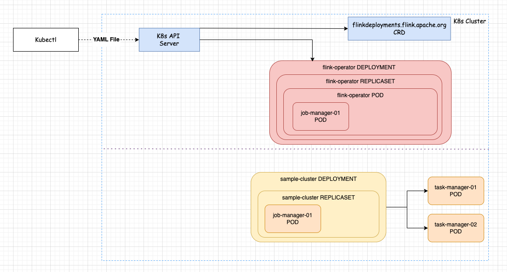
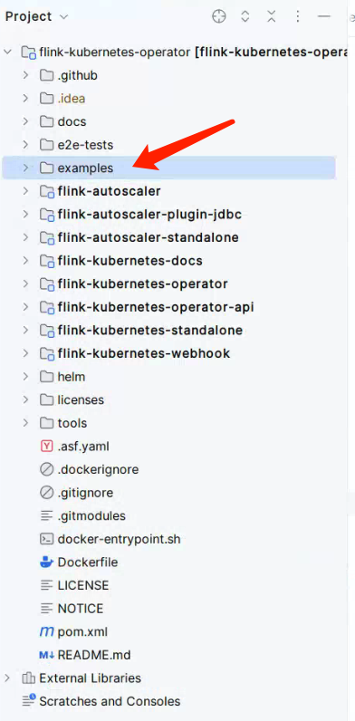
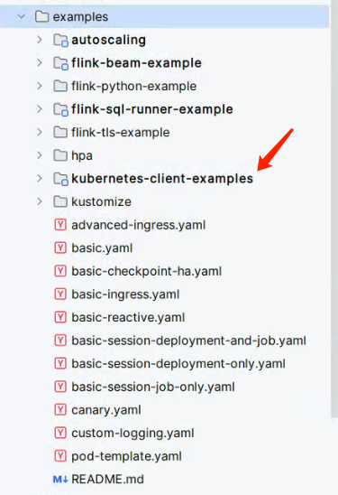

# Flink on Kubernetes - Kubernetes Operator - 开发 Java程序提交 Job

>Operator version: 1.8，Flink version: 1.17         

## 引言 
在之前 "Flink on Kubernetes" Blog 中介绍过手动部署 Session 集群、Application 集群，我想你应该也深有体会的是在整个 Flink Job 提交部署的过程中，从手动编写 yaml 到使用 kubectl 提交 yaml 到 Kubernetes。          

        

那么，接下来开始探讨，如何通过 Java程序部署Flink Job？      

## 了解 Flink Kubernetes Operator   
在 Flink YAML 文件中会存在名为`kind: FlinkDeployment`的Kubernetes 资源定义。 当通过 Kubectl 提交 YAML给 K8s API Server后，是由 Flink Kubernetes Operator来处理 kind: FlinkDeployment 的。 所以 Github 中 `flink-kubernetes-operator` 是我们的突破口。       

### clone operator 代码 
```shell
git clone git@github.com:apache/flink-kubernetes-operator.git  
```

目录结构如下：  
        

**其重点是 examples目录下的模块**       
        

在 `kubernetes-client-examples`模块 下的 Basic.java， 已经明确给出 Kubernetes client 提交 Flink Job 示例。      

>参考 example 的示例，搭建 Java Maven 项目 ...         

## 构建 Maven 项目 

### 添加依赖    

>依赖什么jar，可参考 example的示例代码所依赖的jar，这里就不过多解释。   

1.添加 flink kubernetes operator Jar                
```xml
<!-- https://mvnrepository.com/artifact/org.apache.flink/flink-kubernetes-operator -->
<dependency>
    <groupId>org.apache.flink</groupId>
    <artifactId>flink-kubernetes-operator</artifactId>
    <version>1.8.0</version>
</dependency>
```

2.添加 io.fabric8.kubernetes-client Jar             
```xml
<!-- https://mvnrepository.com/artifact/io.fabric8/kubernetes-client -->
<dependency>
    <groupId>io.fabric8</groupId>
    <artifactId>kubernetes-client</artifactId>
    <version>6.8.1</version>
</dependency>   
```

### 配置 K8s 环境   
>注意：Kubernetes 环境搭建可参考之前的 Blog     

1）将 K8s集群的 ~/.kube/config 拷贝到 开发机的 ~/.kube/config 目录下（若目录不存在则创建），config的 masterurl地址需配置本地hosts 映射关系。             
2）特别注意，本人的 K8s 架构使用 keepalive + haproxy 构建的 master 双活，所以 “Flink on Kubernetes - Kubernetes集群搭建 - 基础环境搭建” Blog 中的`192.168.0.149` 节点需开机。      

## 示例代码     
我们将之前部署过的 Application Job 的YAML当作示例参考   
```yaml
apiVersion: flink.apache.org/v1beta1
kind: FlinkDeployment
metadata:
  name: basic-application-deployment-only
spec:
  image: flink:1.17
  flinkVersion: v1_17
  flinkConfiguration:
    taskmanager.numberOfTaskSlots: "2"
  serviceAccount: flink
  jobManager:
    resource:
      memory: "2048m"
      cpu: 1
  taskManager:
    resource:
      memory: "2048m"
      cpu: 1
  job:
    jarURI: local:///opt/flink/examples/streaming/StateMachineExample.jar
    parallelism: 2
    upgradeMode: stateless
```


refer   
1.https://developer.aliyun.com/article/1163272      