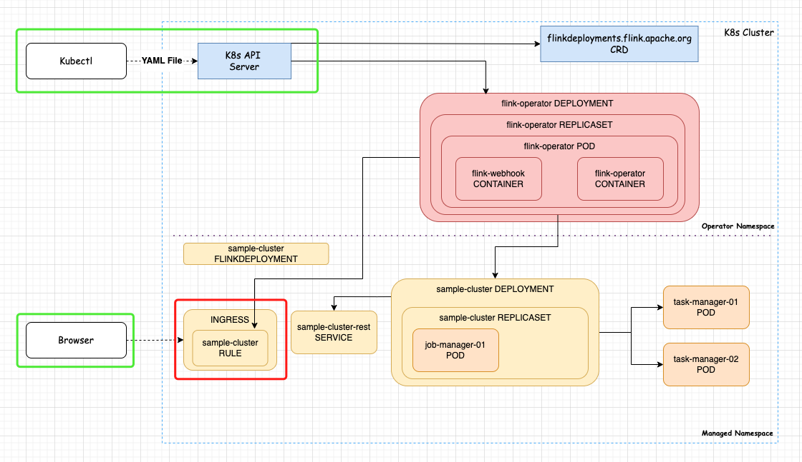

# Kubernetes Operator - Java 开发 K8s Operator 实践       

## 引言     
为了更好介绍 `Flink Kubernetes Operator`实现的细节，我们通过开发一个 Java Operator，了解 Operator 的执行过程。      

>#### What Is a Kubernetes Operator?     
```bash
In Kubernetes parlance, an Operator is a software component, usually deployed in a cluster, that manages the lifecycle of a set of resources. It extends the native set of controllers, such as replicaset and job controllers, to manage complex or interrelated components as a single-managed unit.          
Let’s look at a few common use cases where operators are used:              

    Enforce best practices when deploying applications to a cluster         
    Keep track and recover from accidentally removing/changing resources used by an application     
    Automate housekeeping tasks associated with an application, such as regular backups and cleanups        
    Automate off-cluster resource provisioning — for example, storage buckets and certificates      
    Improve application developers’ experience when interacting with Kubernetes in general      
    Improve overall security by allowing users to manage only application-level resources instead of low-level ones such as pods and deployments        
    Expose application-specific resources (a.k.a. Custom Resource Definitions) as Kubernetes resources      

This last use case is quite interesting. It allows a solution provider to leverage the existing practices around regular Kubernetes resources to manage application-specific resources. The main benefit is that anyone adopting this application can use existing infrastructure-as-code tools.            

To give us an idea of the different kinds of available operators, we can check the OperatorHub.io site(https://operatorhub.io/). There, we’ll find operators for popular databases, API managers, development tools, and others.  
```     

### 需求介绍        
在之前的 Blog “Flink on Kubernetes - Kubernetes Operator - Flink Ingress 配置 & Application Job 部署示例” 介绍过 Flink Kubernetes Operator 提供的自动创建 Ingress的 YAML 配置，示例内容如下：               
```yaml
metadata:
  namespace: default
  name: advanced-ingress
spec:
  image: flink:1.17
  flinkVersion: v1_17
  ingress:
    template: "flink.k8s.io/{{namespace}}/{{name}}(/|$)(.*)"
    className: "nginx"
    annotations:
      nginx.ingress.kubernetes.io/rewrite-target: "/$2"
```

**我们再回溯下原来的内容：**    
通过 `Flink Kubernetes Operator` 部署 Flink Job后，会帮我们创建 2个 Service（Type：ClusterIP），但这并不能让我们从集群外部能访问 Flink Web UI       
```bash
[root@k8s01 k8s_yaml]# kubectl get svc -n flink  
NAME                                                TYPE        CLUSTER-IP     EXTERNAL-IP   PORT(S)             AGE
basic-application-deployment-only-ingress-tz        ClusterIP   None           <none>        6123/TCP,6124/TCP   18h
basic-application-deployment-only-ingress-tz-rest   ClusterIP   10.96.17.230   <none>        8081/TCP            18h
flink-operator-webhook-service                      ClusterIP   10.96.139.50   <none>        443/TCP             19h
```

若我们在 Flink Job YAML 中添加 ingress 相关配置，Operator 会根据我们提供的 `template`,创建 Ingress 资源。         
```bash  
[root@k8s01 k8s_yaml]# kubectl get ingress -n flink 
NAME                                           CLASS   HOSTS          ADDRESS       PORTS   AGE
basic-application-deployment-only-ingress-tz   nginx   flink.k8s.io   10.96.36.74   80      18h
```

Operator 创建 Ingress，我们也可以使用 YAML来 手动创建。             
>注意：手动创建 Ingress YAML，需根据 Job name, namespace, service name 调整参数     

vim basic-application-deployment-only-ingress-tz-ingress.yaml       
```bash
apiVersion: networking.k8s.io/v1
kind: Ingress
metadata:
  annotations:
    nginx.ingress.kubernetes.io/rewrite-target: /$2
  name: basic-application-deployment-only-ingress-tz
  namespace: flink
spec:
  ingressClassName: nginx
  rules:
  - host: flink.k8s.io
    http:
      paths:
      - backend:
          service:
            name: basic-application-deployment-only-ingress-tz-rest
            port:
              number: 8081
        path: /flink/basic-application-deployment-only-ingress-tz(/|$)(.*)
        pathType: ImplementationSpecific
```

背景铺垫差不多了，那么现在的需求是：            
* 不使用 Flink Kubernetes Operator 创建 Ingress 资源情况下  
* 开发一个 Operator 来创建 Flink Job Ingress        
* 监听 Flink Job Service, 若没有 Ingress，则创建 Ingress，若 Service 不存在，则删除 Ingress`                      
      

上图“红色”框的 Ingress，就不需要 Flink Kubernetes Operator。            


来我们可以`开发一个0到1 的Java Operator`。                  


## 开发 

### 1.根据模板创建项目    
```shell
mvn io.javaoperatorsdk:bootstrapper:4.8.3:create -DprojectGroupId=com.xinzhuxiansheng.javaproject -DprojectArtifactId=javamain-k8sOperator  
```


<operator.sdk.version>4.8.3</operator.sdk.version>

<dependency>
    <groupId>io.javaoperatorsdk</groupId>
    <artifactId>operator-framework</artifactId>
    <version>${operator.sdk.version}</version>
</dependency>       


refer       
1.https://javaoperatorsdk.io/docs/getting-started               
2.https://github.com/eugenp/tutorials/tree/master/kubernetes-modules/k8s-operator                   
3.https://www.baeldung.com/java-kubernetes-operator-sdk             
