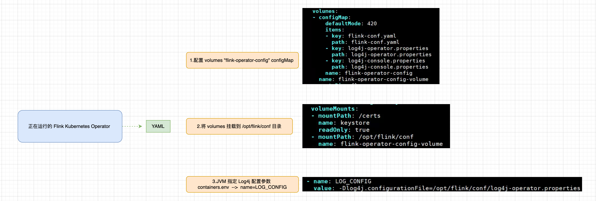

# Flink on Kubernetes - Kubernetes Operator - 配置 Operator 日志持久化   

>Operator version: 1.8    

## 引言   
“我们 需要 Operator Log”，Flink Kubernetes Operator 部署后，并没有将 Log 持久化在 Pod 内部文件目录中，可访问 Operator 官网 `https://nightlies.apache.org/flink/flink-kubernetes-operator-docs-main/docs/operations/metrics-logging/#logging`，了解关于 Logging 的介绍，内容如下：     

>The Operator controls the logging behaviour for Flink applications and the Operator itself using configuration files mounted externally via ConfigMaps. Configuration files(https://github.com/apache/flink-kubernetes-operator/tree/main/helm/flink-kubernetes-operator/conf) with default values are shipped in the Helm chart. It is recommended to review and adjust them if needed in the values.yaml file before deploying the Operator in production environments.        

### 排查 Operator Log 配置  
        

查看 flink-kubernetes-operator YAML，可知晓 Operator Log 配置是由 `flink-operator-config` configMap中的 `log4j-operator.properties` 决定的。        
```shell
kubectl -n flink get deployment flink-kubernetes-operator -o yaml     
```

### 查看 log4j-operator.properties 配置 
了解可知，Operator 的 log 是通过 ConfigMaps 下的 `log4j-operator.properties` 配置的。 可访问 https://github.com/apache/flink-kubernetes-operator/tree/main/helm/flink-kubernetes-operator/conf 下的 `log4j-operator.properties`; 也可使用 `kubectl -n flink describe configmap flink-operator-config` 命令，查看 `log4j-operator.properties:` 内容。          

**查看 Operator configmaps：**      
```shell
[root@k8s01 ~]# kubectl get configmaps -n flink           
NAME                    DATA   AGE
flink-operator-config   3      62m   
kube-root-ca.crt        1      44d   
```

**log4j-operator.properties 内容如下：**      
kubectl -n flink describe configmap flink-operator-config     
```bash   
################################################################################
#  Licensed to the Apache Software Foundation (ASF) under one
#  or more contributor license agreements.  See the NOTICE file
#  distributed with this work for additional information
#  regarding copyright ownership.  The ASF licenses this file
#  to you under the Apache License, Version 2.0 (the
#  "License"); you may not use this file except in compliance
#  with the License.  You may obtain a copy of the License at
#
#      http://www.apache.org/licenses/LICENSE-2.0
#
#  Unless required by applicable law or agreed to in writing, software
#  distributed under the License is distributed on an "AS IS" BASIS,
#  WITHOUT WARRANTIES OR CONDITIONS OF ANY KIND, either express or implied.
#  See the License for the specific language governing permissions and
# limitations under the License.
################################################################################

rootLogger.level = INFO
rootLogger.appenderRef.console.ref = ConsoleAppender

# Log all infos to the console
appender.console.name = ConsoleAppender
appender.console.type = CONSOLE
appender.console.layout.type = PatternLayout
appender.console.layout.pattern = %style{%d}{yellow} %style{%-30c{1.}}{cyan} %highlight{[%-5level]%notEmpty{[%X{resource.namespace}/}%notEmpty{%X{resource.name}]} %msg%n%throwable}

# Do not log config loading
logger.conf.name = org.apache.flink.configuration.GlobalConfiguration
logger.conf.level = WARN

# Avoid logging fallback key INFO messages
logger.conf.name = org.apache.flink.configuration.Configuration
logger.conf.level = WARN

# Flink Operator Logging Overrides
# rootLogger.level = DEBUG
# logger.operator.name= org.apache.flink.kubernetes.operator
# logger.operator.level = DEBUG
```

`log4j-operator.properties` 只定义了 `ConsoleAppender`, 这显然对一个 Java 程序来说是远远不够的, `它会让 Operator log 只能使用 kubectl logs`查看 。若在以下情况下，可能会影响问题排查：      
* 当 Flink Job 部署以及运行过程中，可能出现的异常      
* 当 `Custom Operator Plugins` 部署以及运行过程中，可能出现的异常      
>可访问官网 `https://nightlies.apache.org/flink/flink-kubernetes-operator-docs-main/docs/operations/plugins/#custom-operator-plugins` 了解更多 Plugins细节(其含义，我们开发 jar，托管给 Operator 执行)， `后续在实践 “Custom Flink Resource Listeners” 监听 Flink Job状态, Log 也特别重要`  ...         

接下来，介绍让 Log 持久化。       

## 配置 RollingFileAppender   
>在之前 Blog “Flink on Kubernetes - Kubernetes Operator - Helm 自定义 value.yaml 本地安装 Operator” 介绍了 Operator的本地安装，后面会基于它来对 Operator进行修改。        

RollingFileAppender 是 Java 程序的Log 管理标配，这里相关配置可参考 `log4j-console.properties` 配置 (https://github.com/apache/flink-kubernetes-operator/blob/main/helm/flink-kubernetes-operator/conf/log4j-console.properties);      

vim  flink-kubernetes-operator/conf/log4j-operator.properties            
```shell
# 1.添加 RollingFileAppender 
rootLogger.appenderRef.console.ref = ConsoleAppender,RollingFileAppender

# 2.添加 RollingFileAppender  
appender.rolling.name = RollingFileAppender
appender.rolling.type = RollingFile
appender.rolling.append = false
appender.rolling.fileName = ${sys:log.file}
appender.rolling.filePattern = ${sys:log.file}.%i
appender.rolling.layout.type = PatternLayout
appender.rolling.layout.pattern = %d{yyyy-MM-dd HH:mm:ss,SSS} %-5p %-60c %x - %m%n
appender.rolling.policies.type = Policies
appender.rolling.policies.size.type = SizeBasedTriggeringPolicy
appender.rolling.policies.size.size=100MB
appender.rolling.strategy.type = DefaultRolloverStrategy
appender.rolling.strategy.max = 10
```

>注意：log4j-operator.properties 它的内容行尾不能出现多余的空格，否则可能会出现以下异常信息： 
```bash
00:36:43,210 m️ain ERROR Unable to locate plugin type for RollingFile                                                
00:36:43,218 main ERROR Unable to locate plugin type for CONSOLE                                                    
00:36:43,356 main ERROR Unable to locate plugin for RollingFile                                                     
00:36:43,365 main ERROR Unable to locate plugin for CONSOLE                                                         
00:36:43,367 main ERROR Unable to invoke factory method in class    
```

# 2.修改 将 webhhok,opeator jvm参数 都添加 -Dlog.file     
vim flink-kubernetes-operator/myvalues.yaml   
```shell
Set the jvm start up options for webhook and operator
jvmArgs:
  webhook: "-Dlog.file=/opt/flink/log/webhook.log"
  operator: "-Dlog.file=/opt/flink/log/operator.log"
```

>注意：在log 配置中，使用 ${sys:log.file} 变量，所以，还需在 JVM 参数中配置 `-Dlog.file`      


## 创建 Operator Log PVC  
在之前 Blog “Flink on Kubernetes - Kubernetes集群搭建 - 部署 Prometheus Grafana” 提到过一个知识点：   
>`在 Kubernetes 的 YAML 中不能直接在 Deployment 的配置文件中声明 volumeClaimTemplate。volumeClaimTemplate 是专门用于 StatefulSets 中的，用来为每个 Pod 创建一个新的 Persistent Volume（PV）`        

vim flink-operator-log-pvc.yaml     
```shell
kind: PersistentVolumeClaim
apiVersion: v1
metadata:
  name: flink-operator-log-pvc
  namespace: flink  # namespace
spec:
  storageClassName: nfs-storage # 配置 pvc的storageClass
  accessModes:
    - ReadWriteOnce # 允许一个持久卷被单个节点以读写方式使用
  resources:
    requests:
      storage: 2Gi
```

执行    
```shell
kubectl -n flink apply -f flink-operator-log-pvc.yaml     
```

## 修改 flink-kubernetes-operator/templates/flink-operator.yaml, 添加 log-pvc       

vim flink-kubernetes-operator/templates/flink-operator.yaml ,修改内容如下：        
>`注意：flink-operator.yaml 包含较多的 if、else、end，它是一个完整的判断处理逻辑，所以，在该文件修改的时候，要注意 if、end 的判断边界，若加错位置，可能会出现某个条件满足，导致你的配置不生效`          
```shell
# 1.增加 flink-operator-log volumnes 
226       volumes:
227         - name: flink-operator-log   # 定义的 volume 名称
228           persistentVolumeClaim:
229             claimName: flink-operator-log-pvc   # pvc 名称
230         - name: flink-operator-config-volume
231           configMap:
232             name: flink-operator-config
233             items:


# 2.配置 volume 挂载路径 (注意，volume 的挂载路径有2处，1个 operator，1个 webhook)
# operator:
144           {{- if .Values.tls.create }}
145             - name: flink-operator-cert-secret
146               mountPath: /opt/flink/tls-cert
147           {{- end }}
148             - name: flink-operator-log  # 将 flink-operator-log volume 挂载到 /opt/flink/log  
149               mountPath: /opt/flink/log

# webhook: 
208           volumeMounts:
209           - name: keystore
210             mountPath: "/certs"
211             readOnly: true
212           - name: flink-operator-config-volume
213             mountPath: /opt/flink/conf
214           - name: flink-operator-log  # 将 flink-operator-log volume 挂载到 /opt/flink/log  
215             mountPath: /opt/flink/log
216         {{- end }}    
```

>注意：在上一章节 “配置 RollingFileAppender”，在 `flink-kubernetes-operator/myvalues.yaml` 在 webhhok,opeator jvm参数 都添加 -Dlog.file, `挂载路径(mountPath) 要与 -Dlog.file 的路径必须保持一致`      

>`意外实践 不生效： 我看到 myvalues.yaml 支持定义 Volumes、VolumeMounts，配置内容如下， 但并没有参数并没有生效`, 也许是我理解的不对，暂时不解决这块，等后面清楚后再来说明。           
```bash
vim myvalues.yaml （参数不生效，暂不建议此实践）    

# 修改内容如下    
operatorVolumeMounts:
  create: false
  data:
    - name: flink-artifacts
      mountPath: /opt/flink/artifacts
    - name: flink-operator-log
      mountPath: /opt/flink/log

operatorVolumes:
  create: false
  data:
    - name: flink-artifacts
      hostPath:
        path: /tmp/flink/artifacts
        type: DirectoryOrCreate
    - name: flink-operator-log   # 定义的 volume 名称
      persistentVolumeClaim:
        claimName: flink-operator-log-pvc   # pvc 名称
#    - name: flink-artifacts
#      persistentVolumeClaim:
#        claimName: flink-artifacts
```

## 重新安装 Operator   

**卸载**     
```shell
helm uninstall flink-kubernetes-operator -n flink       

# Output log: 
[root@k8s01 flink-kubernetes-operator]# helm uninstall flink-kubernetes-operator -n flink   
These resources were kept due to the resource policy:
[RoleBinding] flink-role-binding
[Role] flink
[ServiceAccount] flink

release "flink-kubernetes-operator" uninstalled     
```

**安装**  
```shell
helm install -f myvalues.yaml flink-kubernetes-operator . --namespace flink       

# Output log:   
[root@k8s01 flink-kubernetes-operator]# helm install -f myvalues.yaml flink-kubernetes-operator . --namespace flink
NAME: flink-kubernetes-operator
LAST DEPLOYED: Mon May 12 23:55:29 2024
NAMESPACE: flink
STATUS: deployed
REVISION: 1
TEST SUITE: None
```

## 验证  
1）查看 PVC      
```shell
# 查看 pvc
[root@k8s01 k8s_yaml]# kubectl -n flink get pvc 
NAME                     STATUS   VOLUME                                     CAPACITY   ACCESS MODES   STORAGECLASS   AGE
flink-operator-log-pvc   Bound    pvc-bf6fd323-d50f-447c-b3f8-a29b201f1adf   2Gi        RWO            nfs-storage    37s
```

2）POD 路径挂载成功且有 operator.log 文件存在     
```bash
# kubectl exec -it 进入 POD
# Output log:       
flink@flink-kubernetes-operator-df8549cfb-cpmg5:~/log$ pwd
/opt/flink/log
flink@flink-kubernetes-operator-df8549cfb-cpmg5:~/log$ ls
operator.log
flink@flink-kubernetes-operator-df8549cfb-cpmg5:~/log$ ls
operator.log	webhook.log
```

3）持久化是否生效         
可在 POD /opt/flink/log目录下 `touch xxx.log`, 若 Operator 重启后，仍然存在，则生效啦。       

## 总结     
Log 持久化是生产实战中的重要的一环，目前 Operator Log 配置的是 `RollingFile`,因为 log 量少，无法达到 100M 滚动切割，后续我再来 Check Rolling 是否生效。           

我想大伙阅读了 Blog “Flink on Kubernetes - Kubernetes集群搭建 - 部署 Prometheus Grafana” 和 该篇 “配置 Operator 日志持久化”之后，对 PVC 的使用有了一定的了解，像该篇 “排查 Operator Log 配置” 章节的图片内容介绍的那样，三步骤走：        
* 定义 volume，通过 pvc 名称 绑定     
* 配置 volumeMounts，将 volume 挂载到具体路径    
* 使用路径            

refer         
1.https://nightlies.apache.org/flink/flink-kubernetes-operator-docs-main/docs/operations/metrics-logging/#logging         
